# Upgrade And Quality Workflow

Use when an accepted skill changes, a staged skill looks promotion-ready, or a developer needs confidence without loading a large candidate into context.

## Flow

[](diagrams/upgrade-and-quality-workflow-flow.svg)

Source: [Mermaid](diagrams/upgrade-and-quality-workflow-flow.mmd)

## Rules

1. Inspect repo facts first: references, `SKILL.md`, `module.json`, scripts, docs, and candidate shape.
2. Run scripts for facts before writing judgments.
3. Preserve one job, trigger family, dependencies, and risk profile.
4. Validate with the smallest deterministic checks that cover the change.
5. Regenerate generated files through `sync`; never hand-edit them.

Do not turn a skill update into a broad spec rewrite. Prefer stable script output for hashes, deltas, budgets, and evidence paths, then summarize the decision.

## Upgrade Review

```shell
python -B .agents/manage.py compare-skill --old <old-skill> --new <new-skill>
```

Interpretation:

- new validation errors or lower SemVer: `keep-staged`;
- added risk/dependencies, removed files, or breaking changes: usually `merge`;
- equivalent folders or validating compatible changes: possible `override`;
- SemVer warnings require an explanation before apply.

Only this command may replace a target folder, and only after an explicit replacement request:

```shell
python -B .agents/manage.py upgrade-skill --old <old-skill> --new <new-skill> --target .agents/skills/<skill-name> --strategy override --apply
```

Merge remains planning-only; the agent or developer performs semantic merging.

## Quality Commands

```shell
python -B .agents/manage.py eval-skill --skill <skill> --suite <suite.json>
python -B .agents/manage.py attest-skill --skill <skill> --format json
python -B .agents/manage.py skill-inventory --skill <skill>
python -B .agents/manage.py measure-skill-budget --skill <skill>
```

Use `eval-skill` for assertions, `attest-skill` for provenance and hashes, `skill-inventory` for dependencies/risk/quality facts, and `measure-skill-budget` for token-pressure hotspots.

## Workflow Modules

For workflows under `automations/`:

```shell
python -B .agents/manage.py validate-automations
python -B .agents/manage.py sync-automation-routing
```

`validate-automations` checks layout, contracts, related skill names, external access, optional files/folders, stale generated metadata, and active-path cache noise. Workflow scripts, external inputs, and related skills must be declared in the selected workflow.
