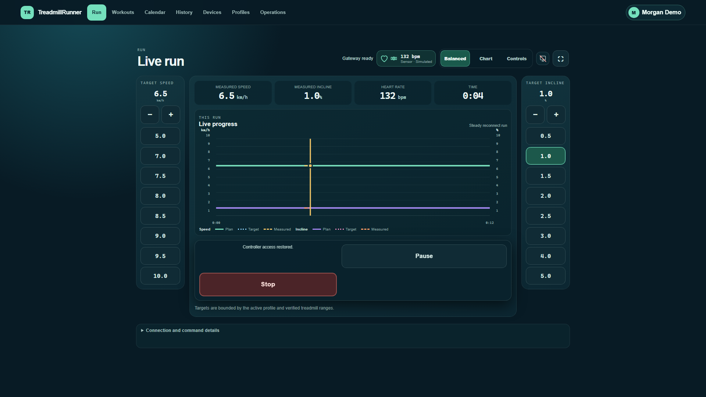
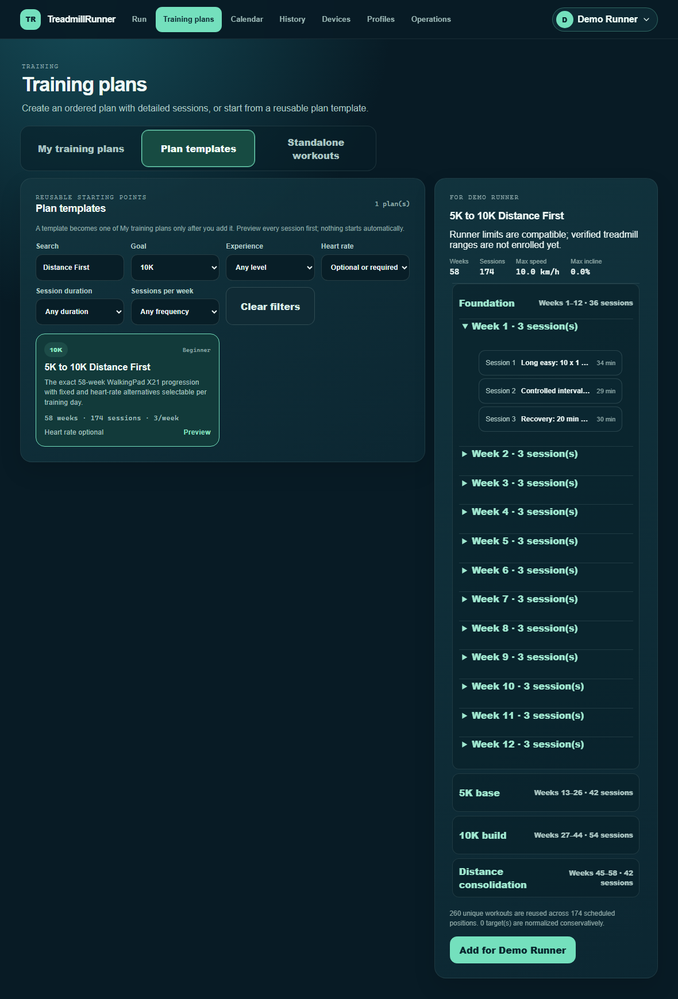
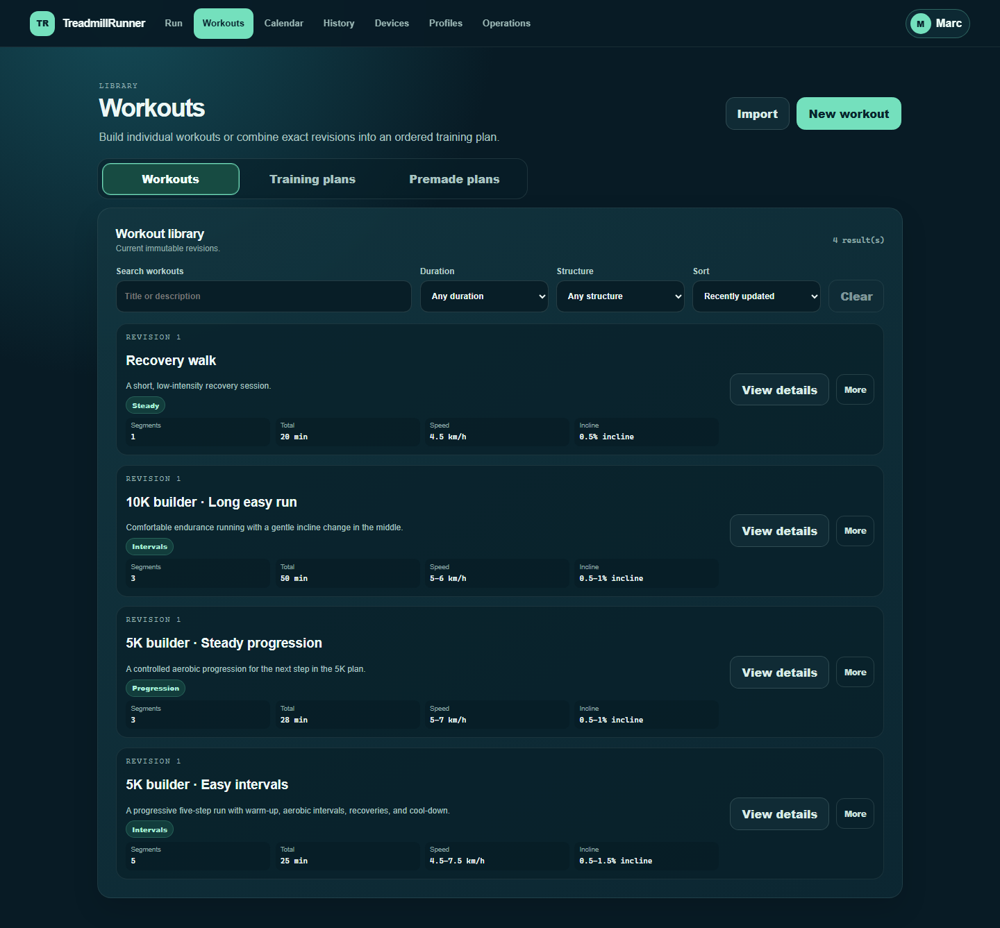
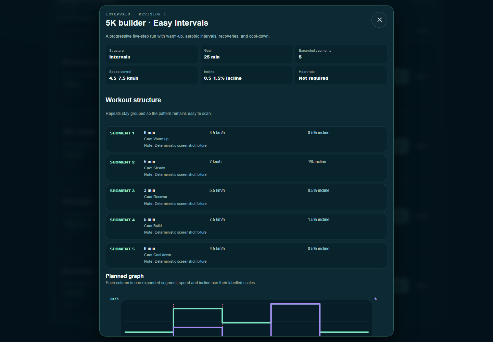
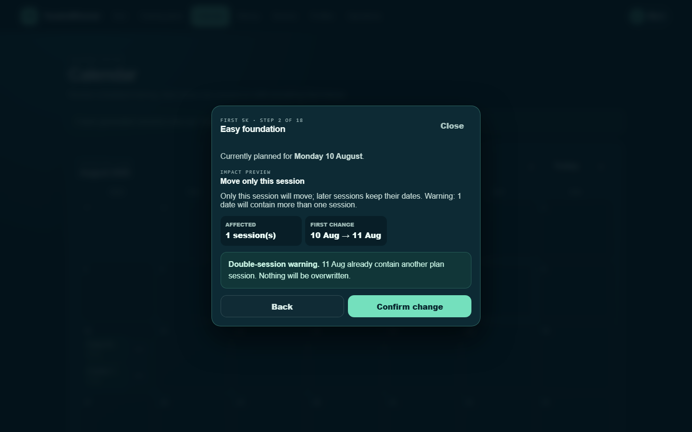
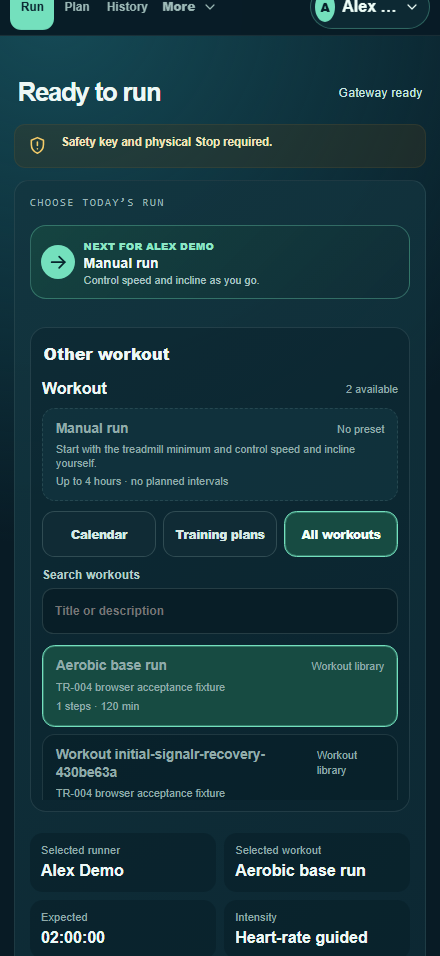
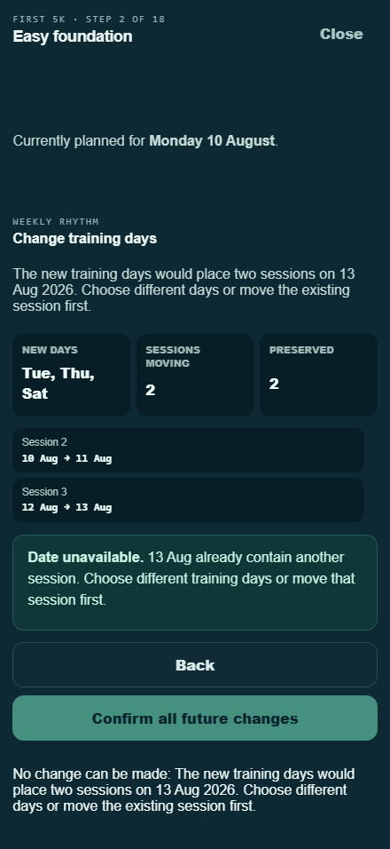

# TreadmillRunner

TreadmillRunner is a local-first treadmill workout application for one Horizon Omega Z. A .NET 10 gateway runs on the existing Windows 11 VM, owns Bluetooth and workout state, and serves an install-free touch interface to browsers on the home network.

The project combines a deterministic simulator with one exact Horizon Omega Z hardware adapter. On console software `S3.02` and Bluetooth firmware `V10.23.17`, owner-observed Stage 3 evidence verifies FTMS Start, Stop, speed, and incline with response-plus-fresh-telemetry confirmation. Pause remains disabled because it is not hardware verified. The treadmill safety key, physical Stop, and console remain authoritative.

## See it in use

| Live control and recovery | Premade training plans |
|---|---|
| [](screenshots/showcase/tr-023-control-recovered-desktop.png) | [](screenshots/showcase/tr-024-premade-plan-catalog.png) |

| Workout library | Workout structure |
|---|---|
| [](screenshots/showcase/tr-026-workout-library.png) | [](screenshots/showcase/tr-026-workout-details.png) |

| Calendar adjustment preview | iPhone calendar action sheet |
|---|---|
| [](screenshots/showcase/tr-027-calendar-move.png) | [](screenshots/showcase/tr-027-calendar-mobile.png) |

| Simplified phone Run view | Change future training days |
|---|---|
| [](screenshots/showcase/tr-029-simplified-run-iphone.png) | [](screenshots/showcase/tr-030-training-days-preview.png) |

The gateway owns active workout timing if a browser disappears. Browser controls reconnect indefinitely, while BLE and service-restart recovery stay guarded: recovery never sends Start, never replays an uncertain command, and never silently overrides an apparent physical-console change. See the [live-session guide](docs/project/live-session.md) for the exact guarantees.

## Install on Windows

For normal use, download `TreadmillRunner-<version>-Windows-x64.zip` from [GitHub Releases](https://github.com/belgian-coder/treadmill-runner/releases/latest), extract it, and run `Install-TreadmillRunner.cmd`. The installer asks for administrator approval, installs the Windows service, verifies readiness, and opens the dashboard. The NUC must run Windows 11 x64 on a **Private** household network with the [ASP.NET Core Runtime 10 x64](https://dotnet.microsoft.com/download/dotnet/10.0).

See the [complete installation guide](docs/installation.md) for first-run enrollment, phone access, online GitHub updates, the protected local-feed fallback, signed offline ZIP updates, repair, and data retention. Never port-forward the dashboard or expose it to an untrusted network.

## Current status

- TR-001 delivers the solution, simulator, SignalR path, responsive UI, tests, scripts, and Windows-first documentation.
- TR-003 delivers household profiles, immutable workout revisions, preview-first imports, and an EF Core/SQLite training calendar.
- TR-004 covers simulated daily runs, controller reclaim, one-second history, debrief, charts, HR analytics, weekly totals, sound, and responsive browser tests. Accelerated cadence/memory, SQLite-write, and loopback-latency checks pass; household Wi-Fi evidence remains pending.
- Story TR-005 is implemented through local Omega Z/Polar H10 enrollment, structurally read-only BLE reads/subscriptions, explicit FTMS or Omega-vendor telemetry, simultaneous connection/freshness state, and real telemetry composition into the authoritative session engine. Ten power cycles and the 60–90 minute simultaneous read-only soak remain owner-present acceptance.
- Story TR-006B/C includes portable FTMS control codecs, an isolated serialized non-replayable command connection, operation/lease/session/generation guards, response-plus-fresh-telemetry confirmation, explicit Confirmed/Rejected/Unknown results, Hold-to-start, and the accepted exact-firmware Stage 3 sequence. Pause and vendor motion writes remain disabled pending their separate exact-device gates.
- Story TR-003B adds persisted ordered 5K/10K/Base/Custom training programs with runner-specific completed-only progression and calendar-first next-run selection.
- Story TR-009 closes deterministic completion gaps: capability-aware target preflight, immutable treadmill session snapshots, Polar-first selection, system-level simulated HR automation, screen wake lock, `/health/ble`, and maintenance-locked semantic restore verification.
- TR-002's read-only Windows adapter can run a bounded active advertisement scan and perform uncached GATT enumeration. An interactive VM test found nearby advertisers and successfully enumerated a connectable device without pairing, subscribing, or issuing an application-data GATT write.
- Windows Service Session 0 behavior and exact Omega/Polar simultaneous hardware acceptance remain external gates.
- No unverified command is enabled, no Unknown outcome is retried, and reconnect expires every pending intent.
- TR-013 adds opt-in per-profile Garmin FIT upload through a pinned unsupported adapter and an explicit-recording Connect IQ companion for Fenix 8 and Vivoactive 5/6. SDK 9.2.0 builds and representative tests pass; layouts, watches, trusted HTTPS, and IQ Store review remain external.
- US-TR-041 adds trustworthy telemetry/session durability, Metric-only features and exports, UI evidence, provenance, and an iPhone icon. See the [story](docs/project/stories/tr-041-coordinated-improvement-program.md).

## Prerequisites

- Windows 11
- .NET SDK 10.0.110 or the patch selected by `global.json`
- PowerShell 7 or Windows PowerShell 5.1
- Python 3.12 for the deterministic validation harness
- Node.js/npm for Playwright browser validation

## Quick start

```powershell
.\eng\bootstrap.ps1
.\eng\database.ps1 -Action Update -DatabasePath .\data\treadmillrunner.db
.\eng\run-simulator.ps1
```

The simulator uses `.\data\treadmillrunner.db`; a fresh checkout needs the explicit migration command above.
Open `http://localhost:5180`. Run all deterministic checks with:

```powershell
.\eng\validate.ps1
```

For normal implementation loops, run only the affected tests and browser flow first. Both commands retain TRX evidence under `artifacts/test-results`:

```powershell
.\eng\verify-change.ps1 -TestFilter 'FullyQualifiedName~ReadOnlyDeviceCoordinatorTests'
.\eng\verify-change.ps1 -TestFilter 'FullyQualifiedName~DeviceEnrollmentStoreTests' -BrowserFilter 'FullyQualifiedName~LiveDashboardTests'
```

`verify-change.ps1` refreshes stale browser output automatically and otherwise reuses the passed readiness report, build, published gateway, and migrated template. Do not run the complete suite after every small change. Once implementation and focused tests are green, run the complete deterministic and clean browser gates once:

```powershell
.\eng\verify-change.ps1 -Full
```

Connect IQ is intentionally excluded from the normal final gate. Use `.\eng\verify-change.ps1 -Full -IncludeConnectIq` only when the companion source, resources, build scripts, or companion contracts changed.

The .NET and browser runners stream output to durable logs, print 15-second heartbeats, and stop their exact process trees after 60 or 90 seconds without progress output. Browser execution also stops remaining work as soon as a test failure and its log context are captured. Focused .NET/browser phases cap at one/two minutes; complete .NET/browser phases cap at three/ten minutes. The browser runner executes up to three isolated fixture classes in parallel and runs latency benchmarks separately. `-TimeoutMinutes` and `-StallTimeoutSeconds` remain explicit overrides. Passed readiness evidence and the migrated database template are reused until their actual inputs change, including for clean final runs.

Use the Devices page to run a bounded active read-only scan and enroll one treadmill plus one or more heart-rate monitors. Choose FTMS or the Omega vendor telemetry path explicitly; the gateway does not silently switch between them. Enrollment and diagnostics remain non-controlling, and simulator mutation endpoints exist only in Development.

Some Omega Z firmware advertisements omit the local name. TreadmillRunner accepts the observed unnamed `1816` plus `1826` signature only as a read-only Omega enrollment candidate, then obtains model and firmware from Device Information. Named non-Omega devices are not matched by this fallback, and it never enables controls.

## Planning your workouts

Use the navigation in the simulator UI to create or select a local profile, build a workout, import one, and plan it on the calendar. A saved workout is an immutable revision: editing creates a new revision, so existing calendar choices continue to reference the exact workout that was selected.

Workout cards show the practical differences before selection: structure, expanded segment count, total goal, speed range, incline range, and whether heart-rate control is used. **View details** opens the current revision as a grouped session outline with repeat patterns, ramps, cues, and notes. Training-plan cards expose their complete ordered session list, grouped by phase and week when that metadata exists.

Imports are previewed before anything is saved. The supported import paths are native workout JSON, Metric QDomyos XML, and Garmin FIT workouts. Confirming a preview rechecks the original bounded file; QDomyos distance and speed are accepted only as kilometres and km/h.

Choose the active runner once from the application header; Run, Workouts, Calendar, History, and editors use that browser-local selection until it is changed. The calendar supports weekly schedules, alternatives for a day, and previewed plan actions. Completed plan steps are visibly marked. An unfinished plan session can be moved alone, moved with all following sessions, skipped, or restored. A completed-late base session can move to its actual date either alone or together with every later incomplete session by the same offset, without rewriting its linked History record or progression; it can also gain an extra repeat while either keeping later dates or shifting the remainder. Occupied dates block ordinary moves and schedule shifts, while an explicit repeat may keep both choices after a collision warning—nothing is overwritten.

For an active training plan, **Change training days** replaces its default weekdays and reschedules only eligible future generated sessions after an exact preview. Completed runs, skips, repeats, one-off moves, and earlier sessions remain anchored. Confirmation is profile- and version-guarded, and a collision remains visible as two sessions on the same day rather than silently replacing either one.

**Workouts → Premade plans** offers 16 profile-scoped 5K, 10K, general-fitness, walking, maintenance, and heart-rate templates. Choose a runner, add the plan for that runner, then choose its first date and training days. The ordered sessions appear on only that profile's calendar with plan position, week, and phase; generated plan workouts stay out of the shared workout library. The 58-week plan remains readable through phase/week groups rather than a flat 174-row editor. See [Premade training plans](docs/project/premade-plans.md).

## Running in the simulator

On Today, select a workout, review readiness, take control, and arm it. Arming never starts a belt. Simulator motion lets the gateway own progression across disconnects. Afterwards, save or skip a debrief; History offers goals and Metric activity exports, and Planning exports FIT Workout revisions.

See [the live-session guide](docs/project/live-session.md) for contracts, recovery behavior, and current limitations. The Windows service supports signed check, verify/stage, explicit UI activation, health verification, and automatic rollback. Use the [release operations runbook](docs/project/release-operations.md) to publish, update, rotate trust, or recover a feed.

## Database operations

SQLite uses reviewed EF migrations and WAL. Application startup does not create or migrate a production database automatically. The repo-local development database is `.\data\treadmillrunner.db`, which is the same explicit path `run-simulator.ps1` passes to the gateway. Use the project-owned helper to inspect migrations, create a migration script, or apply reviewed migrations to that path:

```powershell
.\eng\database.ps1 -Action Status
.\eng\database.ps1 -Action Script
.\eng\database.ps1 -Action Update -DatabasePath .\data\treadmillrunner.db
```

The `Script` action writes `artifacts/database/treadmillrunner.sql` by default. The TR-003 backup proof uses SQLite's online backup API and opens the backup as a separate database; replacing a live user database is deferred to TR-007.

The current migration normalizes profiles to Metric, reconciles active-session conflicts, and adds uniqueness and lease/recovery/receipt indexes. Startup does not apply it automatically.

For a Release WebAssembly publish, run `.\eng\clean-wasm-publish.ps1 -Configuration Release` first when stale WebCIL output is possible. `dotnet clean` can retain generated WebCIL assets.

## Read next

1. [Project context](project-context.md)
2. [Story backlog](docs/project/backlog.md)
3. [Architecture](docs/project/architecture.md)
4. [Safety rules](docs/project/safety-guidelines.md)
5. [Omega Z evidence](docs/project/omega-z-protocol-findings.md)
6. [Implementation plan](docs/project/implementation-plan.md)
7. [Windows BLE read-only operations](docs/project/windows-ble-operations.md)
8. [AI harness findings](docs/project/ai-harness-findings.md)
9. [Simulated live session](docs/project/live-session.md)
10. [Release operations](docs/project/release-operations.md)
11. [Garmin integrations](docs/project/garmin-connect.md)
12. [Connect IQ companion and IQ Store release](docs/project/connect-iq-companion.md)
13. [Premade training plans](docs/project/premade-plans.md)
14. [WalkingPad plan provenance](docs/project/walkingpad-plan-provenance.md)
15. [Session and workout exports](docs/project/exports.md)

## License

TreadmillRunner is available under the [MIT License](LICENSE).

The sibling `../qdomyos-zwift` checkout is research evidence only and is not part of this repository.

## Maintainer releases

GitHub Actions is disabled in repository settings, and no workflow or Dependabot update configuration is committed: commits, pull requests, and tags never start a hosted build. Releases are validated, built, signed, packaged, tagged, and uploaded from the release workstation because the signing key is non-exportable and hosted minutes are intentionally not used:

```powershell
.\eng\create-github-release.ps1 `
  -Version 1.5.10 `
  -ReleaseNotes 'Describe the user-visible changes in this version.'
```

Do not create or move tags manually. See [release operations](docs/project/release-operations.md) for prerequisites, assets, interruption recovery, and update activation.
