# Bug Ticket Workflow

Intake, reproduce, fix, validate, and hand off defects.

## Start

For read-only/offline/no-profile/no-temp/no-write, skip Start and use Read-Only/Offline Dogfood.

Normal run: read `module.json`, this file, global `instructions.md`, and phase; create/select `runs/BUG-<bug-id>/`. The stable bug identifier names the folder; dates belong inside `run.json`, `REPORT.md`, and `execution-log.md`. Start requires `--run-id <bug-id>` and adds `BUG-` when it is absent. Start scaffolds `ticket-info.md` and `plan.md`.

Stop before implementation until the fix plan is complete, plan-check passes, and approval is recorded.

## Read-Only/Offline Dogfood

Read routing plus `WORKFLOW.md`, `module.json`, `instructions.md`, and `suites/workflow-evals.json`. Use `which-workflow`; do not start a run, even when `which-workflow` returns a lifecycle `workflow start` next command. Run only `module.json.strict_read_only_commands` plus `rg`/file reads. Treat strict-check `next_command` output as advisory; follow it only if strict-listed. Inspect `suites/workflow-evals.json`; do not execute evals under strict dogfood. Exclude `.agents/local-ai/cache/**`, `.agents/tmp/**`, run folders, and raw navigation JSON.

Strict read-only/offline excludes start/resume/finish, normal smoke, lifecycle scorecard, context/context-evidence writes, imports, exports, project-context writes, fixes/tests, credential/profile checks, browser/server work, local AI, and retained runs.

## Diagrams

Bug-specific diagrams stay in `plan.md`.

## Process Diagram

Source: [Mermaid](diagrams/workflow-process-diagram.mmd)

## Connection Diagram

Source: [Mermaid](diagrams/workflow-connection-diagram.mmd)

## Example Prompts

- Start: "Start bug-ticket-workflow with `--run-id <bug-id>`."
- Plan: "Fill `plan.md`, run plan-check, stop."
- Resume: "Resume the latest bug-ticket run."
- Handoff: "Prepare root cause, validation, and blockers."
- Finish: "Finish after regression proof and validation."
