# Disciplined Change Workflow

Larger multi-skill changes.

## Start

Strict read-only/offline/no-profile/no-temp/no-write dogfood: skip Start; use Read-Only Dogfood.

Normal run: read `module.json`, this file, and phase; create/select `runs/<run-id>/`. Classify before editing. Finish with fresh evidence.

## Rules

No new skills are created by this workflow. Use related skills through their commands; do not embed their full instructions here. Prefer cheap fixtures and fresh validation. Deterministic checks decide; patch one cause, rerun.

## Read-Only Dogfood

This section overrides Start and `instructions.md` write steps. Do not create/select `runs/<run-id>`, update `run.json`, write evidence, sync writes, or run lifecycle commands. Route with `which-workflow`; do not start a run, even at medium confidence. Run only `module.json.strict_read_only_commands` plus `rg`/file reads. Treat strict-check `next_command` output as advisory; follow only if strict-listed. Inspect `suites/workflow-evals.json`; do not execute evals under strict dogfood. Exclude `.agents/local-ai/cache/**`, `.agents/tmp/**`, run folders, and raw navigation JSON. Report runs; never modify. Skip normal smoke, lifecycle scorecard/evals, context/context-evidence/checkpoint writes, target commands, owner edits, local AI, profile checks, temp fixtures, and non-strict `validation`.

## Process Diagram

Source: [Mermaid](diagrams/workflow-process-diagram.mmd)

## Connection Diagram

Source: [Mermaid](diagrams/workflow-connection-diagram.mmd)

## Example Prompts

- Start: "Start disciplined-change-workflow."
- Resume: "Resume disciplined-change-workflow."
- Handoff: "Handoff disciplined-change-workflow."
- Finish: "Finish disciplined-change-workflow."
