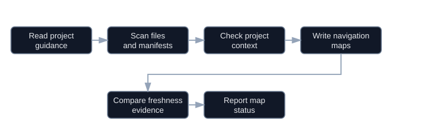
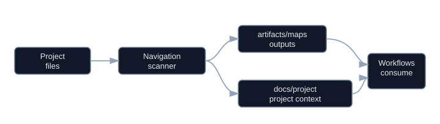

# Navigation Workflow

Start by reading `module.json`, this `WORKFLOW.md`, `instructions.md`, then `artifacts/maps/HANDOFF.md` and `artifacts/maps/NAVIGATION.md` when present.

## Read-Only Dogfood

This section overrides lifecycle/context-evidence/write steps. Route with `python -B .agents/manage.py which-workflow "<request>" --summary --compact --format json`; use the result only to confirm `selected_owner`, and do not follow a `workflow start` next command. Run only commands listed in `module.json.strict_read_only_commands`, plus exact `rg`/file reads. The canonical freshness command is `python -B automations/navigation/scripts/update_navigation.py --target . --check --format json`; use `--write` only when intentionally refreshing generated map outputs.
Lifecycle smoke commands are validation commands only; do not list or run them in strict no-temp dogfood.

## Diagrams

Source: [Mermaid](diagrams/navigation-process.mmd)

Source: [Mermaid](diagrams/navigation-connection.mmd)

## Example Prompts

- Start: "Initialize or refresh navigation maps for this project."
- Resume: "Check whether navigation maps are stale and report the next refresh action."
- Handoff: "Summarize the current navigation handoff and project-context status."
- Finish: "Validate navigation maps and project context, then report written files and skipped checks."
