# User Story Workflow

Story workflow for intake, planning, implementation, validation, and handoff.

## Start

Read `module.json`, then this file. Create/select `runs/US-<story-id>/` and keep current-phase evidence there. The stable story identifier names the folder; dates belong inside `run.json`, `REPORT.md`, and `execution-log.md`. Start requires `--run-id <story-id>` and adds `US-` when it is absent. Start scaffolds `ticket-info.md` and `plan.md`; resume surfaces the plan gate next action. Implementation uses `implementation-mini`, escalating to `implementation-medium` for ambiguity, shared contracts, or repeated failure. Record the declared model target, observed model, and resolved prompt overlay separately.

Always stop after the plan is generated and before implementation. Continue only after `plan.md` is complete, `workflow plan-check` passes, and approval is recorded.

## Read-Only Dogfood

For no-start/offline/no-profile/no-temp/no-write, confirm `selected_owner` with `which-workflow`, then run only `module.json.strict_read_only_commands`, including `python -B .agents/manage.py workflow smoke --name user-story-workflow --dry-run --summary --compact --format json`. Do not follow lifecycle `next_command` values for start/resume/finish, context/context-evidence/checkpoint writes, credentials, local-AI, network, or run creation. Strict validation uses the workflow-manager dispatcher to avoid failure-triage cache writes. Missing `story_id`, `project_root`, or approval is a gap.

## Diagrams

Story diagrams stay in `plan.md`.

## Process Diagram

Source: [Mermaid](diagrams/workflow-process-diagram.mmd)

## Connection Diagram

Source: [Mermaid](diagrams/workflow-connection-diagram.mmd)

## Example Prompts

- Start: "Start `user-story-workflow` with `--run-id <story-id>`."
- Plan only: "Fill `plan.md`, run plan-check, stop."
- Resume: "Resume from the context packet."
- Handoff: "Prepare acceptance, validation, blockers, changed files, and next action."
- Finish: "Finish after validation."
