# Reusable AI Harness

This repo separates reusable capability from stateful work. For the short user-facing case for adopting it, including benefits and downsides, read [Why Use This Harness](why-use-this-harness.md).

| Thing | Canonical Home | Purpose |
|---|---|---|
| Skill | `.agents/skills/<name>/SKILL.md`, `module.json` | Reusable capability, scripts, guardrails, validation. |
| Workflow | `automations/<name>/WORKFLOW.md`, `module.json` | Phase, state, evidence, hooks. |
| Run | `automations/<name>/runs/<run-id>/run.json`, `REPORT.md` | Decisions, checks, evidence, resume, next action. |
| Routing/adapters | generated | Low-context discovery. |

## Operator Flow

Use this flow when starting repo work or when handing another agent a task. The main action is to route first, then open only the owning contract and validate before declaring success.

User actions:

1. Read the user's requested outcome, target project or folder, constraints, and requested deliverable.
2. Restate the concrete task in operational terms: what owner should act, what files may change, and what evidence will prove completion.
3. Route to one skill or one workflow.
4. Open the selected contract and entry file.
5. Write down the intended scope, commands, validation, and stop conditions.
6. Apply the requested change.
7. Run local validation and sync generated files when contracts changed.
8. If validation fails, fix the first failing fact and rerun.
9. Report evidence, skipped checks, remaining risks, and the next action.

[](diagrams/reusable-ai-harness-operator-flow.svg)

Source: [Mermaid](diagrams/reusable-ai-harness-operator-flow.mmd)

## Folder Map

The reusable surface should install cleanly into a consumer repo. Workflow run history, local caches, and local secrets stay out of install copies.

[](diagrams/reusable-ai-harness-folder-map.svg)

Source: [Mermaid](diagrams/reusable-ai-harness-folder-map.mmd)

## Install

Copy this harness into a consumer project with the prepared install path:

```shell
python -B .agents/manage.py install-harness --target D:/Projects/NewProject --dry-run
python -B .agents/manage.py install-harness --target D:/Projects/NewProject --run-setup-check --install-rg-portable --bootstrap-local-ai
```

Replace `D:/Projects/NewProject` with the target project path. The install command copies the reusable surface and excludes Git state, local AI caches, model bundles, local secrets, and workflow run history so the target starts clean. Validate the active target with `python -B .agents/manage.py setup --check`; use `--no-link-skills` for temporary inspection copies.

The prepared flags validate the copy, install verified repo-local fast search, and create local AI config without model payloads or repository indexes. Use `--download-ai-models` only when the install should immediately download the pinned local AI bundle. The tracked `.agents/harness.lock.json` makes the install baseline portable across clones. Run `harness-status --check-upstream`, `harness-update --to latest`, and then the reviewed `harness-update --to latest --apply` inside the consumer; no nested repository or Git mutation is involved.

## Rules

- Read `AGENTS.md`, routing, selected contract, selected entry, then optional docs/evidence.
- Shared behavior belongs in skills; workflow lifecycle belongs in workflows.
- Local AI is optional, local-only, policy-controlled, and backed by deterministic fallback.
- Use Markdown for human instructions and JSON for machine contracts/evidence.
- Keep root docs route-first; move domain detail under the owning skill/workflow.

## Local Agent Harness Lessons

- Route to one narrow owner first; do not expose every skill, workflow, or command to a local model.
- Prefer deterministic Python stages for ordering, retries, parsing, package resolution, date math, and validation. Use models only for bounded classification, extraction, synthesis, or review.
- Treat model routing as advisory: use high-confidence deterministic overrides first, model classification second, and explicit fallback/default behavior when confidence, parsing, or timeouts fail.
- Keep tool profiles small and declared. Broad open-ended tool loops need an explicit workflow phase, budget, and stop rule.
- Promote repeated misses into evals, smoke fixtures, scanners, or command guards. Do not rely on a longer prompt to fix deterministic failure modes.
- Record model/runtime limits, empty-output failures, skipped checks, and unsupported commands as evidence so the harness can fail fast next time.
- Measure harness changes with neutral capability matrices or comparable benchmark reports; do not count candidate-only eval failures on an old ref as quality improvement.

Validate with:

```shell
python -B .agents/manage.py sync
python -B .agents/manage.py check
```
