# Why Use This Harness

This harness is for teams that want AI agents to work in a repository with repeatable rules, visible state, and local validation instead of relying on chat memory.

## What It Improves

| Area | What changes | What you gain |
|---|---|---|
| Startup | Agents read `AGENTS.md`, routing, project context, then one selected skill or workflow. | Less random browsing and less accidental context overload. |
| Planning | Workflows create run state, plans, diagrams, and validation expectations before implementation. | Easier plan review and fewer surprise edits. |
| Resume | Workflow runs keep `run.json`, `REPORT.md`, context packets, and evidence. | A new chat can recover the current state quickly. |
| Search | Setup can install pinned portable `rg`; navigation maps and bounded search provide compact candidates without an index. | Faster auditable context lookup without repository-index maintenance. |
| Validation | Skills and workflows declare deterministic checks. | Success claims are tied to commands and evidence. |
| Copying | `install-harness` excludes run history, caches, model payloads, secrets, and Git state. | Consumer projects start clean and can update without a `.git` folder. |

[](diagrams/why-use-this-harness-what-it-improves.svg)

Source: [Mermaid](diagrams/why-use-this-harness-what-it-improves.mmd)

## What It Does Not Solve

- It does not make weak requirements clear by itself. The agent still needs a concrete user outcome, target area, and acceptance criteria.
- It does not replace project tests, compiler errors, migrations, security review, or direct file inspection.
- It does not guarantee external systems are reachable. Azure DevOps, SonarQube, package feeds, and CI may be unavailable locally and must be reported as skipped or blocked.
- It does not remove the need for human approval before risky changes.
- It does not make local AI reasoning authoritative. Local AI is optional and advisory; deterministic evidence wins.

## Why Portable `rg`

Fast repository search matters because agents repeatedly need to find exact symbols, commands, docs, and changed files. The harness supports a repo-local portable `rg` path so users do not need admin rights or a global install.

The security model is intentionally conservative:

1. The repo tracks a pinned manifest, not a binary.
2. The manifest names exact official release assets and SHA256 hashes.
3. Setup downloads to a temporary location.
4. Setup verifies the archive hash before extracting anything.
5. Setup extracts only `rg` or `rg.exe`.
6. Setup verifies the executable version and records the binary SHA256.
7. Brokered search rechecks the local binary hash before using it.

The tradeoff is that first setup needs network access unless a verified cache already exists. For air-gapped projects, keep the manifest and provide the cache through an approved internal distribution path.

## When To Use A Workflow

Use a workflow when the task has state, phases, approvals, resumability, or evidence requirements:

- user story implementation
- bug investigation and fix planning
- .NET Framework migration
- .NET version upgrade
- disciplined multi-file repository changes
- benchmark or reference refresh work

Use a direct skill or normal code edit when the request is small, stateless, and easy to verify in one pass.

## Good Human Prompt

```text
Use the user-story workflow for this request. Start a new run, inspect project context, create the plan with diagrams and validation steps, and stop before implementation for review.
```

## Poor Human Prompt

```text
Just fix everything.
```

The harness performs best when the request names the target outcome, constraints, and expected stopping point.
