# Architecture

The TR-003 planning schema and preview/confirm sequence are documented in [Planning data and import flow](planning-data.md). The profile-scoped catalog and immutable materialization rules are documented in [Premade training plans](premade-plans.md). The TR-004 runtime sequence and recovery rules are documented in [Simulated live session](live-session.md). Official Garmin OAuth/training publication, the separately isolated unsupported FIT uploader, and the read-only Connect IQ watch binding are documented in [Garmin integrations](garmin-connect.md).

Source: [Mermaid](diagrams/project-context-architecture.mmd)

## Design rule

The Windows gateway owns Bluetooth, workout time, HR automation, safety state, and persistence. Browser clients are replaceable views. SignalR loss does not stop the gateway loop. BLE loss records a telemetry gap and invalidates old-generation intents; guarded recovery may create fresh current-position commands but never Start or replay an uncertain command.

## Browser delivery boundary

The trusted HTTPS origin exposes an installable manifest, a small early `window.treadmillRunnerPwa` bridge, and a root-scoped service worker. The bridge owns install-status detection, opt-in install prompting, worker registration, and explicit-click share-or-download interop. The service worker owns only network-first top-level navigation fallback to one self-contained `/offline.html` safety document for network failures and 502/503/504 responses.

No application shell or application data is cached by the service worker. API, SignalR, workouts, history, browser drafts, telemetry, exports, credentials, and commands remain network-only. Fingerprinted WebAssembly/framework assets are network-delivered and may use the normal immutable browser HTTP cache, but they are never available through the offline worker. Worker activation neither calls `skipWaiting()` nor claims active clients, so it cannot mask a new build or replace stale-client recovery. The gateway remains the sole BLE, session, persistence, and command authority.

Release WebAssembly builds are trimmed and optimized with the pinned SDK's `wasm-tools` workload. The release entry point first removes stale generated WebCIL state and fails closed when that workload is unavailable; it must never silently publish the unoptimized development closure. The routed application remains WebAssembly-only with prerender disabled. Global server rendering or Interactive Auto is not a launch optimization for this application because browser-local profile/lease state and live-control supervision must not be instantiated in a server circuit or serialized into initial HTML.

Operations uses one read-only dashboard projection for its route-critical first render: release status, private access candidates, database integrity, backup policy and recent verification, and combined health. Mutations retain their narrow endpoints and refresh only the affected read models. This avoids serializing six independent startup requests behind the WebAssembly download while preserving compatibility with an older gateway through client fallback.

The household browser origin should use HTTP/2 over a trusted private HTTPS name. Kestrel supports that topology once an administrator supplies a publicly trusted DNS-01 certificate or another certificate chain already trusted by every household client. Loopback HTTP on port 5180 remains the updater and guardian health boundary. HTTP/3 is optional at a separately managed edge and is never required for compatibility; an untrusted self-signed certificate is not an acceptable production shortcut.

## Solution boundaries

| Project | Responsibility |
|---|---|
| `TreadmillRunner.Core` | Domain contracts, workout/session engine, recurrence, leases, metrics, and safety invariants |
| `TreadmillRunner.Protocols` | Omega Z/FTMS byte protocols, standard HR parsing, and file formats |
| `TreadmillRunner.Infrastructure` | Windows BLE, SQLite, backup, filesystem update feed, and Windows integrations |
| `TreadmillRunner.Gateway` | Windows Service host, device coordinator, vertical slices, Minimal APIs, SignalR, health, and UI hosting |
| `TreadmillRunner.Web` | Blazor WebAssembly touch UI; never authoritative and never Bluetooth-aware |

Dependencies point inward: Protocols depends on Core; Infrastructure implements Core/Protocol ports; Gateway composes all server-side projects; Web consumes stable browser contracts. WinRT types are prohibited outside Infrastructure.

## Runtime ownership

- One singleton passive-scan broker owns the adapter watcher and fans bounded
  advertisement streams out to enrollment, diagnostics, and reconnect callers;
  one caller cancelling cannot stop the others.
- One serialized treadmill command coordinator owns all characteristic-value writes through a separate command-only BLE connection. Discovery, enrollment, diagnostics, and telemetry receive only read/subscribe contracts.
- Notification handlers copy bytes into bounded channels and return immediately.
- First telemetry evidence is queued to a bounded lifecycle writer rather than
  blocking notification consumption. Passive evidence remains non-controlling;
  only an explicit verification/commissioning flow can promote capabilities.
- Start/Stop intents carry operation ID, session ID/version/state, lease/holder, four-second expiry, and connection generation. Reconnect invalidates them; Start is consumed before its single motion-affecting write and is never retried.
- The deterministic session engine uses `TimeProvider` and emits immutable snapshots/events.
- SignalR publishes simulated live state at 4 Hz; durable session sampling is 1 Hz.
- The compiled premade-plan catalog is read-only. Preview reuses capability evaluation; explicit materialization stores profile/template provenance, deduplicates identical definitions within the copy, preserves every phase/week/session position, and never activates the plan.
- Garmin integration has three non-interchangeable seams: supported Training API publication, unsupported completed-FIT upload, and native Connect IQ watch recording. The private uploader runs out of process, stores only protected session tokens, admits sessions only after an enable watermark, and atomically leases each job. Unknown/duplicate outcomes cannot auto-retry. Watch tokens are profile-owned SHA-256 hashes and authorize only read-only session status.

## Safety states

`Idle -> ArmedWaitingForPhysicalStart -> Running -> PausedWaitingForPhysicalResume -> Running -> Completed|Stopped|Interrupted|Faulted`.

Arming never moves the belt. For a persisted exact model/firmware capability with `HardwareVerified` evidence, TR-006B exposes a three-second Hold to start action at the verified speed-range minimum. The coordinator obtains FTMS control, rechecks every guard, writes Start once, and requires the matching response plus fresh measured movement. The state changes to Running only after three moving samples. A gateway restart can restore tracking only from a bounded checkpoint for the same enrolled treadmill; planned commands remain suspended until the user explicitly resumes and Start is never replayed or used for recovery.

## Extension boundary

`ITreadmillProtocol` owns a stable ID, display name, deterministic advertisement
matcher, match priority, protocol-reported features/ranges, and separately verified capabilities. `TreadmillProtocolRegistry`
resolves from the portable advertisement identity without knowing a concrete
adapter type. Omega Z is first. Generic FTMS parsing and later Domyos Run 500
and Challenge Run
adapters reuse `IBleCentralTransport`; an adapter cannot expose a command
without fixtures and its hardware gate. Protocol-specific quirks stay inside
the adapter/profile and do not enter the workout engine, persistence, or UI.
