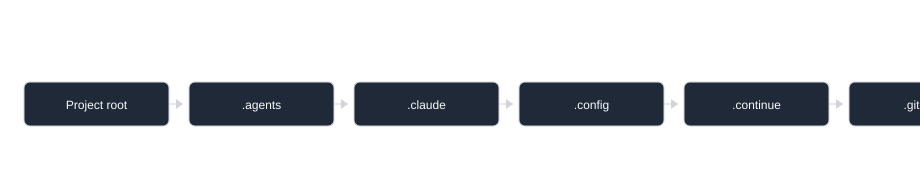
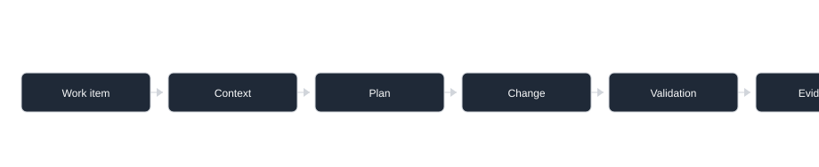

# Project Context

Generated project context for workflow planning and validation. Review assumptions before treating it as project policy.

## Project Information

- Project root: repository root (`.`)
- Generated at: `2026-08-02T10:23:57+00:00`
- Detected project name: `TreadmillRunner`
- Context status: generated; ready for workflow use with recorded assumptions.

## Technologies

- .NET
- GitHub Actions
- Python

### .NET Projects

- `src/TreadmillRunner.Core/TreadmillRunner.Core.csproj` targets net10.0
- `src/TreadmillRunner.Gateway/TreadmillRunner.Gateway.csproj` targets net10.0-windows10.0.22621.0
- `src/TreadmillRunner.Infrastructure/TreadmillRunner.Infrastructure.csproj` targets net10.0-windows10.0.22621.0
- `src/TreadmillRunner.Infrastructure/Design/TreadmillRunner.Infrastructure.Design.csproj` targets net10.0
- `src/TreadmillRunner.Protocols/TreadmillRunner.Protocols.csproj` targets net10.0
- `src/TreadmillRunner.Web/TreadmillRunner.Web.csproj` targets net10.0
- `tests/TreadmillRunner.Core.Tests/TreadmillRunner.Core.Tests.csproj` targets net10.0
- `tests/TreadmillRunner.E2ETests/TreadmillRunner.E2ETests.csproj` targets net10.0
- `tests/TreadmillRunner.IntegrationTests/TreadmillRunner.IntegrationTests.csproj` targets net10.0-windows10.0.22621.0
- `tests/TreadmillRunner.Protocols.Tests/TreadmillRunner.Protocols.Tests.csproj` targets net10.0

### .NET Context

- .NET context status: partial
- dotnet CLI: not probed or missing
- SDK pinned by `global.json`: `10.0.110`
- Safety: No restore/build/test/package commands were run while generating this context.
- NuGet/feed policy: no private/internal feeds detected from repo-local NuGet config.
- Central package management: `Directory.Packages.props` detected.
- Build policy: `TreatWarningsAsErrors=true`, `Nullable=enable`, `AnalysisLevel=latest`, `LangVersion=latest`, `ManagePackageVersionsCentrally=true`, `ContinuousIntegrationBuild=true`, `EnforceCodeStyleInBuild=true`, `ImplicitUsings=enable`
- Configuration inventory: `artifacts/client-debug/wwwroot/appsettings.Development.json` (no connection-string names); `artifacts/client-debug/wwwroot/appsettings.json` (no connection-string names); `artifacts/client-release-debugger/wwwroot/appsettings.Development.json` (no connection-string names); `artifacts/client-release-debugger/wwwroot/appsettings.json` (no connection-string names)
- Persistence signals: packages `Microsoft.EntityFrameworkCore.Design`, `Microsoft.EntityFrameworkCore.Sqlite`
- Feature signals: `aspnet-core`, `blazor`, `ef-core`, `signalr`, `test-projects`
- .NET validation candidates for later review:
  - `dotnet restore TreadmillRunner.slnx` (restore)
  - `dotnet build TreadmillRunner.slnx --no-restore` (build)
  - `dotnet test TreadmillRunner.slnx --no-restore` (test)

## Structure And Responsibilities

Source: [Mermaid](diagrams/project-context-structure.mmd)

| Path | Responsibility |
|---|---|
| `.agents/` | project-owned folder; inspect before editing |
| `.claude/` | project-owned folder; inspect before editing |
| `.config/` | project-owned folder; inspect before editing |
| `.continue/` | project-owned folder; inspect before editing |
| `.github/` | project-owned folder; inspect before editing |
| `artifacts/` | project-owned folder; inspect before editing |
| `automations/` | project-owned folder; inspect before editing |
| `docs/` | project documentation |
| `eng/` | project-owned folder; inspect before editing |
| `src/` | application and library source |
| `tests/` | automated tests |
| `validation/` | project-owned folder; inspect before editing |

## Architecture And Workflow Use

Source: [Mermaid](diagrams/project-context-architecture.mmd)

- User story and bug workflows should load this file before planning.
- Navigation maps, when present, live under `automations/navigation/artifacts/maps/`; start with `HANDOFF.md` for the compact read order.
- Plans should reference exact validation commands from `docs/project/validation/validation-manifest.json`.
- Data-impacting work still needs story-specific impacted entities and ERD evidence in the workflow plan.

## Security And Configuration Notes

- Secret values are not emitted; only file names and configuration key names are reported.
- .NET appsettings files are present; inspect provider binding and secret storage before config changes.
- CI workflow files are present; compare local validation with CI before handoff.

## Validation And Proof

- Validation runner: `python -B docs/project/validation/run_project_validation.py --target . --evidence-dir docs/project/validation/evidence`
- Optional Playwright screenshot proof: add `--screenshot-url <local-url>` after starting the app.
- Evidence output: `docs/project/validation/evidence/<run-id>/validation-report.json` and command logs.

| Check | Command | Kind | Required |
|---|---|---|---|
| Harness addition ownership | `python -B .agents/manage.py check-additions` | validation | true |
| Harness generated sync | `python -B .agents/manage.py sync --check` | validation | true |
| Agent compatibility | `python -B .agents/manage.py validate-agent-compatibility` | validation | true |
| Harness repository check | `python -B .agents/manage.py check` | test | true |
| .NET build | `dotnet build` | build | true |
| .NET tests | `dotnet test` | test | true |
| Python unittest tests | `python -B -m unittest discover -s tests` | test | true |

## Generated Files And Boundaries

- Generated project context package: `docs/project/project-context.md`, `docs/project/project-context.json`, `docs/project/diagrams/`, and `docs/project/validation/`.
- Generated navigation package: `automations/navigation/artifacts/maps/` when initialized by `setup` or `repo-navigation`.
- Do not commit secrets, local caches, model payloads, browser traces, screenshots, or validation evidence unless the project policy explicitly asks for retained proof.

## Agent Workflow Notes

- Read `docs/project/project-context.md` before bug, story, migration, upgrade, or validation planning.
- Read `automations/navigation/artifacts/maps/HANDOFF.md` when present for the compact project map and stale-source check command.
- Refresh context and maps when manifests, source layout, validation commands, CI, security-sensitive config, or generated-file boundaries change.

## Freshness

- Last generated: 2026-08-02
- Last reviewed: not reviewed; generated automatically for workflow use with recorded assumptions.
- Refresh when project files, dependencies, app startup, test commands, CI, Playwright config, migrations, or security-sensitive configuration changes.
- Refresh command: `python -B .agents/skills/project-context-generator/scripts/generate_project_context.py --target . --write --overwrite`
