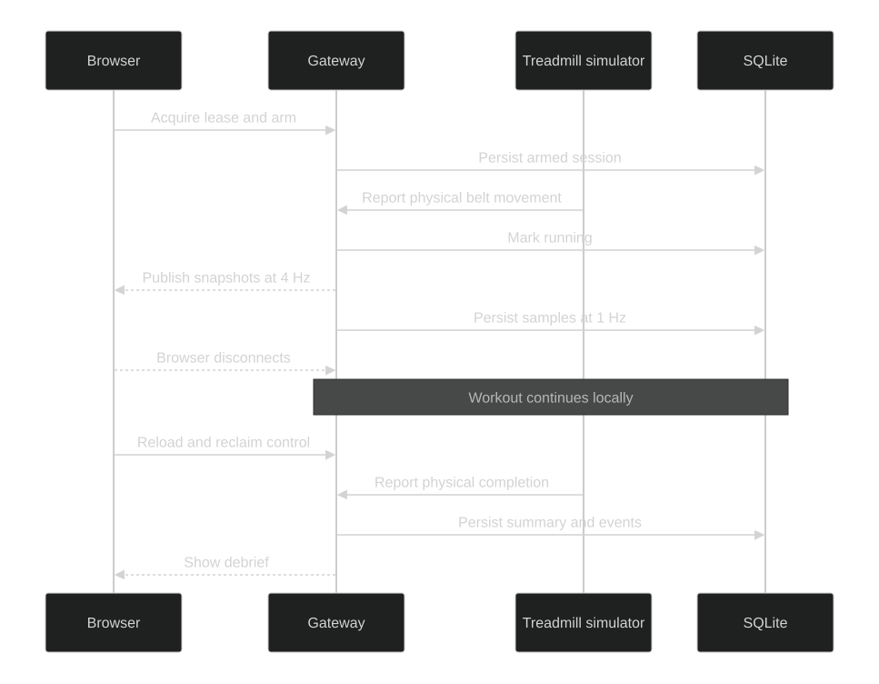
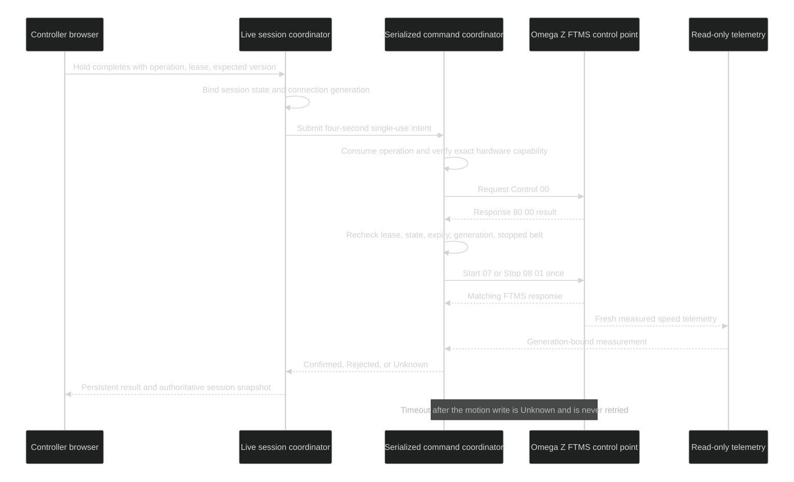

# Authoritative live session

TR-004 provides the authoritative simulator-backed daily running flow. TR-005 adds an explicitly selected read-only Omega Z telemetry source and simultaneous Polar H10 source through the same gateway-owned session coordinator. The gateway—not the browser—owns session state, workout progression, lease, sample cadence, events, and completion. Offline tests do not prove Windows Service BLE or real treadmill control.

Source: [Mermaid](diagrams/live-session-simulated-live-session.mmd)

Source: [Mermaid](diagrams/live-session-command-flow.mmd)

## Runner flow

1. Select a local profile and immutable workout revision.
2. Review gateway, database, simulated treadmill, and heart-rate readiness. HR is required only for an HR-target workout.
3. Take the single controller lease and arm the workout.
4. If the exact enrollment has hardware-verified FTMS Start capability, press and hold for three seconds to send one short-lived Start intent at the verified minimum speed (the owner reports `0.8 km/h`, pending range verification). Otherwise start from the physical console. In either case, three fresh moving treadmill samples advance the session; Development uses its simulator-only motion fixture.
5. Follow live measured, requested, and planned values. Speed and incline both use 10 as their default top tick (10 km/h and 10%). Either axis expands immediately, in whole-unit increments, only when the workout plan, requested target, or measured telemetry exceeds 10. Each retains its highest observed scale for the remainder of the run to avoid visual jumping. For timed workouts, cursor position is elapsed time divided by the immutable workout-plan duration. Distance and other open-ended runs use an expanding five-minute timeline window with one minute of lead time, so the cursor advances without being permanently pinned to the right edge. The browser plots bounded transient chart points; SQLite stores one sample per second.
6. Manual speed and incline overrides, Stop-backed Pause, and Start/Resume require a current lease and unique operation ID. Targets are normalized against the workout, profile, and verified hardware bounds; requested, accepted, and measured values remain distinct. A fixed speed or incline target is applied once when its segment begins, so subsequent physical-console or app adjustments remain in effect for the rest of that segment. Entering the next segment clears app overrides and applies its fixed targets. Ramp targets and enabled heart-rate speed control remain continuously automated.
7. Play/Pause sends verified Stop while running and preserves the session for a fresh hold-to-resume. Stop/End sends Stop first, then explicitly keeps the session paused, resets only the workout cursor, or ends and saves it. Reset never starts motion and keeps all recorded totals and evidence.
8. End the stopped physical session, then optionally save RPE 1–10 and a note.
9. Review planned/requested/measured speed and incline on labelled independent axes in the history page and read-only history sheet. Historical heart-rate readings have their own bpm graph with sensor gaps preserved. Elevation gain/loss is derived retroactively from each stored measured-incline and belt-distance interval using slope geometry. Estimated calories use the runner's session-snapshotted weight and every measured speed/incline interval (ACSM speed/grade equations with a bounded walk/run transition), so manual console and app changes are included. These values are shown alongside HR-zone duration, adherence, event counts, and current-week completed totals.

## Authority and recovery

- A lease heartbeat runs every five seconds and expires after fifteen seconds. It gates manual browser actions only.
- Browser loss never stops the gateway-owned session. Planned progression and eligible HR control continue at the gateway; reloading with the same browser holder ID idempotently reacquires its controller view.
- BLE loss preserves elapsed time and records an unobserved telemetry gap without fabricating distance or measurements. Two fresh stable samples from the same moving treadmill can reconcile the current elapsed target unless a console change, stale HR, protocol fault, or unknown result blocks it.
- Gateway startup restores tracking only from a bounded checkpoint for the same enrolled treadmill. Fresh movement must be confirmed within 30 seconds; all commands remain suspended until **Resume planned controls**. Invalid/unavailable recovery becomes `Interrupted` and never sends Start.
- Every treadmill request includes operation ID, lease/holder, and expected session version. The gateway adds session state, short expiry, and connection generation, serializes writes, consumes the operation before writing, and returns `Rejected`, `Confirmed`, or `Unknown`.
- `Confirmed` requires the matching FTMS response plus fresh measured telemetry. `Unknown` is persistent, suspends automation, instructs physical inspection, and is never blindly retried.
- Repeated manual operation IDs return the current result without creating another event.
- The exact selected workout revision, profile name and ID, profile HR-zone/controller snapshot, metric algorithm version, requested/measured values, samples, and events are persisted.

## Current limits

- The Development simulator reports a fixed HR value. An enrolled Polar H10 supplies real HR; Garmin is outside v1. The HR controller supports Shadow, Decrease only, Full, and Off, with configurable steps/cooldowns. Browser lease loss removes manual authority but does not suspend gateway-owned control; stale telemetry, unsafe reconnect, write uncertainty, pause, protocol fault, or manual speed override still suspends it.
- FTMS Start/Resume, Stop, Pause, speed, and incline software paths exist, but each stays blocked unless persisted exact-model evidence is `HardwareVerified` for that capability. The daily Pause interaction deliberately uses verified Stop; the separate raw Pause opcode remains unused and capability-disabled.
- Accelerated four-hour cadence and bounded chart-memory tests pass. An explicit soak persists and reads 14,400 one-second SQLite samples. In-process controller acceptance stays below 100 ms p95 and loopback browser telemetry stays below 500 ms p95. Formal household-Wi-Fi p95 measurement is not a deployment acceptance check; retained timestamps are diagnostic evidence if normal use feels delayed.
- Signed update check/stage/activate and helper rollback are implemented and deterministically tested. Real A→B activation and broken-C rollback on the Windows VM remain deployment evidence; publishing the Playwright host is not update evidence.
- Screen Wake Lock is not promised over the selected private-LAN HTTP deployment. Configure device Auto-Lock if a continuously visible display is required.

## Validation

- `eng/validate.ps1 -Configuration Release` runs locked restore, formatting/analyzers, architecture gates, build, and non-browser tests. Connect IQ is opt-in with `-IncludeConnectIq` and is used only for companion-related changes.
- `eng/playwright.ps1 -Configuration Release` exercises preflight, live movement, override markers, browser reclaim, debrief, history analytics, and phone/tablet/desktop screenshots. It publishes once, reuses one migration-aware database template, copies that template into isolated fixture databases, runs at most three fixture classes in parallel, streams TRX/log evidence under `artifacts/test-results`, prints progress heartbeats, and stops its exact child process tree after 90 seconds without output or on the total timeout.
- During implementation, reuse current readiness evidence, build/publish output, and migrated database template with `eng/playwright.ps1 -Configuration Release -ReuseBuild -Filter 'FullyQualifiedName~AffectedBrowserTests'`. Run once without `-ReuseBuild` after relevant source changes and for the final release gate. The script automatically allows two minutes for focused filters and five minutes for the complete Browser category.
- Connect IQ simulator attempts are limited to 15 seconds and two attempts per representative device. A hung `monkeydo` process tree is terminated before retry, so `eng/validate.ps1` cannot wait indefinitely on the Garmin simulator.
- The preferred agent entry point is `eng/verify-change.ps1`: use exact `-TestFilter` and optional `-BrowserFilter` values while editing, then use `-Full` once at final acceptance. It automatically chooses between refreshed and reusable browser output.
- `eng/soak.ps1 -Configuration Release -Build` runs the explicit four-hour/14,400-sample SQLite proof outside the fast default suite.
- Accepted screenshots are generated locally under the ignored `validation/playwright/accepted` evidence directory.
