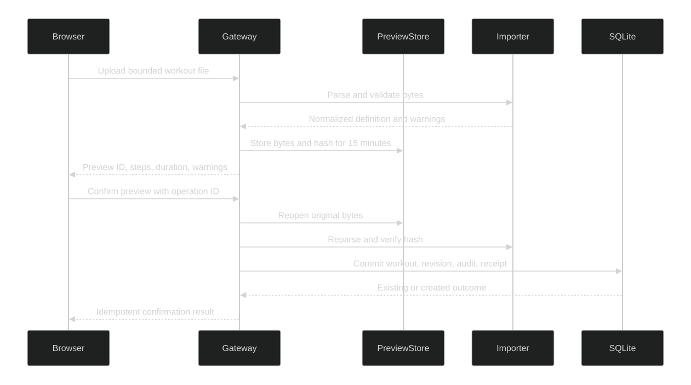

# Planning data and import flow

TR-003 persists profiles, immutable workout revisions, recurring calendar alternatives, and confirmed import evidence in SQLite. Workout definitions remain versioned canonical JSON; calendar references always point to an exact revision.

## Data model

Source: [Mermaid](diagrams/planning-data-data-model.mmd)

The application never updates or deletes a workout revision. Editing appends another revision; existing calendar choices and future session history keep their original revision ID.

## Movable recurring schedules

TR-010 gives every `CalendarSeries` a durable `ScheduleGroupId`. A normal recurring schedule starts as one series whose group ID equals its own ID. Moving only one occurrence creates a skip exception on the original date and an add exception on the target date. Moving “this and later” preserves earlier dates, splits the recurrence at the selected date when necessary, rotates the weekday mask by the date difference, shifts future exceptions, and keeps every continuation segment in the same logical group.

TR-011 adds three profile-owned Garmin integration tables. `GarminAccountLinks` stores the stable external subject and Data-Protection ciphertext for tokens; both profile and external subject are unique. `GarminOAuthStates` stores a hashed one-time state plus protected PKCE verifier and expiry. `GarminSyncItems` is an idempotent versioned outbox for `Workout` and `Calendar` publication. TR-032 makes publishing explicitly session-by-session: opening one planned calendar option validates that exact profile/date/revision and queues only its runnable workout plus one dated occurrence. Connecting Garmin, creating workouts, and background processing never bulk-enqueue the remaining plan. Disconnecting a profile link cascades through its state and queue without changing local workouts, calendar history, or another profile.

TR-013 keeps unsupported activity delivery structurally separate. `GarminActivityUploadAccounts` stores one profile-owned protected private-session token envelope, explicit enable flag, enable watermark, provider state, and optimistic version. `GarminActivityUploadJobs` binds one completed session to one deterministic idempotency key and tracks atomic lease, attempt, response disposition, safe failure kind, and remote ID. Unknown, duplicate, and rejected outcomes are terminal. Disconnect deletes that private account aggregate, while a later enable watermark prevents historical sessions from being queued again. `GarminWatchBindings` stores one profile-owned device label and SHA-256 token hash; the raw watch token is returned once over HTTPS/loopback and never persisted.

The calendar UI exposes the scope before it writes: **Move only this session**, **Move this and later**, **Delete only this session**, or **Delete complete workout group**. Deleting one session creates a skip exception. Deleting a complete group transactionally removes every continuation segment and its saved day selections; it never deletes immutable workout revisions or completed session history.

Creating or scheduling training is owned by Plan. The runner searches and selects either a standalone workout or an ordered training plan there: a workout opens the recurring-series editor and may add one alternative revision; a training plan uses its own ordered-run scheduler and enforces the plan's required number of training days. Starting a different plan explicitly warns that the current active plan will be abandoned rather than mixing two progression sequences. Calendar renders and manages resulting occurrences but exposes no creation flow.

Every mutation has a unique operation ID, expected series version, deterministic request fingerprint, and persisted receipt. Identical replays return the stored outcome; reuse of an operation ID for another request is rejected. A concurrent edit returns a conflict and the UI reloads before another attempt.

## Ordered training plans

TR-003B keeps a training plan separate from a calendar series. A calendar answers *what is scheduled on a date*; a training plan answers *which exact workout revision comes next*. A plan root owns immutable revisions, and every revision contains contiguous ordered items that reference exact immutable workout revision IDs. Categories such as `5K`, `10K`, `Base`, and `Custom` are searchable labels rather than execution rules.

Each runner can have at most one active plan run. Starting another plan or restarting the current plan abandons the previous active run without rewriting its history. Existing runs remain pinned to the plan revision that was started; editing a plan creates a new revision, and only a later restart opts the runner into that revision.

Premade materialization is idempotent for one runner, template, and template version. Older installed rows and completed history are retained, while ordinary plan lists select one canonical template installation and the template preview opens it with one clear action instead of creating duplicate copies.

TR-025 makes premade plans strictly profile-owned and gives an active run an optional calendar projection: start date, weekday mask, and time-zone label. The projection walks selected weekdays in date order and assigns contiguous program positions without rebasing when a shorter calendar range is queried. These entries are derived from the immutable run rather than copied into editable calendar series. Generated definitions use the internal `PlanInternal` workout kind and are excluded from ordinary library/manual selectors; only their owning plan exposes them. A schedule identifies the exact program run and item, so repeated definitions still advance one intended position at a time.

TR-032 lets one program item own a primary immutable workout revision plus zero or more ordered alternative revisions. All alternatives project onto the same date and completing any allowed revision advances that item once. The corrected 58-week WalkingPad catalog packages 174 canonical slots and 260 source variants without a runtime dependency on the source drive; the obsolete final 1.0 km/h/0.0 stopping tail is omitted because normal treadmill Stop is authoritative. Clearing upcoming sessions is a profile-scoped, expected-version operation that abandons only the active scheduled run, removing its derived future projection while preserving completed history and workout definitions.

TR-027 projects the complete logical plan and stores only sparse per-item moves/skips plus explicit extra occurrences. **Move only** changes one unfinished item; **Move this and following** applies one date offset to the selected and later unfinished items; **Restore** deletes that item's sparse override. **Skip** participates in contiguous progression but is recorded separately from completion. Already-completed items cannot be moved or skipped, but may gain an extra repeat either without changing later dates or while shifting later incomplete items. A full date is not an error: preview reports every resulting double-session date and confirmation adds both choices without replacing either one. Stopped, interrupted, and faulted attempts remain incomplete and are rescheduled instead of repeated.

Extra repeats are calendar choices, not new program positions. Running one does not rewind or double-advance the ordered plan. All mutations carry profile ownership, active-run version, operation ID, request fingerprint, and a durable replay receipt. Existing template-linked workout revisions are treated as plan-internal from their program provenance even when an older row still says `Structured`; this prevents legacy generated definitions from leaking into the standalone library without hiding custom workouts.

The active runner is a browser-local application-shell context. Selecting it once updates Run, Workouts, Calendar, History, and editors; switching runners reloads the current route so no profile-scoped data remains from the prior runner. This is a household convenience context, not authentication or authorization.

A session selected from a plan persists its selection source, plan-run ID, and plan-item ID alongside the exact workout revision. The arm endpoint validates that this is the next expected item and binds the operation ID to that selection. Only a linked session ending `Completed` advances progression. Manual, library, and calendar sessions are unbound; `Stopped`, `Interrupted`, and `Faulted` attempts remain in history but do not advance. A unique completed-item constraint makes advancement idempotent.

TR-026 derives a compact read-only summary from each workout's current canonical revision. It recursively counts expanded segments, totals time and distance goals, identifies steady, interval, progression, multi-stage, and heart-rate structures, and reports the actual speed and incline ranges. The Workouts library can search and filter these derived values. Opening **View details** loads the immutable current revision and renders its steps, cues, notes, ramps, HR directives, and nested repeats without flattening a large repeated pattern. Every training-plan card also exposes its ordered sessions; plans with week or phase metadata remain grouped while custom plans use a concise ordered list. These views do not create, prepare, or mutate a session.

Run recommendation priority is deterministic:

1. one selected or unambiguous workout scheduled for today;
2. an explicit choice when today has multiple calendar alternatives;
3. the next item of the runner's active training plan;
4. Manual run when neither calendar nor plan supplies a workout.

TR-005 adds `DeviceEnrollments` as a separate local operational aggregate. It stores at most one active row per `Treadmill` or `HeartRate` role using a filtered unique index. A row contains the Windows device identifier, protocol ID, SHA-256 identity fingerprint, display/model/firmware labels, explicit treadmill telemetry mode, serialized reported capabilities, evidence level and verification time, optimistic version, and archive metadata. Forgetting archives rather than deletes the row. The raw Windows identifier stays local and must be redacted from shared evidence and diagnostic bundles.

TR-017 adds `BleReliabilityIncidents`, keyed to the local device enrollment and indexed for open-incident and time-window queries. One row represents an outage episode across multiple failed reconnect attempts and is closed only after valid telemetry returns. It persists display label, role, generation/timing, bounded attempt count, failure category, sanitized fault, and maximum delay; raw BLE identifiers and fingerprints are deliberately absent. Recovered rows are retained for 90 days.

TR-021 adds a durable `SessionOrigin` to every workout session. The migration classifies recognized hardware, simulator, and Garmin upload-test configurations and assigns `Legacy` to anything unknown or malformed. Ordinary history, weekly totals, workout reuse, progression, maintenance, and Garmin reconciliation exclude `SystemTest`; the explicit Tests history view includes only those records.

Session deletion is a previewed, version-bound operation. It is permitted only for a terminal, non-recoverable, non-program-linked session whose Garmin state satisfies the story rules. The transaction removes its samples, events, and eligible system-test upload job. Operation receipts remain as tombstones, and deleting a historical hardware session adjusts later maintenance-event distance baselines so already-completed service intervals do not drift.

`TreadmillMaintenancePolicies` owns one editable interval per enrolled treadmill. `TreadmillMaintenanceEvents` records the performed time, app-tracked hardware-distance baseline, bounded note, and unique operation ID. Due state is the earlier of the date or distance threshold after the first recorded baseline; simulator, system-test, legacy, and deleted sessions do not contribute.

## Local-first household state

TR-031 adds five local-only persistence surfaces. `RunnerExperiencePreferences` is one versioned row per profile and stores display mode, two or three selected metrics, cue types, and cue volume. `LocalGoals` stores profile-owned weekly, monthly, or plan targets. `ProgressionRecommendations` binds one deterministic recommendation and its acceptance/rejection receipt to the exact profile and workout session; it does not mutate a program or workout revision. `LocalBackupPolicies` is a singleton owner policy for an absolute local/UNC folder, interval, retention, and enabled state. `BackupVerifications` records isolated full-integrity success or failure without replacing the live database.

The additive migration does not rewrite profiles, workouts, schedules, sessions, or device enrollments. Optimistic versions protect user edits; profile and session foreign keys preserve ownership and explanation provenance.

## Preview and confirm

Source: [Mermaid](diagrams/planning-data-preview-and-confirm.mmd)

Previewing writes nothing to SQLite. Confirmation reparses the bounded original bytes, so a client cannot replace the normalized definition between preview and commit.

Generated treadmill-workout v4 bundle confirmation follows the same preview/reparse rule and atomically creates immutable workout revisions, one ordered workout-program revision, its exact-revision items, audit evidence, and operation receipt. A failure rolls back the entire set. The external skill itself is not copied, executed, or persisted.
