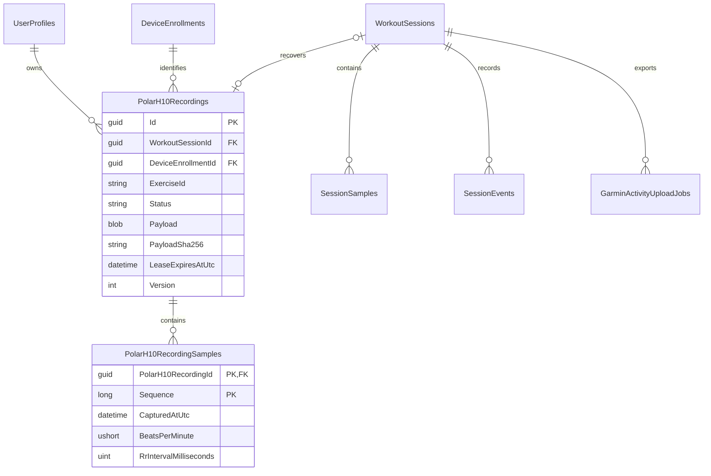

# Polar H10 memory recording and recovery

Polar H10 memory is a feature-gated adjunct to the existing read-only live heart-rate path. It uses a Polar-only PFTP connection in Infrastructure and portable bounded codecs in Protocols. The general BLE read interface and treadmill command interface remain unchanged. The feature is disabled by default until a named H10 and firmware pass the physical acceptance sequence.

Each workout starts with the memory option unchecked. When an opted-in hardware session first reaches physical `Running`, the gateway persists an automatic job for exercise `tr-{sessionId:N}`. A worker checks the exact enrolled device and current recording identifier before every start or stop. Session finalization only queues recovery: it does not wait for BLE. Recovery stops that exact recording, lists and fetches its exact `/tr-{sessionId:N}/SAMPLES.BPB` path, stores an 8 MiB-bounded raw payload and SHA-256, and aligns it against matching live H10 values. A transaction fills null heart-rate values, recalculates aggregates, and records a warning event. Existing heart-rate values are never replaced.

After a committed automatic merge, remote removal is independently retryable and Garmin export may proceed. A missing start and an explicit operator skip are also terminal for Garmin gating. Unknown recordings, a different active identifier, an ambiguous timeline, or an unverifiable removal remain untouched and visible for review. Discarding a workout first persists a cleanup job so deletion of the session cannot orphan an owned H10 recording.

Manual HR and RR recordings use the same durable aggregate but remain separate from workout History. The archive stores the verified payload and parsed samples, supports CSV export, and permits remote deletion only from a retained local row with a payload hash and exact remote path.

```mermaid
sequenceDiagram
    participant Run as Live session
    participant Store as SQLite job
    participant Worker as H10 worker
    participant H10 as Exact enrolled H10
    participant Garmin as Garmin queue
    Run->>Store: Enqueue tr-session at physical Running
    Worker->>H10: Status before exact start
    Run->>Store: Queue stop at terminal state
    Worker->>H10: Status, stop, list, exact fetch
    Worker->>Store: Store payload and hash
    Worker->>Store: Align and fill null HR in transaction
    Store-->>Garmin: Recovery terminal; wake reconciliation
    Worker->>H10: Remove exact merged recording and relist
```



The wire facts and clean-room boundary are recorded in [Polar H10 PFTP memory protocol provenance](protocol-evidence/polar-h10/2026-09-10-pftp-memory-provenance.md). Automated tests establish codec, persistence, worker, Garmin-ordering, API-fingerprint, and responsive-browser behavior. They do not establish Windows pairing, physical H10 service access, recording continuity, sample timing, RR/5-second firmware support, or deletion on a real device.
