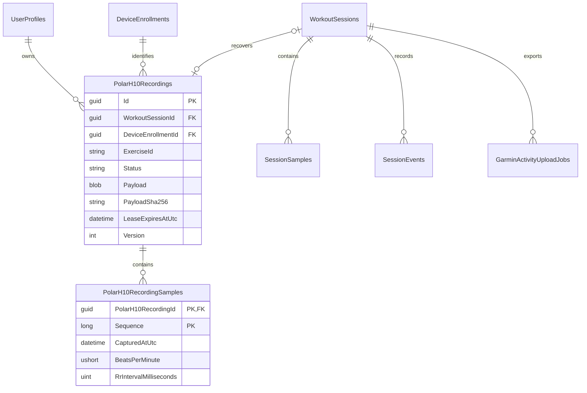

# Polar H10 memory recording and recovery

Polar H10 memory is a feature-gated adjunct to the existing read-only live heart-rate path. It uses a Polar-only PFTP connection in Infrastructure and portable bounded codecs in Protocols. The general BLE read interface and treadmill command interface remain unchanged. The feature is disabled by default until a named H10 and firmware pass the physical acceptance sequence.

Before each PFTP operation, the memory client performs one bounded scan through the shared advertisement broker. A bounded retry of a read-only operation refreshes that locator before reconnecting; mutations are never replayed. It keeps the enrolled locator when that locator is observed; otherwise it may adopt a replacement only when advertisements establish one unique heart-rate-capable match by exact name or by the enrollment's unique device family and kind. Ambiguous candidates never rebind. The fresh advertisement also supplies Windows with the current public/random address type before the PFTP connection opens, which matters when a Polar private address has rotated since enrollment.

Live heart-rate and PFTP response subscriptions request `GattSession.MaintainConnection` when Windows reports that capability. This is a best-effort Windows connection policy, not a guarantee against radio, contact, battery, firmware, or adapter disconnects. Existing bounded reconnect, stale-value removal, source fallback, and preserved-gap behavior remain authoritative.

Each workout starts with the memory option unchecked. For an opted-in hardware session, Prepare durably creates the session-specific automatic job and synchronously confirms exercise `tr-{sessionId:N}` before the armed session is published. If the H10 already has an active recording, Prepare stops it once and verifies idle. A gateway-owned recording that has not yet been downloaded is fetched and durably hashed before its exact `/.../SAMPLES.BPB` path is removed; an unowned recording is removed only by that exact reported path. Prepare verifies removal and then starts the new session-specific recording. The PFTP session is released and fresh normal live H10 telemetry must return before Prepare succeeds, while the operation gate prevents another memory request from interrupting that recovery. Physical `Running` does not issue a second start, so memory coverage begins before workout movement.

Session finalization only queues recovery: it does not wait for BLE. Recovery checks the exact enrolled device and recording identifier, stops that exact recording, lists and fetches its exact `/tr-{sessionId:N}/SAMPLES.BPB` path, stores an 8 MiB-bounded raw payload and SHA-256, and aligns only samples that match the workout timeline. Pre-run samples captured between Prepare and physical start remain in the verified payload but are not merged into History. A transaction fills null heart-rate values, recalculates aggregates, and records a warning event. Existing heart-rate values are never replaced.

After a committed automatic merge, remote removal is independently retryable and Garmin export may proceed. A missing start and an explicit operator skip are also terminal for Garmin gating. Manual memory operations still leave unknown or different active identifiers untouched. The explicit automatic Prepare workflow is the sole exception: it is authorized to replace the one active recording after exact stop/path/removal verification. Ambiguous identifiers, timelines, mutations, or removals fail closed. Discarding a workout first persists a cleanup job so deletion of the session cannot orphan an owned H10 recording.

Manual HR and RR recordings use the same durable aggregate but remain separate from workout History. The archive stores the verified payload and parsed samples, supports CSV export, and permits remote deletion only from a retained local row with a payload hash and exact remote path.

```mermaid
sequenceDiagram
    participant Run as Live session
    participant Store as SQLite job
    participant Worker as H10 worker
    participant H10 as Exact enrolled H10
    participant Garmin as Garmin queue
    Run->>Store: Create tr-session during Prepare
    Run->>H10: Stop and remove exact active stale recording, if any
    Run->>H10: Start and confirm exact tr-session
    H10-->>Run: Resume fresh normal live HR
    Run->>Store: Queue stop at terminal state
    Worker->>H10: Status, stop, list, exact fetch
    Worker->>Store: Store payload and hash
    Worker->>Store: Align and fill null HR in transaction
    Store-->>Garmin: Recovery terminal; wake reconciliation
    Worker->>H10: Remove exact merged recording and relist
```



The wire facts and clean-room boundary are recorded in [Polar H10 PFTP memory protocol provenance](protocol-evidence/polar-h10/2026-09-10-pftp-memory-provenance.md). The current source and hardware evidence boundary is recorded in [Polar H10 live memory and continuity validation](protocol-evidence/polar-h10/2026-09-12-live-memory-and-continuity-validation.md). Automated tests establish codec, locator disambiguation, memory-client routing, persistence, worker, Garmin-ordering, API-fingerprint, and responsive-browser behavior. They do not establish Windows pairing, physical H10 service access, recording continuity, sample timing, RR/5-second firmware support, or deletion on a real device.
