# Project context

## Purpose and current milestone

Build a local-first .NET 10 gateway for one Horizon Omega Z on the existing Windows 11 VM. The gateway owns BLE, workout execution, profiles/history, and a locally served Blazor WebAssembly UI. TR-031 adds profile-owned large-text/high-contrast displays and cues, tiered readiness, exact-revision comparisons, deterministic progression receipts, goals/trends, owner-selected verified backup rotation, combined local health, and confirmation-only sensor-assisted quick start. TR-033 adds Stop-backed resumable Pause, explicit end/reset decisions, and Plan-owned scheduling without adding a service provider, cloud account, or mandatory internet dependency. Exact Omega Z S3.02/V10.23.17 evidence verifies Start, Stop, speed, and incline; the separate raw Pause opcode and vendor motion remain disabled.

## Load first

1. Root [project context](../../project-context.md)
2. [Decision record](decision-record.md)
3. [Architecture](architecture.md)
4. [Story backlog](backlog.md)
5. [Safety rules](safety-guidelines.md)
6. [Omega evidence](omega-z-protocol-findings.md)

## Technology and commands

- .NET SDK 10.0.110 pinned by `global.json`
- ASP.NET Core/Kestrel Windows Service and Blazor WebAssembly
- SignalR live snapshots; EF Core/SQLite migrations, WAL, and online backup are implemented in TR-003
- Windows BLE via `Windows.Devices.Bluetooth` begins read-only in TR-002
- xUnit unit/integration tests and Playwright browser evidence

Commands are project-owned under `eng/`: `bootstrap.ps1`, `build.ps1`, `test.ps1`, `run-simulator.ps1`, `validate.ps1`, and `database.ps1`. `database.ps1` reports or scripts reviewed migrations and applies them only to an explicit SQLite path; gateway startup never silently creates or migrates production data.

## Local planning data (TR-003)

- Household profiles and browser-local active-profile selection are supported.
- Reusable workouts are immutable revisions with canonical definition JSON and a content hash. Editing appends a revision; calendar selections retain their exact revision.
- Native JSON, QDomyos XML, and Garmin FIT workout files are bounded, previewed in memory, and confirmed by revalidating the original bytes. Secure QDomyos parsing never gives `forcespeed` any device-control meaning.
- The calendar expands weekly recurrence in `Europe/Brussels`, supports alternatives and skip/add/replace exceptions, and persists a chosen alternative by profile and local date. A move, following-session shift, restore, or default training-day change is rejected if any resulting date is already occupied, so one plan never silently double-books a day. Removing upcoming sessions is explicitly scoped to the selected plan and leaves completed history intact.
- The file-backed SQLite proof migrates, backs up online, restores to an isolated database, and compares semantic data. Live-database replacement and full disaster recovery remain TR-007.

When producing a Release WebAssembly publish, use `eng/clean-wasm-publish.ps1 -Configuration Release` if generated output may be stale: `dotnet clean` can retain WebCIL assets.

## Simulated runner experience (TR-004)

- The gateway owns arm/wait-for-physical-motion, workout progression, 4 Hz snapshots, one-second persisted samples, events, completion, and browser-independent recovery. BLE treadmill and heart-rate sources publish Ready only with their first valid telemetry snapshot.
- A single controller lease renews every five seconds and expires after fifteen seconds; observers remain read-only. Browser reload can reclaim manual control without owning the workout timer.
- History includes a data-derived planned/requested/measured chart, exact snapshotted HR-zone analytics, adherence/version, event counts, weekly completed totals, and optional RPE/note. Detail responses bound the interactive graph to 240 representative samples and expose the full persisted-sample count; analytics and CSV/FIT exports remain full-resolution.
- Profile-owned run preferences select two or three primary metrics and balanced, large-text, or high-contrast presentation. Missing metrics remain `--`; cues are informational and volume-controlled.
- Completed sessions can be compared only with the same immutable workout revision. Local trend calculations exclude simulator/system-test sessions, and deterministic progression suggestions require an explicit acceptance/rejection receipt without changing a plan.
- Daily Pause uses the exact-device verified Stop operation and retains the active session for an explicit hold-to-resume. Stop/End offers keep paused, reset workout progress, or end and save only after confirmed stop; reset retains recorded totals and never starts motion.
- Owner-selected absolute local/UNC backup policies create rotating copies that pass an isolated full SQLite integrity check while the live session is idle. Operations combines service, database, BLE, storage, and release status.
- Startup restores tracking only for a running hardware session with a bounded checkpoint and the same enrolled treadmill. Fresh movement must appear within 30 seconds and planned controls remain suspended until explicit resume; otherwise the session is interrupted. Volatile single-use intents cover accepted Start/Stop/speed/incline with explicit expiry/lease/session/generation guards and response-plus-fresh-telemetry confirmation. Unknown outcomes suspend automation and are never retried.
- The command connection accepts only the FTMS indication whose request opcode matches the current serialized write. Late acknowledgements for an earlier operation are ignored within the existing bounded wait and can never confirm or reject the current command; a matching response plus fresh telemetry remains mandatory.
- Explicit local-history deletion permits terminal plan-linked sessions and settled Garmin upload records. Plan progress is recalculated from remaining history, and any remote Garmin activity remains untouched; pending, in-flight, and unknown upload outcomes still block deletion.
- See [Simulated live session](live-session.md). Accelerated four-hour cadence/memory, 14,400 one-second SQLite writes, and loopback latency targets passed on the earlier baseline. Formal normal-Wi-Fi latency measurement is not a release check; command and telemetry timestamps remain available for diagnosing practical issues. Signed GitHub/local checks, expected-version staging, pinned-key offline bundle import, UI activation, health verification, and rollback are implemented. GitHub metadata is transport only; the installed public certificate and signed manifest remain authoritative.

## Non-negotiable boundaries

- Remote motion capability is enabled only for the exact model/firmware and individual operations already accepted; reported FTMS support alone is insufficient.
- Physical safety key and console remain authoritative.
- No real BLE command before its explicit hardware gate.
- Browser is not in the live control loop.
- No WinRT outside Infrastructure and no GATT write outside the device coordinator.
- No Start or command replay after disconnect, restart, update, or browser reload. A healthy browser-only interruption does not own or suspend the gateway workout. BLE recovery may generate fresh current-position commands only after guarded reconciliation; a service restart always requires explicit planned-control resume.
- Calendar cannot create training. Plan owns workout scheduling and training-plan start/restart; already-installed premade template versions are idempotent and expose one open action.
- External QDomyos code is not copied or translated.

## External and generated boundaries

Source: [Mermaid](diagrams/project-context-structure.mmd)

- `../qdomyos-zwift` is read-only research evidence outside this repository.
- Harness routing, registries, and adapters are generated through `.agents/manage.py` and are not hand-edited.
- Application code lives under `src/`; tests under `tests/`; deterministic entry points under `eng/`.

## Current verification status

- Windows sees the passed-through RZ616 and nearby devices.
- TR-002 programmatic Windows BLE scanning and uncached GATT enumeration passed interactively; Windows Service Session 0 remains a pending hardware/platform gate outside TR-003.
- TR-005 read-only enrollment and telemetry are implemented. Physical Omega Stage 1/2 evidence is captured; simultaneous Polar operation for a bounded 5–10 minute observation and one successful power-cycle/reconnect check remain owner-present checks. No physical acceptance run may exceed 10 minutes.
- Stage 3 on S3.02/V10.23.17 verifies Start at 0.8 km/h, Stop, speed 1.2/1.5/1.0, incline 1.0/0.5, and final fresh speed/incline 0.0. Pause, production-browser planned transitions, and the representative HR workout remain owner-present checks.
- The Windows gateway service and signed update helper are installed. TR-007A proved a UI-driven good promotion and a deliberately broken rollback; TR-007C separates daily stable publishing from acceptance fixtures; TR-015 keeps local feed support while adding fixed-repository GitHub discovery and signed offline upload.
- TR-009 adds capability-aware target preflight, immutable session hardware snapshots, Polar-first source policy, system-level simulated HR automation, screen wake lock, `/health/ble`, and maintenance-locked semantic restore verification.
- TR-013 adds isolated per-profile Garmin surfaces: official training publication remains approval-gated; unsupported completed-FIT upload is opt-in with protected tokens, enable watermark, atomic durable jobs, terminal duplicate/unknown handling, and no stored password; Connect IQ records only after explicit watch input and can read profile/session status only after trusted HTTPS pairing. The watch source/store package is prepared, while SDK/simulator/physical-watch/IQ Store acceptance remains external.
- TR-017 adds exact-revision one-tap reuse, validated treadmill-workout v4 program import, local QR sharing, typed Screen Wake Lock status, bounded BLE reconnection/outage reports, optional HR battery, awaited startup/daily integrity checks, safe SQLite maintenance, and verified last-known-good backups. Its external workout skill remains read-only and is neither executed nor copied into the app.
- TR-024 adds 16 neutral versioned plans, target/profile preview, idempotent inactive materialization, deduplicated definitions, immutable template provenance, and phase/week rendering for the 174-session long plan. Source examples and the external workout skill remained read-only.
- TR-021 classifies Hardware/Simulator/SystemTest/Legacy sessions, hides system tests from normal totals and progression, supports guarded transactional local deletion, adds manual Found-in-Garmin acknowledgment, checks server/client build fingerprints, keeps editor drafts in bounded expiring browser storage, and tracks informational maintenance intervals from app-recorded hardware distance. It intentionally registers no service worker.
- TR-022 starts a hard-bounded GET-only recovery monitor after an accepted or interrupted activation response and never resends the command. A promoted fingerprint reloads once even when session storage is unavailable, the explicit banner reload bypasses a spent automatic guard, and a same-build rollback renders its terminal status without reloading.
- TR-020 permits the one-time experimental Garmin login/MFA from a direct private or link-local household peer as an explicit owner convenience decision. Public HTTP peers remain rejected, passwords/codes remain ephemeral, and the service retains only DPAPI-protected session tokens for unattended uploads. The app must never be port-forwarded or exposed to guest/public networks.
