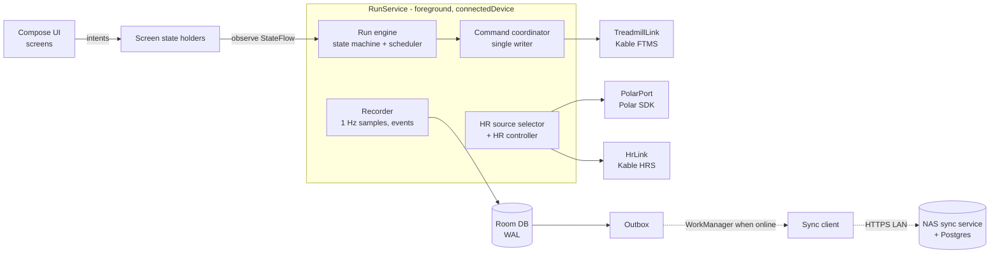

# TreadmillRunner rewrite plan

## 0. Summary

TreadmillRunner will be rebuilt as a **native app on a phone mounted on the treadmill**. The reference device is a Motorola moto g15 Power (Android 15, MediaTek Helio G81, Bluetooth 5.0, 5 GHz Wi-Fi, 8 GB RAM).

- **The phone does everything a run needs, with no network at all:** Bluetooth to the Horizon Omega Z and the Polar H10, workout execution, recording, history, plans and exports.
- **A NAS is optional.** It is a sync and backup target (a Postgres container behind a small sync service, or a plain file share). It also hosts the parts that need the internet, such as Garmin upload.
- **Technology:** Kotlin Multiplatform (KMP) with Compose Multiplatform. Android comes first. The shared code also targets a desktop viewer and, later, iOS without rewriting the domain, protocols or UI.
- **Priorities, in order:** safety, reliability, flexibility, then visual quality.
  - Every safety rule the current app proved on hardware (section 5) carries over unchanged.
  - The UI gets a real design system (section 9) and screenshot regression tests, so the layout problems of the web UI (section 1.3) cannot come back unnoticed.

This plan is the contract for the rewrite. Section 12 turns it into user stories with testable acceptance criteria, and section 13 orders them into phases.

---

## 1. Why rewrite, and what we keep

### 1.1 What the current system taught us
- The Windows VM gateway with a passed-through MediaTek RZ616 radio is the main source of Bluetooth instability. See the [connectivity research](../protocol-evidence/polar-h10/2026-09-24-bluetooth-connectivity-research.md).
- A browser UI served from a gateway breaks whenever the gateway is unreachable. The symptoms: no offline mode, Wake Lock not working over HTTP on iOS, stale PWA builds, and slow WASM start (Lighthouse mobile about 60).
- Android is where Polar's official SDK runs. It covers H10 heart rate, the firmware 4.x security request and onboard recording, all of which we currently re-implement by hand.

### 1.2 What carries over (proven assets)

| Asset | How it is reused |
|---|---|
| Omega Z FTMS control facts and evidence (Stage 1–3) | Ported verbatim into `protocol-ftms` with the same golden vectors |
| Command confirmation, intent, lease and recovery policies | Ported into `domain-run` as pure Kotlin, with the C# tests translated one-to-one |
| Workout schema v1, canonical JSON and SHA-256 revisions | Same JSON, so existing workouts import byte-for-byte |
| Programs, calendar and the premade catalog (16 templates, the 174-slot WalkingPad plan) | Ported as data plus the same rules |
| HR source selector and HR speed controller | Ported with the same constants (dwell 20 s/10 s, steps 0.2/0.5 km/h, cooldowns 30 s/15 s) |
| FIT/TCX/CSV/JSON export semantics, Garmin FIT merge rules | FIT generation on the device; Garmin upload moves to the NAS |
| Importers (native JSON, QDomyos XML, FIT Workout, v4 bundle) | Ported, with the same preview-then-reparse-original-bytes rule |
| Test suites (Protocols, Core, key Integration scenarios) | Become golden vectors and scenario tests in `commonTest` |
| Connect IQ watch app | Kept; pairing moves from HTTPS polling to the Connect IQ Mobile SDK on Android |

### 1.3 UX problems the new design must prevent

| Past problem | Prevented by |
|---|---|
| Preset rails needed scrolling; portrait chart cramped; dense landscape; no real landscape graph (TR-039) | The Run screen layout spec (9.6) is fixed per window class, with no scrolling during a run and a dedicated landscape chart layout |
| Form inputs under 44 px and text under 16 px caused iOS zoom | Minimum touch target 56 dp during a run and 48 dp elsewhere; minimum body text 16 sp; lint rule plus screenshot tests |
| Menus overflowing on short landscape; empty editor column squeezing content | Adaptive layouts from window size classes; list-detail panes that collapse; no fixed widths |
| Library flooded with generated plan workouts | Plan-internal workouts are never listed in the library |
| Play/Pause vs Stop ambiguity | One labelled **Stop** button plus a clearly labelled **Pause (stops belt)**; no icon-only safety actions |
| Too many choices on the Run page | The Today screen shows one primary action; alternatives sit behind "Choose another" |
| Jargon ("MergeAndReplace", "Unknown outcome") | Content guide (9.9): plain language, consequence first |
| Slow start, stale builds, reload prompts | Native app, cold start target under 2 s, updates installed only while idle |
| Screen dimming during a run | `FLAG_KEEP_SCREEN_ON` while a session is armed or running |
| Unusable when the gateway is down | There is no gateway; the phone is self-sufficient |

---

## 2. Target devices and roles

| Device | Role | Required? |
|---|---|---|
| **Treadmill phone** (moto g15 Power, Android 15) | The console: all BLE, the run engine, the local database, the UI, local exports | Yes |
| **Horizon Omega Z** (console S3.02, BLE firmware V10.23.17) | Treadmill: FTMS telemetry plus the verified control subset | Yes |
| **Polar H10** (firmware 4.2.0) | Primary HR, optional onboard recording | Recommended |
| Other HR sensors (straps, Garmin watches in HR broadcast) | Fallback HR sources | Optional |
| **NAS** (Docker host) | Sync service plus Postgres, backup target, update mirror, Garmin upload worker | Optional |
| Garmin watch (Fenix 8 / Vivoactive 5–6) | Connect IQ companion: own recording, status | Optional |
| Desktop/laptop (Windows/Linux/macOS) | Desktop viewer app: history, planning, workout editing (syncs through the NAS) | Later phase |
| iPhone/iPad | iOS viewer, and possibly a console later | Later phase, optional |

### 2.1 Phone setup requirements (validated in story DEV-01)
- Android 15, battery optimisation **exempt** for the app, and the charging limit on (if the phone offers one) or a smart plug limiting charge time.
- Wi-Fi on **5 GHz only**, or Wi-Fi off during runs. Bluetooth shares the radio with 2.4 GHz Wi-Fi.
- A mount on the treadmill console facing the runner's chest. That gives line of sight to the H10 and the phone stays within reach.
- Polar H10: "2 Bluetooth devices" **off** (via Polar Flow) unless deliberately needed, fresh CR2025 battery, and no pairing in Android settings (the app handles security on demand).

---

## 3. Technology choices

| Concern | Choice | Why | Alternatives considered |
|---|---|---|---|
| Language/runtime | **Kotlin 2.x, Kotlin Multiplatform** | Native on Android, shares code with desktop (JVM) and iOS; the Polar SDK is Kotlin | .NET MAUI (keeps C#, but the Polar SDK would need a Kotlin binding and the Android BLE tooling is weaker); Flutter (Dart; Polar SDK only through a plugin, weaker BLE control) |
| UI | **Compose Multiplatform** (Material 3 foundation, custom design system) | Stable on Android, desktop and iOS (iOS stable since CMP 1.8.0) | Native per platform |
| Architecture | Unidirectional data flow (state in, intents out), Clean/hexagonal modules | Testable pure domain; UI is a function of state | — |
| Concurrency | kotlinx.coroutines, `StateFlow`/`SharedFlow`, structured concurrency | Deterministic cancellation of device work | RxJava |
| DI | Koin | KMP-friendly, simple | Hilt (Android only) |
| Local DB | **Room (KMP)** with the bundled SQLite driver, WAL mode | KMP support is stable (Room 2.7+/2.8); schema export and migration tests | SQLDelight (also good; choose Room for its migration tooling) |
| Serialization | kotlinx.serialization (JSON, canonical encoder for revisions) | Deterministic canonical JSON for SHA-256 revision hashes | — |
| Time | kotlinx-datetime plus an injected `Clock` / monotonic `TimeSource` | Testable timing; the engine uses a monotonic clock | — |
| BLE, treadmill and generic HR | **Kable** (JuulLabs, KMP BLE) behind our own `BleCentral` port | One API for Android and iOS; coroutine-native | Nordic Kotlin BLE library (Android only) |
| BLE, Polar H10 | **Polar BLE SDK** (Android now, iOS SDK later) behind a `PolarPort` | Official support for HR, firmware 4.x security, PFTP recording, PFC settings | Our own PFTP port (kept only as a fallback; see H10-07) |
| FIT files | Garmin FIT SDK (Java) on Android/JVM; `expect/actual` for iOS later | Official encoder/decoder | Hand-written encoder |
| Networking | Ktor client (app), **Ktor server** (sync service) | Same language and models on both sides | Spring Boot |
| NAS database | **PostgreSQL 16+** in Docker | Reliable, queryable, easy backup | SQLite on a share (fragile over SMB) |
| File-share mode | SMB via `smbj` (Android/JVM) or Android Storage Access Framework | Works with plain NAS shares | NFS |
| Background work | Android foreground service (`connectedDevice` type) for runs; WorkManager for sync, backup, exports and updates | Runs survive screen-off and are exempt from Doze while in the foreground | — |
| Testing | kotlin.test plus Kotest (property tests), Turbine (flows), Compose UI tests, **Roborazzi** screenshot tests, Room migration tests, Testcontainers (Postgres) | Covers logic, UI regressions and DB evolution | — |
| Build/CI | Gradle version catalogs, GitHub Actions, detekt plus ktlint, Android Lint, Dependabot/Renovate | Reproducible, checked builds | — |

**Cross-platform stance:** the domain, protocols, run engine, persistence, sync client and the whole UI live in `commonMain`. Platform code is limited to BLE adapters, the Polar SDK adapter, the foreground service, the updater, file access and FIT encoding. Adding iOS later means adding those adapters, not a rewrite.

---

## 4. Architecture

### 4.1 Module layout

```
app-android/            Android application: Activity, foreground RunService, updater, platform wiring
app-desktop/            (later) Compose Desktop viewer
app-ios/                (later) iOS host
shared/
  core-model/           IDs (UUIDv7), units (Speed, Incline, Bpm, Distance), Clock, Result types
  protocol-ftms/        FTMS codecs: control point 2AD9, treadmill data 2ACD, features 2ACC, ranges 2AD4/2AD5
  protocol-hr/          HRS 2A37 parser, battery 2A19, DIS 180A
  protocol-omega/       Omega vendor telemetry FFF0/FFF4 decoder (read-only; research writes NOT ported)
  protocol-pftp/        (fallback only) Polar PFTP codec, used if the SDK path fails acceptance
  protocol-fit/         FIT/TCX/CSV/JSON exporters, FIT workout, Garmin merge semantics
  protocol-import/      native JSON, QDomyos XML, FIT workout, v4 bundle importers
  domain-devices/       enrollment, capability profiles, HR source selection, reconnect policy
  domain-workout/       workout schema v1, capability preflight, summaries, revisions
  domain-plan/          programs, calendar, premade catalog, progression
  domain-run/           session state machine, command coordinator, HR controller, recovery policy, metrics
  domain-history/       analytics, comparisons, trends, deletion rules
  data-local/           Room database, DAOs, migrations, outbox, backup/restore
  data-sync/            sync client: change capture, push/pull, conflict resolution, file-share mode
  device-ble/           BleCentral port plus Kable adapter; TreadmillLink, HrLink
  device-polar/         PolarPort plus the Polar SDK adapter (androidMain), fake (commonTest)
  ui-design/            design tokens, theme, components (see section 9)
  ui-features/          screens: today, run, history, workouts, plans, calendar, devices, profile, settings, sync, diagnostics
  testing/              fakes, simulators, golden vectors, scenario DSL
server/
  sync-service/         Ktor server + Postgres (Flyway migrations), update feed mirror, Garmin worker host
  garmin-adapter/       existing Python garminconnect adapter (JSONL contract), containerised
```

Dependency rule: `ui-*` → `domain-*` → `core-model`/`protocol-*`. Adapters (`device-*`, `data-*`) implement ports that the domain defines. The domain never imports Android, Kable or the Polar SDK.

### 4.2 Runtime structure on the phone



- **RunService** starts when a session is armed and stops after the session is terminal and all writes are flushed. It holds the only references to device links during a run. The UI can be killed and recreated without affecting the run.
- **Run engine:** a pure state machine driven by a 4 Hz tick (monotonic clock), telemetry events, and user intents. It emits commands to the command coordinator and records to the recorder. Same states as today (section 5.6).
- **Command coordinator:** the single serialized writer to the treadmill control point. It implements intents, confirmation windows and outcomes exactly as in section 5.
- **Recorder:** persists 1 Hz samples plus events in small transactions, never on the UI thread, and checkpoints recovery state every 5 s.
- **Device links:** each has its own supervisor coroutine. Connection state changes are events; a link never decides to stop the belt.

### 4.3 Process death and crash recovery
- On restart after process death, `RunService` restores from the last recovery checkpoint and applies the **restart recovery rule**: movement must be confirmed within 30 s, otherwise the session becomes `Interrupted`. Planned controls always need an explicit resume.
- A start command is never replayed. Intents are not persisted as "to do"; only their receipts are stored.

### 4.4 Data flow and offline-first rule
- The **local database is the source of truth.** Every feature (run, plans, history, exports, device setup) works in airplane mode.
- Network features (NAS sync, Garmin upload, update check) are **queued work** with visible status, never blocking prerequisites for a run.

---

## 5. Safety and protocol contract (non-negotiable)

These rules are ported from the current code and evidence. Each has at least one automated test in `domain-run` or `protocol-ftms`, plus hardware acceptance where noted.

### 5.1 Verified device profile
- The accepted control profile is **model `OMEGA Z`, BLE firmware `V10.23.17`, FTMS telemetry mode**.
- Speed 0.8–20.0 km/h in 0.1 steps; incline 0–12% in 0.1 steps.
- Verified capabilities: **Start, Stop, SetSpeed, SetIncline**. Raw FTMS Pause is **not** verified.
- Any other model or firmware gets **read-only** mode. A mismatch found on reconnect durably downgrades the device before it can become Ready.
- Vendor `FFF3` writes are not ported. There is no silent FTMS/vendor fallback; the telemetry mode is chosen explicitly at enrollment.

### 5.2 FTMS control point (2AD9)
- Request Control `00`; SetSpeed `02`+u16 (0.01 km/h); SetIncline `03`+s16 (0.1%); Start/Resume `07`; Stop `08 01`. Responses are `80 <op> <result>`.
- The Omega Z never answers Request Control. Accept a typed timeout for opcode `00` only (300 ms window). Motion commands have a 2 s response window.
- One command connection; keep control ownership across commands.

### 5.3 Confirmation rule
- A command is **Confirmed** only with a matching success response **and** fresh measured telemetry of the relevant field. It is **Rejected** on a failure result code. Otherwise it is **Unknown**.
- **Unknown is never retried.** It suspends automation and tells the user to use the console or physical Stop.
- Late responses for earlier opcodes are ignored within the window.

### 5.4 Intents
- Each command intent carries: operation ID (consumed before the write), session ID, version and state, controller lease, expiry (4 s) and connection generation.
- Reconnect expires all intents. Receipts are kept for 90 days.

### 5.5 Start, pause, stop
- **Start** is explicit, single use, and never replayed or restored after reconnect, restart or update. It is sent at 0.8 km/h. The session becomes Running after 3 fresh moving samples; then the planned speed is applied.
- **Pause is a verified Stop.** The session enters `PausedWaitingForPhysicalResume`. The UI labels it **"Pause (stops belt)"**.
- **Resume** is a fresh Start at 0.8 km/h, then ramps to the plan.
- **Stop/End** sends Stop first, then offers Keep paused / Reset progress / End and save. End is accepted only after a confirmed stop.
- **Natural completion** sends one engine-owned Stop. If it is rejected or unknown, the session stays live and visible, with no retry.
- **Bluetooth loss never stops anything.** The safety key, the console and physical Stop are authoritative. The UI says so whenever the link is lost.

### 5.6 Session states
`Idle → ArmedWaitingForPhysicalStart → Running ⇄ PausedWaitingForPhysicalResume → Completed | Stopped | Interrupted | Faulted`

### 5.7 Recovery
- A BLE gap records an unobserved interval and never fabricates samples.
- **Automatic reconciliation** requires all of: the same treadmill, 2 fresh stable moving samples, no Unknown outcome, and a change of at most one increment.
- A larger change means a console change, which needs an explicit "Resume planned controls".

### 5.8 Telemetry validity
- Speed and incline have separate timestamps. Omitted FTMS fields do not refresh values. The freshness limit is 5 s.
- Implausible values are faults and are never clamped into commands.
- HR is valid only at 30–250 bpm, fresh, with contact; otherwise it is stored as null and resets the automation dwell timer.

### 5.9 HR source selection and HR automation
- Sources are limited to the profile's assigned sensors, never another profile's. Order: preferred, then priority, then family tier (Polar, other chest strap, Garmin, other watch, other). Samples are never averaged.
- A source change bumps the generation, writes an event, and suspends automation until the user re-enables it.
- HR controller:
  - Dwell before a change: 20 s below target before increasing, 10 s above target before decreasing.
  - Data freshness: both HR and treadmill telemetry must be at most 5 s old.
  - Step size: aligned to the machine increment and never more aggressive than configured.
  - Modes: Shadow (writes nothing), DecreaseOnly, Full, Off, `SuspendedManualOverride`, `SuspendedSafety`.

### 5.10 Targets
- A fixed target is applied once when its segment begins. Manual or console overrides stick for the rest of the segment. The next segment clears overrides.
- Ramps and HR control apply continuously.

### 5.11 Polar H10
- **Do not bond** for the HR path. Bond on demand only when the SDK requests it for PFTP or PFC.
- Treat PFTP error 106 as terminal.
- Read-only operations may be retried; mutations never are.
- On firmware 4.x only the initiating host can read a recording, so the phone must start any recording it will later fetch.

### 5.12 Network bridge rule
If a future design splits the radio from the console across a network, the bridge must:
- refuse commands without a heartbeat from the app within 2 s,
- stop locally when the channel drops,
- use idempotent request IDs.

This plan avoids the split: the phone owns the radio.

---

## 6. Device integration

### 6.1 Treadmill (Omega Z via Kable)
- **Connect:**
  - Scan with a service filter (`1826`) or by known address.
  - Connect directly by address on reconnect, with **no scan during a run** unless the address is unknown.
  - Discover services; cache characteristic handles for the whole connection.
- **Telemetry:** subscribe to `2ACD` (FTMS mode) or `FFF4` (Omega read-only mode). Each notification gets a monotonic receive timestamp.
- **Control:**
  - One `TreadmillLink.command(op)` path; the command coordinator serializes it.
  - Enable indications on `2AD9` at link setup, not per command.
  - Reset control state on every disconnect; re-enable on every reconnect.
- **Reconnect policy:** backoff 1, 2, 4, 8, 16, 32 s, capped at 60 s after repeated failures, with random jitter per attempt. Idle backoff is 5 minutes. A reconnect keeps the session running (section 5.7).
- **Identity:**
  - Read DIS model and firmware on each connect.
  - Enforce the capability profile.
  - Store a fingerprint (hash) of model and firmware, not raw identifiers, in diagnostics.

### 6.2 Polar H10 (Polar BLE SDK)
- **Live HR:** `startHrStreaming` gives HR plus RR plus contact. It maps to the same HR validity rules.
- **Configuration check at setup:** the SDK reports the firmware version; the app shows it. It reads "multi-connection mode" and offers to turn it off (with explanation).
- **Onboard recording (opt-in per run):**
  - Prepare: start the recording with exercise ID `tr-{sessionId}`, confirm, then publish the armed session.
  - After the session: stop, list, fetch, align, fill null HR samples only in one transaction, remove the exact remote path, and hash everything.
  - The SDK serializes PSFTP. Scanning is paused during a transfer.
  - Rules on the phone: the strap must be worn during the download (45 s rule); a 90 s per-packet timeout; error 106 is terminal.
- **Coexistence of live HR and recording:** the SDK multiplexes one connection, so the current Windows "lease the live connection" workaround goes away. This must be accepted on hardware (H10-04).
- **Fallback:** if the SDK path fails acceptance, `protocol-pftp` (ported from the current codec) runs over Kable, behind the same `PolarPort`.

### 6.3 Other HR sensors
Standard HRS `180D/2A37` via Kable. Battery `180F` is best-effort. There is no bonding.

### 6.4 Garmin
- **Connect IQ companion:**
  - Keep the watch app.
  - Replace HTTPS polling with the **Connect IQ Mobile SDK for Android**: the phone app talks to the watch through Garmin Connect Mobile on the same phone. That removes the public-HTTPS blocker.
  - The watch receives status only and has no treadmill authority.
- **Activity upload (unofficial):**
  - Runs **on the NAS**, not the phone: `garmin-adapter` container with the existing Python JSONL contract.
  - The phone generates the FIT file deterministically and syncs the session. The NAS worker then runs the existing job state machine (Pending → Confirmed / FoundInGarmin / ReviewRequired / Failed / Unknown; no automatic retry of Unknown or ReviewRequired).
  - Credentials live only on the NAS.
- **Without a NAS:**
  - The user can share the FIT file from the phone (Android share sheet to Garmin Connect or to files).
  - Optional direct phone upload is a later story (GAR-06).
- **Official Training API:** stays parked until Garmin approval.

### 6.5 Discovery and pairing UX
- Enrollment scans are bounded and filtered, with active scanning only during enrollment.
- Devices are identified by name, service signature and RSSI bar.
- Anonymous Omega is accepted by the `1816`+`1826` signature as read-only.

---

## 7. Data and sync

### 7.1 Local data model
The entities are ported from `Infrastructure/Persistence/Entities.cs` with these changes:
- **IDs:** UUIDv7 for all entities, so they sort by time and are unique across devices.
- **Sync columns** on every syncable table: `rowVersion` (local counter), `hlc` (hybrid logical clock string), `originDeviceId`, `deletedAt` (tombstone), `syncState`.
- **Immutable after completion:** sessions, samples, events and workout revisions. Only additive fields (debrief, RPE) stay editable.
- **Mutable entities** (profiles, zones, devices, assignments, plans, program runs, calendar overrides, preferences) use field-level last-writer-wins by HLC, with domain validation on merge.
- **Outbox:** every local write in a syncable table appends to `sync_outbox` in the same transaction.
- **Operation receipts:** kept, so a retried intent or import is idempotent.

### 7.2 Sync modes

| Mode | Target | When to use | Guarantees |
|---|---|---|---|
| **A. Sync service (recommended)** | `sync-service` (Ktor) + Postgres on the NAS, Docker Compose | Several devices, desktop viewer, Garmin worker, update mirror | Transactional, conflict-aware, queryable, backed up with `pg_dump` |
| **B. File share** | SMB/NFS share on the NAS | No container host | Periodic snapshot plus append-only change bundles; merge happens on the device; one writer device recommended |
| **C. None** | — | Standalone phone | Local automatic backups plus manual export |

**Why not connect the phone straight to Postgres:** database credentials on the device, no API contract, schema coupling across app versions, fragile long-lived connections over Wi-Fi, and no place for Garmin or update services. The sync service is small and is the stable contract.

### 7.3 Sync protocol (mode A)
- **Pairing:** the NAS web page shows a QR code with the service URL, a one-time pairing token, and the **TLS certificate SHA-256 fingerprint**. The app pins the fingerprint, so a self-signed LAN certificate is fine and no public CA is needed. The device gets a revocable device token.
- **Push:** `POST /sync/v1/push`. It sends batches of outbox changes (entity, ID, fields, HLC, base version) and is idempotent per change ID.
- **Pull:** `GET /sync/v1/pull?since=<serverCursor>`. It returns ordered changes from other devices, and the app applies them in one transaction per batch.
- **Conflicts:**
  - Append-only tables cannot conflict.
  - Mutable entities: per-field HLC last-writer-wins, then domain validation.
  - A merge that would violate an invariant (for example two active program runs for one runner) is kept as a **conflict record** shown in the Sync screen for the user to resolve. It is never silently dropped.
- **Schema versioning:** each change carries `schemaVersion`. The server accepts N and N−1 and rejects newer schemas than it knows with a clear "update the NAS service" status.
- **Large data:** samples are batched per session (compressed); FIT files and H10 payloads go as blobs with SHA-256.
- **Triggers:**
  - WorkManager with the constraint "unmetered network", after session completion, and every 15 minutes while charging.
  - Manual "Sync now".
  - **Never during an armed or running session.**

### 7.4 File-share mode (mode B)
- Layout: `/{share}/treadmillrunner/{deviceId}/snapshots/*.trb` (full backup, hourly or daily) plus `/changes/{hlc}-{deviceId}.ndjson.gz` with a manifest and SHA-256.
- The device imports other devices' change files it has not seen (tracked by manifest), using the same merge rules.
- Writes are atomic: write to `*.tmp`, fsync, rename. Partial files are ignored.

### 7.5 Backups
- Local: automatic verified backups after each completed session plus daily, keeping 2–10 with an integrity check.
- NAS: `pg_dump` nightly (compose job), plus file snapshots in mode B.
- Restore always shows a preview (counts, date range, version), then confirms.

### 7.6 Migration from the current app
- An exporter in the current .NET app (or its existing `.trb` backup plus JSON exports) produces a **migration bundle**: profiles, zones, devices, assignments, workouts and revisions, programs, runs and overrides, calendar, sessions with samples and events, Garmin jobs, and H10 recordings.
- The new app imports it with preview, keeping IDs through a deterministic UUIDv5 mapping and the revision SHA-256 values. The import is idempotent.

---

## 8. Rollout, updates and operations

### 8.1 Build and release pipeline
1. A pull request runs lint (detekt, ktlint, Android Lint), unit and scenario tests, screenshot tests, migration tests, sync-service tests (Testcontainers), and an assemble of the release variant.
2. A merge to `main` publishes to the **beta** channel automatically:
   - a signed APK (release key in GitHub Actions secrets or a self-hosted signing step);
   - an update manifest `{versionCode, versionName, sha256, minSchema, notes, channel}` signed with an Ed25519 key;
   - a GitHub Release, plus a push of the mirror to the NAS.
3. Promotion to **stable** is a manual workflow dispatch after the beta has passed the release checklist (section 11.4).
4. Sync-service releases are container images (`ghcr.io/...`) with semver tags. Compose pins a version; update with `docker compose pull && up -d`, and the service runs its migrations at start.

### 8.2 In-app updater (Android)
- Sources, in order: the **NAS mirror** (works without internet), then GitHub Releases, then a manual APK file (USB or share).
- **Checks before install:**
  - Manifest signature (Ed25519) and APK SHA-256.
  - APK signing certificate equals the installed app's.
  - `versionCode` greater than the installed one.
  - Schema compatibility.
- **Installs only while idle:** no armed or running session, charging or battery above 30%, and the user confirms or an idle window is scheduled.
- **Silent install** uses the `PackageInstaller` session with `setRequireUserAction(USER_ACTION_NOT_REQUIRED)`. It needs `REQUEST_INSTALL_PACKAGES` and `UPDATE_PACKAGES_WITHOUT_USER_ACTION`, and a target SDK that satisfies the current Android floor (Android 15 needs target 33+; build with the latest target). If Android still asks, the user gets one tap.
- A verified **local backup is taken before install**. After an update, the first launch runs a health check (DB integrity, migrations applied, BLE permissions, service start). A failure offers "Restore previous data".
- **Rollback:** Android does not allow downgrades. A rollback is a **revert build** (the previous code with a higher `versionCode`) published to the channel.
  - DB migrations follow **expand/contract**: a release only adds; removals happen one release later. That way the revert build can open the database.
- **Optional kiosk mode:** Device Owner provisioning (adb, one time) enables lock-task mode, fully silent updates and no accidental app switching. It is not required.

### 8.3 Offline operation guarantee
- No run-path feature may depend on the network. This is enforced by an architecture test: the `domain-run` and `device-*` modules have no Ktor dependency.
- The release checklist includes an **airplane-mode run** (REL-03).
- The update check, sync and Garmin upload fail soft, with status on the Sync/Updates screens.

### 8.4 Diagnostics
- **Local diagnostics journal:** JSONL, rotating (64 MiB, 32 files), with the same privacy allow-list as today (no addresses, names or payloads). It adds link metrics, connection-state transitions, command outcomes, sync results and update results.
- **Crash reports** are stored locally (no third-party service) and synced to the NAS when available.
- A **Diagnostics screen** shows link health per device, recent drops with reason codes, the journal tail, and an "Export diagnostics ZIP" action.
- Optional HCI snoop capture guidance for Bluetooth disputes (Developer options → Bluetooth HCI snoop log).

---

## 9. Design system and UI guide

### 9.1 Principles
1. **Glanceable while running.** The runner reads at arm's length while moving: large numerals, high contrast, one focal metric.
2. **Safe by default.** Stop is always visible, always the same place and colour, and never behind a menu. Destructive or motion actions are labelled with words.
3. **One primary action per screen.** Secondary actions go in an overflow or bottom sheet.
4. **Honest state.** Every value shows its freshness. Stale or unknown values are visually distinct (dimmed and dashed), never shown as current.
5. **No layout shift during a run.** Fixed slots; values change, positions do not.
6. **Calm.** Motion and colour signal state changes only.

### 9.2 Tokens
- **Spacing:** 4 dp base (4, 8, 12, 16, 24, 32, 48). Screen margins are 16 dp on compact screens and 24 dp on medium/expanded.
- **Radius:** 8 dp controls, 16 dp cards, 28 dp sheets.
- **Touch targets:** at least 48 dp everywhere, at least **56 dp on the Run screen**, and **72 dp for Stop** and speed/incline steppers.
- **Elevation:** tonal surfaces (Material 3); no drop-shadow stacks.

### 9.3 Typography
- Family: **Inter** (UI) with tabular figures for all numbers. Metric numerals use **Inter Display** or Roboto Flex in a tight numeric style.

| Role | Size / line height | Weight | Use |
|---|---|---|---|
| Metric XL | 96/96 sp | 600, tabular | Primary live metric (speed or HR) |
| Metric L | 56/60 sp | 600, tabular | Secondary live metrics |
| Metric M | 32/36 sp | 600, tabular | Tertiary metrics, stepper values |
| Title L | 28/34 sp | 600 | Screen titles |
| Title M | 20/26 sp | 600 | Card titles |
| Body | 16/24 sp | 400 | Default text (never below 16 sp for input text) |
| Label | 14/20 sp | 500 | Buttons, chips |
| Caption | 12/16 sp | 400 | Metadata only; never for values or actions |

- Large-text preference: scale 1.3× on non-Run screens. The Run screen switches to its "large" layout (fewer metrics) instead of scaling.

### 9.4 Colour
- **Default dark theme** (the treadmill environment, OLED/LCD glare), plus a light theme and a **high-contrast** theme.
- **Semantic roles:** `surface`, `onSurface`, `primary` (brand accent, teal), `danger` (Stop, destructive: red), `warning` (stale, suspended: amber), `success` (confirmed: green), `info`.
- **HR zones:**

  | Zone | Colour | Label |
  |---|---|---|
  | Z1 | blue-grey | Easy |
  | Z2 | blue | Aerobic |
  | Z3 | green | Tempo |
  | Z4 | orange | Threshold |
  | Z5 | red | Max |

  Zone is always shown with number and label, never by colour alone.
- **Contrast:** text at least 4.5:1 (7:1 in high-contrast); metric numerals at least 7:1 on the Run screen.
- **Stale values:** 60% opacity, a dashed underline and an age label ("12 s old").

### 9.5 Components (in `ui-design`, each with a screenshot test)
- **Buttons:** `PrimaryButton`, `SecondaryButton`, `DangerButton` (Stop and delete; the label always includes the verb).
- **Live metrics:** `MetricTile` (value, unit, label, freshness state, optional target band) and `StepperControl` (− value +, long-press repeat at 0.1 increments, preset chips below).
- **Charts:** `LiveChart` (speed/incline/HR, fixed axes that expand in whole units and never shrink; plan overlay; cursor).
- **Status:** `StatusBanner` (link lost, automation suspended, command unknown; severity colours, one action) and `DeviceChip` (connection state, signal, battery).
- **Containers:** `BottomSheet` (all secondary choices during a run), `Card`, `ListRow`, `SectionHeader`, `EmptyState`, `ErrorState`, `LoadingState`, `OfflineBadge`.
- **Inputs:** `FormField` (label above, 56 dp height, error text below, never placeholder-only labels).

### 9.6 Run screen specification
Layouts are fixed per window size class. Nothing scrolls during a run.

- **Compact portrait (phone on the console, the default):**
  1. Top bar (48 dp): session title, elapsed/remaining, device chips (treadmill, HR), and a banner slot of reserved height.
  2. Hero: the primary metric (the user picks speed, HR or pace) at Metric XL, with the target band under it.
  3. A 2×2 grid of secondary metrics (Metric L): speed, incline, HR (zone colour), distance.
  4. Segment strip: current segment, next segment, time to next.
  5. Controls row: the speed stepper and the incline stepper side by side, each at least 72 dp high. Presets open in a bottom sheet (no rails).
  6. Stop dock (bottom, 88 dp): **STOP** (danger, full width minus Pause) plus **Pause (stops belt)**.
- **Compact landscape:** left 60% is the live chart (plan overlay, cursor); right 40% is the hero, 2 metrics and the steppers; the Stop dock sits bottom-right. The chart is a real chart, not a scaled-down one.
- **Medium/expanded (tablet or desktop viewer):** three columns (metrics | chart | controls), with the Stop dock always visible.
- **Focus modes** (swipe or segmented control): *Glance* (hero + 2 metrics), *Chart*, *Controls*. The choice is remembered per session.
- **Banners** use the reserved slot and never push content. Only safety events open a modal (command Unknown: "Use the treadmill's Stop if needed").

### 9.7 Motion, sound, haptics
- Motion takes 150–250 ms with standard easing. There are no animated number counters on live values (they update in place).
- Segment change: a short haptic, a tone (per profile), and a 2 s highlight of the segment strip.
- Warnings: a distinct tone plus haptic; repeated at most every 30 s.
- Respect "remove animations" system settings.

### 9.8 Accessibility
- TalkBack labels on all controls, with live values announced at most every 10 s (polite).
- The layout supports a 200% font size on non-Run screens.
- Colour is never the only signal.

### 9.9 Content and voice
- Plain language, consequence first, then action. Example: "Heart rate lost. Speed will not change automatically. Reconnecting…"
- Units always shown (km/h, %, bpm, km). Metric only, as today.
- Never use internal terms in the UI (lease, generation, Unknown outcome, MergeAndReplace). A glossary maps them to user words: "Couldn't confirm", "Keep one", "Restore two".

### 9.10 Design QA checklist (every UI story)
- [ ] Screenshot tests at compact portrait, compact landscape, medium; dark, light, high-contrast; font scale 1.0 and 1.3.
- [ ] No horizontal scroll; no clipped text; no overlapping elements (automated overlap check in screenshot tests).
- [ ] Touch targets meet 9.2 (lint rule plus a UI test that measures the semantics bounds).
- [ ] Loading, empty, error, offline and stale states designed and tested.
- [ ] Copy reviewed against 9.9.

---

## 10. Screens and navigation

**Navigation:**
- Bottom bar on compact screens: **Today · Plan · History · Workouts · More**.
- Navigation rail on medium/expanded screens.
- During a run, navigation is hidden; the Run screen is full-screen, and leaving it asks for confirmation (the run continues in the foreground service).

| ID | Screen | Purpose | Key elements |
|---|---|---|---|
| S01 | First run / setup wizard | Permissions, profile, devices, optional NAS | Step list, progress, each step skippable except permissions |
| S02 | Today | One recommended action | Recommended session card, "Choose another", readiness chips, last run summary |
| S03 | Pre-run check | Arm with confidence | Workout summary, device readiness (fresh treadmill and HR telemetry), capability preflight, H10 recording toggle, **Arm** |
| S04 | Run | Live run (9.6) | Metrics, chart, steppers, Stop dock, banners |
| S05 | Stop sheet | After Stop | Keep paused · Reset progress · End and save · Discard (confirm) |
| S06 | Debrief | Capture feel | RPE 1–10 slider, note, summary, "Sync pending" badge |
| S07 | History list | Browse sessions | Grouped by week, filters (profile, workout, origin), weekly totals |
| S08 | Session detail | Understand a run | Chart (zoom and pin inspector), splits, zones, adherence, events, exports, Garmin status, delete (preview) |
| S09 | Compare | Same workout revision over time | Overlay chart, deltas |
| S10 | Workouts library | Find and manage workouts | Cards with structure summary, search, filter; plan-internal hidden |
| S11 | Workout detail | See structure | Grouped repeats, targets, capability preflight, "Run now", "Export FIT workout" |
| S12 | Workout editor | Create or edit (new revision) | Block list, repeat groups, drag to reorder, live summary, validation |
| S13 | Import | Bring in files | Picker, preview, conflicts, confirm |
| S14 | Plans | Catalog plus the active plan | Premade catalog (phase/week grouping), install, active plan progress |
| S15 | Plan detail and adjust | Manage the program run | Week view, move/skip/repeat with preview, change training days |
| S16 | Calendar | View and manage schedule | Month/week views, series actions with scope choice, collision warnings |
| S17 | Devices | Manage sensors | Treadmill card (identity, capability, maintenance), HR sensors (assignments, priority), enroll flow |
| S18 | H10 detail | Polar specifics | Firmware, multi-connection setting, battery, recordings, manual recording archive |
| S19 | Profile and zones | Runner settings | Weight, max HR, max speed, zones editor, HR controller settings, experience preferences |
| S20 | Integrations | Garmin, Connect IQ | Watch link, upload status per session (via NAS), review queue |
| S21 | Sync and backup | NAS | Pairing (QR), status, last sync, conflicts, mode B setup, backups, restore |
| S22 | Updates | App version | Channel, available update, notes, install when idle, history |
| S23 | Diagnostics | Troubleshooting | Link health, drops, journal, export ZIP, simulator mode toggle (developer) |
| S24 | Settings | App settings | Theme, units (metric), sounds, haptics, keep-screen-on, developer options |

---

## 11. Validation strategy

### 11.1 Test layers

| Layer | Tooling | Scope | Gate |
|---|---|---|---|
| Golden vectors | kotlin.test | Every codec byte vector ported from `TreadmillRunner.Protocols.Tests` | PR |
| Domain unit | kotlin.test, Kotest, Turbine | State machine, command coordinator, HR controller and selector, recovery, workout, plan and calendar rules (ported C# suites) | PR |
| Property tests | Kotest property | Workout expansion limits, calendar projection, sync merge convergence (any order of change application gives the same state) | PR |
| Scenario tests | Scenario DSL with virtual time plus fake links | End-to-end runs: start → segments → HR automation → BLE drop → reconcile → complete; Unknown outcomes; restart recovery; 4-hour simulation | PR |
| Persistence | Room migration tests, integrity check | Every migration from each released schema; backup/restore round-trip | PR |
| UI | Compose UI tests plus **Roborazzi** screenshots | Each screen in every state (9.10) | PR (screenshot diff must be approved) |
| Sync service | Ktor test host plus Testcontainers Postgres | Push/pull, idempotency, conflicts, schema N/N−1 | PR |
| Device simulation | In-app **Simulator** origin (fake treadmill and HR), plus an optional second Android phone running a GATT-server simulator (FTMS + HRS) | Real BLE path without the treadmill | Beta |
| Hardware acceptance | Runbooks (11.3) | Omega Z control, H10 continuity and recording, airplane mode, power loss | Stable |
| Soak | Simulator 4 h plus hardware 60 min | Memory, battery, drift, reconnects | Stable |

### 11.2 Scenario DSL example (a testable outcome)
```kotlin
runScenario {
  treadmill { verifiedOmegaZ() }
  heartRate { polarH10(bpm = 130) }
  workout { steady(speed = 8.0.kmh, duration = 10.min) }
  arm(); start()
  expectCommand(Start(0.8.kmh)); confirm()
  movingSamples(3); expectCommand(SetSpeed(8.0.kmh)); confirm()
  at(4.min) { treadmill.disconnect(); advance(12.s); treadmill.reconnect(speed = 8.0.kmh) }
  expect { unobservedInterval(4.min, 4.min + 12.s); noFabricatedSamples(); state(Running) }
  at(10.min) { expectCommand(Stop); confirm(); expect { state(Completed) } }
}
```

### 11.3 Hardware acceptance runbooks (owner-supervised)

| ID | Procedure | Pass criteria |
|---|---|---|
| HW-01 | Omega Z control: start, 3 speed changes, 3 incline changes, stop | All Confirmed; latencies within the evidence ranges (Start ≤ 6.5 s, set ≤ 2 s, Stop ≤ 4 s) |
| HW-02 | H10 continuity: 60 min steady run, phone on console, Wi-Fi 5 GHz | ≤ 1 native disconnect per hour; every recovery ≤ 5 s; zero fabricated samples |
| HW-03 | H10 recording: opt-in run, then merge | Recording fetched, SHA-256 stored, only null samples filled, remote removed |
| HW-04 | Airplane-mode run: full structured workout with Wi-Fi off | Run completes, saved, exports work; sync happens after Wi-Fi returns |
| HW-05 | Power loss: cut treadmill power mid-run | Session shows "treadmill lost"; no commands sent; the runner can end and save; the phone keeps running on battery |
| HW-06 | App kill mid-run (`adb shell am kill`) | Restart recovery rule applies; no Start replayed |
| HW-07 | Update while idle | Update installs only when idle; data intact; health check passes |
| HW-08 | NAS sync | Two runs offline, then sync; desktop viewer shows them; conflict flow works |

### 11.4 Release checklist (beta → stable)
- [ ] All PR gates are green on the release commit.
- [ ] HW-01, HW-02, HW-04 and HW-06 were passed on this build (IDs recorded in the release notes).
- [ ] Migration tested from the previous stable DB snapshot.
- [ ] Screenshot baselines approved.
- [ ] A revert build is prepared (previous code, next `versionCode`).

---

## 12. User stories

Format: **ID — story.** Acceptance criteria (AC) are testable; *[auto]* means an automated test, *[hw]* means a hardware runbook. Priority: **P0** for MVP, P1 next, P2 later.

### Epic FND — Foundation
- **FND-01 (P0)** — As a developer, I have a KMP project with the modules of section 4.1 and CI gates, so that every change is checked.
  - AC1 *[auto]*: CI runs lint, unit, screenshot and migration tests on each PR and fails on any failure.
  - AC2 *[auto]*: an architecture test fails if `domain-*` imports Android, Kable, the Polar SDK or Ktor.
- **FND-02 (P0)** — As a developer, I can run the app in **Simulator** mode with fake treadmill and HR, so that features work without hardware.
  - AC1 *[auto]*: a simulated session is marked origin `Simulator` and is hidden from ordinary history by default.
- **FND-03 (P0)** — As a developer, the design system in `ui-design` exists with the tokens and components of section 9.
  - AC1 *[auto]*: every component has screenshot tests in dark, light and high-contrast at font scales 1.0 and 1.3.
- **FND-04 (P0)** — As the owner, I get a signed APK from CI and can install it on the moto g15.
  - AC1: the APK installs over USB; the app starts in under 2 s cold on the device.

### Epic DEV — Devices
- **DEV-01 (P0)** — As a runner, the setup wizard guides me through Bluetooth, notification and battery-optimisation permissions, so that runs are not killed in the background.
  - AC1 *[auto]*: the wizard blocks "Finish" until BLE permissions are granted and shows why each is needed.
  - AC2 *[hw]*: with the screen off for 30 min during a simulated run, the session keeps recording at 1 Hz.
- **DEV-02 (P0)** — As a runner, I can enroll my Omega Z by scanning, and the app shows its model, firmware and whether controls are verified.
  - AC1 *[auto]*: an exact `OMEGA Z`/`V10.23.17`/FTMS match enables controls; any mismatch shows "Read-only: this treadmill version isn't verified".
  - AC2 *[auto]*: only one treadmill can be enrolled.
- **DEV-03 (P0)** — As a runner, I can enroll HR sensors and set preferred and fallback order per profile.
  - AC1 *[auto]*: selection follows preferred, then priority, then family tier; another profile's sensor is never used.
- **DEV-04 (P0)** — As a runner, I see each device's live state (connected, reconnecting, lost), signal and battery on one screen.
  - AC1 *[auto]*: state chips update within 1 s of a link event in the scenario tests.
- **DEV-05 (P1)** — As a runner, the H10 detail screen shows firmware and the multi-connection setting, and offers to turn it off.
  - AC1 *[hw]*: after the change, the H10 stops advertising while connected (verified with a scanner).
- **DEV-06 (P1)** — As a runner, I get maintenance reminders every 3 months or 241 km of recorded distance after I set a baseline.
  - AC1 *[auto]*: a reminder appears exactly when either threshold is crossed.
- **DEV-07 (P1)** — As a runner, the app reconnects devices by address without scanning during a run, with the section 6.1 backoff.
  - AC1 *[auto]*: no scan call during Running in the scenario tests; backoff sequence asserted.

### Epic RUN — Live run and control
- **RUN-01 (P0)** — As a runner, the Today screen recommends one session (calendar item, then plan item, then Manual) with one primary button.
  - AC1 *[auto]*: recommendation-order tests for each source; exactly one primary button.
- **RUN-02 (P0)** — As a runner, the pre-run check shows device readiness and capability preflight before I arm.
  - AC1 *[auto]*: each target shows requested, normalised or rejected; normalisation is never more aggressive.
  - AC2 *[auto]*: arm is disabled without fresh treadmill telemetry (≤ 5 s).
- **RUN-03 (P0)** — As a runner, I start the belt with one tap on **Start** after arming. The app sends Start at 0.8 km/h and applies the plan speed after 3 moving samples.
  - AC1 *[auto]*: command sequence and confirmation rule (section 5.3).
  - AC2 *[hw]*: HW-01.
- **RUN-04 (P0)** — As a runner, I can change speed and incline with large steppers and presets, and see requested vs measured values.
  - AC1 *[auto]*: each change becomes one intent; the outcome is shown (Confirmed/Rejected/"Couldn't confirm").
  - AC2 *[auto]*: an Unknown outcome suspends automation and shows the safety banner; no retry is sent.
- **RUN-05 (P0)** — As a runner, **Stop** is always visible and stops the belt; afterwards I choose Keep paused, Reset progress or End and save.
  - AC1 *[auto]*: End is only allowed after a confirmed stop; Reset writes a `workout-progress-reset` event and keeps data.
- **RUN-06 (P0)** — As a runner, **Pause (stops belt)** stops the belt and Resume restarts at 0.8 km/h, then ramps to the plan.
  - AC1 *[auto]*: the state goes to `PausedWaitingForPhysicalResume`; Resume is a fresh Start intent.
- **RUN-07 (P0)** — As a runner, structured workouts advance segments automatically, with fixed targets applied once per segment and overrides kept within the segment.
  - AC1 *[auto]*: ported target-override tests.
- **RUN-08 (P0)** — As a runner, if the treadmill or HR link drops, the run continues, the gap is recorded, and a banner explains what is happening.
  - AC1 *[auto]*: unobserved interval recorded; no fabricated samples; reconciliation rules (section 5.7).
  - AC2 *[hw]*: HW-05.
- **RUN-09 (P0)** — As a runner, if the app is killed or the phone restarts mid-run, the session recovers or is marked Interrupted, and Start is never replayed.
  - AC1 *[auto]*: restart scenario with 30 s movement confirmation.
  - AC2 *[hw]*: HW-06.
- **RUN-10 (P1)** — As a runner, HR-controlled segments adjust speed within my zone, using the Shadow, DecreaseOnly and Full modes.
  - AC1 *[auto]*: ported HeartRateSpeedController tests (dwell, steps, cooldowns, freshness).
  - AC2 *[hw]*: one full HR-automation workout.
- **RUN-11 (P0)** — As a runner, natural completion stops the belt once and marks the session Completed only after stopped telemetry.
  - AC1 *[auto]*: one engine-owned Stop; no retry on reject or unknown.
- **RUN-12 (P1)** — As a runner, I get audio and haptic cues at segment changes and warnings, configurable per profile.
- **RUN-13 (P0)** — As a runner, the Run screen layouts match 9.6 in portrait and landscape without scrolling.
  - AC1 *[auto]*: screenshot tests at the reference sizes; overlap check passes; Stop at least 72 dp.
- **RUN-14 (P0)** — As a runner, the screen stays on while a session is armed or running.
- **RUN-15 (P1)** — As a runner, I can resume planned controls after a console change with one clear button.

### Epic REC — Recording, history and analytics
- **REC-01 (P0)** — As a runner, every session is recorded at 1 Hz with planned, requested and measured values, HR, distance and calories, persisted even if the app dies.
  - AC1 *[auto]*: after process kill at a random time, at most 5 s of samples are lost.
- **REC-02 (P0)** — As a runner, I add RPE and a note after a run and can edit them later.
- **REC-03 (P0)** — As a runner, History groups sessions by week with totals, and filters by profile, workout and origin.
- **REC-04 (P1)** — As a runner, session detail shows a zoomable chart with a pin inspector, splits, zone durations and adherence.
- **REC-05 (P1)** — As a runner, I can compare sessions of the same workout revision.
- **REC-06 (P1)** — As a runner, I can delete a session after a preview of consequences (plan recompute, blocked by pending Garmin job).
  - AC1 *[auto]*: ported deletion rules.
- **REC-07 (P0)** — As a runner, I can export a session as FIT, TCX, CSV or JSON and share it.
  - AC1 *[auto]*: ported SessionExporter golden files byte-equal where deterministic.

### Epic WKT — Workouts
- **WKT-01 (P0)** — As a runner, I browse workouts as cards with structure summaries; plan-internal workouts are hidden.
- **WKT-02 (P1)** — As a runner, I create and edit workouts (steps, repeats, goals, speed and incline targets); each save creates a new revision.
  - AC1 *[auto]*: canonical JSON plus SHA-256 identical to the current app for the same definition.
  - AC2 *[auto]*: limits enforced (10,000 steps, depth 32, 12 h).
- **WKT-03 (P1)** — As a runner, I import workouts from native JSON, QDomyos XML, FIT workout and v4 bundles with preview.
  - AC1 *[auto]*: ported importer tests; confirm re-parses the original bytes.
- **WKT-04 (P2)** — As a runner, I export a workout as a FIT workout for my watch.

### Epic PLN — Plans and calendar
- **PLN-01 (P0)** — As a runner, I install a premade plan (16 templates, including the WalkingPad plan) and see it grouped by phase and week.
  - AC1 *[auto]*: installation idempotent per runner and template version.
- **PLN-02 (P0)** — As a runner, only a completed linked session advances my plan.
  - AC1 *[auto]*: unique completed-item constraint; idempotent.
- **PLN-03 (P1)** — As a runner, I can move, skip, restore or repeat plan items and change training days, with a preview before applying.
  - AC1 *[auto]*: occupied dates block moves; repeats warn on collision.
- **PLN-04 (P1)** — As a runner, the calendar shows recurring series, alternatives and exceptions, with Move only / Move this and later / Delete one / Delete group.
- **PLN-05 (P2)** — As a runner, custom programs can be created from my workouts.

### Epic H10 — Polar H10
- **H10-01 (P0)** — As a runner, the H10 streams HR, RR and contact via the Polar SDK.
  - AC1 *[hw]*: HW-02.
- **H10-02 (P1)** — As a runner, I can opt in per run to onboard recording; it starts before arming and is confirmed.
- **H10-03 (P1)** — As a runner, after the run the recording is fetched and fills only missing HR samples, then the remote file is removed.
  - AC1 *[auto]*: alignment and fill-null-only tests (ported).
  - AC2 *[hw]*: HW-03.
- **H10-04 (P1)** — As a runner, live HR continues while a recording is prepared or fetched (no connection lease needed).
  - AC1 *[hw]*: live HR has no gap over 5 s during fetch.
- **H10-05 (P1)** — As a runner, the manual HR/RR recording archive is available with CSV export.
- **H10-06 (P1)** — As a runner, error 106 ("recording started elsewhere") is shown plainly and never retried.
- **H10-07 (P2)** — As a developer, the fallback `protocol-pftp` path is available behind `PolarPort` if the SDK path fails acceptance.

### Epic SYN — Sync, backup and NAS
- **SYN-01 (P0)** — As a runner, automatic local backups are taken after each session and daily, verified, keeping 2–10.
- **SYN-02 (P1)** — As the owner, I deploy the NAS sync service and Postgres with one Docker Compose file.
  - AC1 *[auto]*: compose smoke test in CI (service healthy, migrations applied).
- **SYN-03 (P1)** — As a runner, I pair the phone with the NAS by scanning a QR code; the certificate is pinned.
  - AC1 *[auto]*: pairing fails with a mismatched fingerprint.
- **SYN-04 (P1)** — As a runner, finished sessions and changes sync automatically when on Wi-Fi and never during a run.
  - AC1 *[auto]*: no sync jobs run while a session is armed or running.
  - AC2 *[hw]*: HW-08.
- **SYN-05 (P1)** — As a runner, conflicts that would break a rule appear in the Sync screen for me to resolve.
  - AC1 *[auto]*: property test shows convergence; invariant conflicts produce conflict records.
- **SYN-06 (P2)** — As the owner, I can use file-share mode (SMB) instead of the service.
- **SYN-07 (P0)** — As the owner, I can migrate all data from the current Windows app into the new app.
  - AC1 *[auto]*: migration of a fixture backup preserves counts, revision hashes and sample values.
- **SYN-08 (P1)** — As a runner, I can restore from a local or NAS backup with a preview.

### Epic GAR — Garmin
- **GAR-01 (P1)** — As a runner, the NAS Garmin worker uploads or matches my completed sessions using the existing rules.
  - AC1 *[auto]*: ported matcher and worker tests run in the sync-service CI.
- **GAR-02 (P1)** — As a runner, I see each session's Garmin status in plain language and can review ambiguous matches ("Keep one" / "Restore two").
- **GAR-03 (P1)** — As a runner, my Connect IQ watch shows the live session status via the phone (Connect IQ Mobile SDK).
- **GAR-04 (P2)** — As a runner, the watch app is published to the Connect IQ store.
- **GAR-05 (P2)** — As a runner, the official Training API publishes planned workouts once Garmin approves.
- **GAR-06 (P2)** — As a runner without a NAS, I can upload directly from the phone.

### Epic PRF — Profiles and settings
- **PRF-01 (P0)** — As a runner, I manage my profile (weight, max HR, max speed, zones Z1–Z5, up to 10, editable) and HR controller settings.
- **PRF-02 (P0)** — As a household, several runner profiles exist; the active runner is chosen before each run; sensor assignments are per profile.
- **PRF-03 (P1)** — As a runner, I choose display preferences (balanced, large-text, high-contrast; primary metrics; cues and volume).

### Epic OPS — Updates, diagnostics, operations
- **OPS-01 (P0)** — As the owner, the app updates itself from the NAS mirror or GitHub, only while idle, after verifying the signature.
  - AC1 *[auto]*: an update is refused with a bad signature, a lower `versionCode` or a different signing certificate.
  - AC2 *[hw]*: HW-07.
- **OPS-02 (P0)** — As the owner, I can roll back by publishing a revert build, and the database still opens (expand/contract).
  - AC1 *[auto]*: migration tests run with the previous release's code against the new schema.
- **OPS-03 (P0)** — As the owner, the Diagnostics screen shows link health and recent drops, and exports a privacy-safe ZIP.
  - AC1 *[auto]*: the export contains no addresses, names or payloads (allow-list test).
- **OPS-04 (P1)** — As the owner, crash reports are kept locally and synced to the NAS.
- **OPS-05 (P2)** — As the owner, I can provision kiosk (Device Owner) mode.

### Epic PLT — Other platforms
- **PLT-01 (P2)** — As a runner, a desktop viewer shows history, plans and workouts synced from the NAS.
- **PLT-02 (P2)** — As a runner, an iOS viewer does the same (distribution via TestFlight needs an Apple developer account).
- **PLT-03 (P2)** — As a runner, the iOS app can act as the console (Polar iOS SDK, Kable on iOS) once hardware-accepted.

---

## 13. Phases and exit criteria

| Phase | Stories | Exit criteria |
|---|---|---|
| **0. Spike (1–2 weeks)** | FND-04, H10-01 prototype, DEV-02 prototype, HW-02 | Polar SDK demo plus a Kable FTMS read on the moto g15: 60 min without an H10 drop over 5 s. **Go/no-go decision for Android.** |
| **1. Foundation** | FND-01..03, DEV-01, PRF-01..02 | CI green; design system with screenshots; setup wizard |
| **2. Run MVP (offline)** | DEV-02..04, DEV-07, RUN-01..09, RUN-11, RUN-13..14, REC-01..03, REC-07, WKT-01, PLN-01..02, SYN-01, SYN-07, OPS-01..03, H10-01 | HW-01, HW-02, HW-04, HW-05, HW-06 pass; daily use replaces the Windows app |
| **3. Depth** | RUN-10, RUN-12, RUN-15, REC-04..06, WKT-02..03, PLN-03..04, H10-02..06, DEV-05..06, PRF-03 | HR automation workout on hardware; H10 recording merge on hardware |
| **4. NAS** | SYN-02..05, SYN-08, GAR-01..03, OPS-04 | HW-08; Garmin uploads from the NAS; watch status |
| **5. Reach** | SYN-06, WKT-04, PLN-05, GAR-04..06, H10-07, OPS-05, PLT-01..03 | Per story |

The Windows app stays installed read-only until phase 2 exits, as a fallback and for the migration export.

---

## 14. Risks and mitigations

| Risk | Impact | Mitigation |
|---|---|---|
| Phone BLE also drops the H10 (MediaTek combo chip) | Core value | Phase 0 go/no-go with HW-02; Wi-Fi on 5 GHz or off; mount position; fallback: an external phone or tablet with a different chipset |
| Android kills the foreground service (vendor battery management) | Lost runs | Battery-optimisation exemption in setup (DEV-01); a test with the screen off; dontkillmyapp.com guidance for Motorola |
| Polar SDK changes behaviour or licence | H10 features | `PolarPort` abstraction; fallback PFTP codec (H10-07); pin the SDK version, requiring ≥ 6.12 for firmware 4.x |
| Two BLE stacks (Kable + Polar SDK) interfering | Drops | They connect to different peripherals; scans are coordinated through one `ScanCoordinator`; hardware soak |
| Garmin unofficial API breaks | Upload | Kept isolated on the NAS; manual FIT share always available |
| Silent update rules tighten in Android releases | Update friction | Target the latest SDK every release; one-tap fallback; optional Device Owner mode |
| Schema drift between phone and NAS versions | Sync errors | N/N−1 support; the server reports incompatibility clearly; expand/contract migrations |
| Battery ageing from always-on charging | Hardware | Charge limit or smart plug; battery health shown in Diagnostics |

---

## 15. Open decisions (owner)
1. **Pause semantics:** keep Stop-backed Pause (recommended; verified), or research raw FTMS Pause on hardware later.
2. **Signing:** CI-held key (convenient) or local signing step (as today).
3. **Sync mode:** confirm mode A (Postgres service) as the default.
4. **Garmin upload location:** NAS only, or also phone-direct (GAR-06).
5. **Phase 0 exit threshold** for H10 continuity (proposed: at most 1 drop per hour, recovery ≤ 5 s).

## 16. References
- Current architecture and rules: [architecture](../architecture.md), [safety guidelines](../safety-guidelines.md), [decision record](../decision-record.md), [live session](../live-session.md).
- Omega Z evidence: [protocol evidence](../protocol-evidence/omega-z/).
- Polar: [H10 memory](../polar-h10-memory.md), [connectivity research](../protocol-evidence/polar-h10/2026-09-24-bluetooth-connectivity-research.md), [Polar BLE SDK](https://github.com/polarofficial/polar-ble-sdk).
- Platform:
  - [Compose Multiplatform iOS stable](https://blog.jetbrains.com/kotlin/2025/05/compose-multiplatform-1-8-0-released-compose-multiplatform-for-ios-is-stable-and-production-ready/)
  - [Kotlin Multiplatform platform stability](https://kotlinlang.org/docs/multiplatform/supported-platforms.html)
  - [Android app update ownership](https://source.android.com/docs/setup/create/app-ownership)
  - [PackageInstaller.SessionParams.setRequireUserAction](https://learn.microsoft.com/en-us/dotnet/api/android.content.pm.packageinstaller.sessionparams.setrequireuseraction?view=net-android-34.0)
  - [moto g15 power specifications](https://en-us.support.motorola.com/app/answers/detail/a_id/183974/~/specifications---moto-g15-power/)
