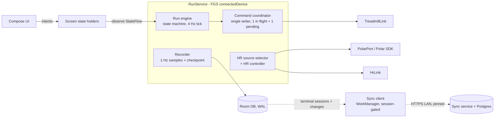

# TreadmillRunner rewrite plan

## 0. Summary

TreadmillRunner will be rebuilt as a **native app on a phone mounted on the treadmill**. The reference device is a Motorola moto g15 Power (Android 15, MediaTek Helio G81, Bluetooth 5.0, 5 GHz Wi-Fi, 8 GB RAM).

- **The phone does everything a run needs, with no network at all:** Bluetooth to the Horizon Omega Z and the Polar H10, workout execution, recording, history, plans and exports.
- **A NAS is optional.** It is a sync and backup target (a Postgres container behind a small sync service; a file share works as a one-way backup target). It also hosts the parts that need the internet, such as Garmin upload and the update mirror.
- **Technology:** Kotlin Multiplatform (KMP) with Compose Multiplatform. Android comes first. The shared code also targets a desktop viewer and, later, iOS, without rewriting the domain, protocols or UI.
- **Priorities, in order:** safety, reliability, flexibility, then visual quality.
  - Every safety rule the current app proved (section 5) carries over.
  - Treadmill **control is re-commissioned on the new Bluetooth stack** before it is enabled (DEV-08). Until then the app runs read-only, with the console controlling the belt.
  - The UI gets a real design system (section 9) with screenshot and accessibility regression tests, so the layout problems of the web UI (section 1.3) cannot return unnoticed.

This plan is the contract for the rewrite. Section 12 turns it into user stories with testable acceptance criteria, and section 13 orders them into phases with go/no-go gates.

**Revision note:** this version incorporates an independent Opus review (safety, protocol, sync, rollout, UX and validation findings), checked against the current code and docs.

---

## 1. Why rewrite, and what we keep

### 1.1 What the current system taught us
- The Windows VM gateway with a passed-through MediaTek RZ616 radio is the main source of Bluetooth instability. See the [connectivity research](../protocol-evidence/polar-h10/2026-09-24-bluetooth-connectivity-research.md).
- A browser UI served from a gateway breaks whenever the gateway is unreachable. The symptoms: no offline mode, Wake Lock not working over HTTP on iOS, stale PWA builds, and slow WASM start (Lighthouse mobile about 60).
- Android is where Polar's official SDK runs. It covers H10 heart rate, the firmware 4.x security request and onboard recording, all of which we currently re-implement by hand.

### 1.2 What carries over (proven assets)

| Asset | How it is reused |
|---|---|
| Omega Z FTMS control facts and evidence (Stage 1–3) | Ported into `protocol-ftms` with the same golden vectors; **re-commissioned on Android** (DEV-08) |
| Command confirmation, intent, lease and recovery policies | Ported into `domain-run` as pure Kotlin, with the C# tests translated one-to-one |
| Workout schema v1, canonical JSON and SHA-256 revisions | Same JSON. A hand-written canonical writer reproduces System.Text.Json output byte-for-byte (WKT-02) |
| Programs, calendar and the premade catalog (16 templates, the 174-slot/260-variant WalkingPad plan) | Ported as data plus the same rules |
| HR source selector and HR speed controller | Ported with the same **defaults and bounds**: increase step 0.2 (0.1–0.5) km/h, increase cooldown 30 s (15–180 s), decrease step 0.5 (0.1–1.0) km/h, decrease cooldown 15 s (5–120 s); dwell 20 s below / 10 s above |
| FIT/TCX/CSV/JSON export semantics, Garmin FIT merge rules | FIT generation on the device (jvm/android source set); the same library serves the NAS merge worker |
| Importers (native JSON, QDomyos XML, FIT Workout, v4 bundle) | Ported, with the same preview-then-reparse-original-bytes rule |
| Test suites (Protocols, Core, key Integration scenarios) | Become golden vectors and scenario tests in `commonTest` |
| Connect IQ watch app | Kept as a standalone recorder; phone-linked status is an optional later story (GAR-03) |

### 1.3 UX problems the new design must prevent

| Past problem | Prevented by |
|---|---|
| Preset rails needed scrolling; portrait chart cramped; dense landscape; no real landscape graph (TR-039) | Run screen slot budget (9.6) per window class; nothing scrolls during a run; a dedicated landscape chart layout |
| Form inputs under 44 px and text under 16 px (iOS zoom) | Minimum touch target 56 dp on Run and 48 dp elsewhere; minimum input text 16 sp; accessibility checks in screenshot tests |
| Menus overflowing on short landscape; an empty editor column squeezing content | Adaptive layouts from window size classes; list-detail panes that collapse; no fixed widths |
| Library flooded with generated plan workouts | Plan-internal workouts are never listed in the library |
| Play/Pause vs Stop ambiguity | Labelled **STOP**, labelled **Pause (stops belt)**, a hold gesture for motion start, and a dock state table (9.6) |
| Too many choices on the Run page | The Today screen has one primary action; alternatives sit behind "Choose another", or appear as an explicit choice when today has alternatives |
| Jargon ("MergeAndReplace", "Unknown outcome") | Content guide (9.9): plain language, consequence first |
| Slow start, stale builds, reload prompts | Native app, cold start under 2 s, updates installed only while idle |
| Screen dimming during a run | `FLAG_KEEP_SCREEN_ON` whenever a non-terminal session exists |
| Unusable when the gateway is down | There is no gateway; the phone is self-sufficient |

---

## 2. Target devices and roles

| Device | Role | Required? |
|---|---|---|
| **Treadmill phone** (moto g15 Power, Android 15) | The console: all BLE, the run engine, the local DB, the UI, local exports | Yes |
| **Horizon Omega Z** (console S3.02, BLE firmware V10.23.17) | Treadmill: FTMS telemetry plus the verified control subset | Yes |
| **Polar H10** (firmware 4.2.0) | Primary HR, optional onboard recording | Recommended |
| Other HR sensors (straps, Garmin watches in HR broadcast) | Fallback HR sources | Optional |
| **NAS** (Docker host) | Sync service plus Postgres, backup target, update mirror, Garmin upload worker | Optional |
| Garmin watch (Fenix 8 / Vivoactive 5–6) | Connect IQ companion: its own recording | Optional |
| Desktop/laptop | Desktop viewer: history, planning, workout editing (syncs through the NAS). **Never issues treadmill commands.** | Later phase |
| iPhone/iPad | iOS viewer; a console later only after its own commissioning | Later phase, optional |

### 2.1 Phone and environment setup (validated in DEV-01 and Phase 0)
- Android 15. The app is exempt from battery optimisation, **and** has a CompanionDeviceManager (CDM) association for the treadmill and the H10.
- Charging limit on (if the phone offers one) or a smart plug limiting charge time. Thermal status is monitored (HW-10).
- **Wi-Fi:** Android has no 5 GHz-only toggle, so give the phone a **5 GHz-only SSID** on the router, or keep Wi-Fi off during runs.
- **No Bluetooth audio (A2DP) headphones on the treadmill phone during runs**, unless HW-02 has passed with them connected.
- **The Windows gateway's Bluetooth is disabled** while the phone is in use. The treadmill accepts one central, and the H10 accepts only one when "2 devices" is off. This applies to Phase 0 and to any parallel-running period.
- Mounted on the treadmill console, facing the runner's chest.
- Polar H10:
  - "2 Bluetooth devices" **off** via Polar Flow, unless the SDK exposes it (verified in Phase 0).
  - Fresh CR2025 battery.
  - Not paired in Android settings for the HR path (see 5.11 on bonding).

---

## 3. Technology choices

| Concern | Choice | Why | Alternatives considered |
|---|---|---|---|
| Language/runtime | **Kotlin 2.x, Kotlin Multiplatform** | Native on Android, shares code with desktop (JVM) and iOS; the Polar Android SDK is Kotlin | .NET MAUI (Polar SDK needs a binding; weaker BLE tooling); Flutter |
| UI | **Compose Multiplatform** (Material 3 foundation, custom design system) | Stable on Android, desktop and iOS (iOS stable since CMP 1.8.0) | Native per platform |
| Architecture | Unidirectional data flow; hexagonal ports and adapters | Pure, testable domain; UI is a function of state | — |
| Concurrency | kotlinx.coroutines, `StateFlow`/`SharedFlow` | Deterministic cancellation of device work | RxJava |
| DI | Koin | KMP-friendly | Hilt (Android only) |
| Local DB | **Room (KMP)**, bundled SQLite driver, WAL | Stable KMP support (2.7+/2.8); schema export; migration tests | SQLDelight |
| Serialization | kotlinx.serialization, plus a **hand-written canonical writer** for workout revisions | The revision SHA-256 must match .NET's `Utf8JsonWriter` output | — |
| Time | kotlinx-datetime, injected `Clock`, monotonic `TimeSource` | Testable timing | — |
| BLE, treadmill and generic HR | Behind our own `BleCentral` port. **Candidates: Kable (KMP) or the Nordic Android BLE library.** Decided in Phase 0 on measured reconnect behaviour and GATT 133 handling | Kable's KMP benefit only matters if iOS becomes a console; Nordic's library is more field-proven on Android | — |
| BLE, Polar H10 | **Polar BLE SDK** (pin the current 8.x release; 6.12 is only the firmware-4.1.10 floor) behind a `PolarPort` | Official HR/RR, firmware 4.x security, recording start/stop/list/fetch/remove | Our own PFTP port as a fallback (H10-07) |
| FIT files | Garmin FIT Java SDK in a **jvm/android source set** (not `commonMain`); `expect/actual` for iOS later | Official encoder/decoder; the same jar is used on the NAS | Hand-written encoder |
| QR scanning (pairing) | **ZXing** or the **bundled** ML Kit model | Works offline (the unbundled model downloads via Play services) | — |
| Networking | Ktor client (app), **Ktor server** (sync service) | Same language and models on both ends | Spring Boot |
| NAS database | **PostgreSQL 16+** in Docker | Reliable, queryable, easy backup | SQLite on a share |
| File-share backup | `smbj` (JVM/Android) | Android has no built-in SMB DocumentsProvider | NFS |
| Background work | Foreground service type `connectedDevice` for runs; WorkManager for sync, backup, export, update (all gated by the session gate, 7.3) | FGS survives screen-off; Doze-exempt while in the foreground | FGS type `health` (not used) |
| Testing | kotlin.test, Kotest (property), Turbine, Compose UI tests, **Roborazzi** with ATF accessibility checks, on-device screenshots at the beta gate, Room migration tests, Testcontainers Postgres, Macrobenchmark, JankStats | Logic, UI regressions, DB evolution, performance | — |
| Build/CI | Gradle version catalogs, detekt plus ktlint, Android Lint, Renovate. CI host is an open decision (15.3): GitHub Actions is currently disabled by decision record | Reproducible, checked builds | — |

### 3.1 Android permissions (declared, and explained in the setup wizard)
- **Bluetooth:** `BLUETOOTH_SCAN` (with `neverForLocation`), `BLUETOOTH_CONNECT`.
- **Background run:** `FOREGROUND_SERVICE`, `FOREGROUND_SERVICE_CONNECTED_DEVICE` (needs a granted BLE runtime permission), `POST_NOTIFICATIONS`, `REQUEST_IGNORE_BATTERY_OPTIMIZATIONS`, `REQUEST_COMPANION_*` (CDM association and presence).
- **Updates:** `REQUEST_INSTALL_PACKAGES` (a one-time "Install unknown apps" grant), `UPDATE_PACKAGES_WITHOUT_USER_ACTION`.
- **Other:** `CAMERA` (QR pairing), `VIBRATE`, `INTERNET`, `ACCESS_NETWORK_STATE`.

**Cross-platform stance:** the domain, protocols, run engine, persistence, sync client and the whole UI live in `commonMain`. Platform code is limited to the BLE adapters, the Polar SDK adapter (the iOS SDK uses Combine and Swift Concurrency, so iOS needs a Swift wrapper), the foreground service, CDM, the updater, file access and FIT.

---

## 4. Architecture

### 4.1 Module layout

```
app-android/            Activity, RunService (FGS), CDM, updater, platform wiring
app-desktop/            (later) Compose Desktop viewer, with no command path
app-ios/                (later) iOS host
shared/
  core-model/           IDs, units (Speed, Incline, Bpm, Distance), Clock, Result types
  protocol-ftms/        FTMS codecs: 2AD9 control point, 2ACD treadmill data, 2ACC features, 2AD4/2AD5 ranges
  protocol-hr/          HRS 2A37, battery 2A19, DIS 180A
  protocol-omega/       Omega vendor telemetry FFF0/FFF4 (read-only; research writes NOT ported)
  protocol-pftp/        fallback-only Polar PFTP codec (H10-07)
  protocol-fit/         jvm/android source set: FIT/TCX/CSV/JSON exporters, FIT workout, Garmin merge semantics
  protocol-import/      native JSON, QDomyos XML, FIT workout, v4 bundle importers
  domain-devices/       enrollment, capability profiles (per model/firmware/host stack), HR source selection, reconnect policy, scan budget
  domain-workout/       schema v1, canonical writer, capability preflight, summaries, revisions
  domain-plan/          programs, calendar, premade catalog, progression, goals
  domain-run/           session state machine, command coordinator, HR controller, recovery policy, metrics
  domain-history/       analytics, comparisons, trends, deletion rules
  data-local/           Room DB, DAOs, migrations, change capture, backup/restore
  data-sync/            sync client, session bundles, conflict records, backup copy to NAS/SAF
  device-ble/           BleCentral port plus adapter; TreadmillLink, HrLink
  device-polar/         PolarPort plus the Polar SDK adapter (androidMain), fake (commonTest)
  ui-design/            tokens, theme, components (section 9)
  ui-features/          screens (section 10)
  testing/              fakes, simulators, golden vectors, scenario DSL
server/
  sync-service/         Ktor + Postgres (Flyway), update mirror (pulls and verifies releases), Garmin worker host
  garmin-adapter/       existing Python garminconnect adapter (JSONL contract), containerised
```

**Architecture tests (CI-enforced):**
- `domain-*` imports no Android, BLE library, Polar SDK or Ktor.
- `domain-run` and `device-*` have no network dependency.
- **Only `app-android`'s Run feature can reach the command coordinator.** No server, desktop, watch or sync code path can issue treadmill commands.

### 4.2 Runtime structure on the phone



- **RunService** starts when a session is armed and stops after the session is terminal, the writes are flushed, and any H10 prepare/cleanup job is persisted. It holds the only references to the device links during a run; the UI can be destroyed and recreated freely.
- **The FGS notification** shows the state, elapsed time and the current HR/speed. Tapping it returns to Run. It has **no Stop action** (Stop lives only on the Run screen, where its state and outcome are visible).
- **Recorder:** persists 1 Hz samples and events in small transactions off the UI thread, and writes the **recovery checkpoint every 1 s** (the current durability bound).
- **Device links:** each has a supervisor coroutine. Connection changes are events; a link never decides to stop the belt.

### 4.3 Process death, crashes and reboot
- **Process death while a session is live (the FGS gets restarted):**
  - The service is restarted using the battery-optimisation exemption or the CDM presence exemption. Either one alone is enough; this is tested both ways.
  - The engine restores from the checkpoint and applies the **restart recovery rule**: movement must be confirmed within 30 s, otherwise the session becomes `Interrupted`.
  - Planned controls always need an explicit resume.
- **Phone reboot:** nothing auto-starts at boot. On the next launch an unfinished session is marked `Interrupted`, with its data kept.
- A Start command is never replayed. Intents are not persisted as "to do"; only their receipts are stored.

### 4.4 Offline-first rule
- The **local database is the source of truth.** Every feature (run, plans, history, exports, device setup, backups) works in airplane mode.
- Network features (sync, Garmin, update check) are queued, gated work with visible status. They are never prerequisites for a run.

---

## 5. Safety and protocol contract (non-negotiable)

These rules are ported from the current code and evidence. Each has at least one automated test, plus hardware acceptance where noted.

### 5.1 Verified device profile and commissioning
- The current accepted profile is **model `OMEGA Z`, BLE firmware `V10.23.17`, FTMS telemetry mode, on the Windows stack**.
  - Speed and incline were physically exercised only at 1.0–1.5 km/h and 0.5–1.0%.
  - The 0.8–20 km/h and 0–12% ranges (0.1 steps) are DIS/FTMS-reported limits and are used as bounds, not as proof of behaviour at the extremes.
- **Capabilities are per model/firmware *and host stack*.** The Android build starts with every control disabled (read-only). Control is enabled only after an **Android commissioning run on this phone** (DEV-08). Each stage needs owner approval and sanitized evidence, following `safety-guidelines.md` §Hardware progression:
  1. Unloaded Start and Stop.
  2. SetSpeed and SetIncline at minimum speed.
  3. Planned transitions.
- Any other model or firmware is **read-only**. A mismatch on reconnect durably downgrades the device before it can become Ready.
- Vendor `FFF3` writes are not ported. There is no silent FTMS/vendor fallback; the telemetry mode is chosen explicitly at enrollment.

### 5.2 FTMS control point (2AD9)
- **Opcodes:**
  - Request Control: `00`.
  - SetSpeed: `02`+u16 (0.01 km/h).
  - SetIncline: `03`+s16 (0.1%).
  - Start/Resume: `07`. **It has no parameter.** The belt starts at the treadmill's own minimum, observed as 0.8 km/h.
  - Stop: `08 01`.
- Responses are `80 <op> <result>`.
- The Omega Z never answers Request Control. Accept a typed timeout for opcode `00` only (300 ms window). Motion commands have a 2 s response window.
- One command connection; keep control ownership across commands; enable `2AD9` indications at link setup; reset control state on every disconnect.

### 5.3 Confirmation, rate limiting and supersession
- A command is **Confirmed** only with a matching success response **and** fresh measured telemetry of the relevant field. It is **Rejected** on a failure result code. Otherwise it is **Unknown**.
- **Unknown is never retried.** It suspends automation and tells the user to use the console or physical Stop.
- Late responses for earlier opcodes are ignored within the window.
- **At most one intent in flight plus one latest pending target** per axis (speed, incline). A newer target replaces the pending one. Stepper long-press repeat coalesces into the latest target. Speed increases are rate-limited (one per confirmation cycle).

### 5.4 Intents and limits
- Each intent carries: operation ID (consumed before the write), session ID, version and state, controller lease, expiry (4 s) and connection generation. Reconnect expires all intents. Receipts are kept for 90 days.
- **Every target is normalized against:** the machine range, the **profile maximum speed**, the workout, and personal limits (`safety-guidelines.md`). Normalization is never more aggressive than requested.
- **No remote path:** only the phone's Run UI (and the engine acting for the armed session) can create intents. This is enforced by an architecture test (4.1).

### 5.5 Start, pause, stop, end
- **Arm** binds the profile, the exact workout revision and optionally the program item. It never moves the belt.
- **Start from the app:** a **hold of 1.5 s** on Start sends `07`. This is a deliberate choice that supersedes the current single tap (15.2), made because of sweaty hands and a mounted phone.
  - Single use. Never replayed after reconnect, restart or update.
  - The session becomes Running after **3 fresh moving samples** (> 0.3 km/h); then the planned speed is applied.
- **Start from the console:** while Armed, starting the belt on the console reaches Running by the same 3-sample rule, with no app command. This is the only start path until DEV-08 passes.
- **Pause is a verified Stop:** the session enters `PausedWaitingForPhysicalResume`. The UI labels it **"Pause (stops belt)"**. This matches the current code but contradicts `decision-record.md:44` and `live-session.md` (lines 7 and 50); record a superseding decision before the port (15.1).
- **Resume:** a hold of 1.5 s sends a fresh Start, then ramps to the plan.
- **Stop/End:**
  - Stop is sent first. Then the user chooses Keep paused, Reset progress, End and save, or Discard.
  - End is accepted after a **confirmed stop**.
  - **If treadmill telemetry has been unavailable for more than 30 s**, the Stop sheet instead offers **"End: I confirm the belt is stopped"**. It writes a `stop-unconfirmed-by-telemetry` event, ends the session as `Stopped`, and sends no command.
- **Reset progress** moves the cursor to step 1, keeps the recorded data, writes `workout-progress-reset`, and never starts motion.
- **Discard** needs confirmation and first persists any H10 cleanup job.
- **Natural completion:** one engine-owned Stop. The session is `Completed` only after stopped telemetry. If the Stop is rejected or unknown, the session stays live and visible, with no retry.
- **Bluetooth loss never stops anything.** The safety key, the console and physical Stop are authoritative. The UI says so whenever the link is lost.
- **Input lockout:** motion controls ignore input for 800 ms after any session state change.

### 5.6 Session states and origins
- States: `Idle → ArmedWaitingForPhysicalStart → Running ⇄ PausedWaitingForPhysicalResume → Completed | Stopped | Interrupted | Faulted`.
- Origins: `Hardware | Simulator | SystemTest | Legacy`.
  - Simulator and SystemTest sessions are excluded from totals, progression, maintenance, plan advancement and Garmin.
  - They are shown only in their own views.

### 5.7 Recovery
- A BLE gap records an unobserved interval and never fabricates samples.
- **Automatic reconciliation** requires all of: the same treadmill, 2 fresh stable moving samples, no Unknown outcome, and a change of at most one increment.
- A larger change means a console change, which needs an explicit "Resume planned controls".

### 5.8 Telemetry validity
- Speed and incline have separate timestamps. Omitted FTMS fields do not refresh values. The freshness limit is 5 s.
- Implausible values are faults and are never clamped into commands.
- HR is valid only at 30–250 bpm, fresh, with contact; otherwise it is stored as null and resets the automation dwell timer.

### 5.9 HR source selection and automation
- Sources come only from the profile's assigned sensors. Order: preferred, then priority, then family tier (Polar, other chest strap, Garmin, other watch, other). Samples are never averaged.
- A preferred source must be stable for a while before a connected fallback is dropped.
- A source change bumps the generation, writes an event, and suspends automation until the user re-enables it.
- HR controller:
  - Timing: dwell 20 s below target before increasing, 10 s above target before decreasing; both inputs at most 5 s old.
  - Step size: aligned to the machine increment and never more aggressive than configured.
  - Modes: Shadow (writes nothing), DecreaseOnly, Full, Off, `SuspendedManualOverride`, `SuspendedSafety`.

### 5.10 Targets
- A fixed target is applied once when its segment begins. Manual or console overrides stick for the rest of the segment. The next segment clears overrides.
- Ramps and HR control apply continuously.

### 5.11 Polar H10
- **Do not bond** for the HR path.
- If the SDK needs security for PFTP or PFC, it creates an **Android system bond**.
  - Uninstalling the app (for example for a manual rollback) removes the app, and the bond may need re-creating.
  - On firmware 4.x only the initiating host can read a recording, so **never uninstall with an unfetched recording** (the updater checks this; OPS-02).
- Treat PFTP error 106 as terminal. Read-only operations may be retried; mutations never are.

### 5.12 Required persistent states (never toasts)
- Each of these is a persistent banner or state:
  - Bluetooth off / adapter unavailable
  - Permission revoked
  - Device absent
  - Connecting
  - Telemetry stale
  - Command couldn't be confirmed (Unknown)
  - Protocol invalid
  - Automation suspended
  - Control unavailable (read-only)
  - Phone too hot
  - Battery low
- Each has one clear action.

### 5.13 Network bridge rule
If a future design ever splits the radio from the console across a network, the bridge must:
- refuse commands without a heartbeat from the app within 2 s,
- stop locally when the channel drops,
- use idempotent request IDs.

This plan avoids the split: the phone owns the radio.

---

## 6. Device integration

### 6.1 Treadmill (Omega Z)
- **Connect:**
  - Enrollment uses a filtered, bounded, active scan (`1826`).
  - Later connects go directly by address. **There are no treadmill scans during a run.**
  - Characteristic handles are cached for the whole connection.
- **Telemetry:** subscribe to `2ACD` (FTMS mode) or `FFF4` (Omega read-only mode). Each notification gets a monotonic receive timestamp.
- **Reconnect backoff:**
  - Active session: **1, 2, 4, 8, 10 s (cap 10 s)**, with jitter per attempt.
  - Idle: up to 5 minutes.
  - A reconnect keeps the session running (5.7).
- **Identity:** read DIS model and firmware on each connect and enforce the capability profile. Diagnostics store only a hash fingerprint.

### 6.2 Polar H10 (Polar BLE SDK)
- **Live HR:** HR, RR and contact streaming, mapped to the same validity rules.
- **Reconnect:** the H10 may rotate its private address, and it is unbonded, so reconnecting by address can fail. HR reconnection may use **one filtered low-duty scan**, counted in the per-app **scan budget**. Android throttles an app to about 5 scan starts per 30 s, shared by the BLE library and the Polar SDK.
- **Settings:** firmware version is shown. Whether the SDK can read or set the multi-connection ("2 devices") setting is **verified in Phase 0**; otherwise the app explains how to change it in Polar Flow.
- **Onboard recording (opt-in per run)**, porting the rules from `polar-h10-memory.md`:
  - **Prepare:**
    - Start exercise `tr-{sessionId:N}` and confirm it before the armed session is published.
    - If a recording is already active, return its ID without changing it. Replacing it needs a second request carrying the same user-confirmed ID. Owned recordings are fetched and hashed before removal.
  - **After the session:**
    - Stop, list, then fetch `/tr-…/SAMPLES.BPB` (raw payload ≤ 8 MiB, SHA-256 stored).
    - Align the recording. Samples recorded before the physical start are kept in the payload but not merged. Ambiguous alignment becomes **review-required**.
    - **Fill only null HR samples in one transaction.** This is the single permitted post-run sample mutation (7.1). Aggregates are recalculated.
    - Remove the exact remote path.
  - Discard first persists a cleanup job.
  - Garmin export waits until the recording is merged, confirmed never started, or explicitly skipped.
  - Phone-side rules: the strap must be worn during the download (45 s rule); 90 s per-packet timeout; error 106 is terminal.
- **Live HR and recording together:** the SDK multiplexes one connection. This must be proven on hardware (H10-04, HW-11). If it fails, the old "lease the live connection" behaviour is ported.
- **Fallback:** if the SDK path fails acceptance, `protocol-pftp` runs over the BLE adapter behind the same `PolarPort` (H10-07).

### 6.3 Other HR sensors
Standard HRS `180D/2A37`. Battery `180F` is best-effort. No bonding.

### 6.4 Garmin
- **Connect IQ watch app:** stays a standalone recorder (its own activity with onboard HR).
  - Phone-linked status through the Connect IQ Mobile SDK is **optional and P2** (GAR-03).
  - It needs Garmin Connect Mobile on the treadmill phone, with the watch paired to *that* phone. That breaks the runner's normal phone sync and adds a third active BLE link.
- **Activity upload (unofficial):**
  - Runs on the **NAS** (`garmin-adapter` container) with the existing contract. The phone generates the FIT file and syncs the session.
  - The worker keeps the enable watermark, the 5-minute wait, the watch-match rules (±10 min start, similar duration and distance, corroborating HR), and `PreferWatch` (default) / `MergeAndReplace`.
  - Job states: Pending, Confirmed, FoundInGarmin, ReviewRequired, Failed, Unknown. **No automatic retry of Unknown or ReviewRequired.**
  - Credentials live only on the NAS; Garmin tokens are not migrated (re-authenticate).
- **Without a NAS (and in the interim before Phase 4):** share the FIT from the phone (Android share sheet). Phone-direct upload is GAR-06.
- **Official Training API:** parked until Garmin approval.

### 6.5 Discovery and pairing UX
- Enrollment scans are bounded and filtered, with active scanning only during enrollment.
- Devices are identified by name, service signature and an RSSI bar.
- Anonymous Omega is accepted by the `1816`+`1826` signature as read-only.
- **The CDM association** is created during enrollment for the treadmill and the H10.

---

## 7. Data and sync

### 7.1 Local data model
The entities are ported from `Infrastructure/Persistence/Entities.cs`.

- **IDs:**
  - **Migrated rows keep their existing GUIDs verbatim** (as UUID strings). New rows use UUIDv7.
  - This preserves external references: the H10 exercise ID `tr-{sessionId:N}` on the strap, Garmin idempotency keys, and evidence docs.
- **Sync columns on mutable, syncable entities:** `version` (per row), `updatedAt`, `originDeviceId`, `deletedAt` (tombstone).
- **Sessions:**
  - Samples and events are **immutable** except for the single H10 null-HR fill transaction, which bumps `session.contentVersion`.
  - Samples and events carry no per-row sync columns; they sync as one compressed **session bundle** (7.3).
  - Debrief (RPE, note ≤ 1,000 characters) stays editable.
- **Workout revisions** are immutable (content-addressed by SHA-256).
- **Derived data is never synced; it is recomputed locally:** plan progress, totals, maintenance due state, analytics (`decision-record.md:47`).
- **Local-only data (never synced):** operation receipts, recovery checkpoints, device locators, BLE reliability incidents, the diagnostics journal, the scan budget.

### 7.2 Sync modes

| Mode | Target | Use | Guarantees |
|---|---|---|---|
| **A. Sync service (recommended)** | `sync-service` (Ktor) + Postgres on the NAS, Docker Compose | Several devices, desktop viewer, Garmin worker, update mirror | Transactional, conflict-aware, queryable, `pg_dump` backups |
| **B. File share (backup/export only)** | SMB share via `smbj` | NAS without a container host | One-way: verified backups and exports. **No multi-writer merge.** |
| **C. None** | — | Standalone phone | Local backups copied to a shared folder or USB |

**Why the phone doesn't connect straight to Postgres:** database credentials on the device, no API contract, schema coupling across app versions, fragile connections over Wi-Fi, and no home for the Garmin worker or update mirror.

### 7.3 Sync protocol (mode A)
- **Pairing:**
  - The NAS page shows a QR code with the service URL, a **single-use pairing token (10-minute expiry)**, and **SPKI SHA-256 pins (current plus next, for rotation)**.
  - The app pins the SPKI, so a self-signed LAN certificate is fine.
  - The device receives a revocable device token.
  - The service binds to the LAN only.
- **Ordering:** the server assigns a monotonic `serverSeq` to every accepted change. Clients pull with `since=<serverSeq>`. No hybrid logical clock is needed.
- **Push, mutable entities:**
  - The push carries **only the changed fields**, with the `baseVersion` the edit was made on.
  - **Clients never write fields they don't know**, so an older client cannot null a newer field.
  - The server merges changes to different fields. Changes to the same field produce a **conflict record** (shown in the Sync screen for the user to resolve).
  - Last-writer-wins applies only to display preferences.
- **Push, sessions:**
  - A session syncs as one bundle (metadata, samples, events, FIT, H10 payload hash) **only when it is terminal and H10 recovery is terminal**, at its `contentVersion`. A higher `contentVersion` replaces it.
  - Debrief edits sync as field changes.
- **Deletes:**
  - A delete is a tombstone.
  - A delete that meets a later edit (for example a debrief) becomes a conflict record.
  - Deleting a session that has a pending Garmin job is refused, as today.
- **Invariants:** a merge that would break a domain rule (for example two active program runs for one runner) becomes a conflict record. Nothing is dropped silently.
- **Protocol versions:** the server publishes a supported client protocol window `[min, max]`. A phone update needing a newer NAS still installs (offline-first) and shows "Sync paused: update the NAS service".
- **Session gate:** workers check "no armed or running session" at start and before each batch. **Arming cancels running sync, backup and export work.** Nothing syncs during a run.
- **Triggers:** after a session becomes terminal, every 15 minutes while charging and idle, and "Sync now". Network constraint: unmetered.

### 7.4 Backups
- **Local, automatic:** after each completed session and daily. Retention is **2–60, default 14** (as today).
  - The backup is made with `VACUUM INTO`, then `PRAGMA integrity_check` on the copy, then a verification receipt.
- **Uninstall-safe copies:** app-private storage is wiped on uninstall, so every verified backup is also copied to a **user-chosen shared folder (SAF) or USB**, and to the NAS when paired (mode A or B).
- **NAS:** nightly `pg_dump` (compose job), **including the sync service's secrets and TLS keys**, with a documented and tested restore.
- **Restore** always shows a preview (counts, date range, schema and app version), then confirms.

### 7.5 Migration from the current app
- Import **directly from the current `.trb` SQLite backup** (`SqliteOnlineBackupService`), with a preview; no .NET exporter is needed. The import is idempotent and keeps GUIDs verbatim.
- **Migrated:**
  - profiles and zones;
  - devices (identity) and assignments;
  - workouts, revisions and import audits;
  - programs, revisions, items and alternatives, runs, schedule overrides, extra occurrences, premade installations;
  - calendar series, options, exceptions and exception options, training-day selections;
  - sessions, samples and events;
  - H10 recordings and their samples;
  - Garmin upload jobs (status history);
  - local goals, progression recommendations, maintenance policies and events, experience preferences;
  - operation receipts under 90 days old.
- **Not migrated:** Garmin tokens (DPAPI-protected; re-authenticate on the NAS), watch bindings, device locators, backup policy, BLE incidents.
- **Golden check:** hash every workout revision in the owner's real backup with the new canonical writer; all SHA-256 values must match (WKT-02).

---

## 8. Rollout, updates and operations

### 8.1 Build and release pipeline
1. **PR gates:** lint (detekt, ktlint, Android Lint), unit and scenario tests, property tests, screenshot plus accessibility checks, migration tests, sync-service tests (Testcontainers), and an assemble of the release variant.
2. **Release:**
   - Build a signed APK and an update manifest signed with Ed25519.
   - Publish both to GitHub Releases on the **beta** channel. Where this runs (GitHub Actions or a local script, as today) is open decision 15.3.
3. **The NAS mirror pulls the release:** the sync service periodically pulls GitHub Releases, verifies the Ed25519 manifest signature and the APK SHA-256, and serves them on the LAN. A manual upload to the NAS is also supported.
4. **Promotion to stable** happens after the release checklist (11.4).
5. **Sync service:** released as container images with semver tags. Compose pins a version; update with `docker compose pull && up -d`. Flyway migrations run at start, and a pre-migration `pg_dump` is taken.

### 8.2 Update manifest and policy
- **Manifest fields:** `versionCode, versionName, sha256, apkCertSha256, minSyncProtocol, maxSyncProtocol, minSchema, channel, issuedAt, sequence, notes, featureFlags, yanked[]`.
- **Policy, carried over from `release-operations.md`:**
  - Never mix one origin's manifest with another origin's package.
  - Keep a **rejected-versions list**.
  - `sequence` must increase, which prevents replaying an older manifest.
  - Yanked versions are never installed.

### 8.3 In-app updater (Android)
- **Sources, in order:** the NAS mirror (works without internet), then GitHub Releases, then a manual APK file.
- **Checks before install:** manifest signature, APK SHA-256, signing certificate equal to the installed app's, higher `versionCode`, and the schema and protocol window.
- **Installs only while idle:**
  - no non-terminal session;
  - no unfetched H10 recording that this phone started;
  - charging or battery above 30%;
  - the user confirms, or a scheduled idle window.
- **Silent install:**
  - Uses the `PackageInstaller` session with `setRequireUserAction(USER_ACTION_NOT_REQUIRED)`: the app updates itself, holds `UPDATE_PACKAGES_WITHOUT_USER_ACTION`, and targets the latest SDK (Android 15 needs 33+).
  - **Always handle `STATUS_PENDING_USER_ACTION`**, which shows one tap.
  - Relaunch through `MY_PACKAGE_REPLACED`.
- **Before and after:** a verified backup is taken before install (7.4). The first launch runs a health check (DB integrity, migrations, permissions, FGS start, CDM associations); a failure offers "Restore previous data".
- **Kill switches first:** the manifest carries `featureFlags`. New behaviour ships behind flags that are off by default for risky changes, so a flag flip in a new manifest is the first rollback tool.
- **Revert builds:**
  - Android forbids downgrades, and **Room will not open a database whose schema identity differs**. So the schema version is **monotonic**.
  - A revert build reverts *behaviour* only. It carries the latest entities and migrations, with the new code paths disabled.
  - Migrations follow expand/contract: add first, remove one release later.
- **Kiosk mode (optional):**
  - Device Owner via `dpm set-device-owner`, which fails while any account exists on the phone: remove the Google account or factory-reset first.
  - Lock-task allow-list: TreadmillRunner, Polar Flow, Garmin Connect Mobile. Leaving lock-task mode needs a PIN.

### 8.4 Key management (OPS-06)
- **APK signing key:** if it is lost, updates become impossible and the only option is uninstall and reinstall, which also loses app data unless the uninstall-safe backups exist.
  - Keep two offline backups (for example an encrypted USB stick and a password manager).
  - Use APK Signature Scheme v3 **key rotation** (`apksigner --lineage`) if a key must change.
- **Ed25519 manifest key:** kept with the same backups. Rotation **never happens through an ordinary update**: it needs a manifest signed by the old key that introduces the new key, installed deliberately.
- **Sync-service TLS key and secrets:** included in the NAS backup (7.4). SPKI pins allow the next key in advance.

### 8.5 Offline operation guarantee
- There is no network dependency in `domain-run` or `device-*` (architecture test).
- The release checklist includes an **airplane-mode run** (HW-04).
- Update, sync and Garmin fail soft, with their status shown on screen.

### 8.6 Diagnostics
- **Local journal:** JSONL, **32 files × ~2 MiB** rotating, with the current privacy allow-list (no addresses, names or payloads). It records:
  - link parameters and state transitions;
  - drop reasons (Android GATT status codes);
  - command outcomes, scan-budget use and thermal status;
  - sync and update results.
- **Library logging** (BLE library, Polar SDK) is disabled in release builds. This is covered by the privacy allow-list test (OPS-03).
- **Crash reports** are stored locally (no third-party service) and synced to the NAS when paired.
- **Diagnostics screen:** link health per device, recent drops, the journal tail, and "Export diagnostics ZIP".
- **Developer guidance:** Android HCI snoop log for Bluetooth disputes (Developer options).

---

## 9. Design system and UI guide

### 9.1 Principles
1. **Glanceable while running:** read at arm's length while moving; large numerals, high contrast, one focal metric.
2. **Safe by default:** STOP is always visible, in the same place and colour. Motion start needs a hold. No icon-only safety actions.
3. **One primary action per screen.** Secondary actions go in an overflow or bottom sheet.
4. **Honest state:** every live value shows its freshness. Stale or unknown values are visibly different and never shown as current.
5. **No layout shift during a run:** fixed slots; values change, positions do not.
6. **Calm:** motion and colour signal state changes only.

### 9.2 Tokens
- **Spacing:** 4 dp base (4, 8, 12, 16, 24, 32, 48). Margins are 16 dp on compact screens and 24 dp on medium/expanded.
- **Radius:** 8 dp controls, 16 dp cards, 28 dp sheets.
- **Touch targets:** ≥ 48 dp everywhere, **≥ 56 dp on Run**, **≥ 72 dp for STOP and stepper buttons**.
- **Elevation:** tonal surfaces; no shadow stacks.
- **Insets:** edge-to-edge (Android 15, target 35+). All screens respect status, navigation and display-cutout insets. The Stop dock sits **above the gesture navigation area** (bottom gesture exclusion is not allowed).

### 9.3 Typography
- Family: **Inter**, with tabular figures for every number.

| Role | Size / line height | Weight | Use |
|---|---|---|---|
| Metric XL | 88/88 sp | 600 | Hero live metric |
| Metric L | 48/52 sp | 600 | Secondary live metrics |
| Metric M | 32/36 sp | 600 | Stepper values |
| Title L | 28/34 sp | 600 | Screen titles |
| Title M | 20/26 sp | 600 | Card titles |
| Body | 16/24 sp | 400 | Default text; input text never below 16 sp |
| Label | 14/20 sp | 500 | Buttons, chips |
| Caption | 12/16 sp | 400 | Metadata only; never for values or actions |

- **The Run screen ignores the system font scale** (it overrides `LocalDensity.fontScale`) and offers its own *Large* layout (fewer, bigger metrics). All other screens follow the system scale and are tested at 1.0, 1.3 and 2.0.

### 9.4 Colour
- **Themes:** default dark (the treadmill environment), light, and high-contrast.
- **Semantic roles:** `surface`, `onSurface`, `primary` (teal), `danger` (**reserved for STOP and destructive actions**), `warning` (stale, suspended: amber), `success` (confirmed), `info`.
- **HR zones:**
  - The **zone name comes from the profile** (up to 10 zones; default names "Warm up / Easy / Aerobic / Threshold / Maximum").
  - A zone colour ramp is defined for 1–10 zones (cool to warm: blue-grey, blue, cyan, green, lime, yellow, orange, deep orange, magenta, purple). **The top zones use magenta or purple, never `danger` red.**
  - A zone always shows its number and name, never colour alone.
- **Contrast:** text ≥ 4.5:1 (≥ 7:1 in high-contrast); Run metric numerals ≥ 7:1.
- **Stale values:**
  - From 5 s old: 60% opacity plus an age label ("12 s old").
  - From 30 s old: the value is replaced by "—".

### 9.5 Components (`ui-design`; each has screenshot and accessibility tests)
- **Buttons:**
  - `PrimaryButton`, `SecondaryButton`.
  - `DangerButton`: STOP and delete; the label always includes the verb.
  - `HoldButton`: Start and Resume. A 1.5 s hold with a progress ring and a haptic at completion; release early cancels.
- **Live metrics:**
  - `MetricTile`: value, unit, label, freshness state, optional target band.
  - `StepperRow`: a full-width row `[− 72 dp] value (requested / measured) [+ 72 dp]`. States: idle, **pending** (spinner, requested value shown), confirmed, rejected, **"Couldn't confirm"**. Long-press repeat coalesces. Presets open in a bottom sheet.
- **Charts:** `LiveChart`: speed, incline and HR; fixed axes that expand in whole units and never shrink; plan overlay; cursor.
- **Status:**
  - `StatusBanner`: one visible, ordered by severity, with a "+N" count and one action.
  - `DeviceChip`: state, signal, battery.
- **Containers:** `BottomSheet`, `Card`, `ListRow`, `SectionHeader`, `EmptyState`, `ErrorState`, `LoadingState`, `OfflineBadge`, `SegmentedControl`.
- **Inputs:** `FormField`: label above, 56 dp, error text below, never a placeholder-only label.

### 9.6 Run screen specification (reference: ~411 × 914 dp portrait; confirm with `adb shell wm size` / `wm density`)
- **Portrait slot budget.** Rows are listed top to bottom. The heights assume gesture navigation; 3-button navigation takes 24 dp from the chart/strip row.

  | Slot | Height (dp) | Content |
  |---|---|---|
  | Status inset | system | — |
  | Banner slot (reserved) | 56 | Highest-priority banner, or empty (never collapses) |
  | Hero | 168 | Primary metric (user choice: speed, HR, pace or time) with target band |
  | Secondary grid | 2 × 96 | 2×2 tiles (the 2–3 chosen metrics plus elapsed/remaining) |
  | Segment strip | 64 | Current step, next step, time to next |
  | Speed stepper row | 88 | `[−] 8.4 km/h (req 8.5) [+]` |
  | Incline stepper row | 88 | `[−] 2.0 % [+]` |
  | Stop dock | 96 | See the dock state table |
  | Navigation inset | system | — |

- **Landscape (~914 × 411 dp):**
  - Left 58% is the live chart, with a plan overlay and cursor.
  - Right 42% holds the hero, two metrics and the two stepper rows.
  - The dock is bottom-right, above the insets.
- **Medium/expanded:** three columns (metrics | chart | controls), with the dock always visible.
- **Focus modes:** a `SegmentedControl` (Glance / Chart / Controls), remembered per session. **No swipe gestures during a run** (sweat causes false touches).
- **Dock state table:**

  | State | Left | Right |
  |---|---|---|
  | Armed | **Start** (hold 1.5 s; disabled until DEV-08 passes, label "Start on the console") | Cancel |
  | Running | **STOP** | Pause (stops belt) |
  | Paused | End… | **Resume** (hold 1.5 s). Placed on the side opposite where Pause was |
  | Finishing | "Waiting for belt to stop" (disabled) | — |
  | Stopped, no telemetry for more than 30 s | End: I confirm the belt is stopped | — |

- **Special Run states:**
  - Armed-waiting ("Start on the console or hold Start").
  - Restart recovery ("Resume planned controls").
  - Read-only run (steppers replaced by requested-plan guidance).
- **Keep screen on** whenever any non-terminal session exists (Armed, Running, Paused, the Stop sheet).
- **Leaving Run** uses predictive back (`OnBackPressedCallback`) with a confirmation; the run continues in the service.

### 9.7 Motion, sound, haptics
- Motion takes 150–250 ms. Live values update in place, never with animated counters.
- **Cue set** (as today, per profile, with volume): step change, HR out of zone, halfway, connection problem, completion.
- Warnings repeat at most every 30 s.
- System "remove animations" is respected.

### 9.8 Accessibility
- TalkBack labels on all controls; live values are announced politely at most every 10 s.
- Colour is never the only signal.
- Non-Run screens support a 200% font scale.

### 9.9 Content and voice
- Plain language, consequence first, then the action. Example: "Heart rate lost. Speed won't change automatically. Reconnecting…"
- Units are always shown (km/h, %, bpm, km). Metric only.
- **Glossary (internal → UI):**

  | Internal | UI |
  |---|---|
  | Unknown | "Couldn't confirm" |
  | lease / generation | not shown |
  | MergeAndReplace | "Keep one" |
  | Undo merge | "Restore two" |
  | ReviewRequired | "Needs your check" |

### 9.10 Design QA checklist (every UI story)
- [ ] Roborazzi screenshots at compact portrait, compact landscape and medium, in dark, light and high-contrast, at font scale 1.0, 1.3 and 2.0 (non-Run).
- [ ] ATF accessibility checks pass (touch target, contrast, labels) in screenshot tests.
- [ ] No clipped text or horizontal scroll (screenshot review plus text-overflow assertions).
- [ ] Loading, empty, error, offline and stale states designed and tested.
- [ ] Copy checked against 9.9.
- [ ] Beta gate: on-device screenshots on the moto g15 match the Roborazzi baselines, reviewed by eye.

---

## 10. Screens and navigation

**Navigation:**
- Bottom bar on compact screens: **Today · Plan · History · Workouts · More**. A navigation rail on medium/expanded.
- During a run, the Run screen is full-screen and navigation is hidden.

| ID | Screen | Purpose | Key elements |
|---|---|---|---|
| S01 | Setup wizard | Permissions, profile, devices, CDM, backup folder, optional NAS | Steps with progress; permissions and backup folder required |
| S02 | Today | One recommended action | **Runner switcher**; recommended card; explicit choice when today has alternatives; "Choose another"; readiness chips; last run |
| S03 | Pre-run check | Arm with confidence | Workout summary, device readiness, capability preflight (requested/normalized/rejected), H10 recording toggle, **Arm** |
| S04 | Run | Live run (9.6) | Slots, steppers, dock, banners, special states |
| S05 | Stop sheet | After Stop | Keep paused · Reset progress · End and save · Discard (confirm) · End without telemetry (when applicable) |
| S06 | Debrief | Capture feel | RPE 1–10, note (≤ 1,000 characters), summary, sync badge |
| S07 | History list | Browse sessions | Weekly groups and totals; filters (profile, workout, origin) |
| S08 | Session detail | Understand a run | Chart (240-point display projection, zoom, pin inspector), splits, zones, adherence, events, exports, Garmin status, H10 status, delete (preview) |
| S09 | Compare | Same workout revision over time | Overlay, deltas |
| S10 | Tests history | SystemTest and Simulator sessions | Separate list; excluded from totals |
| S11 | Workouts library | Find and manage | Cards with structure summary, search, filter; plan-internal hidden |
| S12 | Workout detail | See structure | Grouped repeats, targets, preflight, Run now, Export FIT workout |
| S13 | Workout editor | Create or edit (new revision) | Blocks, repeat groups, reorder, live summary, validation |
| S14 | Import | Files and migration | Picker, preview, conflicts, confirm; **migration import from `.trb`** |
| S15 | Plans | Catalog and active plan | Premade catalog (phase/week grouping), install, start date and weekday mask, active plan progress |
| S16 | Plan detail and adjust | Program run | Week view (expand per week), move/skip/restore/repeat with preview, change training days, clear upcoming |
| S17 | Calendar | Schedule | Month/week views; series actions with scope choice; collision warnings |
| S18 | Goals and progress | Local goals, progression recommendations | Goal list; recommendation cards with accept/dismiss |
| S19 | Devices | Sensors | Treadmill card (identity, control status, commissioning, maintenance); HR sensors (assignments, priority) |
| S20 | Commissioning | DEV-08 flow | Stage checklist, owner approval per stage, evidence export |
| S21 | H10 detail | Polar specifics | Firmware, multi-connection, battery, recordings, manual archive with CSV export |
| S22 | Maintenance | Treadmill care | Baseline, due state (3 months / 241 km), history |
| S23 | Profile and zones | Runner settings | Weight, max HR, max speed, zones (up to 10), HR controller, experience preferences (layout, primary metrics, cues, volume) |
| S24 | Integrations | Garmin, Connect IQ | Upload status (NAS), review queue, FIT share |
| S25 | Sync and backup | NAS and backups | Pairing (QR), status, conflicts, backup folder, backups, restore |
| S26 | Updates | App version | Channel, available update, notes, install when idle, history |
| S27 | Diagnostics | Troubleshooting | Link health, drops, scan budget, thermal, journal, export ZIP, simulator toggle (developer) |
| S28 | Settings | App settings | Theme, sounds, haptics, developer options, kiosk |
| — | System states | Global | Bluetooth off, permission revoked, phone too hot, battery low (full-screen or banner per 5.12) |

---

## 11. Validation strategy

### 11.1 Test layers

| Layer | Tooling | Scope | Gate |
|---|---|---|---|
| Golden vectors | kotlin.test | Every codec byte vector from `TreadmillRunner.Protocols.Tests` | PR |
| Canonical revisions | kotlin.test | Every revision in the owner's backup hashes identically (WKT-02) | PR (fixture) / release (real DB) |
| Domain unit | kotlin.test, Kotest, Turbine | Ported C# suites: state machine, command contracts, HR controller and selector, recovery, completion stop, workouts, programs, calendar, calories, analytics | PR |
| **Coordinator property tests** | Kotest property | Random interleavings of responses, telemetry, disconnects and taps never produce: a retry after Unknown, two writes in flight, a replayed Start, or a command after a generation change | PR |
| Scenario tests | Scenario DSL, virtual time, fake links | End-to-end runs, drops, reconcile, restart, console start, read-only run, 4 h simulation (14,400 samples) | PR |
| Persistence | Room migration tests, integrity | Every migration from each released schema; **revert build opens the forward-migrated DB**; backup/restore round-trip | PR |
| UI | Compose UI tests, Roborazzi, ATF checks | Every screen and state (9.10) | PR (diffs approved) |
| Performance | Macrobenchmark, JankStats | Cold start TTFD median < 2 s; Run p95 frame < 16 ms on the Helio G81; three-year history fixture loads in budget | Beta |
| Sync service | Ktor test host, Testcontainers | Push/pull, idempotency, field merge, conflicts, protocol window | PR |
| **Sync fuzzing** | Property/fuzz | Three simulated devices, random offline windows, server restart during a push, duplicate pushes, partial blobs; convergence plus no lost edits | PR (nightly for long runs) |
| Device simulation | In-app Simulator origin; optional second phone as a GATT FTMS+HRS server | Real BLE path without hardware | Beta |
| Hardware acceptance | Runbooks (11.3) | Commissioning, continuity, recording, offline, power loss, kill, updates, sync | Stable |

### 11.2 Scenario DSL example
```kotlin
runScenario {
  treadmill { verifiedOmegaZ(commissionedOn = AndroidStack) }
  heartRate { polarH10(bpm = 130) }
  workout { steady(speed = 8.0.kmh, duration = 10.min) }
  arm(); holdStart()
  expectCommand(Start); confirm()                       // FTMS 07 has no speed parameter
  movingSamples(3, speed = 0.8.kmh); expectState(Running)
  expectCommand(SetSpeed(8.0.kmh)); confirm()
  at(4.min) { treadmill.disconnect(); advance(8.s); treadmill.reconnect(speed = 8.0.kmh) }
  expect { unobservedInterval(4.min, 4.min + 8.s); noFabricatedSamples() }
  stableMovingSamples(2); expect { reconciled(); state(Running) }
  at(10.min) {
    expectCommand(Stop); confirm()
    stoppedSamples(1); expect { state(Completed) }        // Completed only after stopped telemetry
  }
}
```

### 11.3 Hardware acceptance runbooks (owner-supervised)

**H10 continuity threshold (HCT), used everywhere:**
- at least **3 runs of 60 min** with the phone mounted, and radio settings recorded (Wi-Fi SSID band, A2DP off, H10 multi-connection setting);
- **≤ 1 native disconnect per run-hour**;
- **no HR gap longer than 10 s**;
- zero fabricated samples.

| ID | Procedure | Pass criteria |
|---|---|---|
| HW-00 | Phase 0 spike: Polar SDK HR plus a BLE-library FTMS read on the moto g15; unloaded Start/Stop via the chosen BLE library | HCT met; unloaded Start/Stop Confirmed; the Request Control silence behaves as on Windows |
| HW-01 | Commissioning (DEV-08) stages 1–3 | Owner approves each stage; latencies within evidence (Start ≤ 6.5 s, set ≤ 2 s, Stop ≤ 4 s); sanitized evidence stored |
| HW-02 | H10 continuity | HCT |
| HW-03 | H10 recording: opt-in run, then merge | Fetched, SHA-256 stored, only null samples filled, remote removed |
| HW-04 | Airplane-mode run, full structured workout | Completes, saved, exports work; syncs later |
| HW-05 | Cut treadmill power mid-run | "Treadmill lost" banner; no commands; after 30 s "End: I confirm the belt is stopped" works; the phone stays up on battery |
| HW-06 | Kill mid-run with `adb shell am crash <pkg>` (or the debug "kill process" action); then `am force-stop` | Recovery rule applies after crash; no Start replayed; after force-stop the session is Interrupted on next launch |
| HW-07 | Update while idle, with an update offered during a run | Deferred during the run; installs when idle; data intact; health check passes |
| HW-08 | NAS sync | Two offline runs then sync; desktop viewer shows them; conflict flow works |
| HW-09 | Turn phone Bluetooth off mid-run | Belt continues; banner; reconcile after re-enable |
| HW-10 | 60 min charging with the screen on during a run | Thermal status stays below "severe"; battery and charging state logged |
| HW-11 | Treadmill command latency while the H10 streams, including during recording Prepare | Latencies within HW-01 bounds; no HR gap over 5 s |

### 11.4 Release checklist (beta → stable)
- [ ] All PR gates green on the release commit.
- [ ] HW-01 (if control code changed), HW-02, HW-04, HW-06 and HW-09 passed on this build (recorded in the release notes).
- [ ] Migration from the previous stable DB snapshot tested, including a revert-build open.
- [ ] Screenshot baselines approved, including the on-device pass.
- [ ] Feature flags for new risky behaviour default to off, or are explicitly enabled with a reason.
- [ ] Keys backed up (OPS-06) and a manifest `sequence` increment.

---

## 12. User stories

Format: **ID — story.** Acceptance criteria (AC) are testable; *[auto]* means an automated test, *[hw]* means a hardware runbook. Priority: **P0** for MVP, P1 next, P2 later.

### Epic FND — Foundation
- **FND-01 (P0)** — As a developer, I have the KMP modules of section 4.1 with CI gates.
  - AC1 *[auto]*: lint, unit, property, screenshot, accessibility and migration tests run on each PR; any failure blocks.
  - AC2 *[auto]*: the architecture tests of 4.1 fail on a forbidden dependency or a non-Run command path.
- **FND-02 (P0)** — As a developer, I can run in Simulator mode.
  - AC1 *[auto]*: simulated sessions have origin `Simulator` and are excluded from totals, progression, maintenance, plan advancement and Garmin.
- **FND-03 (P0)** — As a developer, `ui-design` provides the tokens and components of section 9.
  - AC1 *[auto]*: every component has screenshot and ATF tests in all themes and at font scales 1.0, 1.3 and 2.0.
- **FND-04 (P0)** — As the owner, I get a signed APK and install it on the moto g15.
  - AC1 *[auto]*: Macrobenchmark `StartupTimingMetric`, median of 10 cold starts on the moto g15, TTFD < 2 s.

### Epic DEV — Devices
- **DEV-01 (P0)** — As a runner, the setup wizard grants Bluetooth, notifications, battery exemption and CDM associations, and explains each.
  - AC1 *[auto]*: Finish is blocked until BLE permissions and a backup folder are set.
  - AC2 *[hw]*: screen off for 60 min with `dumpsys deviceidle force-idle` during a simulated run shows no sample gap over 2 s.
  - AC3 *[hw]*: restart recovery works with the battery exemption revoked but CDM associated, and vice versa.
- **DEV-02 (P0)** — As a runner, I enroll the Omega Z and see model, firmware and control status.
  - AC1 *[auto]*: an exact profile match *with Android commissioning complete* enables controls. Otherwise the app shows "Read-only: controls not yet verified on this phone" or "…this treadmill version isn't verified".
  - AC2 *[auto]*: only one treadmill can be enrolled.
- **DEV-03 (P0)** — As a runner, I enroll HR sensors and set preferred and fallback order per profile.
  - AC1 *[auto]*: ported `HeartRateSourceSelector` tests; another profile's sensor is never used.
- **DEV-04 (P0)** — As a runner, I see each device's live state, signal and battery.
  - AC1 *[auto]*: chips update within 1 s of a link event.
- **DEV-05 (P1)** — As a runner, the H10 screen shows firmware and the multi-connection setting, and lets me change it via the SDK if supported, or explains how in Polar Flow.
  - AC1 *[hw]*: after the change, the H10 stops advertising while connected.
- **DEV-06 (P1)** — As a runner, I get maintenance reminders every 3 months or 241 km after a baseline.
  - AC1 *[auto]*: triggers exactly when either threshold is crossed; SystemTest and Simulator distance is excluded.
- **DEV-07 (P0)** — As a runner, devices reconnect with the 6.1 backoff; the treadmill never scans during a run; HR scans stay within the scan budget.
  - AC1 *[auto]*: the backoff sequence is 1, 2, 4, 8, 10 s; no treadmill scan while Running; scan starts ≤ budget.
- **DEV-08 (P0, gate for any control)** — As the owner, I commission treadmill control on this phone in stages, each approved by me, with sanitized evidence.
  - AC1 *[auto]*: controls stay disabled until all stages are approved; approval is stored per model, firmware and host stack.
  - AC2 *[hw]*: HW-01.

### Epic RUN — Live run and control
- **RUN-01 (P0)** — As a runner, Today recommends my session.
  - AC1 *[auto]*: order is today's single calendar item, then today's alternatives (shown as an explicit choice, no default), then the next plan item, then Manual (`planning-data.md`).
  - AC2 *[auto]*: exactly one primary button.
- **RUN-02 (P0)** — As a runner, the pre-run check shows readiness and preflight.
  - AC1 *[auto]*: each target shows requested, normalized or rejected against machine, profile maximum, workout and personal limits; never more aggressive.
  - AC2 *[auto]*: Arm is disabled without fresh treadmill telemetry (≤ 5 s).
- **RUN-03 (P0, controls after DEV-08)** — As a runner, I hold Start for 1.5 s to start the belt.
  - AC1 *[auto]*: one `07` intent; Running after 3 samples > 0.3 km/h; then SetSpeed to plan; confirmation rule applies.
  - AC2 *[auto]*: releasing before 1.5 s sends nothing.
  - AC3 *[auto]*: starting on the console while Armed reaches Running without any app command.
- **RUN-04 (P0, after DEV-08)** — As a runner, I change speed and incline with stepper rows and presets, seeing requested and measured.
  - AC1 *[auto]*: outcomes shown as confirmed, rejected or "Couldn't confirm".
  - AC2 *[auto]*: Unknown suspends automation, shows the safety banner, and sends no retry.
  - AC3 *[auto]*: a 3 s long-press produces at most 1 in-flight plus 1 pending intent, and the final target equals the last displayed value.
- **RUN-05 (P0)** — As a runner, STOP is always visible; after Stop I choose Keep paused, Reset progress, End and save, or Discard.
  - AC1 *[auto]*: End only after a confirmed stop (or via the no-telemetry path).
  - AC2 *[auto]*: Discard needs confirmation and persists an H10 cleanup job first; Reset writes `workout-progress-reset` and never starts motion.
- **RUN-06 (P0, after DEV-08)** — As a runner, Pause (stops belt) stops the belt; Resume (1.5 s hold) restarts, then ramps to plan.
  - AC1 *[auto]*: state `PausedWaitingForPhysicalResume`; Resume is a fresh Start intent.
  - AC2 *[auto]*: taps within 800 ms after Pause do nothing; Resume sits on the opposite side from Pause.
- **RUN-07 (P0)** — As a runner, structured workouts advance segments; fixed targets apply once per segment, and overrides stick within the segment.
  - AC1 *[auto]*: ported target-override tests.
- **RUN-08 (P0)** — As a runner, link drops don't end my run; gaps are recorded and explained.
  - AC1 *[auto]*: unobserved interval recorded, no fabricated samples, 5.7 reconciliation.
  - AC2 *[hw]*: HW-05 and HW-09.
- **RUN-09a (P0)** — As a runner, if the app process dies mid-run, the session recovers within the 30 s rule or becomes Interrupted.
  - AC1 *[auto]*: restart scenario.
  - AC2 *[hw]*: HW-06.
- **RUN-09b (P0)** — As a runner, after a phone reboot the session is Interrupted on next launch, with data kept.
  - AC1 *[auto]*: no service auto-starts at boot.
- **RUN-10 (P0)** — As a runner, HR-controlled segments adjust speed in Shadow, DecreaseOnly and Full modes.
  - AC1 *[auto]*: ported `HeartRateSpeedController` tests.
  - AC2 *[hw]*: one full HR-automation workout.
- **RUN-11 (P0)** — As a runner, natural completion stops the belt once and completes only after stopped telemetry.
  - AC1 *[auto]*: one engine Stop; no retry on reject or unknown.
- **RUN-12 (P1)** — As a runner, I get cues for step change, HR out of zone, halfway, connection problem and completion.
  - AC1 *[auto]*: each cue fires once per trigger, respects the profile's toggles and volume, and repeats warnings at most every 30 s.
- **RUN-13 (P0)** — As a runner, the Run layouts match 9.6 without scrolling.
  - AC1 *[auto]*: Roborazzi at 411×914 and 914×411 dp, with gesture and 3-button navigation insets; ATF passes; STOP ≥ 72 dp and above the gesture area.
- **RUN-14 (P0)** — As a runner, the screen stays on during any non-terminal session.
  - AC1 *[auto]*: the flag is set on Armed and cleared on terminal.
  - AC2 *[hw]*: 60 min with no dimming.
- **RUN-15 (P1)** — As a runner, after a console change or a restart I can resume planned controls with one button.
  - AC1 *[auto]*: no planned command is sent before the user taps Resume planned controls.
- **RUN-16 (P0)** — As a runner, I can do a **read-only run**: the console controls the belt, and the app records and guides me through the segments.
  - AC1 *[auto]*: no control-point writes in read-only mode; segment guidance shows the requested speed and incline to set on the console.
- **RUN-17 (P0)** — As a runner, I can start a **Manual run** without a workout.
  - AC1 *[auto]*: an open-ended session with a 5-minute chart window and 1 minute lead.

### Epic REC — Recording, history, analytics
- **REC-01 (P0)** — As a runner, sessions record at 1 Hz and survive app death.
  - AC1 *[auto]*: after a kill at a random time, at most 1 s of samples is lost.
- **REC-02 (P0)** — As a runner, I add RPE (1–10) and a note after a run and edit them later.
  - AC1 *[auto]*: a note over 1,000 characters is rejected with a message; edits are saved and synced as field changes.
- **REC-03 (P0)** — As a runner, History groups by week with totals and filters.
  - AC1 *[auto]*: totals exclude Simulator and SystemTest; filter combinations tested.
- **REC-04 (P1)** — As a runner, session detail shows the chart (240-point projection plus true count), splits, zones and adherence.
- **REC-05 (P1)** — As a runner, I compare sessions of the same revision.
- **REC-06 (P1)** — As a runner, I delete a session after a preview.
  - AC1 *[auto]*: ported deletion rules; refused while a Garmin job is pending, in flight or unknown; plan recompute.
- **REC-07 (P0)** — As a runner, I export FIT, TCX, CSV or JSON and share it.
  - AC1 *[auto]*: decoded-record equality (via the FIT SDK) with the C# golden files; the FIT SDK validator passes.
  - AC2 *[hw]*: a manual Garmin Connect import once per release.
- **REC-08 (P1)** — As a runner, I see local goals and progression recommendations.
- **REC-09 (P0)** — As a runner, Simulator and SystemTest sessions appear only in the Tests view.
  - AC1 *[auto]*: excluded from totals, progression, maintenance, plans and Garmin.

### Epic WKT — Workouts
- **WKT-01 (P0)** — As a runner, I browse workouts as cards; plan-internal ones are hidden.
- **WKT-02 (P1)** — As a runner, I create and edit workouts; each save creates a revision.
  - AC1 *[auto]*: the canonical writer reproduces System.Text.Json output: default `JavaScriptEncoder` escaping (non-ASCII and `+ < > & '` as `\uXXXX`), .NET shortest round-trip numbers (`8`, `1E-05`), and `durationTicks` in 100 ns units.
  - AC2 *[auto]*: all revisions in the owner's backup hash identically.
  - AC3 *[auto]*: limits enforced (10,000 steps, depth 32, 12 h).
- **WKT-03 (P1)** — As a runner, I import native JSON, QDomyos XML, FIT workout and v4 bundles with preview.
  - AC1 *[auto]*: ported importer tests; confirm re-parses the original bytes.
- **WKT-04 (P2)** — As a runner, I export a workout as a FIT workout.

### Epic PLN — Plans and calendar
- **PLN-01 (P0)** — As a runner, I install a premade plan and see it grouped by phase and week.
  - AC1 *[auto]*: idempotent per runner and template version; all 16 templates plus WalkingPad (174 slots, 260 variants) are present.
- **PLN-02 (P0)** — As a runner, only a Completed linked Hardware session advances my plan.
  - AC1 *[auto]*: unique completed-item constraint; idempotent.
- **PLN-06 (P0)** — As a runner, I start a plan with a start date and training weekdays, and I can clear upcoming items.
  - AC1 *[auto]*: the schedule projection equals the ported `TrainingDaySelectionResolver` output; starting another run abandons the previous one.
- **PLN-03 (P1)** — As a runner, I move, skip, restore or repeat items and change training days, with a preview.
  - AC1 *[auto]*: occupied dates block moves; repeats warn on collision; changing training days applies atomically.
- **PLN-04 (P1)** — As a runner, the calendar shows series, alternatives and exceptions, with the four scopes.
- **PLN-07 (P1)** — As a runner, plan items offer alternatives and I choose one on the day.
- **PLN-05 (P2)** — As a runner, I build custom programs.

### Epic H10 — Polar H10
- **H10-01 (P0)** — As a runner, the H10 streams HR, RR and contact via the Polar SDK.
  - AC1 *[hw]*: HCT (HW-02).
- **H10-02 (P1)** — As a runner, I opt in per run to onboard recording, prepared and confirmed before arming (the 6.2 rules).
  - AC1 *[auto]*: an existing active recording is returned unchanged; replacement needs the same confirmed ID.
- **H10-03 (P1)** — As a runner, the recording fills only missing HR samples, then is removed.
  - AC1 *[auto]*: alignment, pre-start exclusion, review-required on ambiguity, fill-null-only, 8 MiB bound.
  - AC2 *[hw]*: HW-03.
- **H10-04 (P1)** — As a runner, live HR continues during recording prepare and fetch.
  - AC1 *[hw]*: no HR gap over 5 s (HW-11).
- **H10-05 (P1)** — Manual HR/RR recording archive with CSV export.
- **H10-06 (P1)** — Error 106 is shown plainly and never retried.
- **H10-07 (P2)** — Fallback `protocol-pftp` behind `PolarPort`.

### Epic SYN — Sync, backup, NAS
- **SYN-01 (P0)** — As a runner, verified backups run after each session and daily (keep 2–60, default 14), and are copied to my chosen folder.
  - AC1 *[auto]*: `VACUUM INTO` plus integrity check plus receipt; the copy exists in the SAF folder; retention enforced.
- **SYN-07 (P0)** — As the owner, I import everything from the current app's `.trb` backup.
  - AC1 *[auto]*: using the owner's real backup, row counts match per migrated table; GUIDs are unchanged; revision hashes match; sample values match.
- **SYN-02 (P1)** — As the owner, I deploy the sync service and Postgres with one Compose file.
  - AC1 *[auto]*: compose smoke test (healthy, migrations applied, pre-migration dump taken).
- **SYN-03 (P1)** — As a runner, I pair with the NAS by QR code.
  - AC1 *[auto]*: pairing fails with a wrong SPKI, an expired token or a reused token.
- **SYN-04 (P1)** — As a runner, terminal sessions and changes sync on Wi-Fi, never during a run.
  - AC1 *[auto]*: arming cancels running workers; no batch starts while a session is non-terminal.
  - AC2 *[hw]*: HW-08.
- **SYN-05 (P1)** — As a runner, conflicts appear in the Sync screen for me to resolve.
  - AC1 *[auto]*: the sync fuzz suite converges with no lost edits; same-field edits produce conflict records; unknown fields are never written.
- **SYN-06 (P2)** — As the owner, I can use an SMB share as a backup and export target.
- **SYN-08 (P1)** — As a runner, I restore from a local, folder or NAS backup with a preview.

### Epic GAR — Garmin
- **GAR-01 (P1)** — As a runner, the NAS worker uploads or matches completed Hardware sessions.
  - AC1 *[auto]*: ported matcher and worker tests. `PreferWatch` default and `MergeAndReplace`; the enable watermark; 5-minute wait; no automatic retry of Unknown or ReviewRequired.
- **GAR-02 (P1)** — As a runner, I see the Garmin status in plain words and resolve reviews ("Keep one" / "Restore two").
- **GAR-06 (P1)** — As a runner without the NAS, I share or upload the FIT from the phone.
  - AC1 *[auto]*: share intent with a valid FIT. Direct upload is a follow-up if the owner wants it.
- **GAR-03 (P2)** — Watch status via the Connect IQ Mobile SDK (needs the watch paired to the treadmill phone).
- **GAR-04 (P2)** — Connect IQ store publication.
- **GAR-05 (P2)** — Official Training API after Garmin approval.

### Epic PRF — Profiles and settings
- **PRF-01 (P0)** — As a runner, I manage my profile, zones (up to 10) and HR controller settings.
  - AC1 *[auto]*: controller values are limited to the bounds in 1.2.
- **PRF-02 (P0)** — As a household, several profiles exist, and the runner is chosen on Today before arming; sensor assignments are per profile.
- **PRF-03 (P1)** — As a runner, I choose display preferences (balanced, large, high-contrast; 2–3 primary metrics mapped to fixed slots; cues and volume).

### Epic OPS — Updates, diagnostics, operations
- **OPS-01 (P0)** — As the owner, the app updates from the NAS mirror or GitHub only while idle, after verification.
  - AC1 *[auto]*: refused on a bad signature, lower `versionCode`, different certificate, yanked or rejected version, non-increasing `sequence`, or an origin mix.
  - AC2 *[hw]*: HW-07.
- **OPS-02 (P0)** — As the owner, I can disable a feature with a manifest flag, or roll back with a revert build that opens the current DB.
  - AC1 *[auto]*: a revert build opens a DB migrated by the release it replaces.
  - AC2 *[auto]*: the updater refuses while an unfetched H10 recording exists.
- **OPS-03 (P0)** — As the owner, Diagnostics shows link health and exports a privacy-safe ZIP.
  - AC1 *[auto]*: the allow-list test finds no addresses, names or payloads, including library logs.
- **OPS-06 (P0)** — As the owner, signing and manifest keys are backed up and rotatable.
  - AC1: a documented procedure; restore tested on a spare machine once; the v3 lineage command is documented.
- **OPS-07 (P0)** — As the owner, backups survive an uninstall (SAF folder or USB, NAS).
  - AC1 *[hw]*: uninstall, reinstall, then restore from the folder; data matches.
- **OPS-04 (P1)** — Local crash reports, synced to the NAS.
- **OPS-05 (P2)** — Kiosk (Device Owner) provisioning.

### Epic PLT — Other platforms
- **PLT-01 (P2)** — Desktop viewer (history, plans, workouts) via the NAS, with no command path.
- **PLT-02 (P2)** — iOS viewer (TestFlight needs an Apple developer account).
- **PLT-03 (P2)** — iOS console after its own commissioning (Swift wrapper for the Polar iOS SDK).

---

## 13. Phases and go/no-go gates

| Phase | Stories | Exit criteria |
|---|---|---|
| **0. Spike (1–2 weeks)** | FND-04 (minimal), H10-01 prototype, DEV-02 prototype, BLE library choice | **HW-00:** HCT met on the moto g15; unloaded Start/Stop Confirmed through the chosen BLE library. **Go/no-go for Android.** |
| **1. Foundation** | FND-01..03, DEV-01, PRF-01..02, SYN-01, OPS-06..07 | CI green; design system with screenshots; setup wizard; backups to a folder |
| **2. Run MVP (offline)** | DEV-02..04, DEV-07, **DEV-08**, RUN-01..11, RUN-13..14, RUN-16..17, REC-01..03, REC-07, REC-09, WKT-01, PLN-01..02, PLN-06, SYN-07, OPS-01..03, H10-01, GAR-06 | HW-01, HW-02, HW-04, HW-05, HW-06, HW-09 pass. Daily use replaces the Windows app; Garmin runs through FIT share until Phase 4 (owner accepts, 15.4) |
| **3. Depth** | RUN-12, RUN-15, REC-04..06, REC-08, WKT-02..03, PLN-03..04, PLN-07, H10-02..06, DEV-05..06, PRF-03 | HW-03, HW-11 pass |
| **4. NAS** | SYN-02..05, SYN-08, GAR-01..02, OPS-04 | HW-08; Garmin uploads from the NAS |
| **5. Reach** | SYN-06, WKT-04, PLN-05, GAR-03..05, H10-07, OPS-05, PLT-01..03 | Per story |

**Transition rules:**
- The Windows app stays installed **with Bluetooth disabled** during Phases 0–2 (2.1).
- Its `.trb` backup is the migration source (SYN-07).
- It is retired after Phase 2 exits.

---

## 14. Risks and mitigations

| Risk | Impact | Mitigation |
|---|---|---|
| Phone BLE also drops the H10 (MediaTek combo chip) | Core value | Phase 0 HCT gate; 5 GHz-only SSID; no A2DP; mount position; fallback: another phone or tablet with a different chipset |
| Android kills or can't restart the FGS | Lost runs | Battery exemption **and** CDM association (both tested); Motorola guidance from dontkillmyapp.com |
| Controls behave differently on the Android stack | Safety | DEV-08 staged commissioning; read-only and console runs until then |
| Scan throttling (≈5 starts / 30 s, shared by the BLE library and the Polar SDK) | Reconnect failures | Scan budget; no treadmill scans during a run; one filtered low-duty HR scan |
| H10 address rotation while unbonded | Reconnect by address fails | Filtered name/service scan within budget |
| System bond lost on reinstall (PFTP, firmware 4.x initiator rule) | Unreadable recordings | Updater refuses with unfetched recordings; no uninstall-based rollback |
| Polar SDK behaviour or API changes (Flow in 7.0; 8.x) | H10 features | `PolarPort`; pinned version; fallback PFTP |
| Connect IQ Mobile SDK needs the watch paired to the treadmill phone | Breaks normal watch sync | Watch stays standalone; GAR-03 optional |
| Garmin unofficial API breaks | Upload | Isolated on the NAS; FIT share is always available |
| Room schema identity blocks revert builds | Failed rollback | Monotonic schema; behaviour-only revert builds; feature flags |
| Signing key loss | No updates | OPS-06 backups and v3 rotation |
| Uninstall wipes app data | Data loss | OPS-07 uninstall-safe backups |
| Thermal throttling or battery ageing when always charging | Stability | HW-10; charge limit; thermal banner |
| Canonical JSON hash mismatch | Duplicate revisions after migration | Hand-written writer; real-DB golden check |

---

## 15. Open decisions (owner)
1. **Pause semantics:** confirm Stop-backed Pause, and record a decision superseding `decision-record.md:44` and `live-session.md` (lines 7 and 50).
2. **Start/Resume gesture:** confirm the 1.5 s hold, superseding the current single tap (the older docs specified a 3 s hold).
3. **CI and signing host:** GitHub Actions is currently disabled by decision record (`decision-record.md:42`). Choose between re-enabling Actions with the key in secrets, or keeping a local release script (as today) that builds, signs and publishes.
4. **Garmin interim:** accept FIT share (GAR-06) from Phase 2 until the NAS worker (Phase 4), or pull GAR-01 earlier.
5. **HCT values:** confirm ≤ 1 disconnect per run-hour, no gap over 10 s, and 3 × 60 min runs.
6. **Sync mode:** confirm mode A (sync service with Postgres) as the default, with mode B as a backup target only.

## 16. References
- Current rules: [architecture](../architecture.md), [safety guidelines](../safety-guidelines.md), [decision record](../decision-record.md), [live session](../live-session.md), [planning data](../planning-data.md), [release operations](../release-operations.md).
- Evidence: [Omega Z protocol evidence](../protocol-evidence/omega-z/), [H10 memory](../polar-h10-memory.md), [connectivity research](../protocol-evidence/polar-h10/2026-09-24-bluetooth-connectivity-research.md).
- Polar: [Polar BLE SDK](https://github.com/polarofficial/polar-ble-sdk), [H10 SDK features](https://github.com/polarofficial/polar-ble-sdk/blob/master/documentation/products/PolarH10.md), [releases](https://github.com/polarofficial/polar-ble-sdk/releases).
- Android:
  - [Foreground service types](https://developer.android.com/develop/background-work/services/fgs/service-types)
  - [App update ownership](https://source.android.com/docs/setup/create/app-ownership)
  - [PackageInstaller.SessionParams.setRequireUserAction](https://learn.microsoft.com/en-us/dotnet/api/android.content.pm.packageinstaller.sessionparams.setrequireuseraction?view=net-android-35.0)
- Kotlin: [Compose Multiplatform iOS stable](https://blog.jetbrains.com/kotlin/2025/05/compose-multiplatform-1-8-0-released-compose-multiplatform-for-ios-is-stable-and-production-ready/), [KMP platform stability](https://kotlinlang.org/docs/multiplatform/supported-platforms.html).
- Device: [moto g15 power specifications](https://en-us.support.motorola.com/app/answers/detail/a_id/183974/~/specifications---moto-g15-power/).
