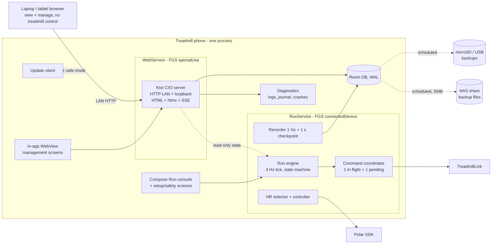

# TreadmillRunner rewrite plan

## 0. Summary

TreadmillRunner is rebuilt as **one self-contained Kotlin app on a phone mounted on the treadmill**. The reference phone is a Motorola moto g15 Power (Android 15, MediaTek Helio G81, Bluetooth 5.0, 5 GHz Wi-Fi, 8 GB RAM, microSD slot).

- **All functionality lives on the phone:**
  - Bluetooth to the Horizon Omega Z and the Polar H10.
  - The run engine, recording, history, workouts, plans and calendar.
  - Exports and the Garmin upload.
  - Backups (microSD/USB and **NAS over SMB**), updates and diagnostics.
- **No other system runs a service.** Other devices (laptop, tablet, another phone) use a **web interface served by the app itself** over the home Wi-Fi.
- **Everything works without Wi-Fi.** The phone's own features need no network at all. Wi-Fi is only needed for remote browsers, update downloads and Garmin upload.
- **Backup and restore use files on external storage (no sync):**
  - automatic verified backups to the microSD card or a USB drive, **and to a NAS share over SMB**;
  - download and upload through the web interface.
- **Everything is Kotlin:**
  - Android app with Jetpack Compose.
  - Pure-Kotlin domain and protocol modules.
  - An embedded Ktor web server, with its HTML rendered in Kotlin (kotlinx.html + htmx).
  - Build scripts and tests in Kotlin too.
- **First steps, before features:**
  1. The project skeleton with unit, integration and end-to-end tests.
  2. **Remote updates without physical access to the phone.**
  3. **Remote debugging** through the app's own diagnostics console.
  4. A hardware go/no-go spike.
- **Priorities, in order:** safety, reliability, flexibility, then visual quality.
  - Every safety rule the current app proved (section 5) carries over.
  - Treadmill **control is re-commissioned on the Android stack** before it is enabled (DEV-08).

**Guiding rules for the whole rewrite:**
- **Private use, single household:** choose the simplest design that is safe and reliable. Don't add enterprise-style features (multi-tenant access, audit trails, complex roles, sync).
- **Backwards compatibility only for runs:** the run (session) data structure stays compatible, so old runs can be imported and runs can be exported and re-imported in the same format ([07](07-exports-and-backup.md)). Everything else (workouts, plans, calendar, profiles, settings, internal database schema) may be redesigned freely and is recreated, not migrated.

This plan is the contract for the rewrite. Section 12 turns it into user stories with testable acceptance criteria; section 13 orders them into phases.

**Revision history:**
- v1 was a first draft.
- v2 incorporated an independent Opus review: safety, protocol, sync, rollout, UX and validation findings.
- v3 removes the NAS services and makes the phone self-contained, all in Kotlin, with a built-in web UI, file-based backups, remote updates and remote debugging from day one.
- v4 (this version) applies the owner's decisions:
  - Pause stops the belt but keeps workout progress.
  - Start and Resume are a single press.
  - No GitHub Actions: builds and releases are made locally and uploaded.
  - FIT and Garmin run in the phone app.
  - No sync: backups go to the NAS over SMB.
  - Wireless debugging is a supported long-term validation path, alongside self-updating.
- v5 applies a second independent Opus review of v4. The main changes:
  - (Netty and TLS, a local CA and a Keeper app were proposed here; v6 removed them.)
  - A safe mode for crash recovery.
  - A dock layout where Resume never lands on Pause's spot.
  - The pause edge cases.
  - Boot behaviour needs no screen lock.
  - The smbj security provider.
  - The 2026 Garmin login change.
  - A local test rig. (v6 replaced the Linux emulator box with the phone itself.)
  - Android developer verification.
- v6 (this version) applies the owner's decisions:
  - **Only the phone app or the treadmill console control the belt**; the web interface never controls the treadmill.
  - **No fixed Bluetooth threshold**: continuity is measured and made as good as possible.
  - **One app only**: no separate Keeper; the app updates itself and has a built-in safe mode.
  - **No certificates and no per-device setup**: the web interface is plain HTTP on the home network, protected by one admin passphrase set on the phone.
  - **No emulator**: device tests run on the treadmill phone itself, in a separate test app variant.
- v7 (this version) applies the owner's decisions:
  - **Both remote-debugging paths are set up in the first phase** for easy autonomous checks: the in-app screen, logs and state, plus wireless ADB with scrcpy.
  - **No backwards compatibility except the run data structure.**
  - **Private use: keep everything as simple as possible.**

---

## 1. Why rewrite, and what we keep

### 1.1 What the current system taught us
- The Windows VM gateway with a passed-through MediaTek RZ616 radio is the main source of Bluetooth instability (HCI command timeouts, H10 supervision-timeout drops, a controller that only recovers after a power cycle).
- A browser UI that depends on a separate gateway breaks when the gateway is unreachable.
- A heavy WASM client was slow on phones (Lighthouse mobile about 60). The new web UI is server-rendered HTML with no WASM.
- Android is where Polar's official SDK runs. It supports H10 heart rate, the firmware 4.x security request and onboard recording.

### 1.2 What carries over

| Asset | How it is reused |
|---|---|
| Omega Z FTMS control facts and evidence (Stage 1–3) | Ported into `protocol-ftms` with the same golden vectors; **re-commissioned on Android** (DEV-08) |
| Command confirmation, intent and recovery policies | Ported into `domain-run` as pure Kotlin, with the C# tests translated one-to-one |
| Workout schema v1 and revisions | Same concepts and rules; our own simple canonical JSON and hash (no byte-compatibility with the old app needed) |
| Programs, calendar, premade catalog (16 templates, 174-slot/260-variant WalkingPad plan) | Ported as data plus the same rules |
| HR source selector and HR speed controller | Same **defaults and bounds**:<br>• increase step 0.2 km/h (0.1–0.5)<br>• increase cooldown 30 s (15–180 s)<br>• decrease step 0.5 km/h (0.1–1.0)<br>• decrease cooldown 15 s (5–120 s)<br>• dwell 20 s below target / 10 s above |
| FIT/TCX/CSV/JSON export semantics, Garmin FIT merge rules | Ported to the phone (Garmin FIT Java SDK) |
| Garmin activity upload (currently Python `garminconnect` 0.3.8) | Re-implemented in Kotlin on the phone in an isolated, feature-flagged module (GAR-01), with FIT share as the fallback |
| Importers (native JSON, QDomyos XML, FIT Workout, v4 bundle) | Ported; preview, then re-parse the original bytes on confirm |
| Controller lease for multiple UIs | **Not needed**: only the phone's Run console controls the belt (5.4) |
| Operator access (passphrase, short-lived tokens) | Becomes one admin passphrase for admin actions in the web interface (7.2) |
| Update discipline (signed manifests, idle-only activation, rejected versions) | Ported into the app's built-in updater (section 8) |
| Test suites (Protocols, Core, key Integration scenarios) | Become golden vectors and scenario tests |
| Connect IQ watch app | Kept as a standalone recorder; phone-linked status is optional (GAR-03) |

### 1.3 UX problems the new design must prevent

| Past problem | Prevented by |
|---|---|
| Preset rails needed scrolling; portrait chart cramped; dense landscape; no real landscape graph (TR-039) | A Run screen slot budget (9.6); nothing scrolls during a run; a dedicated landscape chart layout |
| Inputs under 44 px and text under 16 px (iOS zoom) | Touch target ≥ 56 dp on Run and ≥ 48 dp elsewhere; web inputs ≥ 16 px; accessibility checks in tests |
| Menu overflow on short landscape; an empty editor column squeezing content | Adaptive layouts: window size classes (app) and container queries (web); no fixed widths |
| Library flooded with generated plan workouts | Plan-internal workouts are never listed |
| Play/Pause vs Stop ambiguity | Labelled **STOP** and **Pause (stops belt, keeps progress)**; a dock state table with an input lockout and fixed button positions (9.6) |
| Too many choices on the Run page | Today screen with one primary action |
| Jargon | Content guide (9.9) |
| Slow start, stale builds, reload prompts | Native app (cold start < 2 s); the web UI is versioned with the app, so it can never be stale against its own server |
| Screen dimming during a run | `FLAG_KEEP_SCREEN_ON` whenever a non-terminal session exists |
| Unusable when a gateway is down | There is no gateway |

---

## 2. Devices and roles

| Device | Role | Required? |
|---|---|---|
| **Treadmill phone** (moto g15 Power, Android 15) | Everything: BLE, run engine, database, native UI, **web server**, backups, updates, diagnostics, Garmin upload | Yes |
| **Horizon Omega Z** (console S3.02, BLE firmware V10.23.17) | Treadmill: FTMS telemetry plus the verified control subset | Yes |
| **Polar H10** (firmware 4.2.0) | Primary HR, optional onboard recording | Recommended |
| Other HR sensors | Fallback HR | Optional |
| **External storage** (microSD card in the phone, or a USB-C drive) | Automatic backup target | Recommended |
| **NAS SMB share** | Automatic backup target (files only; no service runs on the NAS) | Recommended |
| Any browser device on the home Wi-Fi | Web interface: history, plans, workouts, settings, read-only live view, diagnostics, updates. **Never controls the treadmill** | Optional |
| Developer laptop | Builds and signs releases **locally**, uploads them (GitHub Releases and/or straight to the phone), reads diagnostics through the web interface, validates over wireless ADB | For development |
| Garmin watch | Connect IQ companion (standalone recording) | Optional |

### 2.1 Phone and environment setup (validated in DEV-01 and Phase 0)
- **Screen lock: None or Swipe** on the treadmill phone. With a PIN or pattern, Android delivers `BOOT_COMPLETED` only after the first unlock, so after an unattended reboot the web interface would not start.
- **Automatic system updates off.** An OS upgrade is a planned regression event: re-run `phoneCheck` and HW-02/HW-07 afterwards.
- **DHCP reservation** for the phone on the router, so its address (used by the QR code and `deployToPhone`) stays stable.
- **Initial provisioning is the only physical step.** It is done once, over USB (see 8.2):
  - install the app;
  - grant permissions (including "Install unknown apps" for self-updates);
  - set the battery-optimisation exemption and the CDM associations;
  - choose the backup folder.
- **Power:** a charging limit if the phone offers one, or a smart plug. Thermal status is monitored (HW-10).
- **Wi-Fi:** a 5 GHz-only SSID (Android has no 5 GHz-only toggle), or Wi-Fi off during runs. With Wi-Fi off, the live view, remote diagnostics and NAS backup are unavailable until it is back on.
- **Radio:**
  - No Bluetooth audio (A2DP) headphones on the treadmill phone during runs, unless HW-02 passes with them.
  - **The Windows gateway's Bluetooth is disabled** while the phone is in use. The treadmill accepts one central, and the H10 accepts only one with "2 devices" off.
- **Mount:** on the treadmill console, facing the runner's chest.
- **Polar H10:**
  - "2 Bluetooth devices" off (via Polar Flow, or via the SDK if supported).
  - Fresh CR2025 battery.
  - Not paired in Android settings for the HR path.

---

## 3. Technology choices (all Kotlin)

| Concern | Choice | Why |
|---|---|---|
| Language | **Kotlin 2.x** (JVM 17 bytecode) | One language for app, web, build and tests |
| Project shape | **Android app + pure-Kotlin/JVM library modules** (no Kotlin Multiplatform for now) | Simpler build; domain and protocol modules run as fast JVM tests. They avoid Android APIs, so a later move to KMP stays possible |
| Native UI | **Jetpack Compose**, Material 3 foundation, custom design system | Best Android UI toolkit; used for the Run console, setup and safety-critical screens |
| Web UI | **Ktor server (CIO engine)** inside the app, **plain HTTP on the home network** (no certificates). HTML with **kotlinx.html**, interactivity with **htmx** and Server-Sent Events, charts with **uPlot** (vendored JS, ~50 KB) | All server code in Kotlin; fast on any browser; no WASM; works offline on the LAN |
| Management screens on the phone | **The same web UI**, shown in an in-app WebView against `http://127.0.0.1` (a loopback secure context) with a per-install loopback token | One implementation for plans, history, workouts, settings, backups and diagnostics, on the phone and remotely |
| Concurrency | kotlinx.coroutines, `StateFlow`/`SharedFlow` | Structured cancellation of device work |
| DI | Koin | Simple, no annotation processing |
| Local DB | **Room** (SQLite, WAL) | Migration tooling, schema export, tests |
| Serialization | kotlinx.serialization (sorted keys for workout revision hashing) | Simple; no compatibility with the old app's hashes needed. |
| BLE (treadmill, generic HR) | Behind our own `BleCentral` port. Candidates are the **Nordic Android BLE library** and **Kable**, chosen in Phase 0 on measured reconnect behaviour and GATT 133 handling | Both are Kotlin; the port keeps the choice reversible |
| BLE (Polar H10) | **Polar BLE SDK**: pin the current 8.x; 6.12 is only the firmware-4.1.10 floor. Behind a `PolarPort` | Official HR/RR, firmware 4.x security, recording |
| FIT | Garmin FIT Java SDK | Official encoder/decoder |
| Garmin upload | Kotlin client using Ktor client with the **OkHttp engine** (a real Android TLS fingerprint), feature-flagged; proven by the GAR-00 spike first | No Python and no second system |
| QR codes | ZXing (generate on the phone, scan if needed) | Works offline |
| NAS backup | **smbj** (pure-JVM SMB2/3 client), with a bundled BouncyCastle `bcprov` registered as `BCSecurityProvider` (Android's stripped provider lacks MD4 for NTLM) | Writes backup files to a NAS share; no NAS-side service |
| Logging | Structured logger with an in-memory ring buffer plus rotating files, streamed to the diagnostics console | Remote debugging (section 8.6) |
| Background work | Foreground service `connectedDevice` for runs; foreground service **`specialUse`** ("LAN web server") for the web server; WorkManager for backups, exports and update checks, gated by the session gate | Allowed for sideloaded apps; the web server stays reachable |
| Build | Gradle Kotlin DSL, version catalog, convention plugins, detekt + ktlint + Android Lint. **All builds, tests and releases run locally** (no GitHub Actions) | Reproducible, checked builds; a Git pre-push hook runs `ciFast` |
| Tests (local rig in 11.0) | kotlin.test, Kotest (property), Turbine, **Robolectric** (fast Android integration), **Ktor `testApplication`**, Room migration tests, **Compose UI and instrumented tests on the phone itself** (a separate `.e2e` app variant, over USB or wireless ADB), **Roborazzi** screenshots with ATF accessibility checks, **Playwright for Java** (driven from Kotlin tests) for web end-to-end, Macrobenchmark and JankStats | Unit, integration and E2E all in Kotlin (section 11) |

### 3.1 Android permissions and manifest (explained in the setup wizard)

**The app (single APK):**
- **Bluetooth:** `BLUETOOTH_SCAN` (`neverForLocation`), `BLUETOOTH_CONNECT`.
- **Foreground services:** `FOREGROUND_SERVICE`, `FOREGROUND_SERVICE_CONNECTED_DEVICE`, `FOREGROUND_SERVICE_SPECIAL_USE` (with the `PROPERTY_SPECIAL_USE_FGS_SUBTYPE` property "LAN web server"), `POST_NOTIFICATIONS`, `REQUEST_IGNORE_BATTERY_OPTIMIZATIONS`, `REQUEST_COMPANION_*`, `RECEIVE_BOOT_COMPLETED`.
- **Self-update:** `REQUEST_INSTALL_PACKAGES`, `UPDATE_PACKAGES_WITHOUT_USER_ACTION`.
- **Network:** `INTERNET`, `ACCESS_NETWORK_STATE`, `ACCESS_WIFI_STATE`; `CHANGE_WIFI_MULTICAST_STATE` (only if mDNS via JmDNS is used); `ACCESS_LOCAL_NETWORK` (a runtime permission, required from targetSdk 37).
- **Other:** `VIBRATE`, `CAMERA` (optional QR scan).

**targetSdk policy:**
- The app keeps targetSdk at or above the platform minimum for silent updates on the phone's OS (Android 15: 33, Android 16: 34, Android 17: 35). Raise it *before* any OS upgrade.

---

## 4. Architecture

### 4.1 Apps and modules

There is **one Android app** on the phone: TreadmillRunner. It updates itself and contains a **safe mode** for recovering from a bad update (8.3).

```
app/                     Main Android app: Activity, RunService (FGS connectedDevice), WebService (FGS specialUse),
                         CDM, Compose screens (Run, setup, safety states), WebView host
modules/
  core-model/            IDs, units, Clock, Result types                                   (pure Kotlin)
  protocol-ftms/         FTMS codecs: 2AD9, 2ACD, 2ACC, 2AD4/2AD5                            (pure Kotlin)
  protocol-hr/           HRS 2A37, battery 2A19, DIS 180A                                   (pure Kotlin)
  protocol-omega/        Omega FFF0/FFF4 telemetry decoder (read-only)                     (pure Kotlin)
  protocol-pftp/         fallback PFTP codec (H10-07)                                       (pure Kotlin)
  protocol-fit/          FIT/TCX/CSV/JSON exporters, FIT workout, Garmin merge semantics     (JVM, FIT SDK)
  protocol-import/       importers                                                          (pure Kotlin)
  domain-devices/        enrollment, capability profiles, HR selection, reconnect, scan budget (pure Kotlin)
  domain-workout/        schema v1, revisions, preflight, summaries                         (pure Kotlin)
  domain-plan/           programs, calendar, premade catalog, goals, progression             (pure Kotlin)
  domain-run/            session state machine, command coordinator, HR controller, recovery (pure Kotlin)
  domain-history/        analytics, comparisons, deletion rules                            (pure Kotlin)
  data-local/            Room DB, DAOs, migrations, backup/restore                          (Android)
  device-ble/            BleCentral port + adapter; TreadmillLink, HrLink                   (Android)
  device-polar/          PolarPort + Polar SDK adapter; fake in tests                       (Android)
  garmin-client/         Kotlin Garmin Connect client (unofficial), job state machine       (JVM + Ktor client)
  web/                   Ktor routes, kotlinx.html views, htmx fragments, SSE, auth, static assets (JVM)
  diagnostics/           logger, ring buffer, journal, crash/ANR capture, state inspectors  (Android + JVM)
  update-core/           manifest model, signature verification, policy (pure Kotlin)
  ui-design/             Compose design system + generated CSS tokens for the web UI
  testing/               fakes, simulators, golden vectors, scenario DSL, web E2E helpers
```

**Architecture tests (enforced by `./gradlew check`):**
- Pure-Kotlin modules import no Android APIs, BLE libraries, the Polar SDK or Ktor.
- `domain-run` and `device-*` have no network dependency.
- **Treadmill commands can only be created through the command coordinator's public API**, and only by the phone's native Run feature. **No web route can create a treadmill command** (an architecture test checks the web module has no dependency on the command API).

### 4.2 Runtime structure on the phone



- **RunService** starts when a session is armed and stops after the session is terminal, the writes are flushed and any H10 job is persisted. It holds the only device-link references during a run.
- **WebService** runs whenever "Web access" is on (the default). It is a separate foreground service, so the web interface stays reachable when the app is in the background.
  - It binds `0.0.0.0`, and accepts a connection only if the local address is loopback, the current Wi-Fi network (tracked by a `ConnectivityManager` callback), or an allow-listed VPN interface (for example Tailscale). Everything else is rejected.
  - **Thread isolation:** the run engine runs on a dedicated high-priority thread (`THREAD_PRIORITY_URGENT_DISPLAY`-level). Ktor runs on a low-priority dispatcher (`THREAD_PRIORITY_BACKGROUND`, limited parallelism) passed as its parent coroutine context. Recorder writes never share a transaction with web writes.
- **The FGS notification** shows the run state and the web address. Tapping it opens the Run screen. It has no Stop action.
- **Recorder:** 1 Hz samples plus a **1 s recovery checkpoint**, off the UI thread.
- **Web UI reads** come from the same `StateFlow`s as the native UI. Web writes go through the same domain services and receipts, so behaviour is identical.

### 4.3 Process death, crashes and reboot
- **Process death while a session is live:**
  - The FGS restarts using the battery exemption or the CDM presence exemption (tested both ways).
  - For a **Running** session: movement must be confirmed within 30 s, otherwise the session becomes `Interrupted`.
  - For a **Paused** session with stopped telemetry: it recovers as Paused (progress kept). The 30 s movement rule does not apply.
  - Planned controls need an explicit resume.
- **Reboot:**
  - `BOOT_COMPLETED` arrives after boot. It needs no screen lock (2.1), otherwise it only arrives after the first unlock.
  - The WebService (`specialUse`) starts. Starting this FGS type from boot is allowed on Android 15.
  - RunService does **not** auto-start. An unfinished Running session is marked `Interrupted`, with its data kept.
- **Crash loops:** handled by the app's own start counter and **safe mode** (8.3).
- **Start is never replayed.** Only receipts are persisted, never "to do" intents.

### 4.4 Offline-first rule
- Every feature of the phone works in airplane mode, including exports and backups.
- Features that need a network (the remote web UI, update checks, Garmin) fail soft, with their status shown.

---

## 5. Safety and protocol contract (non-negotiable)

These rules are ported from the current code and evidence. Each has at least one automated test, plus hardware acceptance where noted.

### 5.1 Verified device profile and commissioning
- The current accepted profile is **`OMEGA Z` / BLE firmware `V10.23.17` / FTMS mode, on the Windows stack**.
  - Speed and incline were physically exercised only at 1.0–1.5 km/h and 0.5–1.0%.
  - The 0.8–20 km/h and 0–12% ranges (0.1 steps) are reported limits used as bounds.
- **Capabilities are per model/firmware *and host stack*.** The Android app starts with every control disabled (read-only).
- Control is enabled only after an **Android commissioning run on this phone** (DEV-08). Each stage needs owner approval and sanitized evidence (hardware progression rules in [09](09-safety-and-command-contract.md)):
  1. Unloaded Start and Stop.
  2. SetSpeed and SetIncline at minimum speed.
  3. Planned transitions.
- Any other model or firmware is read-only. A mismatch on reconnect durably downgrades the device.
- Vendor `FFF3` writes are not ported. The telemetry mode is explicit at enrollment, with no silent fallback.

### 5.2 FTMS control point (2AD9)
- **Opcodes:**
  - Request Control: `00`.
  - SetSpeed: `02`+u16 (0.01 km/h).
  - SetIncline: `03`+s16 (0.1%).
  - Start/Resume: `07`. It has **no parameter**; the belt starts at the treadmill's own minimum, observed as 0.8 km/h.
  - Stop: `08 01`.
- Responses are `80 <op> <result>`.
- The Omega Z never answers Request Control. Accept a typed timeout for opcode `00` only (300 ms). Motion commands have a 2 s response window.
- One command connection. Enable `2AD9` indications at link setup. Reset control state on every disconnect.

### 5.3 Confirmation, rate limiting and supersession
- **Outcomes:**
  - **Confirmed:** a matching success response **and** fresh measured telemetry of the relevant field.
  - **Rejected:** a failure result code.
  - Otherwise **Unknown**.
- **Unknown is never retried.** It suspends automation and tells the user to use the console or physical Stop.
- Late responses for earlier opcodes are ignored within the window.
- At most **one intent in flight plus one latest pending target** per axis. A newer target replaces the pending one, and long-press repeat coalesces. Increases are rate-limited to one per confirmation cycle.

### 5.4 Intents, limits and who may command
- Each intent carries: operation ID (consumed before the write), session ID, session state version, expiry (4 s) and connection generation. Reconnect expires all intents. Receipts are kept for 90 days.
- **Normalization:** targets are normalized against the machine range, the **profile maximum speed**, the workout, and personal limits. Never more aggressive than requested.
- **Who may control the belt (owner decision):** only
  1. the **phone app's native Run console**, and
  2. the **treadmill console** itself (which the app observes and follows, 5.5).
- **The web interface never sends treadmill commands**, not even Stop. It shows a read-only live view. Anyone at the treadmill uses the phone or the console; the treadmill's physical Stop and safety key remain authoritative.
- There is therefore no controller lease between UIs. The intent's session state version still protects against stale or double presses on the phone.

### 5.5 Start, pause, stop, end
- **Arm** binds the profile, the exact workout revision and optionally the program item. It never moves the belt.
- **Start from the app:**
  - A **single press** on Start sends `07` (owner decision, same as today).
  - Protection against accidental starts: the engine-enforced input lockout, the state version on every intent, and fixed button positions (9.6).
  - Single use; never replayed after reconnect, restart or update.
  - Running after **3 fresh moving samples** (> 0.3 km/h); then the effective target is applied.
- **Start from the console:** while Armed, starting the belt on the console reaches Running by the same rule, with no app command. This is the only start path until DEV-08 passes.
- **Pause temporarily stops the belt but not the progress** (owner decision):
  - Pause sends FTMS **Stop `08 01`**. The raw FTMS Pause `08 02` stays unused and unverified. This matches the current (Windows) app: it pauses after a confirmed Stop, and raw Pause is disabled.
  - While the stop is in progress, the state is `Pausing` (STOP stays visible). The session enters `PausedWaitingForPhysicalResume` only after **stopped telemetry**.
  - If the pause Stop is Unknown, the session stays running-suspended with "Couldn't confirm", and no Resume is shown.
  - Kept: the workout cursor, the plan position (frozen) and the recorded data. The paused interval is marked and doesn't count as moving time.
  - The UI labels it **"Pause (stops belt)"**.
  - This supersedes an older design note in the Windows app ("Pause never substitutes Stop"). The new decision record is written in FND-01.
  - Optional: after N minutes paused (profile setting), prompt "End and save?". Never auto-start.
- **Resume:**
  - A single press sends a fresh Start (`07`). While it is in progress the state is `Resuming`, with STOP visible.
  - The same rule as Start applies: 3 fresh moving samples. Then the **effective target** is re-applied:
    - the in-segment override if one was set;
    - otherwise the ramp value at the frozen position;
    - plus incline;
    - for HR segments, the last controller output capped by the segment target, with the dwell timers reset.
- **Console changes:**
  - A console stop while Running becomes Paused, with progress kept.
  - A console start while Paused becomes Running, and then the effective target is applied.
  - Before DEV-08, the same happens with no commands sent (read-only).
- **Counters:** the treadmill's cumulative distance and time may reset after a Stop and Start. The recorder accumulates deltas and detects resets.
- **Stop/End:**
  - Stop is sent first. Then the user chooses Keep paused, Reset progress, End and save, or Discard.
  - End is accepted after a **confirmed stop**.
  - **With no treadmill telemetry for more than 30 s**, the sheet offers **"End: I confirm the belt is stopped"**. It writes `stop-unconfirmed-by-telemetry`, ends the session as `Stopped`, and sends no command.
- **Reset progress** (the only way progress is lost) moves the cursor to step 1, keeps the data, writes `workout-progress-reset`, and never starts motion.
- **Discard** needs confirmation and first persists any H10 cleanup job.
- **Natural completion:** one engine-owned Stop. The session is `Completed` only after stopped telemetry. If the Stop is rejected or unknown, the session stays live, with no retry.
- **Bluetooth loss never stops anything.** The safety key, console and physical Stop are authoritative.
- **Input lockout:**
  - The **800 ms lockout applies to Start, Resume, Pause and the steppers**. It is enforced **in the engine, per session** (not per screen).
  - **STOP and the Stop-sheet actions are never locked out.**

### 5.6 Session states and origins
- States: `Idle → ArmedWaitingForPhysicalStart → (Starting) → Running ⇄ (Pausing / Resuming) ⇄ PausedWaitingForPhysicalResume → (Finishing) → Completed | Stopped | Interrupted | Faulted`.
- The states in parentheses are UI sub-states of the command in flight; they are not persisted.
- Origins: `Hardware | Simulator | SystemTest | Legacy`. Simulator and SystemTest sessions are excluded from totals, progression, maintenance, plan advancement and Garmin.

### 5.7 Recovery
- A BLE gap records an unobserved interval and never fabricates samples.
- **Automatic reconciliation** requires all of: the same treadmill, 2 fresh stable moving samples, no Unknown outcome, and a change of at most one increment.
- A larger change needs an explicit "Resume planned controls".

### 5.8 Telemetry validity
- Separate speed and incline timestamps. Omitted fields do not refresh values. Freshness limit 5 s. Implausible values are faults, never clamped into commands.
- HR is valid only at 30–250 bpm, fresh, with contact; otherwise it is stored as null and resets the dwell timer.

### 5.9 HR selection and automation
- **Source selection:**
  - Only the profile's assigned sensors are used.
  - Order: preferred, then priority, then family tier (Polar, other chest strap, Garmin, other watch, other). Samples are never averaged.
  - A preferred source must be stable for a while before a connected fallback is dropped.
  - A source change bumps the generation, writes an event, and suspends automation.
- **HR controller:**
  - Dwell 20 s below target before increasing, 10 s above target before decreasing; inputs at most 5 s old.
  - Steps are aligned to the machine increment and never more aggressive than configured.
  - Modes: Shadow, DecreaseOnly, Full, Off, `SuspendedManualOverride`, `SuspendedSafety`.

### 5.10 Targets
- A fixed target is applied once at segment start. Overrides stick within the segment. The next segment clears them.
- Ramps and HR control apply continuously.

### 5.11 Polar H10
- **Do not bond** for the HR path.
- Security needed for PFTP or PFC creates an **Android system bond**. Never uninstall with an unfetched recording: on firmware 4.x only the initiator can read it, and the updater checks for this.
- PFTP error 106 is terminal. Read-only operations may be retried; mutations never are.

### 5.12 Required persistent states (never toasts; on the phone and in the web UI)
- Bluetooth off / adapter unavailable
- Permission revoked
- Device absent
- Connecting
- Telemetry stale
- "Couldn't confirm" (Unknown)
- Protocol invalid
- Automation suspended
- Control unavailable (read-only)
- Phone too hot
- Battery low
- Storage low / backup failing

Each has one clear action.

---

## 6. Device integration

### 6.1 Treadmill (Omega Z)
- **Connect:**
  - Enrollment uses a filtered, bounded, active scan (`1826`).
  - Later connects go directly by address. **There are no treadmill scans during a run.**
  - Handles are cached per connection.
- **Telemetry:** `2ACD` (FTMS) or `FFF4` (Omega read-only), each with a monotonic receive timestamp.
- **Backoff:**
  - Active session: **1, 2, 4, 8, 10 s (cap 10 s)** with jitter.
  - Idle: up to 5 minutes.
  - A reconnect keeps the session running (5.7).
- **Identity:** DIS model and firmware on each connect; capability profile enforced; only a hash fingerprint in diagnostics.

### 6.2 Polar H10 (Polar BLE SDK)
- **Live HR:** HR, RR and contact streaming.
- **Reconnect:** address rotation while unbonded can defeat reconnect-by-address. Use **one filtered low-duty scan** within the per-app **scan budget**. Android allows about 5 scan starts per 30 s, shared with the SDK.
- **Settings:** show the firmware. SDK support for the multi-connection setting is verified in Phase 0; otherwise the app explains the Polar Flow route.
- **Onboard recording (opt-in per run)**, full rules in [10-polar-h10](10-polar-h10.md):
  - **Prepare:**
    - Start exercise `tr-{sessionId:N}` and confirm it before the armed session is published.
    - If a recording is already active, return its ID unchanged. Replacing it needs a second request with the same user-confirmed ID. Owned recordings are fetched and hashed before removal.
  - **After the session:**
    - Stop, list, then fetch `/tr-…/SAMPLES.BPB` (≤ 8 MiB, SHA-256 stored).
    - Align the recording. Pre-start samples are kept but not merged. Ambiguous alignment becomes review-required.
    - **Fill only null HR samples in one transaction** (the single permitted post-run sample mutation), then recalculate aggregates.
    - Remove the exact remote path.
  - Discard persists a cleanup job first.
  - Garmin export waits until the recording is merged, confirmed never started, or explicitly skipped.
  - The strap must be worn during the download (45 s rule). 90 s per-packet timeout.
- **Live HR during recording:** the SDK multiplexes one connection. This is proven on hardware (H10-04, HW-11); if it fails, the old live-connection lease is ported.
- **Fallback:** `protocol-pftp` behind `PolarPort` (H10-07).

### 6.3 Other HR sensors
Standard HRS `180D/2A37`. Battery is best-effort. No bonding.

### 6.4 Garmin (on the phone)
- **Login changed in 2026.** Garmin changed its auth flow in March 2026 and the `garth` library is deprecated. `garminconnect` 0.3.x now uses a native mobile-SSO ("DI OAuth") flow with TLS impersonation to get past Cloudflare. So:
  - **GAR-00 spike first:** login, MFA, token refresh and one upload to a test account, run from the phone with Ktor client on the OkHttp engine (Conscrypt TLS).
  - Port from a **pinned upstream version**, and re-check upstream monthly.
  - MFA is a two-step web form with server-side pending-login state (5 min).
  - **Never auto-retry a login.** Logins are rate-limited to avoid account lockout, and "Needs login" is a persistent state.
- **Activity upload (GAR-01)** is a Kotlin re-implementation of what the Python `garminconnect` adapter does today, in the isolated `garmin-client` module:
  - Login: email, password and MFA, entered once in the web UI. Only the session tokens are kept, encrypted with an Android Keystore key.
  - Match: search for the watch activity, the enable watermark, the 5-minute wait, and the match rules (±10 min start, similar duration and distance, corroborating HR).
  - Behaviour: `PreferWatch` (default) or `MergeAndReplace`.
  - Job states: Pending, Confirmed, FoundInGarmin, ReviewRequired, Failed, Unknown. **No automatic retry of Unknown or ReviewRequired.**
  - Unofficial and fragile: behind a feature flag that can be turned off remotely. The current Python contract tests become the Kotlin client's contract tests.
- **FIT share (always available, the documented fallback):** share the FIT via the Android share sheet, or download it from the web UI and import it manually at connect.garmin.com.
- **Connect IQ watch app:** standalone recorder. Phone-linked status via the Connect IQ Mobile SDK is optional (GAR-03), because it needs the watch paired to the treadmill phone.
- **Official Training API:** parked.

### 6.5 Discovery and pairing UX
- Bounded, filtered scans; active scanning only during enrollment.
- Devices identified by name, service signature and RSSI.
- Anonymous Omega accepted by the `1816`+`1826` signature, read-only.
- CDM association created at enrollment for the treadmill and the H10.

---

## 7. Data, web interface, backup and restore

### 7.1 Local data model
The entities are specified in [01-data-model](01-data-model.md). The internal schema is free to change; only the run export structure is a compatibility contract.

- **IDs:** imported runs keep their session IDs verbatim; new rows use UUIDv7. This preserves `tr-{sessionId:N}` on the strap and Garmin idempotency keys for old runs.
- **Sessions:** samples and events are immutable except for the single H10 null-HR fill (which bumps `session.contentVersion`). The debrief (RPE, note ≤ 1,000 characters) stays editable.
- **Workout revisions** are immutable and content-addressed.
- **Derived data** (plan progress, totals, maintenance due, analytics) is recomputed, never stored as truth.
- **Local-only operational data:** operation receipts, recovery checkpoints, device locators, BLE incidents, the diagnostics journal, the scan budget.
- **Single source of truth:** the phone's database. Other devices only use it through the web interface, so there is **no sync, no replication and no merge conflicts**.

### 7.2 Web interface
- **Server:** Ktor (CIO engine) inside the app.
  - **LAN: plain HTTP on port 8080**, with the binding filter from 4.2 (loopback, the current Wi-Fi network, allow-listed VPN only).
  - In-app WebView: `http://127.0.0.1:8080`. Cleartext is allowed via a network security config. Requests need a per-install **loopback token**, set with `CookieManager`, because any app on the phone can reach loopback.
- **No certificates and no per-device setup (owner decision):** open `http://<phone-ip>:8080` in any browser on the home Wi-Fi and it works.
  - The trade-off: traffic on the home network is unencrypted.
  - Browser features that need a secure context (installable PWA, Wake Lock) are unavailable on remote devices. They aren't needed: the phone is the console.
  - Optional future: if a domain name is ever used, a publicly trusted certificate (for example Let's Encrypt via a DNS challenge, renewed by the app) would give HTTPS with still no per-device setup. Not planned.
- **Discovery:**
  - Primary: a DHCP reservation plus the address and QR code shown on the phone (Settings → Web access).
  - Optional: mDNS (`treadmill.local`) via JmDNS and a `MulticastLock`. Many Android browsers don't resolve `.local`.
  - `deployToPhone` defaults to the IP address.
- **Access levels:**

  | Level | Who | Can |
  |---|---|---|
  | **Home** (no login) | Any browser on the home Wi-Fi | View everything, including the read-only live view; manage workouts, plans, calendar, sessions (debrief, delete with preview), profiles, settings; download exports |
  | **Admin** (one passphrase) | Anyone who knows the admin passphrase | Updates, backup download and restore, diagnostics actions, feature flags, NAS and Garmin credentials |

  - The **admin passphrase** is set once on the phone in the setup wizard. It is stored as a PBKDF2 hash. Browsers ask for it when an admin action is used, and keep a short-lived session (HttpOnly cookie, 30 minutes).
  - Admin login is rate-limited. `deployToPhone` uses the same passphrase, stored in the laptop's credential store.
  - Updates are safe even on plain HTTP: only APKs **signed with our key**, with a valid signed manifest, are ever installed (8.3).
- **Pages:** the management screens (section 10), a **read-only live view** (metrics and chart via SSE, 1–4 Hz, no control buttons), the **diagnostics console** (8.6), and the updates page.
- **Versioning:** HTML and assets ship inside the APK with a hash in their URLs, so the web UI can never be stale against its own server.
- **Resource limits:**
  - One SSE stream per page (multiplexed events), closed when the tab is hidden, with a heartbeat every 15 s.
  - At most 8 concurrent SSE clients, with 1 slot reserved for the in-app WebView.
  - Request body limits (backup upload ≤ 2 GiB, streamed to disk).
  - Low-priority thread pool (4.2).
- **Safety:**
  - The web server never blocks the run engine.
  - During a non-terminal session, the web accepts only the debrief; everything else is read-only. Admin actions (restore, install, migrations) are **blocked**.
  - Feature-flag changes take effect at the next Arm. The exception is a flag that only *disables* a feature, which suspends it safely at once.

### 7.3 Backup strategy (file-based, external device)
- **Automatic local backups:** after each completed session, daily, and before every update or restore.
  - Made with `VACUUM INTO`, then `PRAGMA integrity_check` on the copy, then a verification receipt.
  - Retention 2–60, default 14.
- **External copy:** each verified backup is also written to a **user-chosen external folder** (Storage Access Framework): the **microSD card** or a USB-C drive. It survives an uninstall and a phone failure (move the card).
- **NAS copy over SMB:** each verified backup is also uploaded to a NAS share with **smbj** (SMB 2/3). The NAS only stores files; it runs no service.
  - Configure it in the web UI (Admin): server (IP address or router DNS name; no NetBIOS), share, folder, user. The password is encrypted with an Android Keystore key.
  - Security settings: **SMB 3.x with encryption and signing required**; the NAS minimum set to SMB2 (ideally SMB3); a **dedicated NAS user with access to one folder only**. NAS-side snapshots (for example Btrfs) protect against a compromised phone.
  - Uploads are atomic: write a unique `*.tmp`, verify SHA-256 by reading it back, then `rename(final, replaceIfExist=false)`.
  - **The app prunes** NAS backups beyond 30, and only touches files that match its own naming pattern.
  - Uploads run only when idle (never during a run) and retry with backoff when the NAS is unreachable.
  - A **"Test connection"** button writes, reads back and deletes a probe file.
  - Restore can read directly from the NAS share (list, preview, restore).
- **No sync.** The phone is the only live database; the NAS holds backup files only.
- **Backup file format** (`.trb2`, a ZIP):
  - `manifest.json`: app version, schema version, created-at, row counts, SHA-256 of each entry.
  - `db.sqlite`: the database snapshot.
  - `blobs/`: FIT files, H10 payloads.
  - **Encrypted by default** with a backup passphrase set during setup and recorded offline (AES-GCM, key derived with PBKDF2). microSD and NAS copies contain health data.
  - **Secrets:** Keystore-wrapped secrets (Garmin tokens, NAS password) cannot be restored on another phone, and the user re-enters them after such a restore.
- **Download:** "Download backup" in the web UI (Admin) streams a fresh verified backup to the laptop.
- **Restore:**
  - From a file on the external folder, **from the NAS share**, or uploaded through the web UI (Admin).
  - Always **preview first**: counts, date range, app and schema version, and what will be replaced.
  - A safety backup of the current state is taken, then the restore runs, then an integrity check.
  - A restore from an older schema runs the migrations. A restore from a newer schema is refused, with a clear message.
- **Health:** the backup status per destination (microSD/USB, NAS: last success, reachable, free space) is a persistent state (5.12) and appears in the diagnostics console.

### 7.4 Bringing over data from the current app (runs only)
- **Only runs are imported:** sessions with samples, events and debrief, plus linked H10 recording samples where present.
- **Sources:** the current app's versioned full-resolution **session JSON export** (the compatibility contract, [07](07-exports-and-backup.md)), or the runs extracted from its `.trb` backup ([01](01-data-model.md)).
- **Import behaviour:** a preview (count and date range), then idempotent import by session ID.
- **Everything else is recreated in the new app, not migrated:**
  - profile and zones (entered once);
  - devices (enrolled again);
  - premade plans (installed from the built-in catalog);
  - custom workouts (re-entered, or imported from native workout JSON if wanted);
  - calendar, settings, and the Garmin login.
- **The same JSON structure is used for the new app's own run export and import**, so runs round-trip between old, new and future versions.

---

## 8. Delivery: build, remote updates, remote debugging

### 8.1 Build and release
- **Everything is built and released locally** on the developer laptop. There is no GitHub Actions.
- **One command builds a release:** `./gradlew release -Pchannel=beta`. It:
  - runs all JVM, Robolectric and screenshot tests;
  - builds the signed APK;
  - writes an **update manifest** signed with Ed25519: `versionCode, versionName, sha256, apkCertSha256, minSchema, channel, issuedAt, sequence, notes, featureFlags, yanked[]`;
  - signs with the local keys (8.4);
  - **uploads** the APK and manifest to a GitHub Release (as today's local release script does) **and/or** straight to the phone (`deployToPhone`, 8.3).
- **Local quality gates** replace CI:
  - `./gradlew ciFast` runs on a Git pre-push hook: unit, property, scenario, Robolectric, Ktor and screenshot tests.
  - `./gradlew ciNightly` is run before every release, from the Windows development VM with the phone connected (11.0). It adds on-phone E2E (native and web), the update and safe-mode E2E, the NAS backup test and benchmarks.
  - `release` refuses to run unless `ciNightly` passed on the same commit (a result file keyed by commit hash).

### 8.2 Initial provisioning (the one physical session)
1. **Phone settings:** developer options and USB debugging on; screen lock None/Swipe; automatic system updates off.
2. **Install:** `adb install treadmillrunner.apk` over USB (or open the APK file on the phone).
3. **Setup wizard:**
   - permissions (including "Install unknown apps" for this app, so it can update itself);
   - battery exemption, CDM;
   - backup folder and backup passphrase, NAS share;
   - admin passphrase (7.2);
   - a Motorola battery-management check.
4. **Enable wireless debugging** and pair the laptop (Developer options → Wireless debugging), for scrcpy and `phoneCheck` (DLV-09).

After this, updates, diagnostics and recovery work remotely.

### 8.3 Self-update, safe mode and remote recovery (no physical access)
- **How the app updates itself:**
  - It downloads or receives the new APK, verifies it, and installs it with `PackageInstaller`, using `setRequireUserAction(USER_ACTION_NOT_REQUIRED)`.
  - Android allows this **without a tap** when the app **updates itself**, holds `REQUEST_INSTALL_PACKAGES` and `UPDATE_PACKAGES_WITHOUT_USER_ACTION`, and meets the targetSdk minimum (3.1).
  - The app then restarts via `MY_PACKAGE_REPLACED`.
  - If Android ever still asks (`STATUS_PENDING_USER_ACTION`), the web Updates page shows "needs one tap on the phone".
- **Update sources:**
  - **A. Push from the laptop (LAN, no internet needed):** `./gradlew deployToPhone -Phost=<phone IP>` uploads the APK and signed manifest to the app's Updates endpoint (admin passphrase). Doing it by hand on the web Updates page is the same.
  - **B. Pull from GitHub Releases (internet):** "Check now" or a schedule. A private repository needs a read-only token stored on the phone (Keystore-wrapped).
- **Verification before install:**
  - Ed25519 manifest signature;
  - APK SHA-256;
  - APK signer equal to the installed app's certificate (`getPackageArchiveInfo` with `GET_SIGNING_CERTIFICATES`);
  - higher `versionCode`;
  - new `sequence`;
  - not rejected or yanked;
  - schema window.
- **Idle rules:**
  - no non-terminal session;
  - no unfetched H10 recording started by this phone;
  - battery above 30% or charging;
  - an idle window, or "Install now" (admin).
- **Before and after install:**
  - A verified backup is taken (and copied to microSD and the NAS).
  - After install, the first start runs a **health check**: DB integrity, migrations, permissions, services, CDM, web reachable. The result is shown on the web Updates page.
- **Safe mode (crash-loop protection inside the one app):**
  - The very first thing the app does at process start is increment a **start counter** in a tiny file, before any database, Bluetooth or UI code. After the health check passes, it writes **healthy** and resets the counter.
  - If the counter reaches **2 without healthy**, the app starts in **safe mode**. Only the web server, Diagnostics and the Updates page run: no Bluetooth, no background workers, and no migrations beyond the minimum. Logs and crash reports stay reachable remotely, and a fixed build can be pushed.
  - That version is marked **rejected**, so it is never offered again.
  - The web Diagnostics page offers "Restart in normal mode" (admin).
  - Android marks a process that crashes twice within about 60 s as "bad" and stops background restarts. The web service's `BOOT_COMPLETED` start and the post-install restart bring it back. HW-08 verifies recovery **without a tap**, including after a reboot.
- **Limits of a single app, stated honestly:**
  - If a build crashes *before* the start counter runs (for example a broken manifest, or a crash in class loading), safe mode cannot help. Recovery then needs **wireless ADB** (DLV-09) or physical access.
  - Mitigations:
    - the start counter lives in a minimal `Application` path with no dependencies;
    - `ciNightly` includes an update E2E that installs every release over the previous one and checks start and safe mode;
    - risky features ship behind flags.
- **Kill switches:** `featureFlags` in a new manifest, or toggled by the admin, disable risky features (rules in 7.2). This is the first rollback tool.
- **Rolling back:** Android forbids downgrades. A rollback is simply **the next build with the problem fixed or reverted**, pushed like any update.
  - Database migrations only go forward.
  - If a migration ever damages data, restore the pre-update backup that the updater takes automatically.
- **Android developer verification:**
  - Enforcement starts on 2026-09-30 in four countries and goes global on certified devices in 2027. It may block or add taps to installs of unregistered apps, including self-updates. ADB and an advanced flow stay available.
  - Mitigation: register the package name and signing key under a free limited-distribution developer account (≤ 20 devices), with ADB as the fallback.
- **Dev installs:** the internal debuggable variant has its own `applicationId` suffix and its own ports, so it never replaces the real app.

### 8.4 Key management
- **APK signing key:** if it is lost, there are no more updates (only uninstall and reinstall).
  - Keep two offline backups.
  - APK Signature Scheme v3 rotation (`apksigner --lineage`) is documented.
- **Ed25519 manifest key:** backed up the same way. Rotation only through a manifest signed by the old key that introduces the new key.
- **Admin passphrase:** kept in the laptop credential store and the offline key backup. It can be reset on the phone itself (Settings → Web access).

### 8.5 Offline guarantee
- There is no network dependency in `domain-run` or `device-*` (architecture test).
- The release checklist includes an **airplane-mode run** (HW-04).

### 8.6 Remote debugging
**Both remote-debugging paths are set up in the first phase (0b)**, so every later change can be checked remotely and autonomously:
1. the **in-app diagnostics console** (web, admin passphrase): logs, crashes, state, **app screen view** and actions. It always works, with no ADB.
2. **wireless ADB with scrcpy**: the **full phone screen** and control, logcat and `adb shell`. It is available whenever wireless debugging is on; after a reboot it is re-enabled on the phone or via USB.

**Autonomous checks:** one command, `./gradlew phoneCheck`, runs from the laptop, or by an automated agent, without anyone at the phone. It collects:
- the app's web API: version, health, state inspectors, recent logs and crashes, and an app screenshot;
- over ADB, when available: a full-screen screenshot (`adb exec-out screencap`), `dumpsys` (battery, thermal, Bluetooth, foreground services), and the logcat tail.

It writes one report folder (Markdown summary, screenshots, JSON) and exits non-zero on problems: crash since the last check, safe mode, a failing backup, missing permission, service not running, or thermal warning. `phoneCheck --after-deploy` runs automatically after `deployToPhone`.

| Capability | How |
|---|---|
| Live logs | Structured log ring buffer (last 50k lines) streamed over SSE; filter by module, level, device, session; runtime log-level changes per module |
| Persistent logs | Rotating files (32 × ~2 MiB) plus the BLE diagnostics journal (privacy allow-list: no addresses, names or payloads) |
| Crashes and ANRs | Uncaught-exception handler writes a report; on next start `ApplicationExitInfo` adds the exit reason and ANR/native traces; all listed with app version |
| State inspectors | Live JSON views: run engine state, command log (intents, outcomes, latencies), device links (state, GATT status codes, connection parameters, RSSI, battery), scan budget, services, permissions, CDM, battery and thermal, storage, backup health, feature flags |
| Screen view (in-app) | Screenshot and live view (about 1–2 fps) of the app's own window when the app is in the foreground (PixelCopy; no screen-capture permission), in the web Diagnostics page. Works after reboots and in safe mode, with no ADB |
| Actions | Reconnect a device, run a Simulator session, run self-tests (DB integrity, BLE adapter, storage), export a diagnostics ZIP, toggle feature flags, restart services, "Restart in normal mode" |
| Safe mode | After a crash loop, the app serves only the web server, Diagnostics and the Updates page (8.3), so logs, crash reports and a fixed build push remain possible remotely |
| Wireless debugging (set up from the start) | **Wireless ADB** (Android 11+) with **scrcpy**: the full phone screen, including system dialogs and other apps, with remote control, logcat, Android Studio (debugger on the internal variant), and `adb shell` checks such as `dumpsys`, `am crash`, `deviceidle`. Validation scripts (`./gradlew phoneCheck`) run the hardware runbook helpers over ADB. Android turns wireless debugging off after reboots and Wi-Fi changes; re-enabling it needs a tap on the phone, so it complements self-updating and the in-app console rather than replacing them |
| Access from outside the home | Optional: a VPN app on the phone (for example Tailscale). Nothing else to run |
| Privacy | Live logs and ZIPs use the same allow-list as the journal. Release builds disable verbose BLE and Polar SDK logging. Tested (OPS-03) |

---

## 9. Design system and UI guide

The design system lives in `ui-design`. Tokens are defined once in Kotlin and **generated into CSS custom properties** for the web UI, so the phone and the browser look the same.

### 9.1 Principles
1. Glanceable while running.
2. Safe by default: STOP visible, in the same place and colour, whenever the belt may be moving (Starting, Running, Pausing, Resuming, Finishing); Start and Resume never appear where the previous tap landed; an 800 ms input lockout after state changes; no icon-only safety actions.
3. One primary action per screen.
4. Honest state: freshness on every live value.
5. No layout shift during a run.
6. Calm: motion and colour signal state changes only.

### 9.2 Tokens
- **Spacing:** 4 dp/px base (4, 8, 12, 16, 24, 32, 48). Radius: 8 / 16 / 28.
- **Touch targets:**
  - ≥ 48 dp everywhere;
  - **≥ 56 dp on Run**;
  - **≥ 72 dp for STOP and steppers**;
  - web ≥ 44 px, with inputs ≥ 16 px font.
- **Insets:** edge-to-edge (Android 15). The Stop dock sits above the gesture area.

### 9.3 Typography
- **Inter** with tabular figures. Scale:
  - Metric XL 88, Metric L 48, Metric M 32;
  - Title L 28, Title M 20;
  - Body 16, Label 14, Caption 12 (metadata only).
- **The Run screen ignores the system font scale** and offers its own *Large* layout.
- Other screens (native and web) are tested at scales 1.0, 1.3 and 2.0.

### 9.4 Colour
- **Themes:** dark (default), light, high-contrast.
- **Semantic roles:** `primary` (teal), `danger` (**STOP and destructive only**), `warning` (amber), `success`, `info`.
- **HR zones:**
  - Names come from the profile (up to 10).
  - The colour ramp runs from blue-grey through blue, cyan, green, lime, yellow and orange to deep orange, magenta and purple. **The top zones never use danger red.**
  - A zone always shows its number and name.
- **Contrast:** text ≥ 4.5:1 (≥ 7:1 in high-contrast); Run numerals ≥ 7:1.
- **Stale values:** from 5 s, 60% opacity plus an age label; from 30 s, "—".

### 9.5 Components
**Compose:**
- `PrimaryButton`, `SecondaryButton`, `DangerButton`.
- `MetricTile`.
- `StepperRow`: full width, `[−72] value (requested / measured) [+72]`. States: idle, pending, confirmed, rejected, "Couldn't confirm". Long-press coalescing; presets in a sheet.
- `LiveChart`, `StatusBanner` (one visible, "+N", severity-ordered), `DeviceChip`.
- `BottomSheet`, `SegmentedControl`, `FormField`, `EmptyState`, `ErrorState`, `LoadingState`.

**Web (kotlinx.html component functions with the same names and tokens):**
- `button`, `metricTile`, `statusBanner`, `formField`, `card`, `table`, `sheet`/`dialog`, `chart` (uPlot), `emptyState`, `errorState`, `loading` (skeleton).
- Each web component has a visual test (Playwright screenshot) and an axe accessibility check.

### 9.6 Run screen (phone, native; reference ~411 × 914 dp portrait)

**Portrait slots:**

| Slot | Height (dp) | Content |
|---|---|---|
| Banner (reserved) | 56 | Top-priority banner, or empty |
| Hero | 168 | Primary metric (speed, HR, pace or time) with target band |
| Secondary grid | 2 × 96 | Chosen metrics plus elapsed/remaining |
| Segment strip | 64 | Current step, next step, time to next |
| Speed row | 88 | `[−] 8.4 km/h (req 8.5) [+]` |
| Incline row | 88 | `[−] 2.0 % [+]` |
| Stop dock | 96 | Dock state table |

- **Landscape:** 58% chart, 42% hero plus two metrics plus the two rows; the dock at bottom-right.
- **Focus modes:** a `SegmentedControl` (Glance / Chart / Controls). No swipe gestures during a run.
- **Dock state table:**

  | State | Left | Right |
  |---|---|---|
  | Armed | **Start** (single press; before DEV-08: "Start on the console") | Cancel |
  | Starting | **STOP** | "Starting…" (disabled) |
  | Running | **STOP** | Pause (stops belt) |
  | Pausing | **STOP** | "Stopping belt…" (disabled) |
  | Paused (progress kept) | **Resume** (single press) | End… |
  | Resuming | **STOP** | "Starting…" (disabled) |
  | Finishing | **STOP** | "Waiting for belt to stop" (disabled) |
  | No telemetry for more than 30 s after Stop | End: I confirm the belt is stopped | — |

  - A double tap on Pause lands on **End…**, which only opens a sheet. Resume sits where STOP was, and STOP is never locked out.

- **Special states:** Armed-waiting, restart recovery ("Resume planned controls"), and read-only run (guidance to set speed and incline on the console).
- **Keep screen on** for any non-terminal session. Predictive back with a confirmation when leaving Run.
- **Web live view:** read-only metrics, chart and device state. It has **no control buttons**, and it shows the line "Control the treadmill on the phone or the console".

### 9.7 Web layout guide
- **Layout:**
  - Mobile-first CSS grid with container queries: one column below 600 px, list-detail at ≥ 840 px, three panes at ≥ 1200 px.
  - No fixed widths. Max content width is 1280 px.
- **Navigation:** top bar (runner switcher, live-status pill, device chips); a side nav at ≥ 840 px and a bottom nav on phones.
- **Interaction:**
  - Forms use htmx with server validation and inline errors, plus a progressive-enhancement fallback (plain POST).
  - Long lists are paged server-side. The WalkingPad plan renders a week only when expanded.
- **Performance budget:** first contentful paint < 1 s on the LAN; JS ≤ 100 KB (htmx plus uPlot); no framework runtime.

### 9.8 Motion, sound, haptics
- Motion 150–250 ms. Live values update in place.
- **Cue set, per profile, with volume:** step change, HR out of zone, halfway, connection problem, completion. Warnings repeat at most every 30 s.
- Respect "remove animations" and `prefers-reduced-motion`.

### 9.9 Accessibility and content
- TalkBack and ARIA labels; live values are announced politely at most every 10 s. Colour is never the only signal.
- Plain language, consequence first.
- **Glossary (internal → UI):**

  | Internal | UI |
  |---|---|
  | Unknown | "Couldn't confirm" |
  | generation | not shown |
  | MergeAndReplace | "Keep one" |
  | Undo merge | "Restore two" |
  | ReviewRequired | "Needs your check" |

### 9.10 Design QA checklist (every UI story)
- [ ] Native: Roborazzi at compact portrait, landscape and medium; dark, light and high-contrast; font scale 1.0, 1.3 and 2.0 (non-Run); ATF checks pass.
- [ ] Web: Playwright screenshots at 375, 768 and 1280 px, in every theme; axe with zero serious or critical violations; keyboard navigation works.
- [ ] Loading, empty, error, offline and stale states exist.
- [ ] Copy follows 9.9.
- [ ] Beta gate: on-device screenshots on the moto g15 reviewed.

---

## 10. Screens

- **Phone navigation:** the native app opens on **Today** (native). The Run console, setup wizard and safety states are native. Management screens (Plan, History, Workouts, More) open in the in-app WebView with native top and bottom bars.
- **Web navigation** is the same, and adds Live view, Diagnostics and Updates.

| ID | Screen | Native / Web | Key elements |
|---|---|---|---|
| S01 | Setup wizard | Native | Permissions, profile, devices, CDM, backup folder and passphrase, NAS share, admin passphrase |
| S02 | Today | Native (+ web) | Runner switcher, recommended card, explicit choice for alternatives, readiness chips, last run |
| S03 | Pre-run check | Native | Summary, device readiness, preflight, H10 recording toggle, **Arm** |
| S04 | Run console | Native | 9.6 |
| S05 | Stop sheet | Native | Keep paused, Reset progress, End and save, Discard, End without telemetry |
| S06 | Debrief | Native + web | RPE, note, summary |
| S07 | Live view | Web | Read-only metrics and chart via SSE, device chips; no controls |
| S08 | History list | Web | Weekly groups and totals, filters |
| S09 | Session detail | Web | Chart (240-point projection), splits, zones, adherence, events, exports, Garmin, H10, delete (preview) |
| S10 | Compare | Web | Same-revision overlay |
| S11 | Tests history | Web | Simulator and SystemTest sessions |
| S12 | Workouts library | Web | Cards, search, filter |
| S13 | Workout detail | Web | Structure, preflight, "Run on treadmill" (arms via the phone), FIT workout export |
| S14 | Workout editor | Web | Blocks, repeats, reorder, validation (a big-screen editor is a web advantage) |
| S15 | Import | Web | Runs (session JSON / old backup), optional workout files; preview, confirm |
| S16 | Plans | Web | Catalog, install, start date and weekdays, progress |
| S17 | Plan detail and adjust | Web | Week view, move/skip/restore/repeat with preview, change days, clear upcoming |
| S18 | Calendar | Web | Month/week, series actions with scopes |
| S19 | Goals and progress | Web | Goals, recommendations |
| S20 | Devices | Native + web | Treadmill (identity, control status, maintenance), HR sensors, enroll (native only: needs the phone radio) |
| S21 | Commissioning | Native | DEV-08 stages, approvals, evidence export |
| S22 | H10 detail | Native + web | Firmware, multi-connection, battery, recordings, archive |
| S23 | Maintenance | Web | Baseline, due state, history |
| S24 | Profile and zones | Web | Profile, zones, HR controller, experience preferences |
| S25 | Garmin | Web | Login (MFA), upload status, review queue, FIT download |
| S26 | Backup and restore | Web (+ native picker) | Destinations (microSD/USB folder, NAS SMB share with Test connection), status per destination, backups list, download, upload, restore with preview |
| S27 | Updates | Web | Channel, available and installed versions, push upload, install when idle, history, rejected versions |
| S28 | Diagnostics | Web | 8.6 |
| S29 | Web access | Native + web | Address and QR, on/off, admin passphrase (set or reset on the phone) |
| S30 | Settings | Web | Theme, sounds, haptics, feature flags (Admin), kiosk |
| — | System states | Both | Bluetooth off, permission revoked, too hot, battery low, storage low |

---

## 11. Validation strategy

### 11.0 Local test rig (no CI service, no emulator)
- **Windows development VM** (runs the IDE):
  - `ciFast`: JVM unit and property tests, scenario tests, Robolectric, Ktor `testApplication`, Roborazzi screenshots, and web E2E with Playwright for Java against the JVM-hosted `web` module with fakes.
  - **Roborazzi baselines are recorded and verified on this machine only**, so font rendering stays consistent.
- **The treadmill phone is the test device** (owner decision; no emulator and no extra machine):
  - `ciNightly` runs instrumented, Compose E2E, update/safe-mode E2E and benchmarks **on the phone**, connected over USB or wireless ADB.
  - The tests use a separate **`.e2e` build variant**, with its own `applicationId`, ports, database and storage. So they never touch the real app, its data, its CDM associations or the real devices: they run in Simulator mode with fake Bluetooth.
  - **Hard guard:** `ciNightly` first asks the real app's web API whether a session is non-terminal, and refuses to run if so. It also never runs while the real app is in a run.
  - **Web E2E against the phone:** Playwright on the laptop drives the `.e2e` variant's web server over Wi-Fi.
  - **NAS backup test:** the `.e2e` variant uploads to a dedicated `test/` folder on the real NAS share and cleans it up afterwards. This also catches the Android SMB security-provider issue.
  - **On-device screenshots** are captured on the phone at the beta gate and reviewed by eye. This is the real rendering.
- **Trade-offs accepted:**
  - Tests only cover this one phone model and Android version (the only target).
  - Device tests can't run while someone is running.
  - Wireless ADB must be re-enabled on the phone after a reboot; plugging in USB also works.
  - If the phone is ever unavailable, a spare Android 15 phone can take its place with no changes.

### 11.1 Test pyramid

| Level | What | Tooling | Runs (local) |
|---|---|---|---|
| **Unit** | Codecs (golden vectors from `spec/data/`), domain rules (ported Core suites), revision hashing, manifest verification, backup manifest | kotlin.test, Kotest, Turbine: pure JVM, seconds | ciFast |
| **Property** | Command coordinator: random interleavings never produce a retry after Unknown, two writes in flight, a replayed Start, or a command after a generation change. Workout expansion limits, calendar projection | Kotest property | ciFast |
| **Scenario** | Full runs with virtual time and fake links: drops, reconcile, restart, console start, read-only, HR automation, 4 h simulation (14,400 samples) | Scenario DSL | ciFast |
| **Integration (JVM/Robolectric)** | Room DAOs and forward migrations, backup/restore round-trip, RunService with fake BLE, WebService routes | Robolectric, Room testing | ciFast |
| **Integration (web API)** | Every route: home vs admin access, admin session, the no-command architecture rule, CSRF, htmx fragments, SSE streams, upload limits, backup download/restore, update upload verification | Ktor `testApplication` | ciFast |
| **E2E, native** | Compose UI flows on the phone in Simulator mode (`.e2e` variant): setup, arm, run, stop sheet, debrief; plus ATF checks | Instrumented tests on the phone (USB or wireless ADB) (ne, portrait and landscape), Roborazzi | ciNightly (phone) |
| **E2E, web** | Browser flows against the `.e2e` app on the phone (or the JVM web module with fakes in `ciFast`): open without setup, plan a workout, live view during a simulated run, restore preview, update upload | **Playwright for Java**, driven from Kotlin tests; screenshots and axe | ciNightly (phone) |
| **E2E, update** | Install build N, push N+1, self-install when idle, health check; a deliberately crashing build enters safe mode and is rejected; feature-flag kill switch | Phone (`.e2e` variant) | ciNightly, before each release |
| **Performance** | Cold start TTFD < 2 s (median of 10, moto g15); Run p95 frame < 16 ms; web first paint < 1 s; 3-year history fixture | Macrobenchmark, JankStats, Playwright timings | Beta gate |
| **Hardware** | Runbooks 11.3 | Owner-supervised | Stable gate |

### 11.2 Scenario DSL example
```kotlin
runScenario {
  treadmill { verifiedOmegaZ(commissionedOn = AndroidStack) }
  heartRate { polarH10(bpm = 130) }
  workout { steady(speed = 8.0.kmh, duration = 10.min) }
  arm(); pressStart()
  expectCommand(Start); confirm()                          // FTMS 07 has no speed parameter
  movingSamples(3, speed = 0.8.kmh); expectState(Running)
  expectCommand(SetSpeed(8.0.kmh)); confirm()
  at(4.min) { treadmill.disconnect(); advance(8.s); treadmill.reconnect(speed = 8.0.kmh) }
  expect { unobservedInterval(4.min, 4.min + 8.s); noFabricatedSamples() }
  stableMovingSamples(2); expect { reconciled(); state(Running) }
  at(10.min) { expectCommand(Stop); confirm(); stoppedSamples(1); expect { state(Completed) } }
}
```

### 11.3 Hardware acceptance (owner-supervised)

**H10 continuity measurement (HCM), with no fixed threshold (owner decision): make it as good as it can be.**
- **Record per run:**
  - native disconnects;
  - longest and total HR gap;
  - recovery time per drop;
  - the drop reason (GATT status);
  - radio settings (Wi-Fi band, A2DP off, H10 multi-connection setting);
  - phone position.
- **Always required:** zero fabricated samples.
- **Go/no-go for the phone (HW-00):** the phone must do **clearly better than the current Windows setup** on comparable runs. The baseline is 2 drops in a 36-minute run, and 18 in an earlier workout.
- **After that:** every remaining drop is investigated from its recorded reason, and radio settings and placement are tuned. The target is zero drops.

| ID | Procedure | Pass |
|---|---|---|
| HW-00 | Phase 0 spike: Polar SDK HR plus FTMS read on the moto g15; unloaded Start/Stop | HCM clearly better than the Windows baseline; Start/Stop Confirmed; Request Control silence as on Windows |
| HW-01 | Commissioning stages 1–3 (DEV-08) | Owner approval per stage; Start ≤ 6.5 s, set ≤ 2 s, Stop ≤ 4 s |
| HW-02 | H10 continuity (3 × 60 min runs) | HCM recorded; zero fabricated samples; every drop has a recorded reason |
| HW-03 | H10 recording and merge | Fetched, hashed, only null samples filled, remote removed |
| HW-04 | Airplane-mode structured run | Completes; saved; exports and backup to microSD work |
| HW-05 | Cut treadmill power mid-run | Banner; no commands; "End: I confirm…" after 30 s |
| HW-06 | `adb shell am crash` mid-run; then `am force-stop` | Recovery rule; no Start replay; Interrupted after force-stop |
| HW-07 | Remote update: push from laptop during a run, then idle | Deferred during the run; installs when idle; health check OK; web UI shows the new version |
| HW-08 | Remote recovery: push a deliberately crashing build (test channel), then a fixed build; repeat with a reboot in between | The app enters safe mode and rejects the crashing build; Diagnostics reachable; the fixed build brings normal mode back **without a tap**, also after the reboot |
| HW-09 | Phone Bluetooth off mid-run | Belt continues; banner; reconcile |
| HW-10 | 60 min run while charging, screen on | Thermal below "severe"; logged |
| HW-11 | Command latency while the H10 streams, including recording prepare | Within HW-01 bounds; no HR gap > 5 s |
| HW-12 | Web during a run: live view on a laptop and a tablet | Live view updates about every 1 s; no control is possible from the web; the run engine timing is unaffected |
| HW-13 | Backup and restore: restore the microSD backup, and separately the NAS backup, onto a factory-reset phone | Data identical (row counts and hashes), except secrets, which are re-entered |
| HW-14 | NAS unavailable: NAS off during two backups, then back on | Backups queued with backoff; "NAS backup failing" state shown; uploads catch up; nothing attempted during a run |
| HW-15 | Pause mid-segment (including in a ramp, an HR segment and after a manual override), wait 2 min, resume; plus a console stop and start | Belt stops; cursor unchanged; paused interval not counted as moving time; the effective target is re-applied; distance and time continue without a jump or reset |

### 11.4 Release checklist (beta → stable)
- [ ] `ciFast` and `ciNightly` green on the release commit.
- [ ] HW-01 (if control code changed), HW-02, HW-04, HW-06, HW-07 and HW-09 passed on this build.
- [ ] Upgrade from the previous release tested on the phone (`.e2e`), and `phoneCheck` clean after deploy.
- [ ] Web and native screenshot baselines approved, including the on-device pass.
- [ ] Feature flags for new risky behaviour default to off, or have a documented reason.
- [ ] Keys backed up; manifest `sequence` incremented.

---

## 12. User stories

Format: **ID — story.** Acceptance criteria (AC): *[auto]* means an automated test, *[hw]* means a hardware runbook. Priority: **P0** for MVP, P1 next, P2 later.

### Epic FND — Project foundation (first)
- **FND-01 (P0)** — As a developer, the Gradle project has the modules of 4.1, convention plugins, a version catalog, detekt, ktlint and Lint.
  - AC1 *[auto]*: `./gradlew check` runs lint, unit, property, scenario, Robolectric and Ktor tests.
  - AC2 *[auto]*: architecture tests fail on forbidden dependencies or on a command path outside the coordinator API.
- **FND-06 (P0)** — As a developer, the local test rig of 11.0 exists: `ciFast` on the Windows VM, and `ciNightly` running device tests on the phone in the `.e2e` variant.
  - AC1: both commands run green with an example of each test level.
  - AC2: `ciNightly` refuses to start while the real app has a non-terminal session.
  - AC3: the `.e2e` variant's data and settings are isolated from the real app.
- **FND-02 (P0)** — As a developer, the test harness exists at every level with one example test each: unit, property, scenario, Robolectric, Ktor route, Compose E2E on the phone (`.e2e` variant), Playwright web E2E, Roborazzi screenshot.
  - AC1 *[auto]*: `./gradlew ciFast` (pre-push hook) and `./gradlew ciNightly` (before release) run the right sets locally and publish HTML reports; `release` refuses without a passing `ciNightly` for the commit.
- **FND-03 (P0)** — As a developer, Simulator mode provides a fake treadmill and HR (deterministic, scriptable), used by E2E tests and available in Diagnostics.
  - AC1 *[auto]*: simulated sessions are excluded from totals, progression, maintenance, plans and Garmin.
- **FND-04 (P0)** — As a developer, `ui-design` has the tokens and components (Compose) and the generated CSS.
  - AC1 *[auto]*: the token → CSS generation is checked in the build; component screenshots in all themes.
- **FND-05 (P0)** — As the owner, the app installs on the moto g15 and starts.
  - AC1 *[auto]*: Macrobenchmark cold start TTFD median < 2 s.

### Epic DLV — Delivery: updates and remote debugging (first)
- **DLV-01 (P0)** — As the owner, `./gradlew release` builds and signs locally, and uploads the APK and manifest to a GitHub Release and/or the phone.
  - AC1 *[auto]*: the manifest verifies with the public key; tampering with any byte fails verification.
- **DLV-02 (P0)** — As the owner, the app updates itself without a tap on the phone after the one-time provisioning.
  - AC1 *[auto, phone .e2e]*: build N installed, N+1 pushed, installed silently when idle, restarted via `MY_PACKAGE_REPLACED`.
  - AC2: `STATUS_PENDING_USER_ACTION` shows "needs one tap" on the web Updates page.
- **DLV-03 (P0)** — As the owner, I push an update from my laptop with `./gradlew deployToPhone` or the web Updates page.
  - AC1 *[auto]*: refused on a bad signature, SHA-256 mismatch, different certificate, lower `versionCode`, reused `sequence`, yanked or rejected version, or a schema outside the window.
  - AC2 *[hw]*: HW-07.
- **DLV-04 (P0)** — As the owner, updates install only when idle, after a verified backup, and are followed by a health check reported in the web UI.
  - AC1 *[auto]*: no install while a session is non-terminal or an unfetched H10 recording exists.
- **DLV-05 (P0)** — As the owner, a crash loop after an update puts the app in safe mode (web server, Diagnostics, Updates only), rejects that version, and lets me push a fix remotely.
  - AC1 *[auto, phone .e2e]*: E2E with a deliberately crashing build: safe mode after 2 starts without healthy; Diagnostics reachable; the next pushed build restores normal mode with no tap.
  - AC2 *[hw]*: HW-08.
- **DLV-06 (P0)** — As the owner, feature flags can be switched off from Admin or through a manifest, without a new build.
  - AC1 *[auto]*: a disabling flag takes effect within 5 s and suspends safely; other flag changes wait for the next Arm.
- **DLV-07 (P0)** — As the owner, the web Diagnostics console shows live logs (filterable, level changes at runtime), crash and ANR reports with `ApplicationExitInfo`, state inspectors, app-window screenshot and live view, and actions (reconnect, self-test, simulator run, diagnostics ZIP).
  - AC1 *[auto]*: a Ktor test per inspector.
  - AC2 *[auto]*: SSE log stream delivers a new log line within 1 s.
  - AC3 *[auto]*: a crash in a test build appears in the list after restart.
- **DLV-08 (P0)** — As the owner, logs and diagnostic exports never contain addresses, names or payloads.
  - AC1 *[auto]*: allow-list test over the logs, journal and ZIP, including library log output.
- **DLV-09 (P0)** — As a developer, wireless ADB with scrcpy works from the start, and the debuggable internal variant has its own applicationId.
  - AC1: from the laptop, scrcpy shows and controls the full phone screen.
  - AC2: after a reboot, the documented re-enable steps (on the phone or via USB) restore it.
  - AC3: works alongside self-updating; neither depends on the other.
- **DLV-11 (P0)** — As the owner or an automated agent, `./gradlew phoneCheck` gives an autonomous health report with screenshots.
  - AC1: the report contains the app screenshot (web API) and, when ADB is available, a full-screen screenshot.
  - AC2: it includes the version, health, state inspectors, crashes since the last check, backup status, permissions, services and thermal state.
  - AC3: it exits non-zero on any problem, and runs automatically after `deployToPhone`.
  - AC4: without ADB it still completes using only the web API, and says so.
- **DLV-10 (P0)** — As the owner, the signing and manifest keys are backed up and a rotation procedure exists.
  - AC1: a restore on a spare machine is tested once.

### Epic WEB — Web interface
- **WEB-01 (P0)** — As the owner, the app serves the web UI over plain HTTP on the Wi-Fi address and on localhost, from a `specialUse` foreground service that also starts at boot. There are no certificates and no per-device setup.
  - AC1 *[auto]*: the service restarts after process death; requests from outside loopback, Wi-Fi or an allow-listed VPN are rejected.
  - AC2 *[hw]*: reachable within 60 s after an unattended reboot (screen lock None/Swipe).
- **WEB-02 (P0)** — As any user on the home Wi-Fi, I open the address and use the web UI without logging in. Admin actions ask for the admin passphrase set on the phone.
  - AC1 *[auto]*: admin routes return 401 without a valid admin session; a wrong passphrase is rate-limited; the session expires after 30 minutes.
  - AC2 *[auto]*: architecture test: the web module cannot reach the treadmill command API.
- **WEB-03 (P0)** — As a user on another device, I see a read-only live view of the run (metrics, chart, device state) updating in about 1 s.
  - AC1 *[auto]*: SSE delivers each engine state change; at most 8 clients; the run engine tick is unaffected (scenario with 8 clients).
- **WEB-05 (P0)** — As a phone user, the management screens run in the in-app WebView against localhost, with native top and bottom bars.
  - AC1 *[auto]*: Compose E2E opens History and Workouts in the WebView and navigates back.
- **WEB-06 (P0)** — As any user, the web UI meets the 9.7 layout guide and budgets.
  - AC1 *[auto]*: Playwright at 375, 768 and 1280 px; axe clean; first paint < 1 s; JS ≤ 100 KB.

### Epic DEV — Devices
- **DEV-01 (P0)** — As a runner, the setup wizard grants Bluetooth, notifications, battery exemption, CDM and a backup folder, and explains each.
  - AC1 *[auto]*: Finish is blocked until BLE permissions and a backup folder are set.
  - AC2 *[hw]*: 60 min with the screen off under `dumpsys deviceidle force-idle`: no sample gap over 2 s.
  - AC3 *[hw]*: restart recovery works with only the battery exemption, and with only CDM.
- **DEV-02 (P0)** — As a runner, I enroll the Omega Z and see model, firmware and control status.
  - AC1 *[auto]*: controls are enabled only for an exact profile match *with Android commissioning complete*.
  - AC2 *[auto]*: a single treadmill only.
- **DEV-03 (P0)** — As a runner, I enroll HR sensors and set preferred and fallback order per profile.
  - AC1 *[auto]*: ported selector tests.
- **DEV-04 (P0)** — As a runner, I see live device state, signal and battery (phone and web).
  - AC1 *[auto]*: chips update within 1 s.
- **DEV-05 (P1)** — H10 multi-connection setting via the SDK, or Polar Flow guidance.
  - AC1 *[hw]*: the H10 stops advertising while connected.
- **DEV-06 (P1)** — Maintenance reminders at 3 months or 241 km after a baseline (Simulator and SystemTest excluded).
- **DEV-07 (P0)** — Reconnect backoff per 6.1; no treadmill scans during a run; HR scans within budget.
  - AC1 *[auto]*: the backoff sequence and scan-budget tests.
- **DEV-08 (P0, gate for control)** — As the owner, I commission treadmill control on this phone in approved stages, with sanitized evidence.
  - AC1 *[auto]*: controls stay disabled until all stages are approved; approval is stored per model, firmware and host stack.
  - AC2 *[hw]*: HW-01.

### Epic RUN — Live run and control
- **RUN-01 (P0)** — Today recommends: today's single item, then today's alternatives (explicit choice), then the next plan item, then Manual.
  - AC1 *[auto]*: order tests; exactly one primary button.
- **RUN-02 (P0)** — Pre-run check with readiness and preflight (machine, profile maximum, workout, personal limits).
  - AC1 *[auto]*: targets are normalized, never more aggressive; Arm is disabled without fresh telemetry.
- **RUN-03 (P0, controls after DEV-08)** — A single press on Start starts the belt.
  - AC1 *[auto]*: one `07`; Running after 3 samples > 0.3 km/h; SetSpeed to plan.
  - AC2 *[auto]*: a second press within 800 ms, a press while a Start intent is in flight, or simultaneous presses from the phone and the web (stale state version) send at most one `07`.
  - AC3 *[auto]*: a console start while Armed reaches Running without commands.
- **RUN-04 (P0, after DEV-08)** — Stepper rows with requested and measured values and outcome states.
  - AC1 *[auto]*: Unknown suspends automation, with no retry.
  - AC2 *[auto]*: a 3 s long-press gives at most 1 in-flight plus 1 pending, and the final target equals the last displayed value.
- **RUN-05 (P0)** — STOP is always visible; the Stop sheet choices.
  - AC1 *[auto]*: End only after a confirmed stop, or the no-telemetry path.
  - AC2 *[auto]*: Discard persists an H10 cleanup job first; Reset never starts motion.
- **RUN-06 (P0, after DEV-08)** — Pause stops the belt temporarily and keeps progress; Resume (single press) continues where I paused.
  - AC1 *[auto]*: state `PausedWaitingForPhysicalResume`; cursor and plan position unchanged; the paused interval is not moving time.
  - AC1b *[auto]*: Resume is a fresh Start, then the current segment's target is re-applied.
  - AC1c *[hw]*: HW-15.
  - AC2 *[auto]*: the engine-level 800 ms lockout; in the Paused dock, Resume sits where STOP was and End… where Pause was; STOP is never locked out.
  - AC3 *[auto]*: Paused is entered only after stopped telemetry; an Unknown pause Stop shows "Couldn't confirm" with no Resume; after process death a Paused session recovers as Paused.
- **RUN-07 (P0)** — Segment advance; fixed targets once per segment; overrides within the segment.
  - AC1 *[auto]*: ported override tests.
- **RUN-08 (P0)** — Link drops recorded, explained, and reconciled per 5.7.
  - AC1 *[auto]*: no fabricated samples.
  - AC2 *[hw]*: HW-05 and HW-09.
- **RUN-09a (P0)** — Process death: recover within 30 s or Interrupted.
  - AC1 *[auto]*: scenario.
  - AC2 *[hw]*: HW-06.
- **RUN-09b (P0)** — Reboot: the session is Interrupted; RunService does not auto-start; WebService does.
  - AC1 *[auto]*.
- **RUN-10 (P0)** — HR automation in Shadow, DecreaseOnly and Full.
  - AC1 *[auto]*: ported controller tests.
  - AC2 *[hw]*: one full HR workout.
- **RUN-11 (P0)** — Natural completion: one Stop; Completed only after stopped telemetry.
  - AC1 *[auto]*.
- **RUN-12 (P1)** — Cues (step change, HR out of zone, halfway, connection, completion) with toggles and volume.
  - AC1 *[auto]*: once per trigger; warnings at most every 30 s.
- **RUN-13 (P0)** — Run layouts per 9.6.
  - AC1 *[auto]*: Roborazzi at 411×914 and 914×411 with gesture and 3-button insets; ATF; STOP ≥ 72 dp and above the gesture area.
- **RUN-14 (P0)** — Keep screen on for non-terminal sessions.
  - AC1 *[auto]*: the flag lifecycle.
  - AC2 *[hw]*: 60 min with no dimming.
- **RUN-15 (P1)** — Resume planned controls after a console change or restart.
  - AC1 *[auto]*: no planned command before the tap.
- **RUN-16 (P0)** — Read-only run: the console controls the belt; the app records and guides.
  - AC1 *[auto]*: zero control-point writes.
- **RUN-17 (P0)** — Manual run without a workout.
  - AC1 *[auto]*: 5-minute window with 1 minute lead.

### Epic REC — Recording, history, analytics
- **REC-01 (P0)** — 1 Hz recording that survives app death.
  - AC1 *[auto]*: at most 1 s of samples lost after a random kill.
- **REC-02 (P0)** — RPE (1–10) and a note (≤ 1,000 characters) after the run, editable later (phone and web).
  - AC1 *[auto]*: validation.
- **REC-03 (P0)** — History with weekly groups, totals and filters.
  - AC1 *[auto]*: Simulator and SystemTest excluded from totals.
- **REC-04 (P1)** — Session detail: chart with a 240-point projection and the true count, splits, zones, adherence.
- **REC-05 (P1)** — Compare sessions of the same revision.
- **REC-06 (P1)** — Delete with preview.
  - AC1 *[auto]*: refused while a Garmin job is pending, in flight or unknown; plan recompute.
- **REC-07 (P0)** — Export FIT, TCX, CSV or JSON (share on the phone, download on the web).
  - AC1 *[auto]*: decoded-record equality with the C# golden files; the FIT SDK validator passes.
  - AC2 *[hw]*: a Garmin Connect import once per release.
- **REC-08 (P1)** — Goals and progression recommendations.
- **REC-09 (P0)** — A Tests view for Simulator and SystemTest sessions.
  - AC1 *[auto]*: exclusions.

### Epic WKT — Workouts
- **WKT-01 (P0)** — Library cards; plan-internal hidden.
- **WKT-02 (P1)** — Editor (web); each save creates a revision.
  - AC1 *[auto]*: a revision hash is stable (sorted-key JSON, SHA-256); an unchanged save doesn't create a revision.
  - AC2 *[auto]*: limits enforced (10,000 steps, depth 32, 12 h).
- **WKT-03 (P2)** — Optional workout imports (native JSON first; QDomyos XML, FIT workout and v4 bundle only if wanted), with preview.
- **WKT-04 (P2)** — FIT workout export.

### Epic PLN — Plans and calendar
- **PLN-01 (P0)** — Install premade plans; phase and week grouping.
  - AC1 *[auto]*: idempotent; 16 templates, including WalkingPad (174 slots, 260 variants).
- **PLN-02 (P0)** — Only a Completed linked Hardware session advances the plan.
  - AC1 *[auto]*: unique completed-item constraint.
- **PLN-06 (P0)** — Start a plan with a start date and weekdays; clear upcoming items.
  - AC1 *[auto]*: the ported `TrainingDaySelectionResolver` projection.
- **PLN-03 (P1)** — Move, skip, restore, repeat and change days, each with a preview.
  - AC1 *[auto]*: occupied dates block moves; repeat collision warnings; atomic apply.
- **PLN-04 (P1)** — Calendar series, alternatives and exceptions with the four scopes.
- **PLN-07 (P1)** — Alternatives per plan item.
- **PLN-05 (P2)** — Custom programs.

### Epic H10 — Polar H10
- **H10-01 (P0)** — HR, RR and contact via the Polar SDK.
  - AC1 *[hw]*: HW-02 (continuity measured; every drop has a recorded reason).
- **H10-02 (P1)** — Opt-in recording prepared before arming (6.2 rules).
  - AC1 *[auto]*: an existing active recording is returned unchanged; replacement needs the same confirmed ID.
- **H10-03 (P1)** — Fetch, align, fill only nulls, remove.
  - AC1 *[auto]*: alignment, pre-start exclusion, review-required, 8 MiB bound.
  - AC2 *[hw]*: HW-03.
- **H10-04 (P1)** — Live HR continues during prepare and fetch.
  - AC1 *[hw]*: HW-11.
- **H10-05 (P1)** — Manual recording archive with CSV export.
- **H10-06 (P1)** — Error 106 shown plainly and never retried.
- **H10-07 (P2)** — Fallback PFTP codec behind `PolarPort`.

### Epic BAK — Backup, restore, importing old runs
- **BAK-01 (P0)** — Automatic verified backups (after each session, daily, before updates and restores), retention 2–60 (default 14), copied to the external folder (microSD or USB).
  - AC1 *[auto]*: `VACUUM INTO` plus integrity check plus receipt; the external copy exists; retention enforced.
- **BAK-06 (P0)** — As the owner, every verified backup is also uploaded to my NAS share over SMB, and I can restore from it.
  - AC1 *[auto, phone .e2e]*: an upload to the NAS `test/` folder (SMB3, signing and encryption required): atomic upload (tmp, read-back hash, rename without replace), retention of own files only, restore listing; wrong credentials give a clear error. It also catches the Android security-provider/MD4 issue.
  - AC2 *[auto]*: no upload starts while a session is non-terminal; an upload in progress is cancelled on Arm.
  - AC3 *[hw]*: HW-14.
- **BAK-02 (P0)** — Download a backup from the web UI (admin), encrypted by default.
  - AC1 *[auto]*: the downloaded `.trb2` verifies (manifest hashes); an encrypted bundle fails with the wrong passphrase.
- **BAK-03 (P0)** — Restore from the external folder or a web upload, with a preview and a safety backup first.
  - AC1 *[auto]*: a newer schema is refused; an older schema migrates; row counts match after restore.
  - AC2 *[hw]*: HW-13.
- **BAK-04 (P0)** — Backup health (last success, destination reachable, free space) is a persistent state.
  - AC1 *[auto]*: the state is raised per destination when it is missing or unreachable, or the last success is older than 48 h.
- **BAK-05 (P0)** — As the owner, I import my old runs (session JSON exports or the `.trb` backup's runs) and can export and re-import runs in the same structure.
  - AC1 *[auto]*: the golden session exports in `data/exports/` import without loss (samples, events, debrief, IDs); re-exporting gives an equivalent document per [07](07-exports-and-backup.md).
  - AC2 *[hw]*: the owner's real history imports with matching session count and totals.

### Epic GAR — Garmin
- **GAR-06 (P0)** — FIT share (phone) and download (web) for every session.
  - AC1 *[auto]*: a valid FIT (FIT SDK validator).
- **GAR-00 (P1, spike)** — As a developer, I prove Garmin login, MFA, token refresh and one upload from the phone (Ktor on OkHttp), porting a pinned `garminconnect` version.
  - AC1 *[hw]*: works against a test account; a failed login is never retried automatically.
- **GAR-01 (P1)** — The Kotlin Garmin client **in the phone app** uploads or matches completed Hardware sessions from the phone (feature-flagged).
  - AC1 *[auto]*: ported matcher and worker tests, plus the contract examples in `spec/data/garmin/`. `PreferWatch` default, `MergeAndReplace`, the enable watermark, the 5-minute wait, no automatic retry of Unknown or ReviewRequired.
  - AC2 *[auto]*: tokens encrypted with a Keystore key.
- **GAR-02 (P1)** — Garmin status in plain words; the review queue ("Keep one" / "Restore two").
- **GAR-03 (P2)** — Watch status via the Connect IQ Mobile SDK (needs the watch paired to the treadmill phone).
- **GAR-04 (P2)** — Connect IQ store. **GAR-05 (P2)** — Official Training API.

### Epic PRF — Profiles and settings
- **PRF-01 (P0)** — Profile, zones (up to 10) and HR controller settings within bounds (1.2).
  - AC1 *[auto]*: bounds.
- **PRF-02 (P0)** — Multiple profiles; the runner is chosen on Today; per-profile sensor assignments.
- **PRF-03 (P1)** — Display preferences (balanced, large, high-contrast; 2–3 primary metrics mapped to slots; cues and volume).

### Epic OPS — Operations
- **OPS-04 (P1)** — Storage management: journal and backup retention, a free-space warning, and the "Storage low" state.
- **OPS-05 (P2)** — Kiosk mode via Device Owner (lock-task allow-list: TreadmillRunner, Polar Flow, Garmin Connect Mobile; exit PIN). Optional; needs a phone without accounts during provisioning.

---

## 13. Phases

| Phase | Stories | Exit criteria |
|---|---|---|
| **0a. Hardware go/no-go (week 1, throwaway code)** | HW-00 spike | H10 continuity clearly better than the Windows baseline on the moto g15; unloaded Start/Stop Confirmed; the BLE library chosen. **Decides the phone before the heavy foundation work** |
| **0b. Foundation and delivery** | FND-01..06, DLV-01..11, WEB-01..02, BAK-01 | `./gradlew check`, `ciFast` and `ciNightly` green locally. From the laptop: push an update and see it install (HW-07); see live logs, a crash report and the app screen in Diagnostics; see the full screen via scrcpy; `phoneCheck` produces a clean report; a crash-loop build enters safe mode and is recovered remotely (HW-08); a backup lands on microSD |
| **1. Run MVP (offline)** | DEV-01..04, DEV-07, **DEV-08**, RUN-01..11, RUN-13..14, RUN-16..17, REC-01..03, REC-07, REC-09, WKT-01, PLN-01..02, PLN-06, H10-01, BAK-02..06, GAR-06, WEB-03, WEB-05..06, PRF-01..02 | HW-01, HW-02, HW-04, HW-05, HW-06, HW-09, HW-13, HW-14, HW-15 pass. Daily use replaces the Windows app (Garmin through FIT download or share until GAR-01) |
| **2. Depth** | GAR-00, GAR-01..02, RUN-12, RUN-15, REC-04..06, REC-08, WKT-02..03, PLN-03..04, PLN-07, H10-02..06, DEV-05..06, PRF-03, OPS-04 | HW-03, HW-11, HW-12 pass; Garmin upload runs from the phone |
| **3. Reach** | WKT-04, PLN-05, GAR-03..05, H10-07, OPS-05 | Per story |
| **Continuous** | `phoneCheck` grows with each runbook | `phoneCheck` covers every HW runbook helper |

**Transition rules:**
- The Windows app stays installed **with Bluetooth disabled** during Phases 0–1.
- Its run exports and backup are the source for importing old runs (BAK-05).
- It is retired after Phase 1 exits.

## 14. Risks and mitigations

| Risk | Impact | Mitigation |
|---|---|---|
| Phone BLE also drops the H10 | Core value | HW-00 gate; 5 GHz SSID; no A2DP; mount position; fallback to another phone or tablet with a different chipset |
| Android kills the run or web service | Lost runs, unreachable UI | Battery exemption plus CDM; separate `specialUse` web service with boot start; tested |
| A bad update crashes the app | No remote access | Built-in safe mode after 2 failed starts; kill switches; health checks; HW-08 |
| A build crashes before the start counter runs | Safe mode can't help | Minimal `Application` start path; update E2E on every release; recovery via wireless ADB or physical access |
| `STATUS_PENDING_USER_ACTION` appears after an Android update | Update needs a tap | Shown on the web Updates page; target the latest SDK |
| Wireless ADB unavailable after reboot | Harder deep debugging | The in-app diagnostics console is the primary tool; ADB is a complement |
| Web server load affects the run engine | Safety | Separate thread pool; client limits; the scenario test with 8 SSE clients checks tick timing |
| Security of the plain-HTTP web interface on the home LAN | Unauthorized changes | No treadmill control from the web at all; admin passphrase for updates, restore and credentials; only signed APKs install; LAN-only binding; accepted home-network trade-off (owner decision) |
| Unofficial Garmin API breaks | Upload | Isolated module; feature flag; FIT download or share always works |
| Controls behave differently on the Android stack | Safety | DEV-08 staged commissioning; read-only and console runs until then |
| Scan throttling, H10 address rotation | Reconnect failures | Scan budget; filtered low-duty HR scan |
| System bond lost on reinstall | Unreadable recordings | Updater refuses with unfetched recordings; no uninstall-based rollback |
| Signing-key loss | No updates | DLV-10 |
| Android "bad process" state or stopped state after a crash loop | Services don't come back | Boot start of the web service, post-install restart; safe mode; HW-08 with a reboot |
| OS update changes behaviour | Regressions | Automatic system updates off; targetSdk policy; re-run `phoneCheck` and HW-02/HW-07 after any OS update |
| Android developer verification (2026–2027) | Self-updates blocked or need taps | Register packages and key (free limited distribution); ADB fallback |
| Local-network permission (targetSdk 37) | LAN server or SMB blocked | Grant it in provisioning; tested on each targetSdk bump |
| Garmin auth changes (2026 flow, Cloudflare) | Upload breaks | GAR-00 spike; pinned upstream port; monthly re-check; FIT fallback |
| Device tests share the treadmill phone | Tests clash with real use | Separate `.e2e` variant, session guard, never during runs; a spare phone is a drop-in alternative |
| Phone loss or failure | Data loss | microSD/USB and NAS SMB copies; web download; HW-13 |
| NAS share unreachable or full | Missing off-phone backups | Per-destination health state; backoff; microSD copy still made; HW-14 |
| Thermal or battery ageing from always charging | Stability | HW-10; charge limit; thermal banner |

---

## 15. Decisions

**Decided by the owner (v4):**
1. **Pause** temporarily stops the belt (verified Stop) and **keeps progress**; Resume continues the workout. This supersedes the Windows app's older "Pause never substitutes Stop" note; recorded in FND-01.
2. **Start and Resume** are a **single press**, protected by an 800 ms lockout and fixed button positions.
3. **No GitHub Actions.** Builds, tests, signing and releases run locally; releases are uploaded to GitHub Releases and/or pushed to the phone.
4. **FIT and Garmin run on the phone** (GAR-06, GAR-01).
5. **No sync.** Backups go to microSD/USB and to the NAS over SMB.
6. **Wireless debugging** plus the in-app screen view are set up from the start (DLV-07, DLV-09, DLV-11), next to self-updating (DLV-02..05).

**Decided by the owner (v6):**
7. **Treadmill control only on the phone app or the treadmill console.** The web interface is read-only for the treadmill.
8. **No fixed Bluetooth threshold:** continuity is measured, drops are investigated, and it is made as good as possible (HCM).
9. **One app only:** self-update plus built-in safe mode. There is no Keeper app and no Device Owner mode.
10. **No certificates and no per-device setup:** plain HTTP on the home network, with one admin passphrase set on the phone.

**Decided by the owner (v7):**
11. **Both remote-debugging paths from the start**, with `phoneCheck` for autonomous checks.
12. **Backwards compatibility only for the run data structure.**
13. **Private use: keep it as simple as possible.**

**Still open:** none blocking. Future options: kiosk mode (OPS-05); a publicly trusted certificate if a domain is ever used.

## 16. References
- **Specification pack (this folder):**
  - [01 Data model (and extracting runs from the old backup)](01-data-model.md)
  - [02 Workouts](02-workouts.md)
  - [03 Workout import/export formats](03-import-export-formats.md)
  - [04 Calendar and plans](04-calendar-and-plans.md)
  - [05 Sessions and recording](05-sessions-and-recording.md)
  - [06 Profiles and heart rate](06-profiles-and-heart-rate.md)
  - [07 Exports and backup](07-exports-and-backup.md)
  - [08 FTMS and treadmill](08-ftms-and-treadmill.md)
  - [09 Safety and command contract](09-safety-and-command-contract.md)
  - [10 Polar H10](10-polar-h10.md)
  - [11 Garmin](11-garmin.md)
  - Golden data: `data/`
- Polar: [Polar BLE SDK](https://github.com/polarofficial/polar-ble-sdk), [H10 SDK features](https://github.com/polarofficial/polar-ble-sdk/blob/master/documentation/products/PolarH10.md).
- Android:
  - [Foreground service types](https://developer.android.com/develop/background-work/services/fgs/service-types)
  - [App update ownership](https://source.android.com/docs/setup/create/app-ownership)
  - [PackageInstaller.SessionParams](https://developer.android.com/reference/android/content/pm/PackageInstaller.SessionParams)
  - [Android 15 behaviour changes](https://developer.android.com/about/versions/15/behavior-changes-15)
  - [Local network permission](https://developer.android.com/privacy-and-security/local-network-permission)
  - [Android developer verification](https://developer.android.com/developer-verification)
  - [Wireless ADB reconnect limitations](https://www.androidauthority.com/android-wireless-adb-auto-reconnect-3624945/)
- Ktor: [server engines](https://ktor.io/docs/server-engines.html), [CIO HTTPS issue #886](https://github.com/ktorio/ktor/issues/886).
- SMB: [smbj on Android #42](https://github.com/hierynomus/smbj/issues/42), [BCSecurityProvider #665](https://github.com/hierynomus/smbj/issues/665).
- Garmin: [garth deprecation](https://github.com/matin/garth/discussions/222), [garminconnect 0.3.0](https://github.com/cyberjunky/python-garminconnect/releases/tag/0.3.0).
- Device: [moto g15 power specifications](https://en-us.support.motorola.com/app/answers/detail/a_id/183974/~/specifications---moto-g15-power/).
