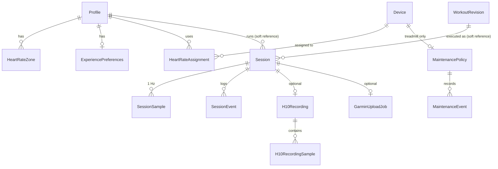

# 01 — Data model and legacy run extraction

**Scope (owner decision):**
- The new app is for private use and stays as simple as possible.
- It needs **no backwards compatibility except for run (session) data.**
- Profiles, devices, workouts, plans and calendar are **re-created** in the new app, not migrated.
- Old runs reach the new app in two ways:
  1. **Session JSON exports** (`treadmillrunner.session/v1`). This is **the compatibility contract**; it is specified exhaustively in [07](07-exports-and-backup.md) §2.
  2. **Extraction from the legacy backup file (`.trb`)** of the runs only: sessions, samples, events and linked Polar H10 recording samples (§5).

This document gives:
- the entities the new app persists, with every field (§4);
- the legacy run extraction (§5);
- a test checklist (§6).

Field names follow the legacy names wherever a value is part of the run contract, so the mapping stays 1:1.

Golden data in `data/exports/`:

| File | What it is |
|---|---|
| `legacy-backup-fixture.trb` | A real backup produced by the current app from synthetic data (afterwards the profile name was anonymised to `Runner` with a plain SQL update; `legacy-rows.txt` matches). It contains:<br>• two runs: a completed hardware run with 15 samples, 9 events, a debrief and a linked H10 recording with 22 samples; and an interrupted simulator run with 4 samples and 4 events;<br>• the profile, devices, workout and so on that those runs reference. |
| `legacy-schema.sql` | The complete DDL of that file (42 tables, 88 indexes, every CHECK). Only the run tables matter for extraction. |
| `legacy-rows.txt` | Every table of the fixture, with the SQLite storage class of each value. It shows the exact text formats of GUIDs, timestamps, booleans and JSON. |
| `fixture-session.json`, `fixture-session-interrupted.json` | The same two runs as session JSON exports ([07](07-exports-and-backup.md)). |

---

## 1. Conventions

### 1.1 Logical types
| Logical type | Meaning | Recommended Room storage |
|---|---|---|
| `uuid` | 128-bit ID | `TEXT`, canonical lower-case 36-character form. Parse case-insensitively |
| `instant` | UTC point in time | `INTEGER` epoch **microseconds** UTC. Legacy values have 100 ns resolution; microseconds keep sample ordering exact and are enough for all rules |
| `date` | Local calendar date | `TEXT` `yyyy-MM-dd` |
| `bool` | | `INTEGER` 0/1 |
| `double` | IEEE 754 binary64 | `REAL` |
| `bpm` | Heart rate, integer | `INTEGER` |
| `string(n)` | Text of at most *n* characters (enforced in validation) | `TEXT` |
| `json` | A UTF-8 JSON document | `TEXT` |
| `enum` | A closed set of names | `TEXT` holding the **name**. Never store ordinals. Names are case-sensitive |

### 1.2 Time
- Every stored instant is UTC.
- Local dates are interpreted in a named IANA zone. The household default is `Europe/Brussels`.
- The week starts on Monday.

### 1.3 IDs
- Every entity has a `uuid` primary key, except the two sample tables. Their keys are (parent ID, `sequence`).
- **Imported run IDs are kept verbatim**: session, event, H10 recording, profile reference and workout revision reference. The session ID is referenced outside the database: by the H10 exercise name `tr-{sessionId without dashes}`, by the FIT serial number and by Garmin.
- New rows use UUIDv7.

### 1.4 Concurrency and immutability
- Mutable configuration rows carry **`version` (int ≥ 1)**:
  - A write carries the version it read.
  - A mismatch is rejected as a conflict and writes nothing.
  - A successful write increments `version` by exactly 1.
  - This guards the phone UI and the web UI editing the same row.
- **Runs are immutable once terminal.** The only exceptions:
  - the debrief;
  - the single H10 null-heart-rate fill ([10](10-polar-h10.md)), which increments `session.contentVersion`;
  - deletion.
- **Workout revisions are immutable** and content-addressed ([02](02-workouts.md)).

### 1.5 Stored versus derived
Derived values are recomputed on read, never stored as truth ([05](05-sessions-and-recording.md) §7):
- weekly totals;
- trends;
- analytics;
- HR-zone time;
- adherence;
- the maintenance due state;
- plan progress.

The run summary fields (duration, distance, calories, averages) are stored once when the run becomes terminal, and again after an H10 fill. They can always be recomputed from the samples.

---

## 2. Entity overview



**Sessions reference profiles and workout revisions *softly*.**
- The profile name, workout title, weight, zones and HR controller settings are **snapshotted in the session** at arm time.
- So a session stays complete and exportable even if its profile or workout does not exist in the new app. That is always the case for imported runs.
- Deleting a session cascades to its samples, events, H10 recording and upload job.

---

## 3. Enumerations

| Enum | Values (stored name) | Legacy JSON ordinal (read only) |
|---|---|---|
| SessionState | `Idle`, `ArmedWaitingForPhysicalStart`, `Running`, `PausedWaitingForPhysicalResume`, `Completed`, `Stopped`, `Interrupted`, `Faulted` | 0–7 in that order |
| SessionOrigin | `Legacy`, `Hardware`, `Simulator`, `SystemTest` | 0–3 |
| WorkoutSelectionSource | `Legacy`, `Manual`, `Library`, `Calendar`, `Program` | 0–4 |
| SessionPauseReason | `WebControl`, `PhysicalConsole`, `TreadmillStopped` | 0–2 |
| SessionDeviceRole | `Treadmill`, `HeartRate` | 0–1 |
| ControlLeaseEventKind | `Acquired`, `Renewed`, `Released`, `Expired`, `Reclaimed` | 0–4 |
| HeartRateAutomationMode | `Disabled`, `Shadow`, `DecreaseOnly`, `Full`, `SuspendedManualOverride`, `SuspendedSafety` | 0–5 |
| TreadmillCapabilityEvidence | `Unknown`, `ProtocolReported`, `PassivelyObserved`, `HardwareVerified` | 0–3 |
| DeviceRole | `Treadmill`, `HeartRate` | – |
| HeartRateDeviceKind / Family | `ChestStrap`, `Watch`, `Sensor` / `Polar`, `Garmin`, `Other` | – |
| LiveDisplayStyle | `Balanced`, `LargeText`, `HighContrast` | – |
| LiveMetric | `Speed`, `Incline`, `HeartRate`, `ElapsedTime`, `Distance`, `Calories` | – |
| MaintenanceState (derived) | `SetupRequired`, `Current`, `DueByDate`, `DueByDistance`, `DueByDateAndDistance` | – |
| H10 recording status | `StartPending`, `Recording`, `StopPending`, `AwaitingDevice`, `Downloading`, `Downloaded`, `ReviewRequired`, `Merging`, `Merged`, `RemovalPending`, `Completed`, `Retained`, `Skipped`, `NotStarted`, `DiscardCleanupPending`, `Retryable` | – |

The legacy app wrote enums as **ordinals inside JSON** (exports, event details, configuration snapshots). Every JSON reader in the new app accepts **both the ordinal and the name**. JSON writers write the form the contract requires ([07](07-exports-and-backup.md) §2).

---

## 4. Entities of the new app

### 4.1 Session (run) — the compatibility-critical entity
| Field | Type | Null | Rules / units |
|---|---|---|---|
| id | uuid | no | PK |
| userProfileId | uuid | no | Soft reference |
| userProfileName | string(100) | no | Snapshot at arm; trimmed; non-blank |
| workoutRevisionId | uuid | no | Soft reference |
| workoutTitle | string(160) | no | Snapshot at arm; non-blank |
| selectionSource | enum WorkoutSelectionSource | no | New runs: `Manual`, `Library`, `Calendar` or `Program`. Imported runs keep their value (`Legacy` possible) |
| programRunId, programItemId | uuid | yes | Both or neither. Set only when `selectionSource = Program`. Soft references (imported runs keep them as opaque values) |
| recordPolarH10Memory | bool | no | Per-run opt-in to H10 onboard recording |
| origin | enum SessionOrigin | no | New runs: `Hardware`, `Simulator` or `SystemTest` |
| state | enum SessionState | no | `Idle` is never persisted |
| armedAt | instant | no | |
| startedAt | instant | yes | The first confirmed physical movement (≥ armedAt) |
| endedAt | instant | yes | Set when terminal (≥ startedAt) |
| durationSeconds | double | no | ≥ 0. **Active running time**, excluding paused time; ≤ endedAt − startedAt |
| distanceKilometers | double | no | ≥ 0 |
| estimatedKilocalories | double | no | ≥ 0 |
| averageHeartRateBpm | double | yes | Time-weighted; ≤ maximum |
| maximumHeartRateBpm | bpm | yes | 1–250 |
| averageSpeedKph | double | no | ≥ 0 |
| averageInclinePercent | double | no | Time-weighted measured incline |
| metricAlgorithmVersion | string(60) | no | `estimated-calories/acsm-speed-grade-v2` for every new run. Imported runs may carry `estimated-calories/v1` (see [05](05-sessions-and-recording.md) §7.1) |
| controllerConfiguration | json | no | The arm-time snapshot (below) |
| perceivedExertion | int | yes | RPE 1–10 |
| debriefNote | string(1000) | yes | Trimmed; blank becomes null |
| debriefUpdatedAt | instant | yes | The debrief exists if and only if this is set |
| contentVersion | int | no | New field (default 1). Incremented by the single H10 null-HR fill; also used for Garmin re-export decisions |
| recoveryCheckpoint | json | yes | Only while non-terminal ([05](05-sessions-and-recording.md) §8). May be cleared once terminal |
| recoveryCheckpointUpdatedAt | instant | yes | |
| imported | bool | no | New field: true for runs imported from a legacy backup or JSON export. Imported runs are never uploaded to Garmin automatically |

**Uniqueness and indexes:**
- At most one session in a non-terminal state (`ArmedWaitingForPhysicalStart`, `Running`, `PausedWaitingForPhysicalResume`) exists at any time.
- At most one `Completed` session per (`programRunId`, `programItemId`).
- Index the history list on (`userProfileId`, `endedAt` DESC), filtered to terminal, started and ended runs.

**`controllerConfiguration` snapshot.** New runs write **exactly the legacy v1 shape**: PascalCase keys, and `Evidence` values as ordinals. The session JSON export embeds this object unchanged, so old and new exports have an identical structure ([07](07-exports-and-backup.md) §2). The shape (from the fixture):
```json
{"Mode":"hardware:ftms:Ftms",            // "simulator" | "hardware:{protocolId}:{telemetryMode}" | "GarminUploadTest"
 "HeartRateController":"shadow",         // "shadow" if the workout has an HR target, else "disabled"
 "Profile":{"WeightKilograms":72.5,"MaximumHeartRateBpm":190,"MaximumSpeedKph":12,
   "HeartRateZones":[{"Number":1,"Name":"Warm up","MinimumBpm":95,"MaximumBpm":113}],
   "HeartRateController":{"IncreaseStepKph":0.2,"IncreaseCooldownSeconds":30,"DecreaseStepKph":0.5,"DecreaseCooldownSeconds":15}},
 "HeartRateSourceLabel":"Polar H10 ABCD1234","HeartRateSourceKind":"ChestStrap","HeartRateSourceFamily":"Polar",
 "Treadmill":{"IdentityLabel":"OMEGA Z","ProtocolId":"ftms","TelemetryMode":"Ftms","ModelNumber":"OMEGA Z",
   "FirmwareRevision":"V10.23.17","Evidence":3,
   "Capabilities":{"CanSetSpeedRemotely":true,"CanSetInclineRemotely":true,"CanPauseRemotely":false,"CanStopRemotely":true,
     "CanStartRemotely":true,"ReportsSpeedTargetSupport":true,"ReportsInclineTargetSupport":true,"ReportsStandardStartResume":true,
     "SpeedRange":{"Minimum":0.8,"Maximum":20,"Increment":0.1,"Evidence":1},
     "InclineRange":{"Minimum":0,"Maximum":12,"Increment":0.5,"Evidence":1}},
   "ConnectionGeneration":3,"EnrollmentId":"2b3c4d5e-6f70-4812-9a3b-4c5d6e7f8091","IdentityFingerprint":"7777…(64 hex)"}}
```
- Nullable members are written as `null`: `MaximumHeartRateBpm`, `MaximumSpeedKph`, `HeartRateController`, the `HeartRateSource*` fields, `Treadmill`, `ModelNumber`, `FirmwareRevision`, `SpeedRange`, `InclineRange`, `EnrollmentId` and `IdentityFingerprint`.
- `Evidence` ordinals: 0 Unknown, 1 ProtocolReported, 2 PassivelyObserved, 3 HardwareVerified.
- Old runs may be `{}` or lack fields. Readers match keys **case-insensitively** and accept ordinals or names.
- `Profile.WeightKilograms` is the weight used for all calorie calculations of the run.
- `Profile.HeartRateZones` is the zone set used for the run's analytics and exports. **The current profile is never used for an old run.**
- `Treadmill` is null for simulator runs.

### 4.2 SessionSample — 1 Hz telemetry (immutable)
| Field | Type | Null | Rules / units |
|---|---|---|---|
| sessionId | uuid | no | PK part; cascade |
| sequence | long | no | PK part; ≥ 0; strictly increasing from 0 (gaps allowed) |
| capturedAt | instant | no | Non-decreasing |
| elapsedMilliseconds | double | no | Active running time since start; non-decreasing |
| plannedSpeedKph | double | yes | ≥ 0 |
| requestedSpeedKph | double | no | ≥ 0 |
| measuredSpeedKph | double | no | ≥ 0 |
| plannedInclinePercent | double | yes | finite |
| requestedInclinePercent | double | no | finite |
| measuredInclinePercent | double | no | finite; may be negative |
| heartRateBpm | bpm | yes | **Only 30–250 is stored; anything else is stored and read as null** |
| distanceKilometers | double | no | Cumulative since start; ≥ 0 |
| estimatedKilocalories | double | no | Cumulative; ≥ 0 (legacy column name `EstimatedCalories`) |
| telemetryAgeMilliseconds | double | no | ≥ 0; the age of the treadmill speed reading at capture |
| metricAlgorithmVersion | string(60) | no | Equals the session's value |

### 4.3 SessionEvent (immutable)
| Field | Type | Null | Rules |
|---|---|---|---|
| id | uuid | no | PK |
| sessionId | uuid | no | cascade |
| occurredAt | instant | no | |
| kind | string(80) | no | One of the 14 kinds in [05](05-sessions-and-recording.md) §6 |
| details | json | no | The typed event body ([05](05-sessions-and-recording.md) §6). Unknown kinds from imports are kept as opaque JSON and shown as generic events |

Events are ordered by (`occurredAt`, `id`).

### 4.4 H10Recording and H10RecordingSample (linked to a run)
Full lifecycle in [10](10-polar-h10.md). The fields the run contract needs:

| Field | Type | Null | Rules |
|---|---|---|---|
| id | uuid | no | |
| sessionId | uuid | yes | Unique when set; set to null if the run is deleted |
| deviceId | uuid | no | The H10 device |
| exerciseId | string(64) | no | `tr-{sessionId as 32 hex digits}` for automatic recordings |
| status | enum (§3) | no | |
| origin | `Automatic` or `Manual` | no | |
| sampleType | `HeartRate` or `RrInterval` | no | |
| sampleIntervalSeconds | int | no | 1 or 5 for HeartRate; 1 for RR |
| startRequestedAt, startConfirmedAt, stopRequestedAt, stopConfirmedAt, startedAt, endedAt | instant | yes | |
| remotePath | string(512) | yes | `/{exerciseId}/SAMPLES.BPB` |
| payload | blob ≤ 8 MiB | yes | The raw recording, opaque |
| payloadSha256 | 64 hex | yes | |
| mergeCount | int | no | The number of run samples filled |
| version | int | no | Concurrency |

**H10RecordingSample:**
- `recordingId` and `sequence` form the key.
- `capturedAt`.
- `beatsPerMinute` (nullable).
- `rrIntervalMilliseconds` (nullable, unsigned).

### 4.5 Profile
| Field | Type | Null | Rules |
|---|---|---|---|
| id | uuid | no | |
| displayName | string(100) | no | Trimmed; unique case-insensitively (`trim().uppercase()`), including archived profiles |
| weightKilograms | double | no | > 0; UI 20–350, step 0.1, default 70 |
| maximumHeartRateBpm | bpm | yes | 1–250; UI 50–250 |
| maximumSpeedKph | double | yes | > 0; UI 1–30. The engine uses 20 km/h when null |
| hrIncreaseStepKph | double | no | 0.1–0.5; default 0.2 |
| hrIncreaseCooldownSeconds | int | no | 15–180; default 30 |
| hrDecreaseStepKph | double | no | 0.1–1.0; default 0.5 |
| hrDecreaseCooldownSeconds | int | no | 5–120; default 15 |
| isArchived, archivedAt | bool, instant? | | `isArchived ⇔ archivedAt != null` |
| version, createdAt, updatedAt | | | |

Rules: [06](06-profiles-and-heart-rate.md) §2.

### 4.6 HeartRateZone
| Field | Type | Rules |
|---|---|---|
| id | uuid | Regenerated when the zone set is replaced |
| profileId | uuid | cascade |
| number | int | 1–10; unique per profile |
| name | string(60) | non-blank, trimmed |
| minimumBpm, maximumBpm | bpm | 1 ≤ min ≤ max ≤ 250; no overlap between zones sorted by number |

The zone set is replaced as a whole on each profile save.

### 4.7 ExperiencePreferences (0..1 per profile)
| Field | Type | Rules |
|---|---|---|
| id, profileId | uuid | profileId unique; cascade |
| displayStyle | enum LiveDisplayStyle | default `Balanced` |
| primaryMetrics | json array of LiveMetric **names** | 2–3 distinct; default `["Speed","HeartRate","ElapsedTime"]` |
| cueStepChanges, cueHeartRateDeparture, cueHalfway, cueConnectionProblems, cueCompletion | bool | default true |
| cueVolumePercent | int | 0–100; default 60 |
| version, updatedAt | | A missing row reads as the defaults with version 0 |

### 4.8 Device (treadmill and HR sensors)
| Field | Type | Null | Rules |
|---|---|---|---|
| id | uuid | no | |
| role | enum DeviceRole | no | At most one active (non-archived) treadmill |
| address / locator | string(256) | no | Android BLE address or identity; (role, locator) unique among active devices |
| protocolId | string(100) | no | For example `ftms`, `bluetooth-heart-rate`, `polar-h10` |
| identityFingerprint | 64 hex | no | |
| displayName | string(100) | no | |
| modelNumber, firmwareRevision | string(100) | yes | From the Device Information Service |
| telemetryMode | `Ftms` or `Vendor` | Treadmill only | Required for a treadmill, null for HR |
| capabilities | json | Treadmill only | Shape as in `controllerConfiguration.treadmill.capabilities`. Evidence and commissioning state: [08](08-ftms-and-treadmill.md), [09](09-safety-and-command-contract.md) |
| evidence | enum TreadmillCapabilityEvidence | no | |
| lastVerifiedAt | instant | yes | |
| hrKind, hrFamily | enum | HR only | Classified from the name when not given ([06](06-profiles-and-heart-rate.md) §5.1) |
| isArchived, archivedAt, version, createdAt, updatedAt | | | "Forget" archives the device and deletes its assignments |

### 4.9 HeartRateAssignment
| Field | Type | Rules |
|---|---|---|
| id | uuid | |
| profileId, deviceId | uuid | (profile, device) unique; the device must be an HR device |
| priority | int | 0–99; lower is tried first |
| autoConnect | bool | |
| isPreferred | bool | **At most one preferred per profile.** Setting one clears the previous one |
| version, createdAt, updatedAt | | |

### 4.10 MaintenancePolicy and MaintenanceEvent
| Entity | Fields |
|---|---|
| MaintenancePolicy | `id`; `deviceId` (unique, treadmill); `intervalMonths` (1–24, **default 3**); `distanceIntervalKilometers` (1–5000, **default 241**); `version` (incremented by a policy change **and by each recorded event**); `createdAt`; `updatedAt`. Created with the defaults when a treadmill is added |
| MaintenanceEvent | `id`; `policyId` (cascade); `operationId` (unique; idempotency); `performedAt` (within the last 10 years, ≤ now + 5 min); `appDistanceBaselineKilometers` (≥ 0; the tracked distance **when recorded**); `note` (≤ 500, trimmed, blank becomes null); `createdAt` |

Rules: [05](05-sessions-and-recording.md) §10.

### 4.11 Other entities (defined in their own specs)
| Entity | Spec |
|---|---|
| Workout, WorkoutRevision (immutable, canonical JSON, SHA-256) | [02](02-workouts.md) |
| Calendar series and exceptions, programs, program runs, overrides, premade installations, goals, progression recommendations | [04](04-calendar-and-plans.md) |
| Garmin upload account and job | [11](11-garmin.md). Imported runs never get a job |
| Operation receipts (idempotency: operation ID, type, request fingerprint, status, outcome; kept 90 days) | [09](09-safety-and-command-contract.md) |
| Backup destinations and verification receipts | [07](07-exports-and-backup.md) §7 |

---

## 5. Extracting runs from a legacy backup (`.trb`)

### 5.1 File format
- **A `.trb` is a plain SQLite 3 database file**: an online page copy of the legacy live database made with the SQLite backup API.
  - The header is `SQLite format 3\0`.
  - UTF-8, page size 4096, `user_version` 0.
  - The copy keeps the **WAL journal flag**. Opening it read-write creates `-wal`/`-shm` sidecars.
- The download name is `treadmillrunner-{yyyyMMdd-HHmmss}.trb`, media type `application/vnd.treadmillrunner.backup`.
- The size is at most 256 MiB.
- Automatic legacy backups have the same format, named `integrity-last-known-good-{yyyyMMdd-HHmmssfff}-{guid:N}.db`.
- The schema history is in `__EFMigrationsHistory`. The current schema is migration `20260910163254_AddPolarH10Memory` (24 migrations).

### 5.2 Procedure
1. Copy the file to app-private storage. Refuse an empty file, a file > 256 MiB, or a wrong 16-byte header.
2. Open it **read-only / immutable** (`file:…?immutable=1&mode=ro`), so no sidecars are created.
3. `PRAGMA integrity_check` must return `ok`.
4. Check that the tables `WorkoutSessions`, `SessionSamples` and `SessionEvents` exist. `PolarH10Recordings` and `PolarH10RecordingSamples` are optional (older backups don't have them).
5. **Select columns by name.** The physical column order differs from the logical order: for example, columns added by later migrations are appended at the end. Tolerate missing optional columns with these defaults:
   - `SelectionSource` → `Legacy`;
   - `SessionOrigin` → `Legacy`;
   - `WorkoutProgramRunId`/`WorkoutProgramItemId` → null;
   - `RecoveryCheckpointJson` → null;
   - `RecordPolarH10Memory` → false.
6. For each `WorkoutSessions` row, map it with §5.4. Skip rows already present with identical content; report rows with the same ID and different content as conflicts. The import is idempotent.
7. **Non-terminal legacy rows** (State `ArmedWaitingForPhysicalStart`, `Running` or `PausedWaitingForPhysicalResume`) are imported as `Interrupted`:
   - with a `session-interrupted` event, reason `Imported from legacy backup while unfinished.`;
   - with the summary rules of [05](05-sessions-and-recording.md) §8.4.
8. Show a preview before committing: the number of runs by state and origin, the date range, total distance, and conflicts. Commit all runs in one transaction.
9. Imported runs get `imported = true` and no Garmin upload job.

### 5.3 Value decoding
| Legacy storage | Decode |
|---|---|
| GUID `TEXT` | Upper case when written by the app, lower case when written by SQL migrations. Parse case-insensitively; keep the value |
| Instant `TEXT` | `yyyy-MM-dd HH:mm:ss[.f{1,7}]+00:00` (space separator, trailing zeros trimmed). SQL-migration rows use `yyyy-MM-ddTHH:mm:ss.fff+00:00`. Accept both; convert to UTC; **order by the parsed value**, never by the text |
| Bool `INTEGER` | 0/1 |
| `REAL` | IEEE double; keep the exact value (for example `DistanceKilometers = 0.001388889`) |
| Enum `TEXT` | Exact names. A `SessionOrigin` value that doesn't parse becomes `Legacy` |
| JSON `TEXT` | Enums are **ordinals** inside JSON (§3) |
| `SessionSamples.HeartRateBpm` outside 30–250 | null |

### 5.4 Mapping
| Legacy column | New field | Notes |
|---|---|---|
| **WorkoutSessions** `Id` | session.id | verbatim |
| `UserProfileId`, `UserProfileName` | userProfileId, userProfileName | The UI offers to attach imported runs to a new profile by name. The original ID is kept in `userProfileId` unless the user remaps it |
| `WorkoutRevisionId`, `WorkoutTitle` | workoutRevisionId, workoutTitle | Soft reference; the revision usually doesn't exist in the new app |
| `WorkoutProgramRunId`, `WorkoutProgramItemId`, `SelectionSource` | same | opaque |
| `SessionOrigin`, `State`, `ArmedAtUtc`, `StartedAtUtc`, `EndedAtUtc` | origin, state, armedAt, startedAt, endedAt | |
| `DurationSeconds`, `DistanceKilometers`, `EstimatedCalories`, `AverageHeartRateBpm`, `MaximumHeartRateBpm`, `AverageSpeedKph`, `AverageInclinePercent` | same (EstimatedCalories → estimatedKilocalories) | Keep the stored values. Do not recompute on import |
| `MetricAlgorithmVersion` | same | |
| `ControllerConfigurationJson` | controllerConfiguration | Keep the original JSON text verbatim (PascalCase) |
| `PerceivedExertion`, `DebriefNote`, `DebriefUpdatedAtUtc` | same | |
| `RecordPolarH10Memory` | recordPolarH10Memory | |
| `RecoveryCheckpointJson`, `RecoveryCheckpointUpdatedAtUtc` | dropped | Terminal runs don't need it |
| `ActiveSessionKey` | – | A virtual computed column; ignore it |
| **SessionSamples** all columns | SessionSample | `EstimatedCalories` → estimatedKilocalories |
| **SessionEvents** `Id`, `OccurredAtUtc`, `Kind`, `DetailsJson` | SessionEvent | Keep `DetailsJson` verbatim (camelCase, enum ordinals) |
| **PolarH10Recordings** where `WorkoutSessionId` is not null | H10Recording | Keep the status if terminal (`Merged`, `Completed`, `Retained`, `Skipped`, `NotStarted`, `ReviewRequired`); otherwise `ReviewRequired`. `DeviceEnrollmentId` becomes a soft reference |
| **PolarH10RecordingSamples** of those recordings | H10RecordingSample | verbatim |

**Not extracted:**
- all other tables (profiles, zones, devices, assignments, maintenance, workouts, plans, calendar, preferences, goals, Garmin, receipts, backups, BLE incidents);
- `__EF*`.

**Worked example** (fixture, see `legacy-rows.txt`):
- The run `4D5E6F70-8192-4A34-9C5D-6E7F80910213`:
  - `State=Completed`, `SessionOrigin=Hardware`, `SelectionSource=Library`;
  - `DurationSeconds=14`, `DistanceKilometers=0.02675`, `EstimatedCalories=2.052846`;
  - `AverageHeartRateBpm=132.6153846153846`, `MaximumHeartRateBpm=156`;
  - `PerceivedExertion=6`, `DebriefNote="Felt controlled; legs fresh."`.
- Sample 1: `CapturedAtUtc="2026-09-01 06:30:01+00:00"`, `ElapsedMilliseconds=1000`, `DistanceKilometers=0.001388889`, `EstimatedCalories=0.080556`, `HeartRateBpm=112`.
- An event: `Kind=device-disconnected`, `OccurredAtUtc="2026-09-01 06:30:08.1999999+00:00"`, `DetailsJson={"deviceRole":1,"reason":"Heart-rate telemetry became stale.","eventType":"device-disconnected","occurredAt":"2026-09-01T06:30:08.1999999+00:00"}`.
- The H10 recording `6F708192-A3B4-4C56-9E7F-809102132435`:
  - `ExerciseId=tr-4d5e6f7081924a349c5d6e7f80910213`, `Status=Completed`;
  - 22 HeartRate samples from `06:29:58` (2 s before the run start) at 1 s intervals, bpm 106, 108, … 148.
- The second run `5A6B7C8D-9E0F-4A1B-8C2D-3E4F5A6B7C8D`: `State=Interrupted`, `SessionOrigin=Simulator`, `SelectionSource=Manual`, `MetricAlgorithmVersion=estimated-calories/v1`, `ControllerConfigurationJson="{}"`.

---

## 6. Test checklist
- [ ] **DM-01** Every JSON reader accepts enum ordinals and names (§3). Writers write the contract form.
- [ ] **DM-02** Concurrency: a stale `version` is rejected with no write. A successful write increments `version` by 1. A missing preferences row reads as the defaults with version 0.
- [ ] **DM-03** Uniqueness is enforced:
  - one non-terminal session;
  - one completed session per (program run, item);
  - one preferred assignment per profile;
  - one active treadmill;
  - unique profile names (case-insensitive);
  - unique zone numbers;
  - one maintenance policy per treadmill;
  - unique maintenance `operationId`.
- [ ] **DM-04** Validation rejects:
  - weight ≤ 0;
  - HR steps or cooldowns out of bounds;
  - RPE outside 1–10;
  - a note over 1000 characters;
  - maintenance outside 1–24 months or 1–5000 km;
  - volume outside 0–100;
  - fewer than 2 or more than 3 metrics, or duplicate metrics;
  - overlapping zones.
- [ ] **DM-05** Deleting a session cascades to its samples, events, upload job and recommendation, and unlinks its H10 recording.
- [ ] **DM-06** Extracting `legacy-backup-fixture.trb` yields:
  - 2 runs, 19 samples (15 + 4), 13 events (9 + 4), 1 H10 recording with 22 samples;
  - GUIDs equal to the fixture (compared case-insensitively);
  - sample values bit-identical to `legacy-rows.txt`;
  - `ControllerConfigurationJson` preserved.
- [ ] **DM-07** The extraction rejects: a non-SQLite file, an empty file, a file over 256 MiB, a failed integrity check, and missing run tables. It creates no sidecar files next to the source.
- [ ] **DM-08** Extraction is idempotent: a second import changes nothing. A changed row with the same ID is reported as a conflict.
- [ ] **DM-09** Both instant formats parse (`2026-09-01 06:30:08.1999999+00:00` and `2026-09-01T06:30:08.199+00:00`). Ordering uses parsed values.
- [ ] **DM-10** A legacy sample heart rate of 20 or 251 imports as null.
- [ ] **DM-11** A non-terminal legacy run imports as `Interrupted`, with a `session-interrupted` event and the [05](05-sessions-and-recording.md) §8.4 summary.
- [ ] **DM-12** Imported runs are flagged `imported` and are never queued for Garmin upload.
