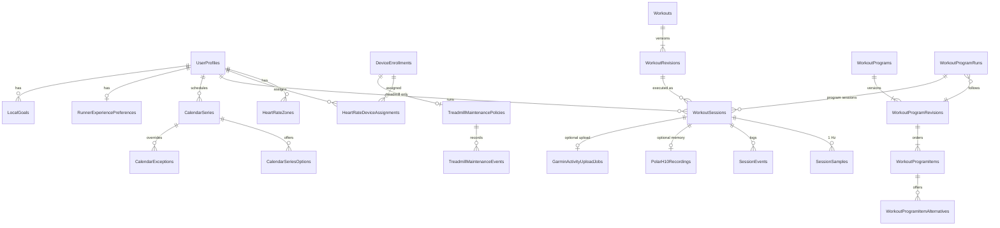

# 01 — Data model and legacy backup format

This document specifies every entity the current app persists, field by field, and how to read the current app's backup file (`.trb`) so the Kotlin app can migrate the data with the **GUIDs kept verbatim**.

- Sections 1–3 are the conventions: types, time, IDs, versioning, what is derived.
- Section 4 is the entity catalogue, grouped by domain. Each table lists every column.
- Section 5 is the legacy `.trb` format and the migration mapping.
- Section 6 is the test checklist.

Golden data for this document lives in `data/exports/`:

| File | What it is |
|---|---|
| `legacy-backup-fixture.trb` | A real backup produced by the current app (a profile with 5 zones, a treadmill and a Polar H10 enrollment with an assignment, one workout revision, one completed hardware session with 15 samples and 9 events, a debrief, a maintenance baseline, preferences, a goal, operation receipts). |
| `legacy-schema.sql` | The complete DDL (`sqlite_master.sql`) of that file: 42 tables and 88 indexes, including every CHECK constraint. It is the authoritative column list for the legacy format. |
| `legacy-rows.txt` | Every table of the fixture, dumped with the SQLite storage class of each value. It shows the exact text formats of GUIDs, timestamps, booleans and JSON columns. |

Behaviour that uses these entities is specified elsewhere: sessions in [05](05-sessions-and-recording.md), profiles and HR in [06](06-profiles-and-heart-rate.md), exports and backup in [07](07-exports-and-backup.md), workouts in [02](02-workouts.md), calendar and plans in [04](04-calendar-and-plans.md), the treadmill in [08](08-ftms-and-treadmill.md), the Polar H10 in [10](10-polar-h10.md), Garmin in [11](11-garmin.md).

---

## 1. Conventions

### 1.1 Logical types

| Logical type | Meaning | Legacy SQLite storage (see 5.3) | Recommended Kotlin/Room storage |
|---|---|---|---|
| `uuid` | 128-bit ID | `TEXT`, canonical 36-char form, **upper case** when written by the app (`4D5E6F70-8192-4A34-9C5D-6E7F80910213`); a few rows written by SQL migrations are lower case | `TEXT` lower case, or a 16-byte `BLOB`; parse case-insensitively |
| `instant` | UTC point in time, 100 ns resolution | `TEXT` `yyyy-MM-dd HH:mm:ss[.fffffff]+00:00` (space separator, trailing zero fraction digits trimmed); SQL-migration rows use `yyyy-MM-ddTHH:mm:ss.fff+00:00` | `INTEGER` epoch milliseconds (or micros) UTC; keep the original text only if lossless round-trip is needed |
| `date` | Local calendar date, no time | `TEXT` `yyyy-MM-dd` | `TEXT` ISO date |
| `bool` | | `INTEGER` 0/1 | `INTEGER` 0/1 |
| `int` / `long` | | `INTEGER` | `INTEGER` |
| `double` | IEEE 754 binary64 | `REAL` | `REAL` |
| `bpm` | Heart rate, unsigned 16-bit in the model | `INTEGER` | `INTEGER` |
| `string(n)` | UTF-16 text, at most *n* characters (the legacy app enforced *n* in validation; SQLite does not) | `TEXT` | `TEXT` + validation |
| `sha256hex` | 64 lower-case hex characters | `TEXT` | `TEXT` |
| `json` | A UTF-8 JSON document (see the column notes for its shape) | `TEXT` | `TEXT` |
| `enum` | A closed set of names | `TEXT` holding the **name** (for example `Completed`) | `TEXT` name. Never store ordinals. |

**Enum names are case-sensitive** and stored exactly as listed in this document.

**Inside JSON columns the legacy app often wrote enums as integers** (their ordinal), for example `"state":2` or `"reason":0`. The ordinal tables are given wherever this happens. A Kotlin reader must accept both the integer and the name. A Kotlin writer writes names.

### 1.2 Time
- Every stored instant is UTC. The legacy validation layer rejects non-UTC offsets.
- Local dates (`date`) are interpreted in a named IANA time zone. The default household zone is `Europe/Brussels`.
- Ordering by an instant must use the parsed value, not the legacy text: legacy text mixes the ` ` and `T` separators.

### 1.3 IDs
- Every entity has a `uuid` primary key, except:
  - `SessionSamples` (key `WorkoutSessionId` + `Sequence`);
  - `PolarH10RecordingSamples` (key `PolarH10RecordingId` + `Sequence`);
  - `GarminOAuthStates` (key `StateHash`).
- **Migrated rows keep their GUIDs verbatim.** They are referenced from outside the database: the H10 exercise name `tr-{sessionId:N}`, Garmin idempotency keys, FIT serial numbers and evidence files.
- New rows in the Kotlin app use UUIDv7 (see the plan, section 7.1).

### 1.4 Optimistic concurrency and idempotency
- **`Version` (int, ≥ 1) is an optimistic concurrency token** on:
  - `DeviceEnrollments`, `HeartRateDeviceAssignments`, `UserProfiles`, `CalendarSeries`, `WorkoutProgramRuns`;
  - `TreadmillMaintenancePolicies`, `GarminAccountLinks`, `GarminWatchBindings`, `GarminActivityUploadAccounts`;
  - `PolarH10Recordings`, `RunnerExperiencePreferences`, `LocalGoals`, `ProgressionRecommendations`, `LocalBackupPolicies`.
- The rules for `Version`:
  - It is created at 1.
  - Every mutation increments it by exactly 1.
  - An update carries the version the client last read (`expectedVersion`). A mismatch is rejected as a conflict (HTTP 409 in the legacy API) and nothing is written.
  - Exception: preference and goal rows that do not exist yet are reported with version **0**. Saving with `expectedVersion` 0 or null creates them at version 1.
- **`OperationReceipts`** make mutating requests idempotent:
  - A request carries a client `operationId` (UUID).
  - The first completed request stores a receipt: type, status code, outcome JSON, and a request fingerprint (the SHA-256 of the request scope).
  - A replay with the same ID and the same fingerprint returns the stored outcome.
  - The same ID with a different type or fingerprint is a conflict.
  - Receipts are local-only operational data. The plan keeps them for 90 days and does not migrate them.
- **Revisions are immutable.**
  - `WorkoutRevisions` and `WorkoutProgramRevisions` rows are never updated or deleted. The legacy data layer throws on any attempt.
  - A change creates a new revision with `RevisionNumber + 1`.
  - Revisions are content-addressed by `ContentSha256`, unique per parent.

### 1.5 Stored versus derived
The rule (plan 7.1): **derived data is recomputed, never stored as truth**. The legacy app does store some aggregates, and each one is noted as a *cache* or a *snapshot*:

| Stored value | Status | Recomputed from |
|---|---|---|
| `WorkoutSessions.DurationSeconds / DistanceKilometers / EstimatedCalories / AverageHeartRateBpm / MaximumHeartRateBpm / AverageSpeedKph / AverageInclinePercent` | Terminal summary, written once at finalization (and after an H10 merge) | Samples ([05](05-sessions-and-recording.md) §5 and §7) |
| `WorkoutSessions.UserProfileName`, `WorkoutTitle`, `ControllerConfigurationJson` | **Snapshot** at arm time. Never updated when the profile or workout changes later | – |
| `SessionSamples.DistanceKilometers`, `EstimatedCalories` | Cumulative values at the sample. Immutable | – |
| `TreadmillMaintenanceEvents.AppDistanceBaselineKilometers` | Snapshot of the tracked distance when the event was recorded; adjusted only by session deletion | The sum of hardware session distance |
| `WorkoutProgramRuns.Status` = `Completed` | Written when the last item is completed | Sessions |
| Maintenance state, weekly totals, trends, analytics, HR-zone time, adherence, plan progress | **Never stored** | Computed on read |

---

## 2. Entity relationship overview



**Delete behaviour** (legacy foreign keys; `PRAGMA foreign_keys=ON` on every connection):

| Parent → child | On delete |
|---|---|
| WorkoutSessions → SessionSamples, SessionEvents, GarminActivityUploadJobs, ProgressionRecommendations | CASCADE |
| WorkoutSessions → PolarH10Recordings.WorkoutSessionId | SET NULL |
| UserProfiles → HeartRateZones, CalendarSeries, TrainingDaySelections, GarminAccountLinks, GarminOAuthStates, GarminWatchBindings, GarminActivityUploadAccounts, RunnerExperiencePreferences, LocalGoals, ProgressionRecommendations | CASCADE |
| UserProfiles → ImportAudits.UserProfileId, PolarH10Recordings.UserProfileId | SET NULL |
| UserProfiles → WorkoutSessions, HeartRateDeviceAssignments, WorkoutProgramRuns, PremadePlanInstallations, WorkoutProgramRevisions.OwnerProfileId | RESTRICT (profiles are archived, never deleted) |
| DeviceEnrollments → TreadmillMaintenancePolicies | CASCADE |
| DeviceEnrollments → HeartRateDeviceAssignments, PolarH10Recordings | RESTRICT |
| Workouts → WorkoutRevisions; WorkoutRevisions → everything that references them | RESTRICT |
| TreadmillMaintenancePolicies → TreadmillMaintenanceEvents; CalendarSeries → options/exceptions; CalendarExceptions → options; WorkoutProgramItems → alternatives; WorkoutProgramRuns → overrides/extra occurrences; GarminAccountLinks → sync items; GarminActivityUploadAccounts → jobs; LocalBackupPolicies → BackupVerifications; PolarH10Recordings → samples | CASCADE |

---

## 3. Enumerations (all values)

| Enum | Values (stored name; ordinal in JSON) | Used by |
|---|---|---|
| SessionState | `Idle`=0, `ArmedWaitingForPhysicalStart`=1, `Running`=2, `PausedWaitingForPhysicalResume`=3, `Completed`=4, `Stopped`=5, `Interrupted`=6, `Faulted`=7 | WorkoutSessions.State, checkpoint JSON, JSON export |
| SessionOrigin | `Legacy`=0, `Hardware`=1, `Simulator`=2, `SystemTest`=3 | WorkoutSessions.SessionOrigin |
| WorkoutSelectionSource | `Legacy`=0, `Manual`=1, `Library`=2, `Calendar`=3, `Program`=4 | WorkoutSessions.SelectionSource |
| SessionPauseReason | `WebControl`=0, `PhysicalConsole`=1, `TreadmillStopped`=2 | session-paused event |
| SessionDeviceRole | `Treadmill`=0, `HeartRate`=1 | device-disconnected/reconnected events |
| ControlLeaseEventKind | `Acquired`=0, `Renewed`=1, `Released`=2, `Expired`=3, `Reclaimed`=4 | control-lease event |
| HeartRateAutomationMode | `Disabled`=0, `Shadow`=1, `DecreaseOnly`=2, `Full`=3, `SuspendedManualOverride`=4, `SuspendedSafety`=5 | recovery checkpoint JSON |
| DeviceRole | `Treadmill`, `HeartRate` | DeviceEnrollments.Role, BleReliabilityIncidents.Role |
| TreadmillTelemetryMode | `Ftms`, `Vendor` | DeviceEnrollments.TelemetryMode |
| TreadmillCapabilityEvidence | `Unknown`=0, `ProtocolReported`=1, `PassivelyObserved`=2, `HardwareVerified`=3 | DeviceEnrollments.Evidence (name), capability JSON (ordinal) |
| HeartRateDeviceKind | `ChestStrap`, `Watch`, `Sensor` | DeviceEnrollments.HeartRateDeviceKind |
| HeartRateDeviceFamily | `Polar`, `Garmin`, `Other` | DeviceEnrollments.HeartRateDeviceFamily |
| BleReliabilityFailureKind | `NativeDisconnected`, `TelemetrySilent`, `NotificationEnded`, `GattTimeout`, `InvalidTelemetry`, `RequiredCharacteristicMissing`, `AdapterUnavailable` | BleReliabilityIncidents.FailureKind |
| UnitSystem | `Metric` (the only value) | UserProfiles.UnitSystem |
| WorkoutKind | `Structured`, `ManualTemplate`, `PlanInternal` | Workouts.Kind |
| CalendarExceptionKind | `Skip`, `Replace`, `Add` | CalendarExceptions.Kind |
| WorkoutProgramRunStatus | `Active`, `Completed`, `Abandoned` | WorkoutProgramRuns.Status |
| LiveDisplayStyle | `Balanced`=0, `LargeText`=1, `HighContrast`=2 | RunnerExperiencePreferences.DisplayStyle |
| LiveMetric | `Speed`=0, `Incline`=1, `HeartRate`=2, `ElapsedTime`=3, `Distance`=4, `Calories`=5 | PrimaryMetricsJson (**ordinals**, see 4.3) |
| LocalGoal Kind / Period | Kind `Sessions`, `Minutes`, `Distance`, `PlanCompletion`; Period `Weekly`, `Monthly`, `Plan` | LocalGoals |
| ProgressionAction | `Maintain`, `Repeat`, `Reduce`, `Advance`, `Reschedule` | ProgressionRecommendations.Action |
| Recommendation status | `Pending`, `Accepted`, `Rejected` | ProgressionRecommendations.Status |
| Backup verification status | `Verified`, `Failed` | BackupVerifications.Status |
| TreadmillMaintenanceState (derived) | `SetupRequired`=0, `Current`=1, `DueByDate`=2, `DueByDistance`=3, `DueByDateAndDistance`=4 | computed only |
| PolarH10 recording status | `StartPending`, `Recording`, `StopPending`, `AwaitingDevice`, `Downloading`, `Downloaded`, `ReviewRequired`, `Merging`, `Merged`, `RemovalPending`, `Completed`, `Retained`, `Skipped`, `NotStarted`, `DiscardCleanupPending`, `Retryable` | PolarH10Recordings.Status |
| PolarH10 origin / sample type | Origin: default `Automatic`, and the manual value used by the archive (see [10](10-polar-h10.md)); SampleType `HeartRate`, `RrInterval` | PolarH10Recordings |
| Garmin sync item kind / status | Kind `Workout`, `TrainingPlan`, `Calendar`; Status `Pending`, `InFlight`, `Synced`, `Failed` | GarminSyncItems |
| Garmin upload account state / handling | State `Connected`, `NeedsAuthentication`, `ProviderUnavailable`; WatchActivityHandling `PreferWatch`, `MergeAndReplace` | GarminActivityUploadAccounts |
| Garmin upload job status | `Pending`, `InFlight`, `Confirmed`, `Failed`, `Unknown`, `Dismissed`, `FoundInGarmin`, `ReviewRequired` | GarminActivityUploadJobs.Status |

---

## 4. Entity catalogue

Each table uses these columns:
- **Column**: the legacy column name.
- **Type**: the logical type (1.1).
- **Null**: whether NULL is allowed.
- **Rules / units**: constraints, units, defaults and meaning. "CK" marks a database CHECK constraint.

### 4.1 Profiles and heart rate

#### UserProfiles — a runner (household member)
| Column | Type | Null | Rules / units |
|---|---|---|---|
| Id | uuid | no | PK |
| DisplayName | string(100) | no | Trimmed; CK length > 0 |
| NormalizedDisplayName | string(100) | no | `DisplayName.trim().toUpperInvariant()`; **unique index** (names are unique case-insensitively, including archived profiles) |
| UnitSystem | enum | no | CK `= 'Metric'` |
| WeightKilograms | double | no | kg; CK > 0; finite. UI bounds 20–350, step 0.1, default 70 |
| MaximumHeartRateBpm | bpm | yes | CK NULL or > 0; model 1–250. UI bounds 50–250 |
| MaximumSpeedKph | double | yes | km/h; CK NULL or > 0. UI bounds 1–30. The session engine uses 20 km/h when NULL |
| HeartRateIncreaseStepKph | double | no | CK 0.1–0.5; default 0.2 |
| HeartRateIncreaseCooldownSeconds | int | no | CK 15–180; default 30 |
| HeartRateDecreaseStepKph | double | no | CK 0.1–1.0; default 0.5 |
| HeartRateDecreaseCooldownSeconds | int | no | CK 5–120; default 15 |
| Version | int | no | CK > 0; concurrency token |
| IsArchived | bool | no | CK: `IsArchived=0 ⇔ ArchivedAtUtc IS NULL` |
| ArchivedAtUtc | instant | yes | |
| CreatedAtUtc, UpdatedAtUtc | instant | no | |

#### HeartRateZones — per-profile zones (a child collection, replaced as a whole on each profile update)
| Column | Type | Null | Rules |
|---|---|---|---|
| Id | uuid | no | PK. Regenerated on every profile update (zones are deleted and re-inserted), so **do not rely on zone IDs** |
| UserProfileId | uuid | no | FK UserProfiles, cascade |
| Number | int | no | CK > 0; model 1–10; **unique per profile** |
| Name | string(60) | no | Non-blank, trimmed |
| MinimumBpm, MaximumBpm | bpm | no | CK Minimum ≤ Maximum; model 1 ≤ min ≤ max ≤ 250. Zones sorted by number must not overlap (next.Minimum > previous.Maximum) |

#### RunnerExperiencePreferences — Run-screen display and audio cues (0..1 per profile)
| Column | Type | Null | Rules |
|---|---|---|---|
| Id | uuid | no | PK |
| UserProfileId | uuid | no | **unique**; FK cascade |
| DisplayStyle | enum LiveDisplayStyle | no | CK in (`Balanced`,`LargeText`,`HighContrast`); default `Balanced` |
| PrimaryMetricsJson | json, ≤ 256 chars | no | A JSON array of 2–3 **distinct** LiveMetric values. **The legacy writer stores ordinals** (for example `[0,2,4]`). The column default is the names form `["Speed","HeartRate","ElapsedTime"]` (equal to `[0,2,3]`). Readers accept both |
| CueStepChanges, CueHeartRateDeparture, CueHalfway, CueConnectionProblems, CueCompletion | bool | no | Default true |
| CueVolumePercent | int | no | CK 0–100; default 60 |
| Version | int | no | CK > 0; created at 1 |
| UpdatedAtUtc | instant | no | |

A profile without a row behaves as the defaults and is reported with version 0.

#### DeviceEnrollments — the enrolled treadmill and HR sensors
| Column | Type | Null | Rules |
|---|---|---|---|
| Id | uuid | no | PK |
| Role | enum DeviceRole | no | CK in (`Treadmill`,`HeartRate`) |
| DeviceId | string(256) | no | The platform BLE device identifier. Legacy Windows form `BluetoothLE#BluetoothLE<adapter>-<address>`. **Not portable to Android**: re-discover by name, service and fingerprint ([08](08-ftms-and-treadmill.md)) |
| ProtocolId | string(100) | no | For example `ftms`, `omega`, `bluetooth-heart-rate` |
| IdentityFingerprint | sha256hex | no | CK length = 64; indexed |
| DisplayName | string(100) | no | Non-blank |
| ModelNumber, FirmwareRevision | string(100) | yes | From the Device Information Service |
| TelemetryMode | enum TreadmillTelemetryMode | yes | **Required for Treadmill, NULL for HeartRate** (CK) |
| CapabilitiesJson | json | yes | Required for Treadmill, NULL for HeartRate (CK). Shape (camelCase; `evidence` is an ordinal): `{"canSetSpeedRemotely":bool,"canSetInclineRemotely":bool,"canPauseRemotely":bool,"canStopRemotely":bool,"canStartRemotely":bool,"reportsSpeedTargetSupport":bool,"reportsInclineTargetSupport":bool,"reportsStandardStartResume":bool,"speedRange":{"minimum":0.8,"maximum":20,"increment":0.1,"evidence":1}\|null,"inclineRange":{…}\|null}` |
| Evidence | enum TreadmillCapabilityEvidence | no | Stored as a name |
| LastVerifiedAtUtc | instant | yes | |
| HeartRateDeviceKind, HeartRateDeviceFamily | enum | yes | HeartRate only (classified from the name when not given, see [06](06-profiles-and-heart-rate.md) §5.1); NULL for treadmills |
| Version | int | no | CK > 0 |
| IsArchived / ArchivedAtUtc | bool / instant | no/yes | CK like UserProfiles. "Forget device" archives the row |
| CreatedAtUtc, UpdatedAtUtc | instant | no | |

Indexes:
- A unique index on `Role` filtered to `Role='Treadmill' AND IsArchived=0`: **at most one active treadmill**.
- A unique index on `(Role, DeviceId)` filtered to `IsArchived=0`.

#### HeartRateDeviceAssignments — which runner may use which HR sensor
| Column | Type | Null | Rules |
|---|---|---|---|
| Id | uuid | no | PK |
| UserProfileId | uuid | no | FK restrict |
| DeviceEnrollmentId | uuid | no | FK restrict; HeartRate enrollments only |
| Priority | int | no | CK 0–99; lower is tried first |
| AutoConnect | bool | no | Whether the gateway connects it automatically (Polar family sensors are always eligible, see [06](06-profiles-and-heart-rate.md) §5) |
| IsPreferred | bool | no | **At most one preferred assignment per profile** (a unique filtered index on UserProfileId where `IsPreferred=1`). Making a new one preferred clears the others (their Version is incremented) |
| Version | int | no | CK > 0 |
| CreatedAtUtc, UpdatedAtUtc | instant | no | |

Unique `(UserProfileId, DeviceEnrollmentId)`. Assignments to archived enrollments are deleted.

#### TreadmillMaintenancePolicies — one per treadmill enrollment
| Column | Type | Null | Rules |
|---|---|---|---|
| Id | uuid | no | PK |
| DeviceEnrollmentId | uuid | no | **unique**; FK cascade |
| IntervalMonths | int | no | CK 1–24; **default 3** |
| DistanceIntervalKilometers | double | no | km; CK 1–5000; **default 241** |
| Version | int | no | CK > 0; incremented by a policy change **and by every recorded event** |
| CreatedAtUtc, UpdatedAtUtc | instant | no | |

The policy is created with the defaults when a treadmill is enrolled.

#### TreadmillMaintenanceEvents — maintenance baselines
| Column | Type | Null | Rules |
|---|---|---|---|
| Id | uuid | no | PK |
| TreadmillMaintenancePolicyId | uuid | no | FK cascade |
| OperationId | uuid | no | **unique** (the idempotency key) |
| PerformedAtUtc | instant | no | Within the last 10 years and at most 5 min in the future |
| AppDistanceBaselineKilometers | double | no | CK ≥ 0. The app-tracked hardware distance **at the time the event was recorded** (not at `PerformedAtUtc`) |
| Note | string(500) | yes | Trimmed; blank becomes NULL; CK length ≤ 500 |
| CreatedAtUtc | instant | no | |

Rules: [05](05-sessions-and-recording.md) §10.

#### BleReliabilityIncidents — BLE outage log (local-only diagnostics, **not migrated**)
The columns are: `Id`; `DeviceEnrollmentId` (no FK); `Role` (DeviceRole); `DeviceDisplayName` (1–100 characters); `StartedAtUnixMilliseconds` (≥ 0); `RecoveredAtUnixMilliseconds` (NULL or ≥ started); `FirstConnectionGeneration`; `RecoveredConnectionGeneration`; `FailedAttemptCount` (> 0); `FailureKind` (enum); `LastSanitizedFault` (1–256 characters); `MaximumReconnectDelaySeconds` (≥ 0).

At most one open incident (`RecoveredAt IS NULL`) per device. Retention is 90 days.

### 4.2 Workouts
Full semantics are in [02](02-workouts.md).

#### Workouts
| Column | Type | Null | Rules |
|---|---|---|---|
| Id | uuid | no | PK |
| Name | string(160) | no | CK length > 0 |
| Kind | enum WorkoutKind | no | Default `Structured`. `PlanInternal` workouts are never listed in the library |
| IsArchived | bool | no | |
| CreatedAtUtc | instant | no | |

#### WorkoutRevisions — immutable
| Column | Type | Null | Rules |
|---|---|---|---|
| Id | uuid | no | PK. **Sessions and plans reference revisions, not workouts** |
| WorkoutId | uuid | no | FK restrict |
| RevisionNumber | int | no | CK > 0; unique per workout |
| DefinitionJson | json | no | The canonical workout JSON (schema v1, [02](02-workouts.md)); example in `data/exports/fixture-workout-definition.json` |
| ContentSha256 | sha256hex | no | The SHA-256 of the UTF-8 canonical JSON; unique per workout |
| CreatedAtUtc | instant | no | |

#### ImportAudits
The columns are:
- `Id`;
- `UserProfileId` (uuid, nullable, SET NULL);
- `WorkoutId`;
- `WorkoutRevisionId`;
- `OriginalFileName` (≤ 255);
- `Format` (≤ 32, the import format name);
- `SourceSha256` (the SHA-256 of the original bytes; indexed with Format);
- `WarningSummaryJson` (a JSON array, default `[]`);
- `ImportedAtUtc`.

### 4.3 Sessions
Behaviour is in [05](05-sessions-and-recording.md).

#### WorkoutSessions
| Column | Type | Null | Rules / units |
|---|---|---|---|
| Id | uuid | no | PK |
| UserProfileId | uuid | no | FK restrict |
| UserProfileName | string(100) | no | Snapshot at arm |
| WorkoutRevisionId | uuid | no | FK restrict |
| WorkoutTitle | string(160) | no | Snapshot at arm (the revision title) |
| WorkoutProgramRunId, WorkoutProgramItemId | uuid | yes | Both set or both NULL; set **only if** SelectionSource = `Program` |
| SelectionSource | enum WorkoutSelectionSource | no | Default `Legacy` (rows older than the column). New sessions: `Manual`, `Library`, `Calendar` or `Program` |
| SessionOrigin | enum SessionOrigin | no | CK in the 4 values; default `Legacy` |
| RecordPolarH10Memory | bool | no | Default 0. A per-run opt-in to H10 onboard recording |
| State | enum SessionState | no | CK length > 0; `Idle` is never persisted |
| ArmedAtUtc | instant | no | |
| StartedAtUtc | instant | yes | Set when the first physical movement is confirmed (≥ ArmedAtUtc) |
| EndedAtUtc | instant | yes | Set when terminal |
| DurationSeconds | double | no | s; CK ≥ 0. **Active (moving-timer) duration**, excluding paused time |
| DistanceKilometers | double | no | km; CK ≥ 0 |
| EstimatedCalories | double | no | kcal; CK ≥ 0 |
| AverageHeartRateBpm | double | yes | Time-weighted |
| MaximumHeartRateBpm | bpm | yes | |
| AverageSpeedKph | double | no | `distance / (duration/3600)`, or 0 |
| AverageInclinePercent | double | no | Time-weighted measured incline |
| MetricAlgorithmVersion | string(60) | no | `estimated-calories/v1` (legacy) or `estimated-calories/acsm-speed-grade-v2` (all new sessions). Every sample must carry the same value |
| ControllerConfigurationJson | json | no | Arm-time snapshot, default `{}`. See the shape below |
| RecoveryCheckpointJson | json, ≤ 16 384 UTF-8 bytes | yes | The latest crash-recovery checkpoint (below). **Not cleared at finalization** |
| RecoveryCheckpointUpdatedAtUtc | instant | yes | |
| PerceivedExertion | int | yes | RPE; CK NULL or 1–10 |
| DebriefNote | string(1000) | yes | Trimmed; blank becomes NULL |
| DebriefUpdatedAtUtc | instant | yes | The debrief exists if and only if this is not NULL |
| ActiveSessionKey | computed | – | Virtual generated column: `1` when State ∈ {Armed, Running, Paused}, else NULL. A unique index on it gives **at most one non-terminal session in the database**. Not a real column in the new model |

Indexes: `(UserProfileId, ArmedAtUtc)`, `State`, `(UserProfileId, SessionOrigin, EndedAtUtc)`, and two filtered ones:
- The history list `(UserProfileId, EndedAtUtc DESC)`, filtered to started, ended, terminal and not SystemTest.
- The recovery candidates, filtered to `State='Running' AND SessionOrigin='Hardware' AND RecoveryCheckpointJson IS NOT NULL`.

Also unique `(WorkoutProgramRunId, WorkoutProgramItemId)` where `State='Completed' AND WorkoutProgramRunId IS NOT NULL`: **a plan item can be completed at most once per run**.

**`ControllerConfigurationJson` shape.** The legacy writer uses **PascalCase** keys and ordinal enums. Readers must match keys case-insensitively. Example (from the fixture):
```json
{"Mode":"hardware:ftms:Ftms",            // "simulator" | "hardware:{protocolId}:{telemetryMode}" | "GarminUploadTest" (system tests)
 "HeartRateController":"shadow",         // "shadow" if the workout has an HR target, else "disabled"
 "Profile":{"WeightKilograms":72.5,"MaximumHeartRateBpm":190,"MaximumSpeedKph":12,
   "HeartRateZones":[{"Number":1,"Name":"Warm up","MinimumBpm":95,"MaximumBpm":113}, …],
   "HeartRateController":{"IncreaseStepKph":0.2,"IncreaseCooldownSeconds":30,"DecreaseStepKph":0.5,"DecreaseCooldownSeconds":15}},
 "HeartRateSourceLabel":"Polar H10 ABCD1234","HeartRateSourceKind":"ChestStrap","HeartRateSourceFamily":"Polar",
 "Treadmill":{"IdentityLabel":"OMEGA Z","ProtocolId":"ftms","TelemetryMode":"Ftms","ModelNumber":"OMEGA Z",
   "FirmwareRevision":"V10.23.17","Evidence":3,"Capabilities":{ …same shape as CapabilitiesJson, PascalCase… },
   "ConnectionGeneration":3,"EnrollmentId":"2b3c4d5e-…","IdentityFingerprint":"7777…"}}
```
- `Profile.WeightKilograms` is the **weight snapshot** used by all calorie calculations for this session.
- `Profile.HeartRateZones` is the **zone snapshot** used for analytics and exports. It never uses the current profile.
- `Treadmill` is NULL for simulator sessions.
- Old rows may be `{}` or lack fields. Readers must tolerate that: a missing weight disables calorie recalculation, and missing zones give no zone analytics.

**`RecoveryCheckpointJson` shape** (camelCase, ordinal enums, `TimeSpan` as `[d.]hh:mm:ss[.fffffff]`):
```json
{"sessionId":"4d5e6f70-…","savedAtUtc":"2026-09-01T06:30:18+00:00","state":2,"sessionVersion":17,
 "startedAtUtc":"2026-09-01T06:30:00+00:00",
 "progression":{"currentStepIndex":1,"lastElapsed":"00:00:14","lastDistanceKilometers":0.02675,
   "stepStartedAtElapsed":"00:00:05","stepStartedAtDistanceKilometers":0.007583333,"progressStartedAtElapsed":"00:00:00"},
 "distanceKilometers":0.02675,"measuredSpeedKph":7,"measuredInclinePercent":1,
 "speedOverrideKph":null,"inclineOverridePercent":3,"desiredHeartRateAutomationMode":1,"connectionGeneration":3}
```
The newest checkpoint wins. The ordering is by `sessionVersion`, then by `savedAtUtc` ([05](05-sessions-and-recording.md) §8.3).

#### SessionSamples — 1 Hz telemetry (immutable)
| Column | Type | Null | Rules / units |
|---|---|---|---|
| WorkoutSessionId | uuid | no | PK part; FK cascade |
| Sequence | long | no | PK part; CK ≥ 0; strictly increasing, starting at 0; gaps allowed |
| CapturedAtUtc | instant | no | Non-decreasing |
| ElapsedMilliseconds | double | no | ms of active (running) time since start; CK ≥ 0; non-decreasing |
| PlannedSpeedKph | double | yes | km/h; the workout's planned speed at this point; NULL for open or HR-only steps without a plan |
| RequestedSpeedKph | double | no | km/h; CK ≥ 0 |
| MeasuredSpeedKph | double | no | km/h; CK ≥ 0 |
| PlannedInclinePercent | double | yes | % grade |
| RequestedInclinePercent | double | no | % |
| MeasuredInclinePercent | double | no | % (may be negative) |
| HeartRateBpm | bpm | yes | Only 30–250 is stored; anything else is stored and read as NULL |
| DistanceKilometers | double | no | km, cumulative since start; CK ≥ 0 |
| EstimatedCalories | double | no | kcal, cumulative; CK ≥ 0 |
| TelemetryAgeMilliseconds | double | no | ms; the age of the treadmill speed telemetry at capture; CK ≥ 0 |
| MetricAlgorithmVersion | string(60) | no | Equals the session's value |

Index `(WorkoutSessionId, CapturedAtUtc)`.

#### SessionEvents — the typed event log (immutable)
| Column | Type | Null | Rules |
|---|---|---|---|
| Id | uuid | no | PK |
| WorkoutSessionId | uuid | no | FK cascade |
| OccurredAtUtc | instant | no | Equals `occurredAt` in DetailsJson |
| Kind | string(80) | no | One of the 14 kinds in [05](05-sessions-and-recording.md) §6. An unknown kind makes the legacy reader fail, so importers must reject or quarantine unknown kinds |
| DetailsJson | json | no | The camelCase event object including `eventType` and `occurredAt`. Default `{}` |

Index `(WorkoutSessionId, OccurredAtUtc)`. Events are read in `(OccurredAtUtc, Id)` order.

### 4.4 Calendar, programs and plans
Semantics are in [04](04-calendar-and-plans.md).

#### CalendarSeries
The columns are:
- `Id`;
- `UserProfileId` (FK cascade);
- `ScheduleGroupId` (uuid, default all-zero; groups the series edited together; indexed with the profile);
- `Name` (≤ 160);
- `TimeZoneId` (IANA, ≤ 100, default `Europe/Brussels`);
- `StartDate` (date);
- `EndDate` (date, nullable; CK ≥ StartDate);
- `IntervalWeeks` (CK > 0);
- `WeekdayMask` (CK 1–127; bits Monday=1, Tuesday=2, Wednesday=4, Thursday=8, Friday=16, Saturday=32, Sunday=64);
- `Version` (concurrency);
- `CreatedAtUtc`.

#### CalendarSeriesOptions
The columns are `Id`, `CalendarSeriesId` (cascade), `WorkoutRevisionId` (restrict) and `DisplayOrder` (unique per series).

#### CalendarExceptions
The columns are:
- `Id`;
- `CalendarSeriesId` (cascade);
- `LocalDate` (date; unique per series);
- `Kind` (`Skip`/`Replace`/`Add`; Skip has no options);
- `Note` (≤ 500, nullable).

#### CalendarExceptionOptions
The columns are `Id`, `CalendarExceptionId` (cascade), `WorkoutRevisionId` (restrict) and `DisplayOrder` (unique per exception).

#### TrainingDaySelections
The columns are:
- `Id`;
- `UserProfileId` (cascade);
- `LocalDate` (unique per profile);
- `CalendarSeriesId` (restrict);
- `WorkoutRevisionId` (restrict);
- `SelectedAtUtc`.

It records which option the runner chose for a day.

#### WorkoutPrograms
The columns are `Id`, `IsArchived` and `CreatedAtUtc`.

#### WorkoutProgramRevisions (immutable)
The columns are:
- `Id`;
- `WorkoutProgramId` (restrict);
- `RevisionNumber` (> 0, unique per program);
- `Name` (1–160);
- `Description` (≤ 2000, nullable);
- `Category` (1–40);
- `ContentSha256` (64 hex; unique per program);
- `TemplateId` (≤ 100, nullable; premade source);
- `TemplateVersion` (≤ 40, nullable);
- `OwnerProfileId` (nullable, restrict);
- `CreatedAtUtc`.

#### WorkoutProgramItems
The columns are:
- `Id`;
- `WorkoutProgramRevisionId` (restrict);
- `WorkoutRevisionId` (restrict);
- `Position` (> 0; unique per revision);
- `WeekNumber`, `SessionNumber` (int, nullable);
- `Phase` (≤ 80, nullable).

There are at most 1000 items.

#### WorkoutProgramItemAlternatives
The columns are:
- `Id`;
- `WorkoutProgramItemId` (cascade);
- `WorkoutRevisionId` (restrict);
- `DisplayOrder` (> 0; unique per item);
- `Variant` (1–40, a label).

`(item, revision)` is unique. There are at most 20 per item.

#### WorkoutProgramRuns
The columns are:
- `Id`;
- `UserProfileId` (restrict);
- `WorkoutProgramRevisionId` (restrict);
- `Status` (`Active`/`Completed`/`Abandoned`; **at most one Active per profile**);
- `StartedAtUtc`;
- `EndedAtUtc` (nullable);
- `ScheduledStartDate` (date, nullable);
- `ScheduledWeekdayMask` (int, default 0);
- `ScheduleTimeZoneId` (≤ 100, nullable);
- `Version`.

CK: either no schedule (`ScheduledStartDate` NULL, mask 0 and zone NULL), or a full schedule (date set, mask 1–127, zone non-empty).

#### WorkoutProgramScheduleOverrides
The columns are:
- `Id`;
- `WorkoutProgramRunId` (cascade);
- `WorkoutProgramItemId` (restrict; unique with the run);
- `TargetDate` (date, nullable);
- `IsSkipped` (bool);
- `UpdatedAtUtc`.

CK: exactly one of skipped or moved (`IsSkipped=1 AND TargetDate IS NULL`, or `IsSkipped=0 AND TargetDate IS NOT NULL`).

#### WorkoutProgramExtraOccurrences
The columns are `Id`, `WorkoutProgramRunId` (cascade), `WorkoutProgramItemId` (restrict), `Date` (date; indexed with the run) and `CreatedAtUtc`.

#### PremadePlanInstallations
The columns are:
- `Id`;
- `UserProfileId` (restrict);
- `TemplateId` (1–100);
- `TemplateVersion` (1–40);
- `TemplateContentSha256` (64 hex);
- `CopyNumber` (> 0);
- `WorkoutProgramId` (restrict; unique);
- `CreatedAtUtc`.

`(profile, template, version, copy)` is unique.

#### LocalGoals
| Column | Type | Null | Rules |
|---|---|---|---|
| Id | uuid | no | |
| UserProfileId | uuid | no | FK cascade |
| Kind | enum | no | CK in (`Sessions`,`Minutes`,`Distance`,`PlanCompletion`) |
| Period | enum | no | CK in (`Weekly`,`Monthly`,`Plan`) |
| TargetValue | double | no | CK > 0 (units per kind: count, minutes, km, %) |
| Enabled | bool | no | Default true |
| Version | int | no | CK > 0 |
| CreatedAtUtc, UpdatedAtUtc | instant | no | |

`(UserProfileId, Kind, Period)` is unique.

#### ProgressionRecommendations
| Column | Type | Null | Rules |
|---|---|---|---|
| Id | uuid | no | |
| OperationId | uuid | no | unique |
| UserProfileId | uuid | no | cascade |
| WorkoutSessionId | uuid | no | cascade; `(UserProfileId, WorkoutSessionId)` unique |
| Action | enum ProgressionAction | no | |
| Reason | string(500) | no | CK length > 0 |
| AlgorithmVersion | string(50) | no | `local-progression-v1` |
| EvidenceJson | json | no | A camelCase serialization of the evidence ([04](04-calendar-and-plans.md)) |
| Status | enum | no | `Pending`/`Accepted`/`Rejected`; CK: `Pending ⇔ DecidedAtUtc IS NULL` |
| CreatedAtUtc | instant | no | |
| DecidedAtUtc | instant | yes | |
| Version | int | no | > 0 |

### 4.5 Operations
- **OperationReceipts**: see 1.4.
  - Columns: `Id`, `ClientOperationId` (unique), `OperationType` (≤ 100, for example `profile.create`, `session.arm`, `history.delete`, `maintenance.record`), `StatusCode`, `OutcomeJson`, `CreatedAtUtc` (indexed), `RequestFingerprint` (64 hex).
  - Local-only; not migrated.
- **LocalBackupPolicies** (at most one row):
  - `Id`;
  - `DestinationPath` (≤ 1024; an absolute local or UNC path in the legacy app);
  - `IntervalHours` (CK 1–168, default 24);
  - `RetentionCount` (CK 2–60, default 14);
  - `Enabled`;
  - `Version`;
  - `UpdatedAtUtc`.
  - **Not migrated**: the Android destinations differ ([07](07-exports-and-backup.md)).
- **BackupVerifications**:
  - `Id`;
  - `LocalBackupPolicyId` (cascade);
  - `BackupPath` (≤ 2048);
  - `Status` (`Verified`/`Failed`);
  - `Detail` (≤ 1000);
  - `BackupBytes` (≥ 0);
  - `StartedAtUtc`;
  - `CompletedAtUtc` (CK ≥ started).
  - Not migrated.

### 4.6 Polar H10 memory (semantics in [10](10-polar-h10.md))
#### PolarH10Recordings
The columns are:
- `Id`;
- `WorkoutSessionId` (nullable, **unique when not NULL**, SET NULL on delete);
- `UserProfileId` (nullable, SET NULL);
- `DeviceEnrollmentId` (restrict);
- `ExerciseId` (1–64 characters; `tr-{sessionId:N}` for automatic recordings; unique with the device);
- `Status` (the 16 values in §3; default `StartPending`);
- `Origin` (≤ 12; default `Automatic`);
- `SampleType` (≤ 16; default `HeartRate`);
- `SampleIntervalSeconds`;
- `StartRequestedAtUtc`, `StartConfirmedAtUtc`, `StopRequestedAtUtc`, `StopConfirmedAtUtc`;
- `ExternalRecordingId` (≤ 256);
- `RemotePath` (≤ 512; unique with the device when not NULL);
- `Payload` (BLOB ≤ 8 MiB);
- `PayloadSha256` (64 hex);
- `PayloadBytes`;
- `QueuedAtUtc`, `UpdatedAtUtc`;
- `StartedAtUtc`, `EndedAtUtc`;
- `LeaseExpiresAtUtc`;
- `AttemptCount` (≥ 0);
- `LastError` (≤ 1000);
- `MergeCount`, `RemovalCount`;
- `Version` (default 1);
- `AvailableAtUtc`;
- `OperationFingerprint` (≤ 64).

#### PolarH10RecordingSamples
The columns are:
- `PolarH10RecordingId` (PK part, cascade);
- `Sequence` (PK part);
- `CapturedAtUtc`;
- `BeatsPerMinute` (nullable);
- `RrIntervalMilliseconds` (nullable, unsigned).

### 4.7 Garmin (semantics in [11](11-garmin.md))
**Secrets:**
- `Protected*` columns are encrypted with the legacy gateway's ASP.NET Data Protection key ring. That key ring is **not in the database**.
- These values can't be decrypted outside the old gateway and **must not be migrated**. The user logs in again on the phone.

The tables:
- **GarminAccountLinks** (dormant official-API link):
  - `Id`;
  - `UserProfileId` (unique, cascade);
  - `ProviderSubject` (1–256, unique);
  - `AccountLabel` (1–160);
  - `ProtectedAccessToken` (secret);
  - `ProtectedRefreshToken` (secret, nullable);
  - `AccessTokenExpiresAtUtc`;
  - `Scopes` (≤ 1000);
  - `ConnectedAtUtc`, `UpdatedAtUtc`;
  - `LastSyncAttemptAtUtc`, `LastSyncSuccessAtUtc`;
  - `LastSyncError` (≤ 1000);
  - `Version`.
- **GarminOAuthStates** (ephemeral; not migrated):
  - `StateHash` (PK, 64 hex);
  - `UserProfileId`;
  - `ProtectedCodeVerifier`;
  - `RedirectUri` (≤ 2048);
  - `CreatedAtUtc`;
  - `ExpiresAtUtc` (> created).
- **GarminSyncItems**:
  - `Id`;
  - `UserProfileId`;
  - `GarminAccountLinkId` (cascade);
  - `Kind` (`Workout`/`TrainingPlan`/`Calendar`);
  - `SourceId`;
  - `SourceVersion` (≤ 128);
  - `IdempotencyKey` (64 hex, unique);
  - `PayloadJson`;
  - `Status` (`Pending`/`InFlight`/`Synced`/`Failed`);
  - `AttemptCount` (≥ 0);
  - `AvailableAtUtc`;
  - `LeaseExpiresAtUtc`;
  - `RemoteId` (≤ 256);
  - `LastError`;
  - `CreatedAtUtc`, `UpdatedAtUtc`.
- **GarminWatchBindings** (Connect IQ):
  - `Id`;
  - `UserProfileId` (unique);
  - `DeviceLabel` (1–100);
  - `TokenSha256` (64 hex, unique);
  - `CreatedAtUtc`;
  - `LastSeenAtUtc`;
  - `Version`.
- **GarminActivityUploadAccounts**:
  - `Id`;
  - `UserProfileId` (unique, cascade);
  - `AccountLabel` (1–160);
  - `ProtectedTokenStore` (secret, ≤ 32768);
  - `Enabled`;
  - `WatchActivityHandling` (`PreferWatch` default / `MergeAndReplace`);
  - `State` (`Connected` default / `NeedsAuthentication` / `ProviderUnavailable`);
  - `ConnectedAtUtc`;
  - `UploadFromUtc` (the enable watermark: only sessions ending after it are uploaded);
  - `UpdatedAtUtc`;
  - `LastUploadSuccessAtUtc`;
  - `LastError`;
  - `Version`.
- **GarminActivityUploadJobs** (one per session):
  - `Id`;
  - `UserProfileId`;
  - `GarminActivityUploadAccountId` (cascade);
  - `WorkoutSessionId` (**unique**, cascade);
  - `IdempotencyKey` (64 hex, unique);
  - `Status` (8 values; default `Pending`);
  - `AttemptCount` (CK 0–3);
  - `AvailableAtUtc`;
  - `LeaseExpiresAtUtc`;
  - `RemoteId`;
  - `OperationPhase` (≤ 30; default `WatchSearch`; other values include `Upload`, `VerifyResync`, `ReplacementUpload`, `ResolveReplacement`, `DeleteOriginal`, `DeleteReplacementDuplicates`, `ResolveRestoredOriginal`, `ResolveLocalSource`, `ResolveRestoredLocal`, `RestoreOriginal`, `RestoreLocal`, `DeleteReplacementDuplicate`, `DeleteGeneratedCopy`, `DeleteResyncedOriginal`);
  - `MatchedRemoteId`, `ReplacementRemoteId` (≤ 256);
  - `MatchEvidence` (≤ 1000);
  - `FailureKind` (≤ 30, for example `watch-match`, `transport`);
  - `LastError`;
  - `CreatedAtUtc`, `UpdatedAtUtc`;
  - `AcknowledgedAtUtc`.

---

## 5. The legacy backup file (`.trb`) and migration

### 5.1 What a `.trb` is
- **A `.trb` file is a plain SQLite 3 database file.** It is a page-level online copy of the live database (the SQLite backup API), not an archive.
  - The first 16 bytes are `SQLite format 3\0`.
  - The encoding is UTF-8, the page size 4096, `user_version` 0.
- The live database runs in WAL mode, and **the copy keeps the WAL flag** (header bytes 18–19 = 2). Opening it read-write creates `-wal`/`-shm` sidecars next to it.
- The download is named `treadmillrunner-{yyyyMMdd-HHmmss}.trb`, with media type `application/vnd.treadmillrunner.backup`.
- The size limit is 256 MiB. Larger databases are refused.
- Automatic verified backups made by the legacy gateway are the same format, named `integrity-last-known-good-{yyyyMMdd-HHmmssfff}-{guid:N}.db`.
- The schema is EF Core migrations. `__EFMigrationsHistory(MigrationId, ProductVersion)` lists the applied migrations, and `__EFMigrationsLock` is empty. The current schema has 24 migrations; the last is `20260910163254_AddPolarH10Memory` (product version `10.0.10`).

### 5.2 Opening it safely
1. Copy the uploaded or picked file to app-private storage. Never open a file on shared storage in place.
2. Check the 16-byte header. Refuse a file that is empty or larger than 256 MiB.
3. Open it with `SQLITE_OPEN_READONLY` (or the URI `file:…?immutable=1`), so no sidecar files are created on the source.
4. Run `PRAGMA integrity_check` (must return `ok`) and `PRAGMA foreign_key_check` (must return no rows).
5. Read `__EFMigrationsHistory`:
   - If the last migration is the current one, import directly.
   - If it is older, apply the column defaults in 5.5.
   - If it is unknown (newer), refuse with a clear message.
6. Validate the JSON columns. They must parse as JSON with max depth 64, no comments and no trailing commas:
   - `DeviceEnrollments.CapabilitiesJson` (nullable);
   - `ImportAudits.WarningSummaryJson`;
   - `WorkoutSessions.ControllerConfigurationJson`;
   - `SessionEvents.DetailsJson`;
   - `OperationReceipts.OutcomeJson`.
7. Validate every `WorkoutRevisions.DefinitionJson` against workout schema v1 ([02](02-workouts.md)). The size limit is the workout-import byte limit.
8. **Always select columns by name.** The physical column order differs from the entity order (for example `UserProfiles` columns are alphabetical after `Id`; columns added later are appended).

### 5.3 Value decoding (from `legacy-rows.txt`)
| Storage | Decode |
|---|---|
| GUID `TEXT` | Parse case-insensitively. Keep it verbatim, normalizing only case |
| Instant `TEXT` | Accept `yyyy-MM-dd HH:mm:ss[.f{1,7}](+|-)hh:mm` and the variant with `T`. The legacy app only writes `+00:00`. Convert to UTC |
| Date `TEXT` | `yyyy-MM-dd` |
| Bool `INTEGER` | 0/1 |
| NULL heart rate or bpm outside 30–250 in `SessionSamples.HeartRateBpm` | Import as NULL (the legacy reader does the same) |
| Enum `TEXT` | Exact, case-sensitive names. `SessionOrigin` values that don't parse are read as `Legacy` |
| JSON enums | Integers (ordinal tables in §3) or names |
| `ElapsedMilliseconds` REAL | Fractional ms allowed |

### 5.4 What is migrated (plan 7.4)
| Legacy table | Migrate? | Notes |
|---|---|---|
| UserProfiles, HeartRateZones | yes | Zone IDs may be regenerated; keep the profile ID |
| DeviceEnrollments (+ policies and events) | yes, identity and metadata | `DeviceId` is a Windows locator: store it as a legacy hint and re-bind on the phone. Capabilities are downgraded to read-only until Android commissioning ([08](08-ftms-and-treadmill.md)) |
| HeartRateDeviceAssignments | yes | Drop assignments pointing at archived enrollments |
| TreadmillMaintenancePolicies, TreadmillMaintenanceEvents | yes | |
| Workouts, WorkoutRevisions, ImportAudits | yes | Revision JSON and `ContentSha256` are kept byte-for-byte; the importer re-hashes and checks the hash |
| CalendarSeries (+options, exceptions, exception options), TrainingDaySelections | yes | |
| WorkoutPrograms, WorkoutProgramRevisions, WorkoutProgramItems, WorkoutProgramItemAlternatives, WorkoutProgramRuns, WorkoutProgramScheduleOverrides, WorkoutProgramExtraOccurrences, PremadePlanInstallations | yes | |
| WorkoutSessions, SessionSamples, SessionEvents | yes | Keep IDs, sequences and all values. Sessions in a non-terminal state are imported as `Interrupted` with the §8.1 rules of [05](05-sessions-and-recording.md) (reason `Imported from legacy backup while unfinished.`) |
| RunnerExperiencePreferences, LocalGoals, ProgressionRecommendations | yes | Convert PrimaryMetricsJson ordinals to names |
| PolarH10Recordings, PolarH10RecordingSamples | yes | Terminal rows only. In-flight rows (StartPending…Merging, RemovalPending, DiscardCleanupPending, Retryable) become `ReviewRequired` |
| GarminActivityUploadJobs | status only | Keep `Status`, `RemoteId`, `MatchedRemoteId` and `IdempotencyKey`, so already-uploaded sessions are never re-uploaded. Accounts (token stores) are not migrated |
| GarminAccountLinks, GarminOAuthStates, GarminSyncItems, GarminWatchBindings, GarminActivityUploadAccounts | no | Secrets and pairing are re-established |
| OperationReceipts, BleReliabilityIncidents, LocalBackupPolicies, BackupVerifications, `__EF*` | no | Local-only operational data |

**Import is idempotent.** Re-importing the same `.trb` (matched by its SHA-256, or row by row by ID) changes nothing. Rows whose ID already exists with identical content are skipped. Rows with the same ID and different content are reported as conflicts; they are never silently overwritten.

### 5.5 Columns added by migration (for older backups)
If a backup is older than the current schema, missing columns take these values (these are exactly what the legacy migrations did):

| Migration | Table.Column → default |
|---|---|
| 20260803224123_AddHeartRateControllerSettings | UserProfiles: IncreaseStep 0.2, IncreaseCooldown 30, DecreaseStep 0.5, DecreaseCooldown 15 |
| 20260804101158_AddHouseholdHeartRateSensors | DeviceEnrollments.HeartRateDeviceKind / Family: NULL (classify from the name at read time); new table HeartRateDeviceAssignments |
| 20260804145850_AddOrderedWorkoutPrograms | WorkoutSessions.SelectionSource `Legacy`, WorkoutProgramRunId/ItemId NULL; Workouts.Kind `Structured`; program tables |
| 20260804171524_AddScheduleGroups | CalendarSeries.ScheduleGroupId `00000000-0000-0000-0000-000000000000` |
| 20260805000956_AddGarminActivityUploadSafety | Jobs.FailureKind NULL; Accounts.UploadFromUtc NULL |
| 20260806094339_AddDailyUsePolish | WorkoutSessions.SessionOrigin, backfilled from `ControllerConfigurationJson.mode`: `GarminUploadTest`→`SystemTest`, `hardware:%`→`Hardware`, `simulator`→`Simulator`, otherwise `Legacy`. Note that the backfill read the lower-case key `$.mode`; rows written with PascalCase `Mode` stay `Legacy`. Also Jobs.AcknowledgedAtUtc NULL; maintenance tables |
| 20260806132117_AddSessionRecoveryCheckpoint | RecoveryCheckpointJson / UpdatedAtUtc NULL |
| 20260806144207_AddPremadePlanCatalog | ProgramRevisions.OwnerProfileId/TemplateId/TemplateVersion NULL; Items.Phase/SessionNumber/WeekNumber NULL; PremadePlanInstallations |
| 20260806172613_AddProfileScopedPlanSchedules | Runs.ScheduledStartDate NULL, ScheduledWeekdayMask 0, ScheduleTimeZoneId NULL |
| 20260821222435_AddGarminWatchDuplicateHandling | Jobs.OperationPhase `WatchSearch`, MatchEvidence/MatchedRemoteId/ReplacementRemoteId NULL; Accounts.WatchActivityHandling `PreferWatch` |
| 20260823111127_MetricOnlySessionAndLeaseHardening | UnitSystem forced to `Metric`; all but the newest non-terminal session become `Interrupted`, with a `session-interrupted` event ("A newer active session was found during database migration reconciliation.") |
| 20260910163254_AddPolarH10Memory | WorkoutSessions.RecordPolarH10Memory 0; Polar tables |
| (others) | 20260801 InitialPersistence, 20260802 AddSessionHistory, 20260803 AddDeviceEnrollments, 20260804 AddGarminAccountSync / AddGarminWatchBinding / AddGarminActivityUpload, 20260805 AddBleReliabilityIncidents, 20260806 AddPlanScheduleAdjustments, 20260807 AddLocalFirstExperience / AddWorkoutProgramAlternatives, 20260810 OptimizeHistoryQueries (indexes only), 20260821 RemoveArchivedDeviceAssignments (deletes assignments of archived devices) |

### 5.6 Worked example (the fixture)
From `legacy-rows.txt`:
- `WorkoutSessions.Id = 4D5E6F70-8192-4A34-9C5D-6E7F80910213`, `State = Completed`, `SessionOrigin = Hardware`, `DurationSeconds = 14`, `DistanceKilometers = 0.02675`, `EstimatedCalories = 2.052846`, `AverageHeartRateBpm = 132.6153846153846`, `MaximumHeartRateBpm = 156`, `PerceivedExertion = 6`, `DebriefNote = "Felt controlled; legs fresh."`.
- `SessionSamples` sequence 1: `CapturedAtUtc = "2026-09-01 06:30:01+00:00"`, `ElapsedMilliseconds = 1000.0`, `DistanceKilometers = 0.001388889`, `EstimatedCalories = 0.080556`, `HeartRateBpm = 112`.
- `SessionEvents` row: `Kind = device-disconnected`, `OccurredAtUtc = "2026-09-01 06:30:08.1999999+00:00"`, `DetailsJson = {"deviceRole":1,"reason":"Heart-rate telemetry became stale.","eventType":"device-disconnected","occurredAt":"2026-09-01T06:30:08.1999999+00:00"}`.
- `RunnerExperiencePreferences.PrimaryMetricsJson = [0,2,4]`, which means `["Speed","HeartRate","Distance"]`.
- `TreadmillMaintenanceEvents.AppDistanceBaselineKilometers = 0.02675` (the tracked distance when recorded).

---

## 6. Test checklist
- [ ] **DM-01** Every enum round-trips by name. JSON readers accept both ordinals and names for every enum in §3.
- [ ] **DM-02** Concurrency: an update with a stale `expectedVersion` is rejected and writes nothing. A successful update increments `Version` by exactly 1. Missing preference and goal rows report version 0.
- [ ] **DM-03** Unique rules are enforced:
  - one active treadmill;
  - one preferred HR assignment per profile;
  - one Active program run per profile;
  - one non-terminal session in the whole database;
  - one completed session per (run, item);
  - unique `NormalizedDisplayName`;
  - zone numbers unique per profile;
  - one maintenance policy per treadmill;
  - `OperationId` unique on maintenance events and recommendations.
- [ ] **DM-04** CHECK-equivalent validation rejects:
  - weight ≤ 0;
  - HR steps and cooldowns outside their bounds;
  - RPE outside 1–10;
  - a note over 1000 characters;
  - a maintenance interval outside 1–24 months or 1–5000 km;
  - a backup retention outside 2–60;
  - an interval outside 1–168 h;
  - a volume outside 0–100.
- [ ] **DM-05** Revisions are immutable: updating or deleting a workout or program revision fails.
- [ ] **DM-06** Delete cascades match §2. Deleting a session removes its samples, events, upload job and recommendations, and nulls the H10 recording's session link.
- [ ] **DM-07** `.trb` import of `data/exports/legacy-backup-fixture.trb` produces:
  - 1 profile with 5 zones (95–113, 114–132, 133–151, 152–170, 171–190);
  - 2 enrollments and 1 assignment;
  - 1 workout revision whose re-computed SHA-256 equals `753dccb73e45b7930c8798f2c47ee00837936d17debda8d3657baadad1f80a6d`;
  - 1 session with 15 samples and 9 events, with GUIDs identical to the fixture (compared case-insensitively);
  - a maintenance event with baseline 0.02675;
  - preferences with metrics Speed, HeartRate, Distance and volume 75.
- [ ] **DM-08** The import rejects: a non-SQLite file, an empty file, a file > 256 MiB, a failed `integrity_check`, foreign-key violations, malformed JSON in the 5 validated columns, an invalid workout definition, and an unknown newer migration.
- [ ] **DM-09** The import is idempotent: importing the fixture twice leaves the counts unchanged. A modified row with the same ID is reported as a conflict.
- [ ] **DM-10** Timestamps: both `2026-09-01 06:30:08.1999999+00:00` and `2026-09-01T06:30:08.199+00:00` parse. Ordering uses parsed values.
- [ ] **DM-11** A sample heart rate of 20 or 251 in a legacy row imports as NULL.
- [ ] **DM-12** Secrets (`Protected*` columns) are never imported. Upload job statuses and remote IDs are kept.
- [ ] **DM-13** A non-terminal legacy session imports as `Interrupted`, with a `session-interrupted` event and a summary recomputed from its samples.
