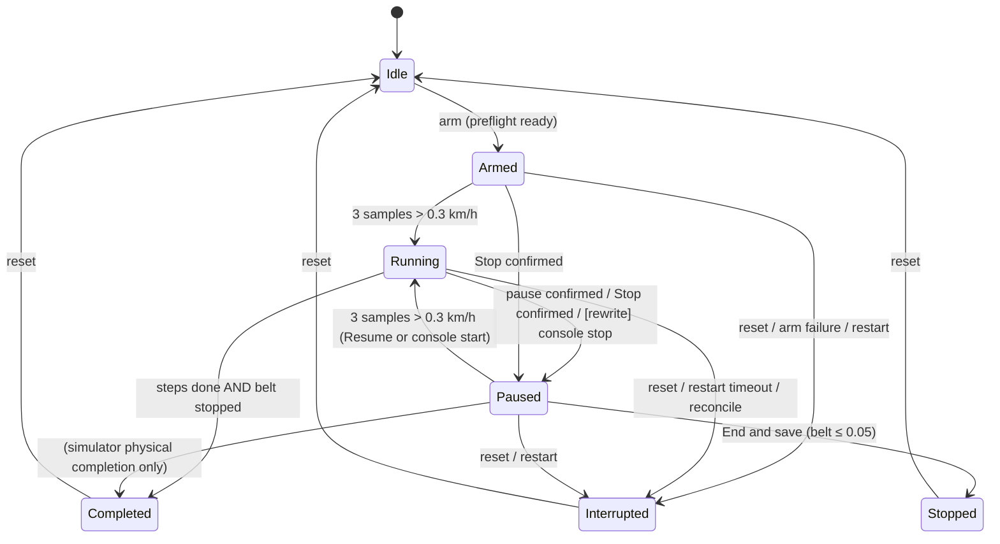

# 05 — Sessions and recording

A **session** (a run) is one execution of one immutable workout revision by one runner. This document specifies:
- the session lifecycle and state machine (§2–§4);
- 1 Hz recording (§5);
- the event log (§6);
- every derived metric, with exact formulas and constants (§7);
- crash and connection recovery (§8);
- origins and exclusions (§9);
- maintenance tracking (§10);
- the debrief and deletion (§11–§12);
- the legacy tests, translated to given/expected tables (§13);
- a checklist (§14).

**How to read the rules:**
- Rules marked **[current]** describe what the Windows app does today. They are the reference behaviour.
- Rules marked **[rewrite]** are owner decisions from the plan ([00](00-plan.md) §4.3, §5.5–5.7) that intentionally change the current behaviour.
- Where the two differ, implement **[rewrite]**. Keep the **[current]** rule for anything the plan doesn't override.
- The safety and command contract (FTMS confirmation, intents, who may command, lockout) is in [09](09-safety-and-command-contract.md). **[rewrite]** Lifecycle actions come only from the phone's native Run console; the web interface never sends session or treadmill commands, and there is no controller lease. The HR source and HR automation are in [06](06-profiles-and-heart-rate.md). Entity fields are in [01](01-data-model.md) §4.1–4.4.

---

## 1. Constants

| Name | Value | Used for |
|---|---|---|
| `PhysicalStartThresholdKph` | **0.3 km/h** (strictly greater counts as moving) | start/resume detection, the moving flag, moving time, calories |
| `RequiredPhysicalStartSamples` | **3** consecutive moving observations | start/resume detection |
| `FreshTelemetryLimit` | **5 s** | treadmill and HR freshness |
| Engine tick (`UpdateInterval`) | **250 ms** | motion integration, progression, automation |
| Sample cadence (`PersistenceInterval`) | **1 s** (phase-locked, §5.2) | samples and checkpoints |
| Stopped threshold | **≤ 0.05 km/h** | "belt is stopped" (end, reset, completion, device release) |
| Restart recovery window | **30 s** | movement must be confirmed after an app/gateway restart |
| Reconnect stability | **2** fresh samples on the same connection generation | reconnect reconciliation |
| Recovered banner hold | **5 s** | `Recovered` → `None` |
| Command intent lifetime | **4 s** from issue ([09](09-safety-and-command-contract.md)) | |
| Client wait for persistence | **5 s** | then reported as "still finishing" |
| Display projection | **240** points | history chart |
| Speed adherence tolerance | **0.3 km/h** | adherence |
| Incline adherence tolerance | **0.5 %** | adherence |
| Checkpoint JSON limit | **16 384** UTF-8 bytes | |
| Debrief note limit | **1 000** characters | |
| Maintenance defaults | **3 months / 241 km** | |

Algorithm identifiers:
- `estimated-calories/v1` (legacy) and `estimated-calories/acsm-speed-grade-v2` (all new sessions);
- `adherence/v1`;
- `local-progression-v1`.

---

## 2. States

| State | Persisted | Terminal | Meaning |
|---|---|---|---|
| `Idle` | never | – | No session |
| `ArmedWaitingForPhysicalStart` | yes | no | Bound to a runner and a workout revision. The belt has not moved yet |
| `Running` | yes | no | Movement confirmed. The clock and progression advance |
| `PausedWaitingForPhysicalResume` | yes | no | Stopped (belt stopped or pause confirmed). Progress is kept |
| `Completed` | yes | yes | Every workout step finished and the belt stopped |
| `Stopped` | yes | yes | The runner ended the session early ("End and save") |
| `Interrupted` | yes | yes | Ended by reset, restart without recovery, restore, a failed arm or reconciliation |
| `Faulted` | yes | yes | Reserved for an unrecoverable engine fault. **[current]** No code path enters it; the state and the `session-faulted` event exist for compatibility |

**[rewrite]** These UI sub-states are *not persisted*: `Starting`, `Pausing`, `Resuming`, `Finishing`. They represent a command in flight: `Pausing` shows while the pause Stop is unconfirmed, and so on ([09](09-safety-and-command-contract.md)).

**Session version.**
- Every session has a `version` (long, ≥ 1).
- It increments on **every** state transition, every manual speed override, and every configuration change: an incline override, an HR automation mode change, "resume planned controls" or a progress reset.
- Every client action carries `expectedSessionVersion`. A mismatch is rejected (409 "Expected session version X, but current version is Y") and nothing changes. A stale button press can never act on a newer state.

---

## 3. State machine

### 3.1 Transition table (pure state machine)

| # | From | Trigger | Guard | To | Side effects in the machine |
|---|---|---|---|---|---|
| T1 | Idle | `arm()` | – | Armed | version+1 |
| T2 | Armed | `observeTelemetry(speed)` | 3 consecutive observations with speed > 0.3 | Running | version+1; counter reset |
| T3 | Paused | `observeTelemetry(speed)` | 3 consecutive observations with speed > 0.3 | Running | version+1; counter reset |
| T4 | Running | `pauseWaitingForPhysicalResume()` | – | Paused | version+1 |
| T5 | Armed, Running, Paused | `stopWaitingForPhysicalResume()` (a confirmed Stop) | – | Paused | version+1 (idempotent state: Paused → Paused still increments the version) |
| T6 | Running, Paused | `complete()` | – | Completed | version+1 |
| T7 | Armed, Running, Paused | `stop()` | – | Stopped | version+1 |
| T8 | Armed, Running, Paused | `interrupt()` | – | Interrupted | version+1 |
| T9 | Armed, Running, Paused | `fault()` | – | Faulted | version+1 |
| T10 | Completed, Stopped, Interrupted, Faulted | `reset()` | – | Idle | version+1; clears in-memory events |
| T11 | Running, Paused | `recordManualSpeedOverride(expected, observed)` | both finite and ≥ 0 | (same) | version+1; appends a `manual-speed-override` event |
| T12 | Running, Paused | `markConfigurationChanged()` | – | (same) | version+1 |
| – | any other combination | – | – | **rejected** | Error "Session state X does not allow this transition." |

**Start detection (`observeTelemetry`):**
- Speed must be finite and ≥ 0; otherwise the call is an error.
- In any state other than Armed or Paused, the call only resets the consecutive-moving counter to 0.
- In Armed or Paused:
  - `counter = speed > 0.3 ? counter + 1 : 0`;
  - when `counter ≥ 3`, transition to Running.
- The counter resets on every transition.

**Restore** (after a restart): `restore(state, version)` accepts only Armed, Running or Paused with version ≥ 1. It sets the state and version without replaying transitions or events.

### 3.2 Diagram



---

## 4. Lifecycle operations (engine level)

All client actions need:
- a non-empty `operationId`: repeating a processed operation ID returns the current snapshot without re-applying;
- **[current]** the current controller lease (holder ID and lease ID). **[rewrite]** There is no lease: the action must come from the phone's native Run console, which carries the session's console authority ([09](09-safety-and-command-contract.md) §6.2, §6.8);
- `expectedSessionVersion`, unless noted otherwise.

Engine-owned automatic commands use a per-session **automation authority**:
- the authority ID is a random UUID per active run;
- the holder is `gateway-session:{sessionId:N}`.

[current] This kept automation working when a browser's controller lease expired.

### 4.1 Preflight
Preflight is computed for (profile, workout revision). It returns check items with status `Ready`, `NotRequired`, `Waiting` or `Blocked`. **Arm is allowed only when every check is `Ready` or `NotRequired`.**

| Check id | Ready when |
|---|---|
| `gateway` | The engine is up |
| `database` | The store is writable |
| `workout-targets` | The workout's targets fit the verified treadmill ranges and the profile's maximum speed (capability policy, [02](02-workouts.md)). The detail says "safer treadmill-increment alignment will be applied" when some targets were normalized. Blocked lists up to 3 rejected targets |
| `treadmill` | Hardware: the treadmill is `Ready` and the speed telemetry age is ≤ 5 s (otherwise `Waiting` with the fault or state). Simulator: always Ready |
| `heart-rate` | Only if the workout contains an HR-target step (`heartRate` or `heartRateZone` speed). Otherwise `NotRequired`. Ready when all hold:<br>• a selected source exists and is Ready;<br>• the bpm is 30–250;<br>• the quality is `Valid`;<br>• contact is not `NotDetected`;<br>• the age is ≤ 5 s. |
| `heart-rate-device-{id}` | One per assigned HR sensor, ordered: preferred first, then priority, then ID. Labelled "Preferred" or "Fallback n". `Ready` if connected, else `NotRequired` (informational) |

### 4.2 Arm
Guards, all rejected with a conflict:
- **[current]** The lease is current, both at the start and again at commit. **[rewrite]** The request comes from the phone's native UI; the web can choose a workout but never arms.
- Startup recovery is finished.
- No reset persistence is pending.
- No restore reconciliation is pending.
- No update or maintenance is activating.
- No other non-terminal session exists (in memory or in the database).
- Preflight is ready.
- The capability policy accepts the workout; the normalized definition is used.
- For `selectionSource=Program`: both the run and the item are given, and the item is the **next item** of the runner's active plan ([04](04-calendar-and-plans.md)).
- H10 memory option: see [10](10-polar-h10.md). Replacing an existing recording needs the exact confirmed exercise ID.

On success:
1. Create the session row:
   - `state=Armed`, `armedAt=now`;
   - origin `Hardware` (a real treadmill is enrolled) or `Simulator` (development, no treadmill);
   - `metricAlgorithmVersion=estimated-calories/acsm-speed-grade-v2`;
   - the snapshot `controllerConfiguration` ([01](01-data-model.md) §4.1): mode, HR controller mode, profile weight, maximum HR, maximum speed, zones, HR controller settings, HR source label/kind/family, and the treadmill snapshot with capabilities, connection generation, enrollment ID and identity fingerprint;
   - the workout title and profile name snapshots.
2. Hold the run's device connections: the treadmill, plus HR sensors if needed.
3. If the H10 memory opt-in is set, start and confirm the H10 exercise **before** publishing the armed session ([10](10-polar-h10.md)).
4. Publish the armed snapshot. The initial HR automation mode is `Shadow` if the workout needs HR, else `Disabled`.

**Arm failure cleanup:**
- If anything fails after the row was created, the row is interrupted with reason `Session arm failed during device or H10 preparation: {error}`.
- If admission is invalidated at commit, the reason is `Session arm was invalidated before it became the active in-memory session.`, and a prepared H10 recording is queued for discard cleanup.
- Device holds are released in both cases.

Arm is idempotent by operation receipt (`session.arm`): the same operation ID with the same request fingerprint returns the stored 201 outcome.

### 4.3 Start
- **Console start** (always available): while Armed, the runner starts the belt on the console. Three consecutive fresh telemetry readings > 0.3 km/h move the session to Running (T2).
- **Remote Start** (only when hardware-verified; [09](09-safety-and-command-contract.md)):
  - The FTMS Start command carries the treadmill's minimum start speed (observed 0.8 km/h).
  - It is allowed only in Armed or Paused.
  - Confirmation arrives through telemetry, by the same rule (T2/T3).
- On Armed → Running:
  - `startedAt = now` (the tick time of the transition);
  - the store's `markRunning(startedAt)` (requires state Armed and startedAt ≥ armedAt);
  - event `session-warning {code:"physical-movement-detected", message:"Physical movement detected"}`.
- On Paused → Running: event `session-resumed`.

### 4.4 The engine tick (every 250 ms)
For the active, non-frozen session:
1. **Apply telemetry** (hardware):
   - If the treadmill speed age is ≤ 5 s:
     - `measuredSpeed = telemetry.speed`;
     - `measuredIncline` is updated only if the incline age is ≤ 5 s;
     - `isMoving = speed > 0.3`;
     - `telemetryAge = speed age`;
     - feed `observeTelemetry(speed)`.
   - Otherwise, begin a telemetry gap (§8.2), set `isMoving=false`, and suspend automation.
   - HR is applied as in [06](06-profiles-and-heart-rate.md) §6.
2. **Restart deadline**: if recovered after a restart, the deadline has passed, the session is still in `RestartTracking`, and it is not moving, then interrupt it (§8.1).
3. **Integrate motion** (`updateMotion`), only while `Running` with `startedAt` set:
   - `delta = max(0, now − lastTick)`;
   - `elapsed += delta` — **[current] the elapsed clock advances in Running even when the belt is stopped** (see §4.5);
   - if `isMoving`: `distance += measuredSpeed × delta_hours` and `calories += calorieInterval(weight, measuredSpeed, measuredIncline, delta)` (§7.1).
4. **Progression** (Running only): advance the workout steps by elapsed time and distance ([02](02-workouts.md)).
   - Each step completion appends `workout-step-transition {completedStepIndex, currentStepIndex|null, cue}`.
   - When the step index changes, manual speed and incline overrides are cleared.
5. **Completion** (§4.7), or **sample capture** (§5) when not complete.
6. **Device release**: when the state is terminal, the belt is not moving and the speed is ≤ 0.05 (and no reset persistence is pending), release the run's device connections once. After release, the terminal snapshot is **frozen**: telemetry no longer changes it; only connection metadata refreshes ([current]: also lease metadata).
7. **Publish** the live snapshot.
8. **Build and run at most one automated command** (planned transition, HR automation, or completion Stop; §4.8 and [06](06-profiles-and-heart-rate.md) §7).

### 4.5 Pause (pause-as-stop)
**[current]:**
- **Stop confirmed** (FTMS Stop with telemetry confirmation, or the simulator Stop), with the session in Armed, Running or Paused:
  - integrate motion up to now;
  - `stopWaitingForPhysicalResume()` → Paused;
  - `isMoving=false`, `measuredSpeed = confirmed measured value (or 0)`;
  - suspend automation with the reason "The treadmill is stopped; press Start when you are ready to resume.";
  - append `session-paused {reason: TreadmillStopped}`;
  - save a recovery checkpoint.
- **Raw FTMS Pause**, only if the capability `canPauseRemotely` is verified (it is **false** on the Omega Z): allowed only in Running → Paused, with `session-paused {reason: WebControl}`; HR automation becomes `SuspendedSafety`.
- **A console stop while Running does NOT change the state**:
  - the session stays Running with `isMoving=false`;
  - elapsed time keeps counting;
  - distance and calories do not.
- After resuming, planned automation stays suspended until the runner re-enables HR automation or resets progress (both clear the suspension).

**[rewrite]** (plan §5.5):
- **Pause = FTMS Stop `08 01`.** The raw FTMS Pause `08 02` is never used.
- While the Stop is unconfirmed, the UI sub-state is `Pausing` and STOP stays visible.
- The session enters Paused **only after stopped telemetry**. If the Stop outcome is Unknown, the session stays Running-suspended with "Couldn't confirm" and no Resume.
- Kept: the workout cursor, the plan position (frozen), and all recorded data.
- **The elapsed clock does not advance while Paused**; the paused interval is not moving time.
- **A console stop while Running becomes Paused** (reason `PhysicalConsole`, progress kept).
- **A console start while Paused becomes Running** (T3), and the effective target is then re-applied.
- **Resume** is a single press that sends a fresh Start. On Running, the **effective target** is re-applied:
  - the in-segment override if one is set;
  - otherwise the ramp value at the frozen position;
  - the incline;
  - for HR segments, the last controller output capped by the segment target, with the dwell timers reset.
- Optional: after N minutes paused (a profile setting), prompt "End and save?". Never auto-start.

### 4.6 The stop sheet (Stop → choice)
**Stop is sent first.** Once Paused (a confirmed stop), the sheet offers:

| Choice | Guard | Effect |
|---|---|---|
| **Keep paused** | – | Client only; the session stays Paused |
| **Start from beginning** (reset progress) | Paused, not moving, measured speed ≤ 0.05, current version | 1. `previousStepIndex = cursor`, `previousWorkoutElapsed = progression.elapsedSinceRestart`.<br>2. `progression.restart(elapsed, distance)`: the cursor goes to step 0, **recorded time, distance and samples are kept**, and `workoutElapsed` restarts from 0.<br>3. Clear the speed and incline overrides and the "applied plan step" markers.<br>4. Reset the HR dwell.<br>5. HR automation desired and actual = `Disabled`, reason "Workout progress was reset. Press Start when you are ready; step-zero speed and incline will be reconciled after fresh motion."<br>6. **Un-suspend commands**, so the next Start plus fresh motion applies the step-0 targets.<br>7. `markConfigurationChanged()` (version+1).<br>8. Event `workout-progress-reset {previousStepIndex, previousWorkoutElapsed}`, and a checkpoint.<br>**Never starts motion.** |
| **End and save** | Paused, not moving, speed ≤ 0.05, current version | `endedAt = terminalTimestamp` (§5.3); summary (§7.9); `stop()` → **Stopped**; event `session-stopped`; finalize; stop the H10 recording; release devices. A Garmin upload may follow |
| **End, save and disconnect devices** | as End | End, then disconnect the runner's treadmill and HR sensors |
| **Discard session** | as End, plus a confirmation dialog ("Permanently discard this session? This deletes the run and all local samples. It cannot be undone.") | 1. End (as above; the session becomes Stopped).<br>2. Build a deletion preview.<br>3. **Queue the H10 discard cleanup first**.<br>4. Delete through the normal deletion path (§12), using the preview revision and fingerprint `{userProfileId, sessionId, revision, discardedFromStopDecision:true}` |
| **[rewrite] End: I confirm the belt is stopped** | Offered only when there has been **no treadmill telemetry for more than 30 s** | Writes the event `session-warning` with code `stop-unconfirmed-by-telemetry`, ends the session as **Stopped**, and sends no command |

STOP and the stop-sheet actions are never subject to the input lockout ([09](09-safety-and-command-contract.md)).

### 4.7 Natural completion
When the progression reports every step complete, the engine evaluates **WorkoutCompletionStopPolicy**:

```
evaluate(ctx):
  if not ctx.progressionComplete        -> Continue
  if not ctx.hardwareMode               -> Finalize                     (simulator completes immediately)
  speedValid = isFinite(ctx.measuredSpeed) and ctx.measuredSpeed >= 0
  if ctx.telemetryFresh and speedValid and not ctx.isMoving and ctx.measuredSpeed <= 0.05
                                        -> Finalize
  if ctx.stopAttempted                  -> AwaitPhysicalStop
  if ctx.telemetryFresh and speedValid and ctx.isMoving and ctx.measuredSpeed > 0.05
     and ctx.canStopRemotely and ctx.treadmillReady and ctx.connectionGenerationCurrent
                                        -> RequestStop
  else                                  -> AwaitPhysicalStop
```
Inputs:
- `telemetryFresh` = the telemetry age is ≤ 5 s;
- `treadmillReady` = the treadmill connection state is Ready;
- `connectionGenerationCurrent` = the device generation equals the session's generation;
- `stopAttempted` = set when the engine has issued its one completion Stop.

The engine's behaviour for each outcome:
- **Finalize**: `complete()` → Completed; event `session-completed`; finalize; stop the H10 recording.
- **RequestStop**:
  - Issue **one** engine-owned Stop (origin `WorkoutCompletion`) and set `stopAttempted=true`.
  - If it is confirmed with a measured speed ≤ 0.05 while Running and complete, finalize immediately.
  - If it is confirmed but the telemetry was not stopped, suspend with the warning "Workout completion did not receive stopped telemetry. Use the physical Stop control; the workout remains open."
- **Rejected** completion Stop: automation is suspended (`SuspendedSafety`), with the warning "The treadmill rejected the workout-completion Stop. Use the physical Stop control; this workout will remain open until stopped telemetry is confirmed."
- **Unknown** completion Stop: `SuspendedSafety`, with the warning "Workout completion could not confirm that the treadmill stopped. Use the physical Stop control; this workout will remain open until stopped telemetry is confirmed."
- **AwaitPhysicalStop**: add the warning once: "Workout steps are complete. The session will stay open until the treadmill confirms a physical stop; use the physical Stop control if needed."
- **No retries.** The session becomes Completed only after fresh stopped telemetry (≤ 0.05 km/h).
- **No samples are recorded once the progression is complete.**

### 4.8 Automated planned commands
Each tick, `buildAutomatedCommand` returns at most one command. The planned-transition part (HR automation is in [06](06-profiles-and-heart-rate.md) §7):
1. Return nothing unless the state is Running.
2. If the progression is complete (hardware): only the completion Stop (§4.7).
3. Return nothing if commands are suspended, or the telemetry age is > 5 s, or the device connection generation ≠ the session generation.
4. HR steps: see [06](06-profiles-and-heart-rate.md) §7.
5. **Speed.** Applies when:
   - `canSetSpeedRemotely` and a speed range is known;
   - no manual speed override is active;
   - and either the step speed is a ramp, or the plan for this step index has not been applied yet.

   Then:
   - `requested = clamp(requestedSpeed, range.min, min(profile.maxSpeed, range.max))`;
   - if `|requested − measuredSpeed| > max(0.15, range.increment/2)`, issue SetSpeed(requested) with origin `PlannedTransition`;
   - otherwise mark the plan as applied for this step index.
6. **Incline** follows the same rule with the incline range (no profile limit) and the incline override.
7. When a `PlannedTransition` SetSpeed or SetIncline is confirmed, mark it applied for the current step index.

Consequence:
- A console change during a **fixed** step is respected until the next step: the plan is not re-applied inside the same step.
- Ramps are re-evaluated continuously.
- `requestedSpeed = speedOverride ?? plannedSpeed ?? measuredSpeed`, and the same for the incline.

**Manual overrides.**
- Manual SetSpeed or SetIncline commands (hardware) go through the command contract. On confirmation:
  - the override is set to the accepted value;
  - an event is appended: `manual-speed-override {expectedSpeedKph: previous requested, observedSpeedKph: accepted}` or `manual-incline-override {previousInclinePercent, requestedInclinePercent}`;
  - a speed override **suspends HR automation** (`SuspendedManualOverride`) and resets the dwell.
- The simulator speed override applies `requested = round1(clamp(previousRequested + adjustment, 0, maxSpeed))` (half away from zero). The adjustment must be finite, non-zero and within ±30.
- The simulator incline override accepts a target of 0–15 %, rounded to 0.1.
- Overrides are cleared at the next step change.

### 4.9 Terminal persistence ordering
To avoid losing the telemetry tail, a terminal transition persists in this order:
1. **Flush** every accepted sample write for the session (§5.4). If the flush fails, the row **stays non-terminal**: startup recovery handles it later, rather than exporting an incoherent run.
2. Append the terminal event (`session-completed` or `session-stopped`). This is idempotent: an identical event (same instant, kind and details) is not duplicated.
3. `finalize(summary)` (§7.9). This is idempotent: an already-terminal row with a matching summary is a no-op, and a mismatch is an error.
4. Queue the H10 recording stop ([10](10-polar-h10.md)).

If the row was deleted meanwhile (discard), step 2 or 3 treats "not found" as success.

If persistence exceeds the 5 s client wait, the API reports "still finishing". A new arm waits for the previous terminal persistence to finish, and retries it if it failed.

**Interruption** uses the same flush. Reset and restart paths allow an incomplete tail. In that case the reason gets the suffix " Accepted telemetry was incomplete and the session was not eligible for automatic export."

### 4.10 Reset (engine)
Reset is used by the simulator, by restore and by maintenance:
1. A non-terminal session is interrupted with reason `Simulator reset.` (or the caller's reason).
2. The unfinished-session sweep also runs.
3. [current] The controller lease is revoked. (The rewrite has no lease.)
4. If an earlier terminal persistence failed, reset re-runs it as an interruption: "Terminal persistence failed; reset recovered the session as interrupted."

---

## 5. Recording

### 5.1 Sample fields (1 Hz)
Captured at each cadence tick **while Running and the progression is not complete**:

| Field | Value at capture |
|---|---|
| sequence | `nextSequence++`. Starts at 0; after a restart, continues at max(stored sequence) + 1 |
| capturedAt | the logical timestamp (§5.3) |
| elapsed | active elapsed time (§4.4) |
| plannedSpeedKph | progression planned speed: fixed = value; ramp = linear interpolation at the step progress fraction; HR step = the initial speed; open = null |
| requestedSpeedKph | `speedOverride ?? plannedSpeed ?? measuredSpeed` |
| measuredSpeedKph | the latest fresh treadmill speed (0 when stopped) |
| plannedInclinePercent | fixed = value; ramp = interpolated; null when there is no step |
| requestedInclinePercent | `inclineOverride ?? plannedIncline ?? measuredIncline` |
| measuredInclinePercent | the latest fresh incline (kept when the incline age is > 5 s) |
| heartRateBpm | the fresh selected HR (null if stale or invalid). **Persisted only if 30–250**, otherwise null |
| distanceKilometers | the cumulative integrated distance (§4.4) |
| estimatedKilocalories | the cumulative integrated calories (§7.1) |
| telemetryAge | the treadmill speed age at capture |
| metricAlgorithmVersion | the session's algorithm version |

Validation: sequence ≥ 0; UTC; elapsed ≥ 0; speeds finite and ≥ 0; inclines finite; HR is null or 1–250 (and 30–250 when persisted); distance and calories finite and ≥ 0; telemetry age ≥ 0; algorithm non-blank.

**Samples are never fabricated for gaps.** A BLE gap records an unobserved interval.

### 5.2 Cadence (`FixedIntervalCadence`, interval 1 s)
State: `lastEmission` (the phase-locked deadline), `lastActual`, `lastObserved`, all initialised to the arm time.
```
tryAdvance(now):
  if now < lastObserved: lastObserved = now; return false          // clock went backwards
  lastObserved = now
  if now - lastActual < interval or now - lastEmission < interval: return false
  n = round((now - lastEmission) / interval)                        // (ticks + interval/2) div interval
  lastEmission += n * interval
  lastActual = now
  return true
```
Properties:
- It is phase-locked: irregular 249/251 ms ticks for 4 h give exactly 14 400 samples.
- It never back-fills a burst after a stall.
- It never emits twice within one interval.
- A backward clock step never emits a timestamp before the last sample.

### 5.3 Timestamps
- **Logical sample timestamp**:
  - `logical = startedAt + elapsed` (or `armedAt` if not started);
  - if the observed time is later, use the observed time;
  - if that is ≤ the previous sample's `capturedAt`, use `previous + 1 tick` (100 ns).
  - `capturedAt` is therefore strictly increasing. It includes paused wall-clock time, while `elapsed` does not.
- **Terminal timestamp**: `max(logical(now), startedAt + elapsed)`, or `armedAt` if the session never started.

### 5.4 Persistence path
- Samples and the recovery checkpoint are written **together in one transaction**. The checkpoint represents the last sample of the batch.
- Samples captured in the same UTC second are coalesced into one batch (at most 32).
- The writer is asynchronous and never blocks the engine:
  - The queue is bounded at 256.
  - On overflow, one "latest write" slot per session (up to 256 sessions) keeps the newest write.
  - A displaced write faults that session's flush.
- **Write guards:**
  - The session must not be terminal.
  - The sample's algorithm version must equal the session's.
  - Within a batch, sequence, capturedAt and elapsed must increase.
  - Re-writing an existing `(session, sequence)` with identical values is a no-op; different values are an error ("Sample sequence N already exists with different telemetry.").
- **Staleness guard** (checked before opening and again before writing). A batch is written only if all hold:
  - it belongs to the active session;
  - the write's `sessionVersion ≤ activeVersion`;
  - its `connectionGeneration ≤ activeGeneration`;
  - its automation authority equals the active authority.

  Otherwise the batch is discarded and the flush reports failure.
- **Retries:**
  - A rejected batch is retried with a delay of `min(2000 ms, 100 ms × attempt)` until a 30 s budget is exhausted; then it fails.
  - I/O errors keep retrying past the budget: accepted telemetry is never dropped silently.
- **[rewrite]** The recorder writes on a background thread and never shares a transaction with web writes (plan §4.2).

### 5.5 Recovery checkpoint
The shape is in [01](01-data-model.md) §4.1 (fields: `sessionId`, `savedAtUtc`, `state`, `sessionVersion`, `startedAtUtc`, `progression{currentStepIndex, lastElapsed, lastDistanceKilometers, stepStartedAtElapsed, stepStartedAtDistanceKilometers, progressStartedAtElapsed}`, `distanceKilometers`, `measuredSpeedKph`, `measuredInclinePercent`, `speedOverrideKph`, `inclineOverridePercent`, `desiredHeartRateAutomationMode`, `connectionGeneration`).

- It is saved with every sample batch, and on stop-pause and progress reset.
- **Precedence rule**: a checkpoint replaces the stored one only if:
  - the stored JSON is null; or
  - `new.sessionVersion > stored.sessionVersion`; or
  - the versions are equal and `new.savedAt > stored.savedAt`.

  `checkpointUpdatedAt = max(stored, new.savedAt)`.
- It is never written to a terminal row.
- It is at most 16 384 bytes.

---

## 6. Events

Every event has `eventType` (the kind) and `occurredAt` (a UTC instant).

**Stored details JSON (legacy)** is the camelCase event object: its properties, then `eventType` and `occurredAt`. Enums are **ordinals** in legacy rows. The JSON export (see [07](07-exports-and-backup.md)) maps each kind to the same fields.

| Kind | Details fields | Emitted by the current app when | History message |
|---|---|---|---|
| `manual-speed-override` | `expectedSpeedKph` (the previous requested), `observedSpeedKph` (the new) | A confirmed manual speed change; a simulator override | – (shows previous → requested speed) |
| `manual-incline-override` | `previousInclinePercent`, `requestedInclinePercent` | A confirmed manual incline change | – |
| `workout-step-transition` | `completedStepIndex` (int), `currentStepIndex` (int or null when finished), `cue` (string or null: the new current step's cue) | Each step completion | – |
| `workout-progress-reset` | `previousStepIndex`, `previousWorkoutElapsed` (TimeSpan text `hh:mm:ss[.fffffff]` in stored details; **seconds** in the export as `previousWorkoutElapsedSeconds`) | Reset progress | "Workout progress reset from step {previousStepIndex+1} after {hh:mm:ss}." |
| `session-paused` | `reason` (SessionPauseReason: 0 WebControl, 1 PhysicalConsole, 2 TreadmillStopped) | Stop confirmed → TreadmillStopped; raw Pause → WebControl. **[rewrite]** A console stop → PhysicalConsole | – |
| `session-resumed` | – | Paused → Running | – |
| `device-disconnected` | `deviceRole` (0 Treadmill, 1 HeartRate), `reason` (string or null) | The start of a treadmill telemetry gap (reason: the device fault, "Treadmill telemetry became stale.", or "The treadmill connection generation changed.") | the reason |
| `device-reconnected` | `deviceRole` | Treadmill reconnect reconciliation (§8.2) | – |
| `session-warning` | `code`, `message` | `physical-movement-detected` ("Physical movement detected") at start; `heart-rate-source-changed` ("Heart-rate source changed to {name or 'no fresh sensor'}.") when the HR source generation changes with automation needed; **[rewrite]** `stop-unconfirmed-by-telemetry` | the message |
| `control-lease` | `kind` (0 Acquired … 4 Reclaimed), `leaseId`, `holderId` | Defined; **not emitted** by the current app. **[rewrite]** Never emitted (there is no lease); kept only so imported runs round-trip | – |
| `session-completed` | – | Completed | – |
| `session-stopped` | – | End and save | – |
| `session-interrupted` | `reason` | Every interruption path (the reasons are listed in §8) | the reason |
| `session-faulted` | `code`, `message` | Defined; not emitted | the message |

Example stored details (from `data/exports/fixture-metrics.txt` and `legacy-rows.txt`):
```
workout-progress-reset  {"previousStepIndex":2,"previousWorkoutElapsed":"00:01:35.5000000","eventType":"workout-progress-reset","occurredAt":"2026-09-01T06:30:05+00:00"}
session-paused          {"reason":2,"eventType":"session-paused","occurredAt":"2026-09-01T06:30:05+00:00"}
control-lease           {"kind":0,"leaseId":"5e6f7081-92a3-4b45-8d6e-7f8091021324","holderId":"phone","eventType":"control-lease","occurredAt":"2026-09-01T06:30:05+00:00"}
```

**Event counts** (for analytics): `manualSpeedOverrides`, `manualInclineOverrides`, `pauses` (session-paused), `disconnects` (device-disconnected) and `warnings` (session-warning).

**Timer history** (FIT and elapsed-versus-timer) uses only `session-paused` and `session-resumed` ([07](07-exports-and-backup.md) §5).

---

## 7. Metrics and algorithms

### 7.1 Calories (ACSM speed-and-grade, `estimated-calories/acsm-speed-grade-v2`)
For one interval with duration `Δt`, speed `v` (km/h), grade `g` (%) and weight `W` (kg):
```
if v <= 0.3 or Δt == 0: return 0
s = v × 1000 / 60                                   # m/min
G = g / 100
walking = 3.5 + 0.1 × s + 1.8 × s × G               # mL O2 / kg / min
running = 3.5 + 0.2 × s + 0.9 × s × G
VO2 = walking                      if v <= 6
      running                      if v >= 8
      walking + (running − walking) × (v − 6) / 2   otherwise (linear blend 6–8 km/h)
VO2 = max(3.5, VO2)                                  # declines never go below resting
kcal/min = VO2 × W / 1000 × 5
kcal     = kcal/min × Δt_minutes
```
- Errors: `W ≤ 0` or non-finite; `v < 0` or non-finite; a non-finite grade; `Δt < 0`.
- **Live integration:** every tick while moving, `calories += interval(W, measuredSpeed, measuredIncline, delta)`.
- **Cumulative over stored samples:** `cum[0]=0`, `cum[i] = cum[i-1] + interval(W, sample[i].measuredSpeed, sample[i].measuredIncline, elapsed[i] − elapsed[i-1])`. The current sample's speed and grade apply to the preceding interval. Decreasing elapsed time is an error.
- **Weight:** always the session's snapshot `controllerConfiguration.Profile.WeightKilograms` (keys matched case-insensitively). If it is missing or not > 0, there is no recalculation.

**Stored-total rules:**
- **v2 sessions:** the stored total at finalization is `max(summary accumulator, last sample's cumulative)`. On interruption it is `max(stored, last sample's cumulative)`.
- **v1 (legacy) sessions:** the total is recalculated from the samples with the snapshot weight if available, otherwise the accumulator is kept. History lists recalculate v1 totals on read; export rules are in [07](07-exports-and-backup.md).

**Golden values** (from the current implementation):

| W kg | v km/h | g % | duration | kcal |
|---|---|---|---|---|
| 70 | 6 | 0 | 60 min | 283.5 |
| 70 | 6 | 10 | 60 min | 661.5 |
| 70 | 7 | 0 | 60 min | 441 (blend) |
| 70 | 7 | 5 | 60 min | 606.375 |
| 70 | 8 | 0 | 60 min | 633.5 |
| 80 | 10 | 1 | 30 min | 460 |
| 70 | 3 | −10 | 60 min | 73.5 (clamped to 3.5) |
| 70 | 0.3 | 0 | 60 min | 0 (not moving) |
| 70 | 0.31 | 0 | 60 min | 84.35 |
| 70 | 0 | 10 | 30 min | 0 |
| 72.5 | 5 | 1 | 1 s | 0.080556 (rounded to 6 dp) |
| 70 | 6 | 0 | 10 min (a two-sample v1 history) | 47.25 |

### 7.2 Distance
- Live: `distance += measuredSpeed × Δt_hours`, only while moving and Running.
- Stored per sample (cumulative). The summary distance is the live accumulator at the terminal point.
- On interruption: `max(stored, last sample's distance)`.

### 7.3 Elevation (treadmill belt distance along the slope)
For consecutive samples `i-1 → i`:
```
d = (dist[i] − dist[i-1]) × 1000                   # metres of belt
if d > 0:
  G = measuredIncline[i] / 100
  vertical = d × G / sqrt(1 + G²)                  # sin(atan(G)) × belt distance
  elevation += vertical
  if vertical >= 0: ascent += vertical else descent += −vertical
point[i] = elevation                                # point[0] = 0
```
- The inputs must have increasing sequence and non-decreasing elapsed time.
- Outputs: `totalAscentMeters`, `totalDescentMeters`, `netElevationMeters`, and a per-sample elevation trace (used by the FIT altitude, [07](07-exports-and-backup.md)).
- Golden: 100 m at +10 % then 50 m at −5 % → ascent **9.9504**, descent **2.4969**, net **7.4535**.

### 7.4 Sample statistics
Over the samples, which must be ordered by sequence, capturedAt and elapsed; otherwise it is an error:

| Output | Definition |
|---|---|
| averageHeartRateBpm | **Time-weighted:** Σ(hr[i] × (e[i] − e[i-1])) / Σ(e[i] − e[i-1]) over i ≥ 1 where hr[i] is present and the interval > 0. If the total weight is 0, the arithmetic mean of all present HR values; null if there are none |
| minimum/maximumHeartRateBpm | Over all present HR values |
| movingTime | Σ(e[i] − e[i-1]) where measuredSpeed[i] > 0.3; **null if fewer than 2 samples** |
| maximumSpeedKph | The maximum measured speed; null if there are no samples |
| averageInclinePercent | Time-weighted like HR, over measured incline, with the arithmetic-mean fallback |
| averagePositiveInclinePercent | Σ(grade × d) / Σd over intervals with d > 0, Δt > 0 and grade > 0 (null if none); d in metres |
| averageNegativeInclinePercent | The same over grade < 0 |
| minimum/maximumInclinePercent | Over all measured inclines |
| averagePositiveVerticalSpeed (m/s) | Σ vertical / Σ Δt over grade > 0 intervals (vertical as in §7.3) |
| averageNegativeVerticalSpeed | The same over grade < 0 (negative) |
| maximumPositiveVerticalSpeed / maximumNegativeVerticalSpeed | Max of `vertical / Δt` for grade > 0 / min for grade < 0 |
| totalAscent/Descent/NetElevation | §7.3 |
| estimatedKilocalories | Recalculated (§7.1) when the weight is known, else the last sample's cumulative value |

Golden (samples: t=0 s 0 km/h 0 % HR 100; t=1 s 4 km/h 1 % HR 120; t=4 s 8 km/h 3 % HR 150; t=6 s 0 km/h −2 % HR null):
- average HR = (120×1 + 150×3)/4 = **142.5**; min 100; max 150;
- moving time **4 s**; max speed 8;
- average incline = (1×1 + 3×3 + (−2)×2)/6 = **1**; min −2; max 3.

A single sample (5 km/h, 2 %, HR 137) gives: average HR 137, min and max 137, **moving time null**, average incline 2.

### 7.5 Heart-rate zone durations
- Use the session's **snapshot zones** (not the current profile).
- For each i ≥ 1 with hr[i] present, find the zone with `min ≤ hr[i] ≤ max` (at most one, since zones do not overlap). Add `e[i] − e[i-1]` to that zone.
- Samples outside every zone add nothing.
- Output one entry per snapshot zone, ordered by number: `{zoneNumber, name, duration}`.

### 7.6 Adherence (`adherence/v1`)
- A sample is **eligible** if it has a planned speed or a planned incline.
- It is **adherent** if both hold:
  - the planned speed is absent, or `|measuredSpeed − plannedSpeed| ≤ 0.3`;
  - the planned incline is absent, or `|measuredIncline − plannedIncline| ≤ 0.5`.
- `adherence% = eligible == 0 ? 100 : adherent / eligible × 100`.

Golden: planned 8 / 1 % for 3 samples with measured (8, 1), (8.2, 1.1), (9, 2) → adherent 2 of 3 = **66.67 %**.

### 7.7 Weekly totals (history header)
- The week is Monday 00:00 to next Monday 00:00 in **Europe/Brussels**, converted to UTC, half-open `[from, through)`.
- Include summaries with status **Completed** and `startedAt` in the window (Stopped is excluded).
- Output: `completedSessionCount`, `duration` (the sum of active duration), `distanceKilometers` (the sum).
- The source list is the latest 500 summaries of the profile; SystemTest is excluded.

Golden: week from 2026-07-27T00:00Z:
- Completed 30 min / 5 km on day 0 (counted);
- Stopped 10 min / 1 km on day 1 (not counted);
- Completed on day 7 (outside the window);

→ count 1, 30 min, 5 km.

### 7.8 Trends, comparisons and progression inputs
- **Trends** (`LocalTrendCalculator`), per profile:
  - Include facts with completion `Completed` and origin not Simulator and not SystemTest.
  - Outputs:
    - `completedSessions`;
    - `duration` (sum);
    - `distanceKilometers` (sum);
    - `incompleteTelemetrySessions` (count of `telemetryComplete=false`);
    - `longestDistanceKilometers`;
    - `longestDuration`;
    - `highestAverageHeartRateBpm` (null if none).
  - Negative or non-finite values are an error.
  - Windows: all (≤ 500 latest), the last 7 days and the last 30 days, by `endedAt ≥ now − 7d/30d`.
  - Fact mapping from summaries:
    - origin: Hardware → Hardware, Simulator → Simulator, SystemTest → SystemTest, **Legacy → Imported** (included);
    - completion: Completed → Completed, Interrupted or Faulted → Interrupted, **Stopped → Completed**;
    - average HR rounded to an integer;
    - `telemetryComplete = duration == 0 or averageSpeed > 0 or distance > 0`.
- **Comparison** for a session:
  - Take other **Completed** sessions of the same profile with **the exact same workout revision ID** (excluding SystemTest), newest `endedAt` first, at most 5.
  - Return `comparisonCount` and `previous` (the most recent), with the explanation "Compared with the most recent completed execution of the exact same immutable workout revision; missing telemetry is not estimated." (or "No earlier completed execution of this immutable workout revision is available.").
- **Progression evidence** for the adviser ([04](04-calendar-and-plans.md)):
  - `adherence` from §7.6;
  - `heartRateCoverage = samples with HR / samples × 100`;
  - `telemetryComplete = samples > 1 and no device-disconnected event`;
  - `wasInterrupted = state ∈ {Interrupted, Faulted}`;
  - RPE from the debrief.

### 7.9 Summary at finalization
The engine's summary:
- `startedAt` (or `armedAt`);
- `endedAt` (§5.3);
- `duration = elapsed` (0 if never started);
- `distance`, `calories` (the accumulators);
- `averageSpeed = duration > 0 ? distance / duration_hours : 0`;
- average/max HR placeholder = the current HR; average incline placeholder = the current incline.

`finalize` then stores:
- state, startedAt, endedAt, duration, distance, averageSpeed from the summary;
- **averageHeartRate, maximumHeartRate and averageIncline from the sample statistics (§7.4) over the normalized samples (§7.11)**, falling back to the summary values when there are no samples;
- calories per §7.1.

**Validation:**
- The status is terminal.
- endedAt ≥ startedAt.
- duration ≤ endedAt − startedAt.
- average HR ≤ max HR.
- Values are finite and non-negative (incline may be negative).
- The profile and revision match the row.

**Program runs:** if Completed with a program item and the run is Active, then once the distinct completed items equal the item count, the run becomes `Completed` (`endedAt` = the session end, `version + 1`).

Fixture (`data/exports/fixture-metrics.txt`, 15 samples with a 4 s pause):
- duration 14 s; distance 0.02675 km; calories 2.052846;
- average HR 132.6153846153846; max HR 156;
- average speed 6.878571428571429; average incline 1.6071428571428572;
- moving time 14 s; ascent 0.463485 m;
- zone times Z1 1 s, Z2 5 s, Z3 5 s, Z4 2 s, Z5 0 s;
- adherence 60 %;
- counts: 1 speed override, 1 incline override, 1 pause, 1 disconnect, 1 warning.

### 7.10 History display projection (240 points)
When a session has more than 240 samples, the history view receives exactly 240 representative samples. Exports and analytics always use all samples.
```
if n <= 240: all samples
else: for slot in 0..239: index = floor(slot × (n − 1) / 239)       # first and last always included
```
An equivalent SQL formulation, used by the legacy store:
```
keep row i (0-based) iff ceil(i × 239 / (n − 1)) < ceil((i + 1) × 239 / (n − 1))
```
Both select the same indices for every n in 241–29 999.

Golden:
- n = 241 → 0…8, 9, …, 235, 236, 237, 238, 240 (index 239 is skipped);
- n = 300 → first ten 0, 1, 2, 3, 5, 6, 7, 8, 10, 11; last five 293, 295, 296, 297, 299;
- n = 12 788 → 0, 53, 107, 160, 214, … 12 733, 12 787.

A 1-sample session returns that sample.

The chart renderer reduces further to at most 720 points: `stride = ceil(n / 719)`; keep indices where `i % stride == 0`, plus the last point.

### 7.11 Timeline normalization (for imported or corrupt data)
Before interruption summaries, finalization statistics and FIT export, samples are normalized:
1. Sort by (sequence, capturedAt).
2. Greedily keep a candidate if it *follows* the previous kept sample: sequence greater, capturedAt ≥, elapsed ≥.
3. Skip an isolated forward outlier: if the candidate leaps past the next sample (next.capturedAt < candidate.capturedAt or next.elapsed < candidate.elapsed), and the next sample follows the previous kept one, drop the candidate.

Golden: samples (seq 0, t 0), (seq 1, t +1 h, elapsed 1 h), (seq 2, t 2 s, elapsed 2 s) → keeps seq 0 and 2.

---

## 8. Recovery

### 8.1 Startup (process restart) recovery
The engine accepts no arm or reset until startup recovery is complete.
1. **Reconcile active sessions**:
   - If more than one row is non-terminal, keep the newest (`armedAt` DESC, then ID DESC).
   - Interrupt the rest at `now`, with reason "A newer active session was found during gateway reconciliation." and the §8.4 summary.
2. **Find the recoverable session**: the newest (checkpoint time DESC) row with `State = Running`, `Origin = Hardware` and a checkpoint.
   - If none: interrupt **every** unfinished row with reason "Gateway restarted without a complete recovery checkpoint." Done.
3. **Restore** it:
   - Load the workout and the configuration snapshot. The workout must still exist; imported runs are never recoverable.
   - Hold the device connections.
   - **The treadmill identity must match**: the snapshot `identityFingerprint` (64 hex) equals the currently enrolled treadmill's fingerprint. Otherwise interrupt all unfinished rows ("Gateway restart recovery could not confirm the same enrolled treadmill."), release the devices, and finish.
   - Rebuild the in-memory run from the checkpoint:
     - progression restore;
     - `version = checkpoint.sessionVersion`;
     - elapsed, distance, measured speed and incline, and overrides;
     - `nextSequence = max stored sequence + 1`;
     - calories recalculated from the normalized stored samples with the snapshot weight.
   - Then set:
     - `commandsSuspended=true`, reason "The gateway restarted; confirm fresh treadmill movement before resuming planned controls.";
     - connection phase `Reconnecting`; recovery state `RestartTracking`;
     - `restartDeadline = now + 30 s`;
     - HR automation `SuspendedSafety` if HR is needed (the desired mode is kept);
     - the warning "Gateway restarted; tracking recovery never issues Start and planned controls remain paused."
4. **Restart deadline**: at a tick after the deadline, if still `RestartTracking` and not moving, interrupt the session with reason "Fresh movement from the enrolled treadmill was not confirmed after gateway restart." (an incomplete tail is allowed).
5. **Errors:**
   - Invalid recovery data: interrupt all unfinished rows ("Gateway restart recovery data was invalid or unavailable.").
   - Schema not ready: retry with backoff `min(30 s, 2^(attempt−1) s)`, with the attempt capped at 8.

**Recovery never issues Start.** Planned controls need one explicit "Resume planned controls" (§8.2), even when movement is confirmed.

**[rewrite]** (plan §4.3):
- Running: movement must be confirmed within **30 s**, otherwise `Interrupted` (as above).
- **Paused with stopped telemetry: recovers as Paused**, progress kept; the 30 s movement rule does not apply. The recovery query must therefore also accept `PausedWaitingForPhysicalResume` checkpoints.
- After a **reboot**, the run service does not auto-start. An unfinished Running session is marked `Interrupted`, with its data kept.

### 8.2 Treadmill telemetry gap and reconnection
- **Gap start**: fires when there is no fresh speed (age > 5 s), or when the connection generation changes while fresh telemetry is present.
  - Record `gapStartedAt`, `preGapSpeed` and `preGapIncline`.
  - Reset the stability counters.
  - Phase `Reconnecting`; state `TelemetryGap` (or `RestartTracking` after a restart).
  - `canResumePlannedControls=false`.
  - Event `device-disconnected {deviceRole: Treadmill, reason}`.
  - Warning "Treadmill telemetry is stale; session automation is suspended." Automation is suspended if Running.
- **Stability**: fresh telemetry on a connection generation counts `stable++` when the generation equals the candidate generation, else `candidate = generation, stable = 1`. The state is `Reconciling`.
- **Reconnect** when `stable ≥ 2`: evaluate **RecoveryReconciliationPolicy** with the current speed and incline, the pre-gap values, the speed increment (range increment or 0.1) and the incline increment (range increment or 0.5), and the last command disposition:
  ```
  if not sameEnrolledTreadmill                 -> Blocked "The enrolled treadmill identity does not match the active session."
  if not freshStableTelemetry                  -> Blocked "Fresh stable treadmill telemetry is required before recovery."
  if lastCommand == Unknown                    -> Blocked "An unknown command outcome blocks automatic recovery."
  if state != Running                          -> Blocked "Only a running session can reconcile planned controls."
  if any input not finite                      -> Blocked "Finite treadmill telemetry and operating increments are required before recovery."
  if measuredSpeed <= 0.3                      -> Blocked "The belt is not moving; recovery will never issue Start."
  speedTol   = max(0.01, speedIncrement) + 0.01
  inclineTol = max(0.01, inclineIncrement) + 0.01
  if |speed − preGapSpeed| > speedTol or |incline − preGapIncline| > inclineTol
                                               -> RequireExplicitResume, possibleConsoleIntervention = true
  if recoveredAfterRestart                     -> RequireExplicitResume
  else                                         -> ResumeAutomatically
  ```
  Then:
  - Set the session generation to the device generation, clear the gap, set `lastReconciledAt=now`, and append `device-reconnected {Treadmill}`.
  - **ResumeAutomatically**: un-suspend; phase and state `Recovered`; restore the desired HR mode; remove the stale warning. After **5 s**, the state returns to `None` and the phase to `Ready`.
  - **Otherwise**: suspend with the reason; phase `NeedsAttention`; state `AwaitingResume` (or `RestartTracking`); `canResumePlannedControls = (action == RequireExplicitResume)`.
- **Resume planned controls** (an explicit action). Guards:
  - Running, moving, fresh (≤ 5 s);
  - no Unknown last command;
  - the client's `connectionGeneration` equals the current one;
  - a tap on the phone's Run console and a version match.

  Effect:
  - un-suspend; state `Recovered`;
  - clear the restart tracking;
  - restore the desired HR mode;
  - reason "Planned controls resumed after fresh treadmill telemetry was confirmed.";
  - version+1.

**BLE loss never stops anything.** The safety key, the console and the physical Stop are authoritative.

### 8.3 Telemetry-write acceptance across reconnects
A queued sample write captured under version `v`, generation `g` and authority `a` is accepted if and only if all hold:
- the session matches;
- `v ≤ activeVersion`;
- `g ≤ activeGeneration`;
- `a == activeAuthority`.

So a sample from the immediately preceding connection still belongs to the session, but a "future" write, or one from another authority epoch, is rejected.

### 8.4 Interruption summary
Applied to a row being interrupted, over its normalized samples (§7.11):
- `endedAt = max(requested, startedAt + max(storedDuration, lastSample.elapsed), lastSample.capturedAt)`. Without a start, the floor is `armedAt`.
- `duration = max(stored, lastSample.elapsed)`; `distance = max(stored, lastSample.distance)`.
- Calories: v2 → `max(stored, lastSample.cumulative)`; v1 → recalculated with the snapshot weight, or kept.
- Average HR, max HR and average incline come from the statistics when available.
- `averageSpeed = duration > 0 ? distance / duration_h : stored`.
- Append `session-interrupted {reason}`.
- `interrupt(sessionId)` is idempotent: it returns false if the row is already terminal.

Golden (from the legacy tests):
- A running session with samples at +0 s (6 km/h, HR 120) and +10 s (elapsed 10, HR 125), interrupted at `now`, gives:
  - Interrupted; `endedAt = now`; duration 10 s;
  - distance > 0; calories > 0; max HR 125; average incline 1;
  - one interrupted event with the reason.
- A malformed legacy sample (seq 1 captured *before* seq 0) is skipped by normalization: max HR 120.

---

## 9. Origins and exclusions

| Origin | Created by | History list | Weekly totals | Trends | Maintenance distance | Plan advancement | Garmin | Restart recovery |
|---|---|---|---|---|---|---|---|---|
| `Hardware` | A real treadmill | yes | yes | yes | **yes** | yes | eligible | **yes** |
| `Simulator` | Development simulator | yes | **[current] yes**; **[rewrite] no** | no | no | [current] yes; **[rewrite] no** | **[rewrite] no** | no |
| `SystemTest` | Garmin upload verification | **hidden** (unless `includeTests`) | no | no | no | no | never auto-queued; only its own explicit test upload ([11](11-garmin.md) §17) | no |
| `Legacy` | Rows older than the origin column | yes | yes | yes (as Imported) | no | yes | no | no |

**[rewrite]** (plan §5.6): Simulator and SystemTest sessions are excluded from totals, progression, maintenance, plan advancement and Garmin. Imported runs (`imported=true`) are excluded from Garmin upload.

The history list shows terminal sessions with both `startedAt` and `endedAt`, excluding SystemTest by default. It is ordered by `endedAt` DESC, `take` 1–5000 (default 50).

---

## 10. Treadmill maintenance tracking
- **Policy:** one per active treadmill, created at enrollment with **3 months / 241 km**. Editable within 1–24 months and 1–5000 km. The version check applies; an edit is idempotent by operation receipt.
- **App-tracked distance** = the sum of `distanceKilometers` over sessions with origin **Hardware** in a terminal state (Completed, Stopped, Interrupted, Faulted), across **all profiles**. Console-only use is invisible; the UI notice says: "Only hardware sessions recorded by TreadmillRunner count toward this distance. Console-only use is not visible to the app."
- **Record maintenance** (a baseline event):
  - `performedAt` is UTC, within the last 10 years and at most now + 5 min;
  - the note is ≤ 500 characters (trimmed; blank becomes null);
  - `appDistanceBaselineKilometers = the tracked distance now`;
  - policy version + 1;
  - idempotent by operation ID.
- **State**, computed on read with `last` = the event with the latest `performedAt` (ties broken by `createdAt`):
  ```
  if no event: SetupRequired
  nextDate     = last.performedAt + intervalMonths (calendar months)
  nextDistance = last.baseline + distanceIntervalKm
  dueDate      = now >= nextDate
  dueDistance  = trackedDistance >= nextDistance
  state = dueDate && dueDistance ? DueByDateAndDistance : dueDate ? DueByDate : dueDistance ? DueByDistance : Current
  isDue = dueDate || dueDistance
  remainingKm = max(0, nextDistance − trackedDistance)
  ```
- **Deleting a Hardware session** with distance > 0: every maintenance event with `createdAt ≥ (session.endedAt ?? armedAt)` gets `baseline = max(0, baseline − session.distance)`, so later baselines stay consistent.

Golden (legacy test):
- Policy 3 months / 10 km. Sessions: Hardware Completed 4 km, Hardware Stopped 3 km, Simulator 100, SystemTest 100, Hardware Running 100.
- Tracked distance = **7** → `SetupRequired`.
- Record at now − 2 months → `Current`. At now + 2 months → `DueByDate`.
- Change the policy to 6 months / 20 km → `Current`.
- Add a Hardware Completed 21 km session → `DueByDistance` (7 + 21 = 28 ≥ 7 + 20), `isDue`.

---

## 11. Debrief
- It can be saved only for a **terminal** session, and edited any time after.
- `perceivedExertion` is null or 1–10 (RPE).
- `note`: null or blank becomes null; otherwise trimmed; ≤ 1000 characters.
- `updatedAt` is UTC. It must be the caller's (runner's) session.
- Golden: RPE 7, note `"  Felt controlled.  "` → stored `"Felt controlled."`. RPE 11 → rejected. A 1001-character note → rejected.

---

## 12. Deletion
- **Preview** (for the owner's profile) returns:
  - `sampleCount`, `eventCount`, `distanceKilometers`;
  - `maintenanceDistanceImpactKilometers` (= the distance if Hardware, else 0);
  - `isProgramLinked`;
  - the Garmin status;
  - `canDelete`, `reason`;
  - `garminRemoteActivityMayRemain`;
  - a **revision**: the lower-case hex SHA-256 of `id|profileId|state|origin|programRunId|programItemId|sampleCount|eventCount|distance(R format)|garminJobId|garminStatus|garminPhase|garminUpdatedAt(ISO "O")`.
- **canDelete** = terminal with both `startedAt` and `endedAt`, **and** the Garmin job is settled:
  - no job, or status ∈ {Confirmed, FoundInGarmin, Dismissed, Failed, ReviewRequired}, or (`Pending` with phase `WatchSearch`);
  - `Pending`/Upload, `InFlight` and `Unknown` block deletion.
- **Reasons (verbatim):**
  - "Only a terminal session can be permanently deleted."
  - "Wait for the Garmin upload to finish, or acknowledge its unknown outcome, before deleting it."
  - "This local session can be deleted. Its pending read-only Garmin watch search will be canceled; no remote activity is deleted."
  - "This local session and its settled Garmin upload record can be deleted. The remote Garmin activity is not deleted."
  - "This session can be permanently deleted. Its training-plan progress will be recalculated from the remaining history."
  - "This session can be permanently deleted."
- **Delete:**
  - It requires `confirmed=true`, the operation ID, the profile, and `expectedRevision` (64 characters).
  - It runs in a serializable transaction.
  - If the revision changed, reject: "The session or its Garmin upload state changed after the deletion preview. Review it again." (409).
  - If `canDelete` is false, reject with the reason.
  - Otherwise: adjust the maintenance baselines (§10), delete the session (cascading to samples, events, Garmin job and recommendations; the H10 link is set to null), and store a receipt `history.delete`.
  - The H10 discard cleanup is queued **before** the delete.
  - The result: `{sessionId, deleted:true, deletedSampleCount, deletedEventCount, deletedGarminStatus, removedMaintenanceDistanceKilometers, garminRemoteActivityMayRemain, deletedAtUtc}`.
  - A replay with the same operation and fingerprint returns the stored result. A different fingerprint is a conflict.
- Plan progress is derived, so it is recalculated from the remaining history.

---

## 13. Legacy tests as given/expected tables

### 13.1 State machine
| # | Given | When | Then |
|---|---|---|---|
| SM-1 | `restore(Running, 7)` | – | state Running, version 7, no events |
| SM-2 | Armed | observe 0.31, 0.30, 0.50, 0.60 | still Armed (the 0.30 resets the counter) |
| SM-3 | SM-2 | observe 0.70 | Running |
| SM-4 | Running (3 × 0.4) | pause, then observe 0.4, 0.5 | Paused |
| SM-5 | SM-4 | observe 0.6 | Running |
| SM-6 | Running | stopWaitingForPhysicalResume twice | Paused both times |
| SM-7 | Running at t, version v | recordManualSpeedOverride(6.0, 7.2) | one event {expected 6.0, observed 7.2, at t}; version v+1 |
| SM-8 | Running | complete / stop / interrupt / fault | Completed / Stopped / Interrupted / Faulted |
| SM-9 | Idle | complete() | rejected (invalid transition) |
| SM-10 | restore(Completed, …) or version 0 | – | rejected |

### 13.2 Completion stop policy (hardware base context: complete, hardware, fresh, moving, 4.5 km/h, canStop, ready, generation current, not attempted)
| # | Change | Expected |
|---|---|---|
| CS-1 | base | RequestStop |
| CS-2 | stopAttempted = true | AwaitPhysicalStop |
| CS-3 | telemetryFresh = false | AwaitPhysicalStop |
| CS-4 | canStopRemotely = false | AwaitPhysicalStop |
| CS-5 | treadmillReady = false | AwaitPhysicalStop |
| CS-6 | generationCurrent = false | AwaitPhysicalStop |
| CS-7 | moving false, speed 0, stopAttempted true | Finalize |
| CS-8 | moving false, speed −∞, attempted | AwaitPhysicalStop |
| CS-9 | moving false, speed −0.1, attempted | AwaitPhysicalStop |
| CS-10 | speed +∞ | AwaitPhysicalStop |
| CS-11 | hardwareMode false, fresh false, canStop false, ready false | Finalize |
| CS-12 | progressionComplete false | Continue |

### 13.3 Recovery reconciliation (base: Running, same treadmill, fresh stable, not restart, speed 6 / incline 1, pre-gap 6 / 1, increments 0.1 / 0.5, last Confirmed)
| # | Change | Expected |
|---|---|---|
| RR-1 | base | ResumeAutomatically |
| RR-2 | sameEnrolledTreadmill false | Blocked |
| RR-3 | freshStableTelemetry false | Blocked |
| RR-4 | last command Unknown | Blocked |
| RR-5 | measured speed 0 | Blocked, reason contains "never issue Start" |
| RR-6 | measured speed NaN | Blocked, reason contains "Finite treadmill telemetry" |
| RR-7 | measured speed 6.3 (tolerance 0.11) | RequireExplicitResume, possibleConsoleIntervention = true |
| RR-8 | recoveredAfterRestart true | RequireExplicitResume, possibleConsoleIntervention = false |
| RR-9 | incline 1.5 (tolerance 0.51) | ResumeAutomatically |
| RR-10 | state Paused | Blocked |

### 13.4 Calories, statistics, analytics
See the golden rows in §7.1, §7.3, §7.4, §7.6 and §7.7. Additionally:

| # | Given | Expected |
|---|---|---|
| AN-1 | Zones Easy 100–130 and Tempo 131–160; samples at 0/1/2 s with HR 110/125/155 | Easy **1 s**, Tempo **1 s** (the first sample contributes nothing) |
| AN-2 | Events: 1 of each counted kind | counts all 1; algorithm `adherence/v1` |
| AN-3 | A summary with status Running | rejected (it must be terminal) |
| AN-4 | A summary with endedAt < startedAt | rejected |

### 13.5 Store and recovery behaviour
| # | Given | When | Then |
|---|---|---|---|
| ST-1 | A running session | append `session-completed` twice and finalize twice with an identical summary | exactly one event; Completed |
| ST-2 | v2 session with samples of cumulative calories 10 and 12 | finalize with accumulator 12.5 / 11.0 | stored 12.5 / **12.0** (the floor at the last sample) |
| ST-3 | v1 session, weight 70, samples of 6.5 km/h over 1 s | finalize with 11 | stored = the recalculated statistic (< the last sample's 12) |
| ST-4 | Legacy v1 row: 70 kg, 2 samples 0 → 600 s at 6 km/h, 0 %, stored 999 | list summaries | 47.25 kcal (the list recalculates v1) |
| ST-5 | Checkpoint (version 8, t) saved; then (version 9, t − 5 min, Paused) | find recoverable | the version 9 checkpoint wins (clock rollback) |
| ST-6 | Stored (version 3, t + 20 s) | save (version 2, t + 10 s) | still version 3 |
| ST-7 | Stored (version 2, t + 20) then (version 3, t + 20) | save (version 2, t + 20) again | version 3 kept |
| ST-8 | Sample 0 plus checkpoint committed | re-append seq 0 with different values plus a newer checkpoint | error "different telemetry"; the checkpoint is not advanced |
| ST-9 | Sample with HR 20 | append twice (identical) | one sample, HR null |
| ST-10 | 300 samples with sequences 0, 2, 4, … | display query | 240 samples; first and last included; identical to the §7.10 index formula; analytics equal to the full-resolution computation |
| ST-11 | A session with exactly one sample | display query | that one sample; total 1 |
| ST-12 | A running session plus a completed one | interruptUnfinished(now, "Gateway restarted.") | returns 1; only the running one is Interrupted (§8.4 golden) |
| ST-13 | Interrupted already | interrupt again | returns false |
| ST-14 | 14 400 samples at 1 Hz | store and read | 14 400 samples, sequence 0…14 399, last elapsed 14 399 s |

### 13.6 Deletion
| # | Garmin job status / phase | canDelete |
|---|---|---|
| DL-1 | Pending / Upload | false |
| DL-2 | Pending / WatchSearch | true |
| DL-3 | InFlight / WatchSearch | false |
| DL-4 | Unknown / Upload | false |
| DL-5 | Confirmed, FoundInGarmin, Dismissed, Failed | true (the job row is deleted with the session) |
| DL-6 | a non-terminal session | false |
| DL-7 | a terminal program-linked session | true; `isProgramLinked` |
| DL-8 | preview, then a Garmin job added | delete with the old revision → concurrency conflict; a fresh preview → true with `garminRemoteActivityMayRemain` |
| DL-9 | SystemTest session, delete | deleted, `deletedSampleCount` 1; a replay → the receipt |
| DL-10 | Hardware 5 km session ended at t + 1 h; maintenance event created at t + 2 h with baseline 5 | delete | baseline 0 |

### 13.7 Cadence and telemetry acceptance
| # | Given | Expected |
|---|---|---|
| CA-1 | 4 h of 250 ms ticks | 14 400 samples |
| CA-2 | 4 h of alternating 249/251 ms ticks | 14 400 samples; the clock ends at +4 h |
| CA-3 | tryAdvance(+3.4 s), (+3.4), (+3.9), (+4.1), (+4.4) | true, false, false, false, true |
| CA-4 | (+1.99), (+2.24), (+2.99), (+3.01) | true, false, false, true |
| CA-5 | (+2.6), (+2.85), (+3.75), (+4.01) | true, false, false, true |
| CA-6 | (+1.49), (+2.24), (+2.5) | true, false, true |
| CA-7 | (+10), (−50), (−49), (+10.999), (+11) | true, false, false, false, true |
| TA-1 | write (session S, version 4, generation 7, authority A) | accepted for active (S, 5, 7, A), (S, 6, 7, A), (S, 6, 8, A); rejected for version 7 versus active 6, another session, generation 8 versus 7, another authority |
| RL-1 | Completed, moving 6.5 | don't release devices; not frozen |
| RL-2 | Completed, stopped 0 | release; frozen after release |
| RL-3 | Interrupted, stopped, reset persistence pending | don't release |

### 13.8 Live end-to-end scenarios (simulator)
| # | Scenario | Expected |
|---|---|---|
| E2E-1 | Arm → motion 6.4 km/h / 1.5 % → +0.1 speed override (planned 6.5) → incline 2.5 → complete | Running at 6.4; requested and measured 6.6; calories > 0; the replayed override operation is a no-op; history has 1 session with both override events; sample count = total; the last sequence = count − 1; analytics zone name = the snapshot's; exports valid; debrief `"  Controlled finish.  "` → `"Controlled finish."`, editable; weekly count 1 |
| E2E-2 | Two-step plan (step 1 3 s, step 2 at 5.5 / 0.5 %); physical change to 7.2 / 3 % inside step 1 | stays at 7.2 / 3 in step 1; step 2 applies 5.5 / 0.5 |
| E2E-3 | Running → Stop | Paused; elapsed > 0; the history list is still empty |
| E2E-4 | then reset progress | Paused; step 0; `workoutElapsed = 0`; elapsed unchanged; event recorded |
| E2E-5 | End with a stale version | 409 |
| E2E-6 | motion → Running, Stop, End | Stopped; history has 1 |
| E2E-7 | Remote start with no verified context | 409 |

---

## 14. Test checklist
- [ ] **SES-01** The state machine passes 13.1, and every rejected combination in 3.1.
- [ ] **SES-02** Start detection needs 3 consecutive > 0.3 km/h observations; any ≤ 0.3 resets the counter; `startedAt` is set once; `physical-movement-detected` is written once.
- [ ] **SES-03** The version increments on every transition, override and configuration change; stale versions are rejected.
- [ ] **SES-04** The completion policy passes 13.2; exactly one completion Stop is issued; no samples after completion; Completed only after stopped telemetry.
- [ ] **SES-05** [rewrite] Pause sends Stop; Paused only after stopped telemetry; an Unknown pause shows no Resume; elapsed is frozen while paused; a console stop becomes Paused; a console start and Resume re-apply the effective target.
- [ ] **SES-06** Stop sheet: reset keeps the data, moves the cursor to step 0, never starts motion, and writes an event; End needs a stopped belt; Discard confirms, queues the H10 cleanup, then deletes; [rewrite] "End: I confirm the belt is stopped" appears only after 30 s without telemetry.
- [ ] **SES-07** Samples at 1 Hz, phase-locked (13.7); strictly increasing capturedAt; HR outside 30–250 is stored as null; identical re-writes are no-ops; conflicting re-writes fail.
- [ ] **SES-08** Terminal persistence flushes telemetry first; terminal events and finalization are idempotent (ST-1).
- [ ] **SES-09** Calories match every golden row in §7.1, to 1e-6; v2 floor and v1 recalculation (ST-2..4).
- [ ] **SES-10** Elevation, statistics, zones and adherence match §7.3–7.6 and the fixture values in §7.9.
- [ ] **SES-11** Weekly totals use the Europe/Brussels Monday week, Completed only.
- [ ] **SES-12** The 240-point projection matches both formulations and the golden indices; 1 and 240 samples pass through unchanged.
- [ ] **SES-13** Startup recovery: reconciles multiple active sessions; recovers only a Running Hardware session with a checkpoint and the same fingerprint; interrupts otherwise with the exact reasons; 30 s movement deadline; never issues Start; [rewrite] a Paused session recovers as Paused.
- [ ] **SES-14** Reconnect reconciliation passes 13.3; 2 stable samples; events written; the Recovered state clears after 5 s.
- [ ] **SES-15** The checkpoint precedence passes ST-5..7; the checkpoint and its samples commit atomically (ST-8).
- [ ] **SES-16** The interruption summary follows §8.4, including the normalization of corrupt order.
- [ ] **SES-17** Origins and exclusions follow §9 ([rewrite] column).
- [ ] **SES-18** Maintenance passes the §10 golden flow and DL-10.
- [ ] **SES-19** Debrief rules (§11).
- [ ] **SES-20** Deletion passes 13.6: the revision hash, reasons, receipts and cascade.
