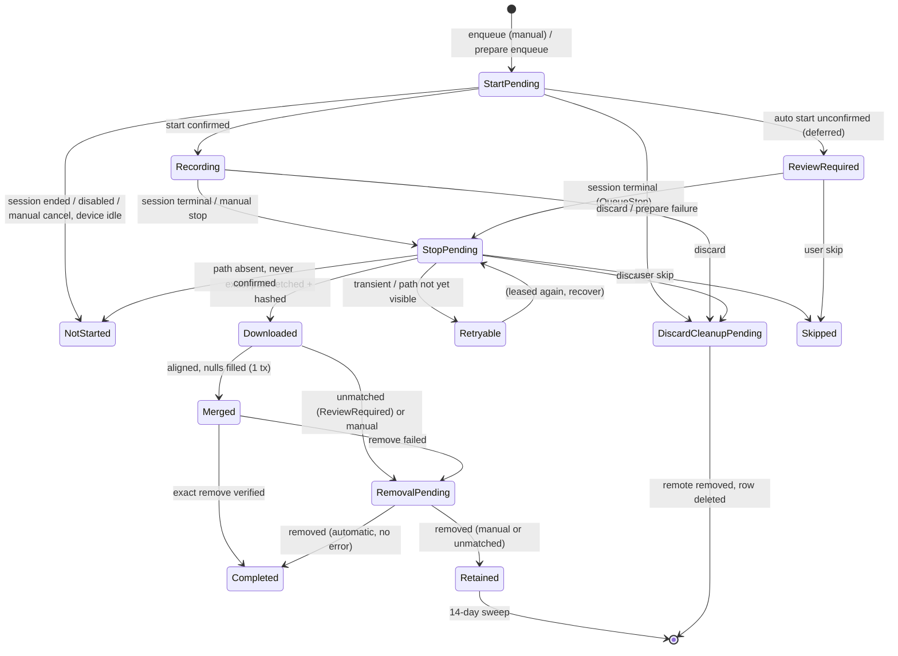

# 10 — Polar H10

This document is the complete, self-contained contract for everything the Android app does with the Polar H10:
- live heart rate (HR), RR intervals, skin contact and battery;
- enrollment and relocation of a sensor whose Bluetooth address rotates;
- onboard ("memory") recording through the Polar file-transfer protocol (PFTP);
- recovery of the recording into workout History;
- manual recordings with a local archive and CSV export.

The app uses the **official Polar BLE SDK** behind a `PolarPort`. It also keeps a **fallback** PFTP implementation (story H10-07). For that reason, every byte layout, constant, timeout and rule is written out here. Section 13 maps each operation to the SDK call that replaces it.

Golden data lives in `data/polar/`:

| File | Contents |
|---|---|
| `hrs-measurement.json` | Heart Rate Measurement (2A37) parse vectors, validity classification, battery vectors, freshness boundaries |
| `pftp-frames.json` | RFC-76 air-frame header bytes, encode vectors (fragmentation, sequence wrap), decode vectors and every rejection case |
| `pftp-messages.json` | RFC-60 query and operation envelopes with protobuf payloads for status, start, stop, list, get and remove; response payloads |
| `samples-bpb.json` | `SAMPLES.BPB` payloads with expected decoded samples, timestamps, `endedAtUtc` and SHA-256 |
| `merge-scenarios.json` | Alignment and fill-only-null merge scenarios, including every ReviewRequired case |
| `locator-scenarios.json` | Address-rotation and reconnect resolution scenarios; name and family classifier vectors |

Conventions:
- Hex is written as space-separated uppercase bytes.
- Multi-byte integers are **little-endian** unless stated otherwise.
- "Exercise id" means the H10 `sample_data_identifier`.
- "Job" means the durable recording row described in section 10.

---

## 1. Device facts

| Fact | Value |
|---|---|
| Target device | Polar H10, firmware **4.2.0** (the owner's strap). Firmware cannot be downgraded. |
| Radio | One BLE peripheral. With "2 Bluetooth devices" **on** it accepts two centrals and keeps advertising while connected. With it off, it accepts one central. |
| Onboard recording | **One** active exercise at a time. Sample type is HR (1 s or 5 s interval) or RR (interval ignored). The exercise id is 1–64 characters. |
| Recording continuity | The recording continues when BLE disconnects. |
| Recording storage | `/<exerciseId>/SAMPLES.BPB`, one directory per exercise. The file contains **no timestamps**. |
| HR service | Standard HRS. **No bonding is needed** for HR. Do not bond for the HR path. |
| PFTP / PFC | Proprietary services. On firmware 4.x they may require link security (section 5). |

---

## 2. GATT surface

| Item | UUID | Properties used | Notes |
|---|---|---|---|
| Heart Rate Service | `0000180d-0000-1000-8000-00805f9b34fb` | — | Standard |
| Heart Rate Measurement | `00002a37-0000-1000-8000-00805f9b34fb` | Notify | Section 3.1 |
| Battery Service | `0000180f-0000-1000-8000-00805f9b34fb` | — | Optional |
| Battery Level | `00002a19-0000-1000-8000-00805f9b34fb` | Read, Notify | Section 3.2 |
| Device Information (DIS) | `0000180a-…` | Read | Model and firmware for display only |
| **PFTP service** ("RFC77") | `0000feee-0000-1000-8000-00805f9b34fb` (16-bit `FEEE`) | — | Also advertised; its presence marks a Polar device |
| PFTP **MTU** characteristic | `fb005c51-02e7-f387-1cad-8acd2d8df0c8` | Write-without-response (preferred), Write, **Notify** | The request/response channel |
| PFTP **D2H** (device-to-host) | `fb005c52-02e7-f387-1cad-8acd2d8df0c8` | Notify | Asynchronous device notifications. Must be enabled for readiness. |
| PFTP **H2D** (host-to-device) | `fb005c53-02e7-f387-1cad-8acd2d8df0c8` | Write / Write-without-response | Asynchronous host notifications. Not used for requests. |
| **PFC service** (Polar Features Configuration) | `6217ff4b-fb31-1140-ad5a-a45545d7ecf3` | — | Section 5.2 |
| PFC Feature | `6217ff4c-c8ec-b1fb-1380-3ad986708e2d` | Read | Capability bits |
| PFC Control Point | `6217ff4d-91bb-91d0-7e2a-7cd3bda8a1f3` | Write, Notify/Indicate | Opcodes and responses |

---

## 3. Live heart rate

### 3.1 Heart Rate Measurement (2A37) parsing

The layout is `flags(1) | hr(1 or 2) | [energy(2)] | [rr(2)…]`.

| Flags bit | Meaning |
|---|---|
| 0 | HR is uint16 LE; otherwise uint8 |
| 1 | Sensor contact **detected** |
| 2 | Sensor contact **supported** |
| 3 | Energy expended present (uint16 LE, kJ) |
| 4 | RR intervals present: uint16 LE each, in units of **1/1024 s**, repeated until the end of the value |
| 5–7 | Ignored |

The contact status comes from bits 1 and 2:

| bit 2 (supported) | bit 1 (detected) | Status |
|---|---|---|
| 0 | any | `NotSupported` |
| 1 | 1 | `Detected` |
| 1 | 0 | `NotDetected` |

The parser **rejects** a value (a format error that is logged and does not crash the stream) in these cases:
- the value is empty;
- the HR or energy field is truncated;
- the RR flag is set but the remaining byte count is 0 or odd;
- bytes remain after the declared fields when the RR flag is clear.

RR in seconds is `raw / 1024.0`. For milliseconds, use `raw * 1000 / 1024` and keep the fraction or round it half away from zero. A 1024 raw value is 1000 ms.

### 3.2 Battery (2A19)

- The value must be exactly **1 byte in 0..100**. Anything else is ignored and does not update the value.
- The app reads it once after connecting, then subscribes if the characteristic notifies.
- Battery is best-effort: a failure never faults the HR connection.
- The value is stored with its observation time.

### 3.3 Signal quality and validity

The signal quality is classified for every notification:

| Condition, evaluated in order | Quality | Published bpm |
|---|---|---|
| contact = `NotDetected` | `ContactLost` | null |
| 30 ≤ bpm ≤ 250 | `Valid` | bpm |
| otherwise | `Invalid` | null |

`NotSupported` contact does **not** block validity. The H10 always reports contact as supported.

A source may drive HR selection and automation only when all of these hold:
- connection state is `Ready`;
- quality is `Valid`;
- 30 ≤ bpm ≤ 250;
- `0 ≤ now − observedAt ≤ 5 s`. The boundary is **inclusive**: exactly 5 s is still fresh.

Any other sample is stored as **null** in the session and resets the automation dwell timer (see 05 and 06).

Vectors: `hrs-measurement.json`.

### 3.4 Connection timing (current behaviour, ported)

| Rule | Value |
|---|---|
| First notification after subscribe | must arrive within **15 s**, else the connection fails ("telemetry silent, initial") |
| Silence watchdog after the first notification | **30 s** without a notification fails the connection |
| GATT operation timeout | 15 s |
| `Ready` is published | on the first **Valid** notification of a connection generation |
| Stable connection | ≥ 2 valid samples with every gap ≤ 5 s, spanning ≥ **30 s** |
| Reconnect backoff, active session | `min(10, 2^(n−1))` s plus deterministic jitter `J`, where n is the consecutive failure count (1, 2, 4, 8, 10, 10… s) |
| Reconnect backoff, idle | `min(300, 2^(n−1))` s plus jitter, where the jitter limit is `min(500, max(0, (300 − base) × 1000))` ms |
| Jitter `J` | `((id[0] << 8) \| id[1]) mod (limit + 1)` ms, where `id` is the 16-byte enrollment UUID in .NET `Guid` byte order and the limit is 500 ms when active. Any stable per-device jitter in 0..500 ms is acceptable. |
| Rediscovery scan before a reconnect | bounded **5 s**. The run must resolve through section 4.3; it never binds an ambiguous candidate. |
| Fallback activation | A lower-priority HR source is started only when the preferred source is Faulted or Reconnecting, needs stable recovery, or has had no Valid sample for more than **30 s**. The 5 s limit decides whether a pulse may be published; the 30 s limit decides whether to start more BLE work. |
| Preferred-source recovery | A recovered preferred source must be durably stable (30 s) before a connected fallback is dropped |

The Android app keeps these semantics and adds the scan budget of the main plan: about 5 scan starts per 30 s, shared with the SDK. With the SDK, `startHrStreaming` replaces the raw subscription. The watchdog, validity and freshness rules stay in our code.

### 3.5 Known H10 link behaviour
- The H10 **ends the link 20–30 s after losing skin contact**. A strap taken off mid-run therefore produces ContactLost and then a disconnect. This is expected, and is not a bug to retry aggressively.
- The H10 disconnects **45 s after being removed from the strap**, and that disconnect **cancels an in-progress recording download**. The strap must be worn during a download (Polar SDK known issue H10 #1). Show "Keep the strap on until the download finishes."
- Any ECG or ACC streaming must be terminated by the app, or the H10 stays on until its battery is empty (known issue H10 #2). This app does not use ECG or ACC.
- HCI disconnect reasons worth logging: `0x08` supervision timeout (radio or controller), `0x13` remote termination (contact, security or multi-connection), `0x16` local termination, `0x3E` connection failed to establish.

---

## 4. Enrollment and locating the H10

### 4.1 Enrollment record (relevant fields)

| Field | Rule |
|---|---|
| `id` | UUID, not empty |
| `role` | `HeartRate` |
| `deviceId` | Locator at enrollment. On Windows this was 12 hex digits of the BT address. On Android, store the BT address **and** the Polar device id (8 hex, printed on the sensor and embedded in the advertised name `Polar H10 XXXXXXXX`). |
| `displayName` | 1–100 characters, trimmed; the user may rename it |
| `modelNumber` | Optional, ≤ 100 |
| `firmwareRevision` | Optional, ≤ 100 |
| `identityFingerprint` | Exactly 64 hex characters, stored lower-case. Only this hash, never the address, appears in diagnostics. |
| `heartRateDeviceKind` | `ChestStrap`, `Watch` or `Sensor`; default from the classifier |
| `heartRateDeviceFamily` | `Polar`, `Garmin` or `Other`; default from the classifier |

The classifier rules and vectors are in `locator-scenarios.json` (`classifier`).

The **effective** kind and family are used for matching:
- If the stored value is the generic one (`Sensor` or `Other`), re-derive it from the display name.
- Otherwise use the stored value.

A product-specific rename (for example "Runner Polar H10") therefore promotes generic metadata.

### 4.2 Which enrollment is "the H10"

An enrollment is an H10 memory target when all of these hold:
- it is active;
- its role is `HeartRate`;
- its family is `Polar`;
- its display name contains `polar h10` (case-insensitive), **or** its model number (trimmed) equals `H10` (case-insensitive).

A memory operation takes an optional enrollment id:

| Matching candidates | Result |
|---|---|
| exactly 1 | Use it |
| 0 | Fail: "The exact enrolled Polar H10 is not available." |
| more than 1 | Fail: "More than one Polar H10 is enrolled; choose the exact device before using memory operations." |

### 4.3 Locator resolution (address rotation)

Polar sensors may advertise with a rotating private address. The persisted address is therefore **not** assumed to be current. Before each PFTP session, and before every read retry, the app runs one bounded scan (default 5 s, maximum 30 s):

1. Merge advertisements per address. The name is the last non-empty trimmed name; the services are the union.
2. If the **enrolled address** is seen, return it immediately (`ExactDeviceId`).
3. After the scan window, compute:
   - `nameIsUnique`: no other active HR enrollment has the same display name (case-insensitive).
   - `familyAndKindAreUnique`: the effective family is not `Other`, and no other active HR enrollment has the same effective family **and** kind.
4. Resolve:
   - `ExactDisplayName` when `nameIsUnique` and exactly one candidate with HR evidence has a name equal to the display name.
   - Else `UniqueFamilyAndKind` when `familyAndKindAreUnique` and exactly one candidate with HR evidence classifies to the same family and kind.
   - HR evidence means advertising `180D` or `FEEE`.
5. Otherwise, **fail closed**: keep the enrolled address. The connect may then fail. It never binds an ambiguous device.

Other rules:
- Caller cancellation aborts the scan. The scan window ending is not an error.
- Diagnostics keep the stable enrolled identity. The resolved address is used only for connecting.
- **Android:** the SDK connects by the Polar **device id**, which is stable across address rotation. It finds the device by scanning (`connectToDevice(deviceId)` / `searchForDevice()`), so the SDK path covers section 4.3 on its own. The resolver above stays authoritative for the fallback path and for non-Polar sensors, and as a cross-check that a found device's name matches the enrollment.

---

## 5. Firmware 4.x, security and PFC

### 5.1 Firmware facts

| Version | Change that matters here |
|---|---|
| 4.0.4 (Dec 2025) | Secure pairing: the sensor sends a **sensor-initiated security request**. **Only the host that started a training recording may read it** (initiator-only access). "2 Bluetooth devices" is **on** by default. On Windows 11, straps with this firmware were reported to disconnect during service enumeration. |
| 4.1.10 (Dec 2025) | Lower power while searching. Apps must use **Polar SDK ≥ 6.12.0**. |
| 4.2.0 (Mar 2026) | The **offline recording issue is fixed**. This is the owner's firmware and the minimum for recording. |

Consequences:
- **PFTP error 106 `OPERATION_NOT_PERMITTED`** is returned when the recording was started by **another host**. Treat 106 as **terminal**: never retry it. Show it plainly (H10-06). Fetch only recordings this app started.
- Security needed for PFTP or PFC creates an **Android system bond**. Never uninstall or reinstall the app while an unfetched recording exists. The in-app updater checks this (see the main plan).
- Pairing is not needed for HR. On other platforms, pairing the H10 caused auto-connect and hangs.

### 5.2 PFC — Polar Features Configuration

The Control Point request is `[opcode] [params…]`. The response arrives on the Control Point notification as `[0xF0] [opcode] [status] [payload…]`.

| Opcode | Name | Params | Response payload |
|---|---|---|---|
| 1 / 2 | Configure / Request broadcast | 1 byte | setting |
| 3 / 4 | Configure / Request 5 kHz | 1 byte | setting |
| 5 / 6 | Configure / Request whisper mode | 1 byte | setting |
| 7 | Configure BLE mode | 1 byte | — |
| **8** | **Configure multi-connection** ("2 Bluetooth devices") | `01` = on, `00` = off | — |
| **9** | **Request multi-connection** | — | 1 byte: `01` on, `00` off |
| 10 / 11 | Configure / Request ANT+ | 1 byte | setting |
| 12 | Request security mode | — | setting |
| **14** | **Configure sensor-initiated security mode** | `01` / `00` | — |
| **15** | **Request sensor-initiated security mode** | — | 1 byte |

| Status | Meaning |
|---|---|
| `01` | Success |
| `02` | Not supported |
| `03` | Invalid parameter |
| `04` | Operation failed |
| `05` | Not allowed |

Feature characteristic bits:

| Byte | Bit | Feature |
|---|---|---|
| 0 | 0 | broadcast |
| 0 | 1 | 5 kHz |
| 0 | 2 | OTA |
| 0 | 4 | whisper mode |
| 0 | 6 | BLE mode |
| 0 | 7 | **multi-connection** |
| 1 | 0 | ANT+ |
| 1 | 1 | security mode |
| 1 | 3 | **sensor-initiated security mode** |

Rules:
- Enable Control Point notifications first.
- Drain stale responses before each command.
- Serialize commands, one at a time.
- Allow a **30 s** response timeout.
- A non-zero ATT status is an attribute error.

The product rule (story DEV-05):
- Show the multi-connection setting on the H10 detail screen and offer to turn it **off**. With one central, the H10 stops advertising while connected, and the Windows gateway can no longer steal the link.
- The HW acceptance check is that the H10 stops advertising while connected.
- If the SDK cannot do this on the pinned version, explain the Polar Flow route.
- Only change the sensor-initiated security mode as a documented troubleshooting step. Never do it silently.

---

## 6. PFTP protocol

This is a clean-room description built from published wire facts. It is used directly by the fallback and serves as the reference when checking the SDK.

### 6.1 Transport and readiness
1. Connect, then discover `FEEE` **uncached**. Obtain the MTU, D2H and H2D characteristics. If any is missing, the error is "PFTP not available". On firmware 4.x this may need security or bonding.
2. Check capabilities:
   - MTU must notify or indicate.
   - D2H must notify or indicate.
   - H2D must be writable.
   - MTU must support write-without-response or write.
3. **Register the MTU value handler (and the disconnect handler) before writing any CCCD.** A response must never arrive before its receiver exists.
4. Enable notifications on **MTU** and then on **D2H**. Prefer Notify over Indicate when both exist. Await both descriptor writes. This is the **readiness barrier**: no request is written before both succeed.
5. After the barrier, if the link is already disconnected, fail with a disconnect.
6. **Frame size** = usable bytes per characteristic write, including the 1-byte frame header:
   - The default is `20`.
   - After the MTU exchange, use `clamp(attMtu − 3, 20, 509)`.
   - On Android, request a larger MTU (for example 512) and use the negotiated value minus 3.
7. **Request writes use write-without-response** when the MTU characteristic exposes it, as Polar's own Android client does. Use acknowledged write only when write-without-response is absent.
   - With acknowledged writes preferred, the H10 on Windows timed out waiting for the first PFTP response. Switching to write-without-response fixed it on hardware.
8. The receive queue for MTU notifications is bounded to **128 frames**. Overflow faults the connection.

### 6.2 RFC-76 air frames (MTU characteristic, both directions)

The header byte is `sequence(4 bits, high) | status(2 bits) | next(1 bit, low)`, i.e. `(seq << 4) | (status << 1) | next`. Bit 3 is 0.

| Field | Values |
|---|---|
| `sequence` | 0..15 ring counter. It **restarts at 0 for every new message**, in both the request and the response. It increments per frame and wraps 15 → 0. |
| `status` | `0` = RESPONSE_OR_ERROR, `1` = LAST, `3` = MORE, `2` = **reserved; reject it** |
| `next` | `0` on the first frame of a message, `1` on every following frame |

**Encoding a request:**
- Split the message into chunks of `frameSize − 1` bytes.
- Every frame except the last is MORE; the last is LAST.
- An empty message is one frame `02`.

**Decoding a response:**
- The first frame must have sequence 0 and next 0.
- Each following frame must have sequence = previous + 1 (mod 16) and next 1.
- MORE and LAST frames append their payload.
- A RESPONSE_OR_ERROR frame carries a **uint16 LE status code** in its first 2 bytes.
  - `0` means success; any trailing bytes are ignored and the payload so far is the result.
  - Any other code is a **remote PFTP error** with that code.
  - Fewer than 2 bytes is a format error.
- The message ends at LAST or RESPONSE_OR_ERROR.
- A total payload above the caller's maximum is rejected: 64 KiB for control responses, 8 MiB for `SAMPLES.BPB`.
- A stream that ends without a final frame is incomplete. A live transport simply times out (section 6.7).

When the SDK sees a sequence mismatch while receiving MORE frames, it writes a **cancel frame** `00 00 00` to the MTU characteristic. It then raises error **303** ("air packet lost"). The fallback may do the same. It must in any case fault the connection (section 6.7).

Vectors: `pftp-frames.json`.

### 6.3 RFC-60 message envelopes (inside the frames)

| Kind | Bytes | Used for |
|---|---|---|
| **Query** | `id_lo`, `(id_hi & 0x7F) \| 0x80`, then protobuf parameters | status, start, stop |
| **Request** (operation) | `len_lo`, `len_hi & 0x7F` (bit 15 clear, len ≤ 0x7FFF), then the `PbPFtpOperation` protobuf of `len` bytes, then optional data (PUT only) | GET, REMOVE |
| **Notification** (H2D) | `id`, then protobuf | Not used by this app |

The high bit of byte 1 tells a query (`1`) from a request (`0`).

The response to both is the raw protobuf result, or nothing. Start, stop and remove return an empty payload on success.

### 6.4 Protobuf messages (proto2 wire format)

Only varint (wire type 0) and length-delimited (wire type 2) fields are produced. A decoder must still **skip** wire types 1 (8 bytes) and 5 (4 bytes). It must reject wire types 3, 4, 6 and 7, field numbers outside 1..2^29−1, truncated varints and fields, and varints longer than 10 bytes.

| Message | Fields |
|---|---|
| `PbPFtpOperation` | 1 `command` enum: **GET = 0**, PUT = 1, MERGE = 2, **REMOVE = 3**; 2 `path` string |
| `PbPFtpRequestStartRecordingParams` (query 14) | 1 `sample_type` enum `PbSampleType`: **HEART_RATE = 1**, **RR_INTERVAL = 16**; 2 `recording_interval` `PbDuration`; 3 `sample_data_identifier` string (the exercise id) |
| `PbDuration` | 1 hours, 2 minutes, 3 **seconds**, 4 millis (all uint32, default 0) |
| `PbRequestRecordingStatusResult` (query 16) | 1 `recording_on` bool (**required**); 2 `sample_data_identifier` string (optional) |
| `PbPFtpDirectory` (GET of a path ending `/`) | 1 repeated `PbPFtpEntry` |
| `PbPFtpEntry` | 1 `name` string (a directory name ends with `/`); 2 `size` uint64; 3/4/5 created/modified/touched (ignored) |
| `PbExerciseSamples` (`SAMPLES.BPB`) | Section 8 |

Query ids (`PbPFtpQuery`) used: **14 REQUEST_START_RECORDING**, **15 REQUEST_STOP_RECORDING**, **16 REQUEST_RECORDING_STATUS**. Others exist but are unused: 1 SET_SYSTEM_TIME, 3 SET_LOCAL_TIME, 4 GET_LOCAL_TIME, 5 GET_DISK_SPACE, 12 PREPARE_FIRMWARE_UPDATE, 13 REQUEST_SYNCHRONIZATION, 21–26 exercise control.

Status decoding rules:
- An **empty** status payload means "not recording". The SDK does the same.
- A non-empty payload **without** field 1 is a format error.

Examples:

| Message | Bytes |
|---|---|
| Status query | `10 80` |
| Stop query | `0F 80` |
| Start HR 1 s `run-1` | `0E 80 08 01 12 02 18 01 1A 05 72 75 6E 2D 31` |
| GET `/` | `05 00 08 00 12 01 2F` |
| Status response `recording, run-1` | `08 01 12 05 72 75 6E 2D 31` |

More are in `pftp-messages.json`.

### 6.5 Operations used

| Operation | Message | Rules |
|---|---|---|
| **Status** | query 16, no params | → `(isRecording, exerciseId?)` |
| **Start** | query 14 + params | The exercise id is validated first (section 7.1). HR interval must be 1 or 5. For RR, the interval is forced to 1 (the device ignores it). Sample type must be HR or RR. |
| **Stop** | query 15, no params | Stops whatever is active. The caller must have checked the id first. |
| **List** | GET `/`, then recursive GET of every `name/` entry | Collect only entries named `SAMPLES.BPB` (case-insensitive) as recordings `path = parent + name` with `size`. Ignore other files. Limits: **≤ 512 entries in total**, **depth ≤ 4** (root = 0; deeper fails), control payload ≤ 64 KiB per directory. Entry names: 1–128 characters, no `\`, no NUL; `/` only as the final character; `.` and `..` are rejected. |
| **Fetch** | GET `/<id>/SAMPLES.BPB` | Payload ≤ **8 MiB** (8 388 608 bytes); decoded as in section 8 |
| **Remove** | REMOVE `/<id>/SAMPLES.BPB` | Removes the exercise. The path must be exact. |

Path validation applies before any request:
- a path is 1–512 characters, starts with `/`, and has no `\`, NUL, `//`, `.` or `..` segment;
- fetch and remove paths must end with `/SAMPLES.BPB` (case-insensitive).

Paths from the device are validated the same way, and a listed path must have exactly two segments `<id>/SAMPLES.BPB`. Anything else is an unsupported path and fails closed.

### 6.6 Error codes (`PbPFtpError`)

| Code | Name | Handling |
|---|---|---|
| 0 | OPERATION_SUCCEEDED | — |
| 1 | REBOOTING | transient |
| 2 | TRY_AGAIN | transient |
| 100 | UNIDENTIFIED_HOST_ERROR | terminal for the operation |
| 101 | INVALID_COMMAND | terminal (bug) |
| 102 | INVALID_PARAMETER | terminal (bug) |
| 103 | NO_SUCH_FILE_OR_DIRECTORY | Fetch or remove: the recording is absent. Reconcile by listing. |
| 104 / 105 | DIRECTORY_EXISTS / FILE_EXISTS | terminal |
| **106** | **OPERATION_NOT_PERMITTED** | **terminal, never retried**; shown plainly ("Recording started by another app or device; it can only be read there") |
| 107 | NO_SUCH_USER | terminal |
| 108 | TIMEOUT | device-side timeout; treat as transient for reads |
| 200 | UNIDENTIFIED_DEVICE_ERROR | terminal. The SDK also uses 200 for "undefined status" and "stream out of sync". |
| 201 | NOT_IMPLEMENTED | terminal |
| 202 | SYSTEM_BUSY | transient |
| 203–209 | INVALID_CONTENT, CHECKSUM_FAILURE, DISK_FULL, PREREQUISITE_NOT_MET, INSUFFICIENT_BUFFER, WAIT_FOR_IDLING, BATTERY_TOO_LOW | terminal for this attempt. Show DISK_FULL and BATTERY_TOO_LOW to the user. |
| 300–399 | reserved for the communication interface | — |
| **303** | SDK-generated **"air packet lost"** (sequence mismatch) | transport fault: fault the connection; a read may be retried on a fresh connection |

In the current code, a remote PFTP error is **never** treated as a transient read failure. Only a timeout, a BLE transport failure or a non-PFTP I/O failure is retried. The rewrite keeps this for 106 and all 1xx/2xx codes. It may add 1, 2, 108 and 202 to the retryable **read** set; mutations are never retried whatever the code.

The SDK decodes the error code as `(b1 & 0xFF) | ((b2 << 8) & 0xFF)`, which keeps only the low byte. Codes above 255 from the device would be mangled. Our fallback decodes the full uint16.

### 6.7 Exchange discipline and timeouts

| Rule | Value / behaviour |
|---|---|
| One exchange at a time | Per connection, serialized. **All PFTP workflows in the app are also serialized by one process-wide operation gate.** This covers status-before-mutation sequences and prepare. HTTP/web callers wait at most **30 s** for the gate. |
| Before writing | Discard every queued MTU frame. Anything queued belongs to setup or an obsolete operation. |
| Response timeout (this project) | **10 s** per exchange by default (valid range: over 0 s and at most 2 min). It covers initialization, writes and all response frames. |
| Polar SDK | **90 s per packet**; 900 s only for firmware-package writes |
| **Incomplete exchange** | A timeout, caller cancellation, disconnect, malformed frame, sequence or continuation error, oversize or write failure **permanently faults** the connection. Every later exchange on it fails immediately ("cannot be reused after an incomplete exchange"), including callers already queued behind it. A fresh connection is required, so delayed frames can never answer a later request. A **remote PFTP error** (a complete RESPONSE_OR_ERROR frame with a code) does **not** fault the connection. |
| Disconnect | A disconnect ends the receive stream at once with a disconnect error. Waiting for the timeout is not required. Disposal cancels an in-flight receive and waits for it to unwind. |
| Caller cancellation | Stays a cancellation. It is never reported as a timeout. The connection is still faulted. |
| Read retry (memory session) | Status, list and fetch: at most **2 attempts**. Between them: dispose the connection, wait **500 ms**, **rescan the locator**, reconnect. Only for timeout, BLE transport or non-PFTP I/O errors. Caller cancellation is never retried. |
| Mutations (start, stop, remove) | **Never retried or replayed** automatically. After a mutation has been dispatched, any failure has an **uncertain physical outcome** and is reconciled only by a later status or list read. |
| Status endpoint budget | 20 s for acquire + open + status (and list, for the overview) |
| Automatic start in the worker | **20 s** budget for the start attempt |

### 6.8 Memory session semantics
- `open(enrollmentId)`:
  - resolve the exact H10 (section 4.2);
  - resolve the locator (section 4.3);
  - return a session that lazily opens **one** PFTP connection.
  - Status, list and delete in one session reuse the same scan and connection. Test: 1 scan, 1 connect, 1 dispose.
- `start(id, type, interval)` runs on **one** connection:
  1. Read the status (a retryable read).
  2. If something is recording, return `StartIssued = false` with that status, and **leave it untouched** (even when it is a different id).
  3. Otherwise record `startIssuedAtUtc = now` **before** sending query 14.
  4. Send query 14.
  5. Read the status again to confirm.
  6. Return `(status, StartIssued = true, startIssuedAtUtc)`.
- `startIssuedAtUtc` is the **time anchor** for the recording (section 8.2).
- Dispose the memory session **before** releasing the live-connection lease (section 7.4).

---

## 7. Recording lifecycle

### 7.1 Exercise ids

| Origin | Id | Notes |
|---|---|---|
| **Automatic** (workout) | `tr-{sessionId:N}` | `tr-` plus the 32 lowercase hex digits of the session UUID, no dashes: 35 characters. Example: `tr-0123456789abcdef0123456789abcdef` |
| **Manual** | `manual-{yyyyMMdd-HHmmss}-{uuidN}`, truncated to its **first 47 characters** | The timestamp is UTC. Example: `manual-20260910-070000-0123456789abcdef01234567` (47 characters) |
| Seen on the device | anything valid | "Unowned" if no local job has that id for this enrollment |

Validation everywhere: not blank or whitespace, **1–64 characters**, no `/`, `\` or NUL. The current code counts UTF-16 code units; the rewrite should accept ASCII only for ids it creates.

The remote path is always `/{id}/SAMPLES.BPB`. It is compared **exactly** (ordinal) when matching list results.

### 7.2 Automatic preparation before arming (story H10-02)

The per-run option "Record on H10 memory" is **unchecked** for each new workout. It applies only to hardware sessions whose selected HR source is the enrolled H10. The arm request carries:
- `recordPolarH10Memory`;
- `replaceExistingPolarH10Recording`;
- `replacePolarH10ExerciseId`.

Replacement requires both the record flag and a non-blank exact id; otherwise the arm is rejected with a validation error.

Arm order:
1. Persist the session row.
2. Hold the run connections.
3. **Prepare synchronously.**
4. Only on success publish the armed session.

If prepare fails, the new session is interrupted with the reason "Session arm failed during device or H10 preparation: {reason}". If the arm is invalidated after a successful prepare, queue a discard cleanup (section 7.6) and wake the worker.

Prepare works as follows (feature flag on; otherwise it fails with "Polar H10 memory recording is disabled."):
1. Enter the process-wide PFTP gate.
2. Acquire the **live-connection lease** for the exact enrollment (section 7.4).
3. Open the memory session.
4. **Status.** If something is recording **and** its id ≠ `tr-{sessionId:N}`:
   - Without `replace`: fail with **ActiveRecording(exerciseId)**. The id may be null ("unidentified session"). **Nothing is mutated and no job is created.** The API answers 409 with `{code: "PolarH10RecordingActive", error, exerciseId}`. The UI asks the user to confirm replacing *that exact id*.
   - With `replace`, the device's id must **equal** `replacePolarH10ExerciseId`; otherwise fail with ActiveRecording(current id). This covers a recording that changed after the user confirmed. From this point, the user-confirmed mutation **ignores request cancellation**; each PFTP step is still bounded by its own timeout.
   - Then **remove the superseded recording** (section 7.3).
5. **Enqueue** the job: Automatic, HR, interval 1, `startRequestedAtUtc = now`. The enqueue is idempotent on (enrollment, exerciseId).
6. **Start** through the session's start (section 6.8). If the start result shows a *different* active id (it appeared between the status and the start):
   - Apply the same `replace` and exact-id rule.
   - Remove the superseded recording, excluding this job.
   - Start again.
7. Require `isRecording && id == tr-{sessionId:N}`. Otherwise fail: "The H10 did not confirm the workout-specific memory recording."
8. `confirmedAt` is `startIssuedAtUtc` when this call issued the start. If the exact recording was already active, it is the job's `startRequestedAtUtc`. Then **MarkRecording(job, confirmedAt)**.
9. Dispose the memory session, then release the lease. Live HR reconnects **asynchronously**; the onboard recording covers the handoff gap.
10. **On any failure after the job exists:**
    - QueueDiscardCleanup(session) and wake the worker, so an uncertain start can never orphan a recording.
    - Rethrow a cancellation that the caller asked for.
    - Rethrow ActiveRecording as it is.
    - Wrap anything else as "Polar H10 memory preparation failed: {base message}".

The physical `Running` transition **never** issues a second start. Memory coverage begins before the belt moves; the pre-start samples are excluded later (section 9). Physical start readiness still needs the normal device preflight.

### 7.3 Removing a superseded recording (during prepare only)
1. The current status must carry an id; otherwise fail ("active recording without an exact exercise identifier").
2. **Stop**, then **status**. If it is still recording, fail: "The existing H10 recording did not stop; the new workout recording was not started."
3. Look up the local job for (enrollment, staleId), and **list**. If the exact stale path is listed, **and** a local job exists that is not the excluded job, not DiscardCleanupPending, and has **no payload hash yet**:
   - fetch it, anchored at `startConfirmedAtUtc ?? startRequestedAtUtc`, failing if neither exists ("no safe start-time anchor");
   - **store it durably** with its SHA-256 **before** any removal. Owned data is never lost.
4. If the path is listed, **REMOVE** the exact path.
5. **List again.** If the path is still present, fail: "The superseded H10 recording still exists after exact-path removal."
6. If the stale job is DiscardCleanupPending, complete the discard cleanup. Otherwise wake the worker to merge or retain it.

The automatic prepare is the **only** flow allowed to stop or remove an active recording that is not its own, and only after the exact second confirmation. Manual operations leave unknown or different active ids untouched.

### 7.4 Live-connection lease (Windows design; kept as the Android fallback)

On Windows, two centrals on one H10 caused PFTP responses to time out, so each PFTP workflow takes a lease:
- Acquire: **suspend** the live HR worker for that exact enrollment and await its disposal. If the suspension is refused, fail ("could not be released") **without touching PFTP**. The job becomes Retryable with its lease cleared.
- Release, which is idempotent: resume the prior connection demand. An explicit user disconnect stays in force.
- A suspension blocks background reconnect and automatic priority progression past that enrollment.

On Android the Polar SDK multiplexes HR streaming and PFTP over **one** connection, so the lease may be unnecessary. Hardware test HW-11 must prove that live HR continues (no gap over 5 s) during prepare and fetch. If it does not, port the lease exactly.

### 7.5 Recovery after the session (story H10-03)

When the session finalizes (Completed or Stopped) or is interrupted, the app only **queues** a stop, in the same persistence step as the terminal state. It never waits for BLE. Queue stop means: every job of the session **not** in {Completed, Skipped, NotStarted} is set as follows:

| Field | New value |
|---|---|
| status | StopPending |
| stopRequestedAtUtc | now |
| availableAtUtc | now |
| attemptCount | 0 |
| lastError | null |
| lease | null |
| version | +1 |

The worker then recovers the job (section 10.3):
1. status (stop the exact recording if it is active);
2. list;
3. fetch the exact path;
4. store the payload (≤ 8 MiB) with its SHA-256;
5. merge (section 9);
6. remove the exact path;
7. list again to verify.

### 7.6 Discard

Discarding a workout **first** persists a cleanup job, before the session row is deleted. This is `QueueDiscardCleanup(session)` for the Automatic job:
- no job: nothing to do;
- status Completed or NotStarted: delete the job row;
- otherwise:

| Field | New value |
|---|---|
| status | DiscardCleanupPending |
| stopRequestedAtUtc | now, only if unset |
| availableAtUtc | now |
| lease | null |
| attemptCount | 0 |
| version | +1 |

The worker then stops the exact recording if it is active, removes the exact path if it is listed, verifies the removal and deletes the job row with its samples. Its payload is never stored: see StoreDownloaded in section 10.2.

### 7.7 Manual recordings (story H10-05)

| Action | Rule |
|---|---|
| Start | Interval 1 or 5 (HR) or RR. **At most one** manual job may be non-terminal: not Completed, Retained, Skipped or NotStarted. Otherwise 409 "A manual H10 recording operation is already pending…". Enqueue a Manual job (StartPending), wake the worker, return 202 `{id, exerciseId}`. |
| Stop | If the pending manual job is still StartPending: mark it NotStarted ("cancelled before it started"), 204. Else queue its stop, 202. With no pending job: read the status. Not recording → 204. Active with no id → 409 "no verified identifier; left untouched". Unknown id → 409 "not owned by this gateway; left untouched". An Automatic job without a session → 409. An Automatic job whose session is active → 409 "stop the workout from the Run screen". Otherwise queue the stop, 202. |
| Download existing | The id must be listed at its exact path, else 404. Reuse the job or enqueue a Manual one. Unless the job is already Retained, queue its stop. Wake the worker. 202. |
| Delete remote | Only for a local job that is **Retained** with a payload hash and a remote path. The device must not be recording (409). REMOVE the exact path, list again, and 409 if it is still present. Then MarkRemoteRemoved, 204. |
| Archive list | Manual jobs with a payload, newest updated first, at most **100**. Each row has its HR samples, RR values and `canDeleteRemote = Retained && remotePath != null && removalCount == 0`. |
| CSV export | See below |

The CSV export is UTF-8, `text/csv; charset=utf-8`, file name `polar-h10-{jobId:N}.csv`:

```
capturedAtUtc,beatsPerMinute,rrIntervalMilliseconds
2026-09-10T07:00:00.0000000+00:00,100,
2026-09-10T07:00:01.0000000+00:00,101,
2026-09-10T07:00:00.0000000+00:00,,1000
2026-09-10T07:00:01.0000000+00:00,,980
```

- HR rows come first, then RR rows.
- The RR timestamp starts at `startedAtUtc`, or the Unix epoch if that is missing, and accumulates each RR value.
- Timestamps use the ISO-8601 round-trip format with 7 fractional digits and an offset. The rewrite may use `…Z` with milliseconds if the web and phone agree. Document the chosen format in 07.

Manual recordings never enter workout History. After a verified download, the worker removes the remote copy and the job becomes **Retained**. Retained rows with `removalCount > 0` are deleted **14 days** after their last update, by an hourly sweep.

---

## 8. SAMPLES.BPB

### 8.1 Decoding (`PbExerciseSamples`)

| Field | Type | Use |
|---|---|---|
| 1 `recording_interval` | `PbDuration` (length-delimited) | Required. Total = ((h·60 + m)·60 + s)·1000 + ms. It must be > 0 and a **whole number of seconds**, else a format error (sub-second is unsupported). Missing → format error. |
| 2 `heart_rate_samples` | packed uint32 varints (also accept an unpacked varint field 2) | HR in bpm; each must fit in uint16. Values are kept **raw**, including 0; the merge filters them. |
| 3 `heart_rate_offline` | repeated `{1 start_index, 2 stop_index}` | Sample index ranges where the sensor was offline. Currently ignored. Such samples are typically implausible and dropped by the 30–250 filter. The rewrite may also exclude them explicitly. |
| 28 `rr_samples` | `PbExerciseRRIntervals { 1 rr_intervals packed uint32 }` (length-delimited) | RR in **ms** |
| everything else | — | skipped |

- The sample type is **RR** when at least one RR value is present, else **HR**.
- An unsupported wire type on field 2 or 28 is a format error.
- The payload bound is 8 MiB.

### 8.2 Time anchoring

The file has **no timestamps**. The anchor is the job's `startConfirmedAtUtc`, or `startRequestedAtUtc`, or now:
- `startConfirmedAtUtc` is the **start-issued instant**, recorded before query 14 was sent.
- If the exact recording was already active, it is the job's `startRequestedAtUtc`.
- HR sample `i` is captured at `anchor + i × interval`.
- For HR, `endedAtUtc = anchor + count × interval`.
- For RR, RR value `k` is timestamped at `anchor + Σ_{j<k} rr_j` ms, and `endedAtUtc = anchor + Σ rr`.
- `recordingId` is the first path segment.

Persisted recording samples:
- HR samples take sequence 0..n−1 with `(capturedAt, bpm)`.
- RR samples continue the sequence with `(capturedAt, rrMs)`.
- The payload is stored **raw** with `payloadBytes` and **SHA-256** (lower-case hex, 64 characters).

Vectors: `samples-bpb.json`.

---

## 9. Alignment and merge into History

The merge runs **only** for an Automatic job in status Downloaded, inside **one database transaction**.

| Situation | Result |
|---|---|
| Status is DiscardCleanupPending | Return DiscardCleanupPending |
| Status is Merged | Return Merged (idempotent) |
| Status is not Downloaded | Error |
| Origin is Manual | Return Retained; History is not touched |
| The session was deleted | ReviewRequired: "The workout was removed before H10 recovery completed." |
| The session has no start or end, or the job has no startConfirmedAtUtc | ReviewRequired: "The workout or H10 recording window is incomplete." |

**Window checks.** Any failure gives ReviewRequired: "The H10 recording window does not safely match this workout."
- `startRequestedAtUtc ≥ session.armedAtUtc − 5 s`
- `startConfirmedAtUtc ≤ session.startedAtUtc + 30 s`
- `session.startedAtUtc ≤ recording.endedAtUtc ≤ session.endedAtUtc + 5 min`

**Inputs:**
- recorded samples with 30 ≤ bpm ≤ 250, in sequence order;
- session samples in sequence order.

If either is empty: ReviewRequired "There are not enough samples to align the H10 recording."

**Offset search:**
- Candidates are **−2000, −1500, … , +2000 ms** (9 values).
- For each recorded sample `r`, take the session sample nearest to `r.t + offset`. It counts as a match when it lies within **375 ms** and its bpm equals `r.bpm`.
- Rank by matches (descending), then by |offset| (ascending).
- If the best has **< 1** match, or the **second-best ties** the best: ReviewRequired "The H10 recording alignment is ambiguous and requires review."

**Fill only nulls:**
- The fill targets are session samples whose bpm is **null or < 30 or > 250**. Legacy implausible values count as missing.
- For each target in order, use the **nearest unused** recorded sample to `s.t − offset` within **600 ms**.
- Set the bpm and mark the recorded sample used.
- **A plausible existing value is never replaced.**

**Commit in the same transaction:**
- Recompute the session aggregates over the normalized timeline:
  - rows are ordered by sequence, then capture time;
  - a row whose capture time or elapsed time goes backwards is skipped;
  - an isolated forward outlier is dropped when the next row follows the previous one.
- `averageHeartRateBpm` is time-weighted: `Σ_{i≥1, bpm_i≠null} bpm_i·(elapsed_i − elapsed_{i−1}) / Σ Δ`. If the total weight is 0, use the plain mean. Zero-length intervals are skipped.
- `maximumHeartRateBpm` = the maximum non-null bpm.
- The job becomes **Merged** with `mergeCount = n` (n may be 0), its lease and lastError cleared.
- Append a session event of kind `session-warning`: `{code: "polar-h10-memory-merged", message: "Recovered {n} missing heart-rate samples from the verified Polar H10 recording.", occurredAt}`.
- Bump the session's content version: this is the single permitted post-run sample mutation.

**Pre-start samples** (between prepare and the physical start) stay in the stored payload and in the recording-sample table. They have no session sample to fill, so they never enter History.

A ReviewRequired from the merge is committed as well, in its own transaction.

Scenarios with expected results: `merge-scenarios.json`.

---

## 10. Job model and state machine

### 10.1 Job fields

| Field | Notes |
|---|---|
| `id` | UUID |
| `workoutSessionId?` | null for Manual; set to null if the session is deleted (except that a discard deletes the job) |
| `userProfileId?` | |
| `deviceEnrollmentId` | Required. **Unique with `exerciseId`.** |
| `exerciseId` | ≤ 64 characters |
| `origin` | `Automatic` or `Manual` |
| `sampleType` | `HeartRate` or `RrInterval` |
| `sampleIntervalSeconds` | 1 or 5 (RR is always 1) |
| `status` | Section 10.2 |
| `attemptCount` | 0..5; at 5 the job is no longer leased |
| `leaseExpiresAtUtc?` | |
| `availableAtUtc` | Earliest time of the next attempt |
| `queuedAtUtc` | |
| `updatedAtUtc` | |
| `startRequestedAtUtc?` | |
| `startConfirmedAtUtc?` | |
| `stopRequestedAtUtc?` | |
| `stopConfirmedAtUtc?` | |
| `externalRecordingId?` | |
| `remotePath?` | |
| `payload?` | bytes, ≤ 8 MiB |
| `payloadSha256?` | 64 lower-case hex |
| `payloadBytes` | |
| `startedAtUtc?` | |
| `endedAtUtc?` | |
| `mergeCount` | |
| `removalCount` | |
| `lastError?` | Truncated to **1000** characters |
| `version` | Optimistic concurrency. Every guarded write is `…WHERE id = ? AND version = ?` and bumps the version. |

Recording samples table: `(recordingId, sequence)` is the primary key, with `capturedAtUtc`, `bpm?` and `rrMs?`. Rows are deleted with their job.

The **fingerprint** of a stored recording is `payloadSha256` + `payloadBytes`. The API contract (used by the History detail) returns every field above except the payload and samples, with `status` as its **string** name.

### 10.2 Statuses

All statuses exist in the API. `AwaitingDevice`, `Downloading` and `Merging` are defined and leasable, but the current code **never assigns** them. The rewrite may drop them or use them for progress display.

| Status | Meaning | Terminal for Garmin gate? |
|---|---|---|
| StartPending | Queued start (Manual; Automatic only if prepare was bypassed) | no |
| Recording | Start confirmed | no |
| StopPending | Stop and recover requested | no |
| AwaitingDevice / Downloading / Merging | (unused) | no |
| Downloaded | Payload + SHA-256 stored | no |
| **Merged** | History filled | **yes** |
| **RemovalPending** | Remote removal outstanding (retryable) | **yes** |
| **Completed** | Merged and remote removed | **yes** |
| Retained | Local verified copy kept (Manual, or unmatched Automatic); remote removed | no ⚠ |
| **Skipped** | The user skipped recovery | **yes** |
| **NotStarted** | Proven never started, cancelled or disabled | **yes** |
| DiscardCleanupPending | Session discarded; remove remote, then delete the row | no (the session is gone) |
| ReviewRequired | Needs a human: ambiguity, a different active recording, exhausted attempts, or an automatic start that was not confirmed | no |
| Retryable | Transient failure; backoff | no |

⚠ In the current code, an **unmatched** Automatic recording ends as Retained, which keeps blocking Garmin for that session until the user skips it. The rewrite should decide explicitly. The recommendation is to treat Retained as terminal for the gate, because the History merge was deliberately not possible. This is an open owner question (00-plan §16); until it is decided, [11](11-garmin.md) §7.2 keeps the current rule (Retained is not settled).

Store transitions:

| Operation | Effect |
|---|---|
| **Enqueue** | Idempotent on (enrollment, exerciseId): returns the existing row, including after a unique-constraint race. Validates the origin, id and interval. Status StartPending; `startRequestedAtUtc = queuedAtUtc = availableAtUtc = now`. |
| **Lease next** | See the steps below |
| **MarkRecording(at)** | `startConfirmedAtUtc ??= at`. If the status is not StopPending or DiscardCleanupPending: status Recording, lastError null, attempts 0. Clear the lease. **A queued terminal stop or discard always wins over a late start confirmation.** |
| **QueueStop(session)** / **QueueDiscardCleanup(session)** | Sections 7.5 and 7.6 |
| **QueueStopById[IfVersion]** | StopPending; stopRequested now; attempts 0; lastError null; available now; lease null; version+1. An explicit stop **re-arms** an exhausted job (attempts reset). The IfVersion form fails if another writer bumped the version. |
| **StoreDownloaded(record)** | Payload > 8 MiB → error. If DiscardCleanupPending: only `stopConfirmedAtUtc ??= now` and clear the lease. **The payload is not stored.** Otherwise: status Downloaded; set the recording id, sample type and interval, remote path, payload, bytes, SHA-256 and started/ended; `stopConfirmed ??= now`; lease null; lastError null; attempts 0; replace the recording samples. |
| **MergeDownloaded** | Section 9 |
| **MarkRemoteRemoved[IfVersion]** | Retained when `origin ≠ Automatic` or lastError is non-empty; else **Completed** with lastError cleared. removalCount+1; lease null; version+1. |
| **MarkOutcome[IfVersion](outcome, error)** | Set the status and lastError (≤ 1000); lease null; version+1. Retryable sets `availableAt = now + min(60, max(2, attemptCount × 5))` s. Skipped resets attempts to 0. |
| **Retry (API)** | Refused (409) when Completed, Skipped or NotStarted. Merged or RemovalPending → RemovalPending. Automatic without a session → DiscardCleanupPending. Automatic with a hash → Downloaded. Else → Retryable. Attempts 0; lease null; available now; lastError null; version+1. |
| **Skip (API)** | Refused (409) when Merged, RemovalPending or Completed ("already completed; remote cleanup continues"). Else Skipped with "H10 recovery was explicitly skipped by the user; any remote recording was retained." Wake the Garmin worker. |
| **CompleteDiscardCleanup** | Only from DiscardCleanupPending; deletes the row and its samples |
| **Retention sweep** | At most hourly: delete Retained rows with removalCount > 0 and `updatedAt < now − 14 d` |

**Lease next(now, duration)** runs these steps:
1. Release expired leases: `lease ≤ now` in any non-terminal working status → lease null, available now.
2. Select one job where:
   - the status is in {StartPending, StopPending, AwaitingDevice, Downloading, Downloaded, Merged, RemovalPending, DiscardCleanupPending, Retryable}, **or** (Recording **and** Automatic **and** its session is missing or not in {ArmedWaitingForPhysicalStart, Running, PausedWaitingForPhysicalResume});
   - **and** attempts < 5, available ≤ now, and no lease.
3. Order by available, then queued, then id.
4. Claim it with a compare-and-set on the version: `lease = now + duration`, attempts+1, version+1.
5. Retry the claim up to 3 times on contention. **Exactly one** of several concurrent leasers wins.

### 10.3 Worker pass (one job per pass)

| Setting | Value |
|---|---|
| Poll interval | clamp(1..60 s), default **5 s** |
| Wake | A wake signal cuts the wait short; multiple wakes coalesce |
| Lease duration | clamp(30..900 s), default **120 s** |
| Serialization | The whole pass runs inside the process-wide PFTP gate |

The pass:
1. Run the retention sweep if an hour has passed.
2. Lease a job. If there is none, return.
3. Classify the job:
   - `downloadedWork` = the hash is present and the status is Downloaded or Retryable.
   - `startWork` = StartPending, or (Retryable and no stop requested and not downloadedWork).
   - `activeAutomaticSession` = true when the origin is not Automatic; else whether the session is in an active state.
4. **Deferred automatic start.** When all of these hold, mark **ReviewRequired** with "The H10 recording start was not confirmed. Automatic retries are deferred until the workout ends to preserve live heart-rate telemetry." **without touching BLE**, and return:
   - the origin is Automatic;
   - the job was previously attempted (Retryable, or StartPending with attempts > 1 after this lease);
   - it has no start confirmation and no stop request;
   - its session is active.
   - Rationale: never fight live HR during a run. After the run, QueueStop re-arms it.
5. **downloadedWork:** merge **without BLE**.
   - Merged or DiscardCleanupPending → wake the worker.
   - Otherwise (ReviewRequired or Retained): queue the **unmatched removal**. Status RemovalPending with lastError "{previous error or 'The recording could not be linked to workout History.'} The verified local copy is retained for 14 days."; then wake.
   - On a merge exception: Retryable, or ReviewRequired when attempts ≥ 5, with "The verified H10 copy could not be merged into workout History. Retry without reconnecting the sensor."
   - Return.
6. Acquire the live lease, then open the memory session.
7. **startWork:**
   - If the feature is enabled and the automatic session is active: **start the exact job**.
     - Start through the session: `start(exerciseId, type, interval)`. For Automatic, the budget is 20 s.
     - If the device is recording a *different* id: **ReviewRequired** "The H10 is recording a different exercise. It was left untouched."
     - If the result is not recording: error.
     - Else MarkRecording, with the anchor from section 7.2 step 8. Record a confirmation that arrives after the 20 s deadline fired **durably** (MarkRecording is not cancelled).
   - Otherwise (the feature is disabled or the session has ended): **resolve the disallowed start**.
     - The status is the exact id → queue its stop (IfVersion) and wake.
     - A different id → ReviewRequired "left untouched".
     - Idle → **NotStarted**, with "The workout ended before the H10 recording start could be confirmed." or "The memory feature was disabled before the H10 recording started.". Wake Garmin.
8. **Otherwise, recover the exact job:**
   1. The path is `/{exerciseId}/SAMPLES.BPB`.
   2. Status. If a *different* id is active: ReviewRequired "left untouched"; return. If the exact id is active: **stop**.
   3. **List**, and find the exact path (ordinal comparison).
   4. If the job is Merged or RemovalPending:
      - remove the path if it is listed;
      - list again; if it is still present, error ("still exists after removal");
      - MarkRemoteRemovedIfVersion; on success wake Garmin, else wake the worker;
      - return.
   5. If the job is DiscardCleanupPending:
      - if the path is listed, remove it and verify; if it is still present, error;
      - CompleteDiscardCleanup; wake Garmin;
      - return.
   6. If the path is not listed:
      - never confirmed → **NotStarted** "The H10 recording was never started." and wake Garmin;
      - confirmed → **Retryable** "The exact recording is not yet visible on the H10.";
      - return.
   7. Fetch the recording, anchored as in section 8.2, then StoreDownloaded. Re-read the job; if it is DiscardCleanupPending, wake and return.
   8. **Manual:** queue the unmatched removal (RemovalPending → later Retained), then *try* the remote removal.
   9. **Automatic:** Merge.
      - DiscardCleanupPending → wake.
      - Not Merged → unmatched removal plus *try* removal.
      - Merged → *try* removal, then wake Garmin.
      - *Try* removal means: REMOVE, then list to verify, then either CompleteDiscardCleanup or MarkRemoteRemovedIfVersion, then wake. On failure, keep the verified local copy, log it, and wake: the removal stays retryable.
9. **On any exception** (not a shutdown), compute the outcome:
   - an automatic start attempt → **ReviewRequired**, with the deferred message from step 4;
   - else Merged or RemovalPending → **RemovalPending**, keeping lastError;
   - else attempts ≥ 5 → **ReviewRequired**;
   - else DiscardCleanupPending → stays DiscardCleanupPending;
   - else **Retryable**.
   - The message is "The exact H10 recording could not be reconciled. Keep the sensor nearby and retry." unless one of the above applies.
   - The write is **IfVersion**: a stale worker result never overwrites a concurrent stop or discard.
10. Always dispose the session, then release the lease. Each pass balances acquire and release exactly.

### 10.4 State diagram (main paths)



---

## 11. Garmin export gating

A completed or stopped session may be reconciled or uploaded to Garmin only when **no** H10 job for that session has a status outside {**Merged, RemovalPending, Completed, Skipped, NotStarted**}. This condition is checked both when a session is selected for reconciliation **and** when an upload job is leased.

The H10 worker wakes the Garmin worker after:
- a merge that is followed by a removal attempt;
- a verified removal;
- NotStarted;
- Skipped;
- a completed discard cleanup.

Tests:
- A pending job (StartPending) → reconciliation finds 0 sessions. After an explicit skip → it finds more than 0.
- After a merge → reconciliation finds more than 0 sessions.

---

## 12. HTTP/web API (current contract, for the web UI port)

All routes are under `/api/polar-h10`. They return **404 when the feature flag is off**. Every route except `capability` passes through the PFTP gate (30 s wait).

| Route | Result |
|---|---|
| `GET /capability` | `{available, memoryCapability}`. It only resolves the enrollment and **never** suspends live HR or opens PFTP. |
| `GET /status` | `{memoryCapability, isRecording, connection: "Connected" or "Unavailable", deviceId (the stable enrolled id), displayName, lastSeenUtc, manualOperationPending, exerciseId, available}`. Any failure of the lease, locator, PFTP, timeout or the pending-job store maps to `memoryCapability: false, connection: "Unavailable"` with HTTP 200. |
| `GET /overview` | `{status, items[]}`, where each item is `{id: exerciseId, title, status (local job status or "Available"), startedAtUtc, endedAtUtc: null, canDeleteRemote: false}`. 503 on failure. |
| `GET /recordings?source=remote` or `local` | Remote: the same items. Local: the archive (section 7.7). Any other source → 400. |
| `POST /recordings/start` | Body `{intervalSeconds = 1, rrIntervals = false}` |
| `POST /recordings/stop` | Section 7.7 |
| `POST /recordings/{exerciseId}/download` | Section 7.7 |
| `POST /recordings/{jobId}/delete-remote` | Section 7.7 |
| `GET /recordings/{jobId}/export.csv` | Section 7.7 |
| `GET /sessions/{sessionId}` | The job contract, or 204 when there is no job |
| `POST /sessions/{sessionId}/retry` | Section 10.2 |
| `POST /sessions/{sessionId}/skip` | Section 10.2 |

---

## 13. Mapping to the Polar BLE SDK (Android)

Pin the current 8.x release. Firmware 4.1.10 requires at least 6.12. The API below is the coroutine API of the current SDK line; check every name against the pinned version in Phase 0.

**Features to request** in `PolarBleApiDefaultImpl.defaultImplementation(context, features)`:
- `FEATURE_HR`
- `FEATURE_BATTERY_INFO`
- `FEATURE_DEVICE_INFO`
- `FEATURE_POLAR_H10_EXERCISE_RECORDING`
- `FEATURE_POLAR_FEATURES_CONFIGURATION_SERVICE`
- `FEATURE_POLAR_ONLINE_STREAMING`, if `startHrStreaming` is gated by it on the pinned version

| Our operation | Fallback wire | Polar SDK |
|---|---|---|
| Scan / locate | Section 4.3 | `searchForDevice()` → `PolarDeviceInfo{deviceId, address, rssi, name, isConnectable, hasHeartRateService, hasFileSystemService}`. `setPolarFilter(true)` keeps Polar devices only. |
| Connect / disconnect | GATT | `connectToDevice(deviceId)`, `disconnectFromDevice(deviceId)`, `waitForConnection(deviceId)`, `setAutomaticReconnection(bool)`. Readiness comes from the callbacks `bleSdkFeatureReady(id, feature)` and `bleSdkFeaturesReadiness(id, ready, unavailable)`. Wait for `FEATURE_POLAR_H10_EXERCISE_RECORDING` before any PFTP call; this replaces the CCCD barrier. |
| Live HR / RR / contact | 2A37 | `startHrStreaming(id): Flow<PolarHrData>`. Each sample has `hr`, `rrsMs` (ms), `rrs` (1/1024 s), `rrAvailable`, `contactStatus`, `contactStatusSupported`. Map to section 3.3: `contactStatusSupported && !contactStatus` → ContactLost. Stop with `stopHrStreaming(id)`. |
| Battery | 2A19 | Callback `batteryLevelReceived(id, level)` or `getBatteryLevel(id)`; −1 means unknown |
| Firmware / model | DIS | `disInformationReceived(id, disInfo)` |
| Status | query 16 | `requestRecordingStatus(id): Pair<Boolean, String>`. The id is `""` when absent, which maps to null. An empty payload means "not recording". |
| Start | query 14 | `startRecording(id, exerciseId, RecordingInterval.INTERVAL_1S or INTERVAL_5S, SampleType.HR or RR)`. The SDK annotates exerciseId `@Size(1,64)`. |
| Stop | query 15 | `stopRecording(id)` |
| List | GET `/` recursive | `listExercises(id): Flow<PolarExerciseEntry{path, date, identifier}>`. For the H10, `path` is `/<id>/SAMPLES.BPB`, `identifier` is the first path segment, and **`date` is "now" and meaningless**. Our own limits (512 entries, depth 4, name rules) and exact-path validation still apply to what it returns. |
| Fetch | GET path | `fetchExercise(id, entry): PolarExerciseData{recordingInterval (s), hrSamples: List<Int>}`. hrSamples holds **bpm, or RR ms if the file has RR**. **The raw bytes are not exposed.** See below. |
| Remove | REMOVE path | `removeExercise(id, entry)`. Build `entry` from the exact listed entry, never from a constructed path. |
| Multi-connection | PFC 8/9 | `setMultiBLEConnectionMode(id, enable)`, `getMultiBLEConnectionMode(id): Boolean` |
| Sensor-initiated security | PFC 14/15 | `setSensorInitiatedSecurityMode(id, enable)`, `getSensorInitiatedSecurityMode(id): Boolean` |

SDK behaviours to account for:
- **Errors.** A PFTP error becomes an `Exception` whose message is the `PbPFtpError` enum **name** (for example `"OPERATION_NOT_PERMITTED"`). A disconnect is `PolarDeviceDisconnected`. Error 303 and other unmapped codes arrive as wrapped `PftpResponseError`. The adapter must map these back to numeric codes: 106 is terminal and never retried; the others are classified as in section 6.6.
- **Timeouts.** The SDK waits **90 s per packet**. Wrap every PortOperation in our own budgets (section 6.7) and treat an expiry as an incomplete exchange: disconnect and reconnect before the next PFTP call. Do not assume the SDK's internal state is clean.
- **Serialization.** The SDK serializes PFTP operations internally, but our process-wide gate and exact-id checks stay mandatory.
- **SHA-256 without raw bytes.** `fetchExercise` does not return raw bytes, and `getFile` refuses the H10 file system. Two options:
  - (a) Run the **fallback codec for fetch only**, on the same connection. Recommended if coexisting with the SDK connection is proven in Phase 0.
  - (b) Store a **canonical re-encoding**: field 1 `{3: interval}`, then field 2 packed HR, or field 28 `{1: packed RR}`, byte-identical to `samples-bpb.json`. Hash that, and record `payloadEncoding = "canonical-v1"` next to the hash.
  - Decide in Phase 0 and record the decision. The hash field must never claim to be a raw-file hash when it is not.
- **Security.** The SDK responds to the firmware 4.x sensor-initiated security request, which creates a system bond. Show a one-time explanation. Do not bond for HR-only use.

---

## 14. Simulator model (project-authored, for tests and bench runs)

The simulator is a deterministic state machine, independent of the production codecs. It sits behind a GATT peripheral adapter that advertises `180D` and `FEEE` and publishes the characteristics of section 2:
- MTU: Read, WriteWithoutResponse, Notify, and Write unless the "write-without-response-only" option is set;
- D2H: Read, Notify;
- H2D: Read, WriteWithoutResponse;
- 2A37 and 2A19: Read, Notify.

The Kotlin port becomes a **fake `PolarPort`** and a **fallback-codec test peer**.

**Options:**

| Option | Default | Range / rule |
|---|---|---|
| deviceName | `Polar H10 Simulator` | 1–24 characters |
| heartRate | 72 | 1–250 |
| batteryPercent | 100 | 0–100 |
| frameSize | 20 | 3–509 |
| intervalSeconds | 1 | 1 or 5 |
| seedExerciseId | `simulated-run` | Valid id. The seed recording is included unless disabled. |
| heartRateSamples | [] | ≤ 4096 values, each 1–250 |
| rrIntervalsMs | [] | ≤ 4096 values, each > 0. If empty, `[1000, 1000, 1000]`. |
| notificationDelay | 0 | 0–2 min |
| dropEveryNthNotification | 0 (off) | n ≥ 0 |
| disconnectAfterNotifications | 0 (off) | n ≥ 0 |
| mtuWriteWithoutResponseOnly | false | |

**State:**
- a recordings map (keys compared case-insensitively);
- the active exercise id, sample type and interval;
- the request reassembly buffer and the expected request sequence;
- the notification attempt counter;
- the HR index;
- disconnectRequested.

**BeginConnection** resets the reassembly buffer, the sequence (to 0), the attempt counter, the HR index and disconnectRequested.

**Accept host packet:**
- After disconnectRequested, emit nothing.
- Decode the frame. The first frame of a request must have sequence 0 and next 0; later frames must have the expected sequence and next 1. A status of 0 is invalid in a request.
- MORE → buffer and emit nothing.
- LAST → reassemble and handle.
- Any violation emits error **1**.

**Handle a message:**
- A query when `(byte1 & 0x80) != 0`. Queries: **14** start, **15** stop, **16** status (parameters must be empty, else error 3). Any other query → error 2.
- Otherwise an operation. Operation data must be empty, else error 3. The operation must include a path, else error 3. Commands: **0** read, **3** remove. Any other command → error 2.

**Start:**
- Requires sample type 1 or 16, an interval field and an id, else error 3.
- If already recording → **error 5 (busy)**.
- The interval field 3 is required (else 3). HR requires 1 or 5 (else 3).
- On success, set active (type; interval, 1 for RR) and emit success with an empty payload.

**Stop:**
- Parameters must be empty (else 3).
- If active, add the recording: HR payload `{1:{3:interval}} + {2: packed samples, or [heartRate] if empty}`, or RR `{1:{3:interval}} + {28:{1: packed rr}}`. Clear active.
- Success with an empty payload.

**Read:**
- The path is validated as in section 6.5; an invalid path → error 1.
- `/` → a directory of `"<id>/"` entries sorted case-insensitively, with the payload length as size.
- `/<id>/` → a single `SAMPLES.BPB` entry.
- `/<id>/SAMPLES.BPB` → the payload.
- Anything missing → error **4**.

**Remove:**
- Only for `…/SAMPLES.BPB` paths.
- The active id → error **5**.
- A missing id → error 4.
- Otherwise remove it and emit success (empty payload).

**Responses:**
- Success is framed like a request (sequence 0.., MORE/LAST), with the empty payload as a single `02` frame.
- An error is one frame `00 <code LE>`, and clears the reassembly state.

The simulator's error codes are **simulator-local** (1 invalid request, 2 unsupported, 3 invalid parameters, 4 not found, 5 busy). They are *not* the device's `PbPFtpError` values. Map them to 101, 101, 102, 103 and 202 if a test needs realism.

**Fault injection:**
- Every emission increments the attempt counter.
- The emission is `dropped` when `attempt % dropEvery == 0`.
- It sets `disconnectRequested` when `attempt ≥ disconnectAfter`.

**HR notifications:**
- One per second.
- The value cycles through heartRateSamples, or `[heartRate]`.
- `00 <bpm>` if bpm ≤ 255, else `01 <lo> <hi>`.
- The adapter applies notificationDelay before sending and disconnects subscribers after a disconnect emission.

---

## 15. Tests translated from the current suite (given / expected)

### 15.1 HR parsing and selection

| Given | Expected |
|---|---|
| `00 48` | 72 bpm, NotSupported, no energy, no RR |
| `1F 2C 01 34 12 00 04 00 02` | 300 bpm, Detected, energy 0x1234, RR [1.0 s, 0.5 s]; quality Invalid |
| `01 48`, `08 48 01`, `10 48 01` | format error each |
| A Polar source 5 s old, preferred assignment | selected (the boundary is fresh), also with autoConnect = false |
| Quality ContactLost, Invalid or Unavailable | not selected |
| bpm 29 or 251 with quality Valid | not selected |

### 15.2 PFTP codec and client

| Given | Expected |
|---|---|
| 7 zero bytes, frame 4, starting sequence 14 | 3 frames with sequences 14, 15, 0; the next sequence is 1 |
| `abcde`, frame 4 | frames `06 61 62 63`, `13 64 65`; reassembles to `abcde` |
| frames `05 01`,`25 02` or single `04` | format error (reserved status) |
| query 14 with param `07` | `0E 80 07` |
| GET `/` | `05 00 08 00 12 01 2F`; decode gives back the same operation and empty data |
| start `run-1`, HR, 1 s; then stop | requests `0E 80 08 01 12 02 18 01 1A 05 72 75 6E 2D 31` and `0F 80` |
| status response `08 01 12 05 'run-1'` | recording, `run-1`; the request was `10 80` |
| status response `12 01 78` | format error (flag missing) |
| directories `/` → {`run-a/`, `ignored.txt`(3)}, `/run-a/` → {`SAMPLES.BPB`(27)} | one recording, `/run-a/SAMPLES.BPB`, 27 bytes; 2 requests |
| samples `{1:{3:1}} {2:[100,101,102]}` | HR, 1 s, [100,101,102] |
| samples `{1:{3:1}} {28:{1:[E8 07 D0 07]}}` | RR, [1000, 976] |
| frames `07 01`,`13 02` | format error (continuation) |
| frame `00 67 00` | remote error 103 |

### 15.3 Transport (fallback) contract

| Given | Expected |
|---|---|
| MTU exposes Write + WriteWithoutResponse, WWR only, or Write only | WWR, WWR, Write |
| Notify + Indicate | CCCD Notify |
| Initialization held | no write happens before initialization completes, then the response is returned |
| The response arrives during the write call | captured, 1 write |
| A frame queued during setup | discarded (1 discard call); the current response is returned |
| 2-frame response `part-`/`two` | `part-two` |
| No response, 40 ms timeout | Timeout. The next exchange fails with an IO error ("fresh connection required"). Dispose closes the transport. |
| A second caller queued behind a timed-out exchange | The first gets Timeout, the second gets an IO error; only 1 write happened |
| Caller cancels mid-exchange | Cancellation, not Timeout. The next exchange fails with an IO error. |
| Dispose during a receive | The receive is cancelled; dispose completes; the transport is disposed |
| Response `04` | format error, not success |

### 15.4 Memory client

| Given | Expected |
|---|---|
| Enrolled at `102030405060`; the scan sees `AABBCCDDEEFF` "Polar H10" with HRS | connects to `AABBCCDDEEFF`; the status reports the stable enrolled id |
| Status then list in one session | 1 scan, 1 connection, 1 dispose |
| First status times out once | 2 scans, 2 connections, 2 disposes; success |
| Status times out twice | Timeout after 2 attempts; 2 connections |
| Status gets PFTP error 106 | fails at once; 1 connection (no retry) |
| Start on an idle device | queries [16, 14, 16] on 1 connection; StartIssued with a timestamp; confirmed id |
| Start while `other-owner` is active | queries [16] only; StartIssued = false; the status shows `other-owner` |
| The confirmation times out after start was dispatched | Timeout; exactly 1 start query; 1 connection (no replay) |

### 15.5 Locator and live lease

- See `locator-scenarios.json` (11 scenarios).
- Lease: acquire suspends exactly the H10 enrollment. A double dispose resumes it once.
- A refused suspension gives an error ("could not be released").

### 15.6 Automatic preparation

| Given | Expected |
|---|---|
| Active `stale-exercise`, replace = true, confirmed id `stale-exercise` | stop 1, delete `/stale-exercise/SAMPLES.BPB`, start 1; job Recording with `tr-…`; 1 acquire and 1 release; memory disposed before release; 0 wakes |
| Active recording with no id, no replace | ActiveRecording(null); no stop, start or delete; no job; 0 wakes |
| Active `new-unconfirmed-recording`, replace with confirmed `recording-the-user-confirmed` | ActiveRecording(`new-unconfirmed-recording`); nothing mutated; no job |
| Idle at the first status; `confirmed-race` appears before start; replace confirmed `confirmed-race`; the request is cancelled right after stop | completes anyway: stop 1, start 1, job Recording, active = `tr-…` |
| Active `owned-stale` with a local Manual job in Recording (no hash) | the stale job becomes Downloaded with a hash (fetch 1) before removal; worker woken 1 |
| The start confirmation throws after dispatch | error; job DiscardCleanupPending; the device shows `tr-…` active; wake 1 |
| The request is cancelled right after start dispatch | cancellation; job DiscardCleanupPending; wake 1 |

### 15.7 Store and worker

- **Enqueue** is idempotent. Of two concurrent leasers, exactly one gets the job.
- **Active manual lookup:** the newest non-terminal one wins; after it becomes NotStarted, the older one is returned.
- **Merge scenarios:** `merge-scenarios.json`.
- **Garmin:**
  - A pending StartPending job gives 0 reconciled sessions; after a skip, more than 0.
  - After a merge, more than 0.
- **Terminal wins:**
  - QueueStop, then a late MarkRecording → StopPending.
  - Then QueueDiscard and StoreDownloaded → DiscardCleanupPending with a null payload.
- **Completed discard** removes the row and all its samples.
- **Durable restart:**
  - Session Running: pass 1 → Recording.
  - Session Completed, first delete fails: pass 2 → Merged, the remote still exists.
  - Pass 3 → Completed, remote gone. 2 delete calls; 3 acquires and 3 releases; 1 merge event.
- **Feature disabled** with a queued automatic start → NotStarted; the remote is never created.
- **Manual existing download** (StopPending, remote exists) → Retained; remote removed; 0 starts; 1 delete; 1 archive row.
- **Explicit stop** on ReviewRequired with attempts 5 → StopPending, attempts 0, no error.
- **Stale 5th attempt:**
  - lease (attempts 5), then QueueStopById, then a stale MarkOutcomeIfVersion(ReviewRequired) → returns false;
  - the job stays StopPending with attempts 0; the next lease has attempts 1.
- **Stale success after discard:** QueueStopByIdIfVersion and MarkRemoteRemovedIfVersion with the old version → false; the job stays DiscardCleanupPending with removalCount 0.
- **Unconfirmed automatic start** (the start blocks, 50 ms budget, session Running):
  - → ReviewRequired "deferred until the workout ends"; 1 start; 1/1 lease.
  - A later pass during the run touches nothing.
  - After Completed and QueueStop: → NotStarted; still 1 start; 2/2 leases.
- **Retryable automatic** (attempts 1) while Running → ReviewRequired with **0** status calls, 0 starts and 0 leases.
- **Expired StartPending lease** (attempts 1) while Running → ReviewRequired, attempts 2, 0 starts, 0 leases.
- **Confirmation after the deadline fired** → Recording, with startConfirmed = the issued time; 1/1 lease.
- **Already active exact recording** (StartIssued = false, clock +12 s) → Recording, with startConfirmed = startRequested (the original time).
- **Lease refused** → 0 status calls, 0 starts; the job is Retryable with its lease cleared.

### 15.8 API

| Given | Expected |
|---|---|
| `GET /capability` | 200, one enrollment resolve, **0** lease acquires, 0 memory opens |
| `GET /status`, idle H10 | memoryCapability true, isRecording false, "Connected", deviceId = the stable id |
| `GET /status` with a PFTP timeout | 200, memoryCapability false, "Unavailable" |
| `GET /status` when the pending-job store throws | 200, "Unavailable" (never "Connected") |
| `GET /sessions/{id}` | JSON with `outcome` as a **string** plus all job fields |

### 15.9 Simulator

| Given | Expected |
|---|---|
| Production client against the simulator (samples 101, 102, 103, no seed) | idle → start `production-run` → recording with that id → stop → list [`/production-run/SAMPLES.BPB`] → fetch [101, 102, 103] → remove → list empty |
| UUID constants | exactly as in section 2 |
| Seed `seed`, start `run-1`, stop | `/` lists `seed/` and `run-1/`; `/run-1/` lists `SAMPLES.BPB`; the samples field 2 is [101, 102, 103]; remove succeeds; `/` no longer lists `run-1/` |
| Frame 4, drop every 2nd, disconnect after 3 | the fragmented REMOVE request: every frame before the last emits nothing; the last emits attempt 1 (not dropped). The next status request emits attempt 2 (dropped). The next emits attempt 3 (disconnect). After that nothing is emitted. |
| HR samples [72, 180] | notifications `00 48`, `00 B4` |
| GET `/../SAMPLES.BPB` | a single error frame (status 0) |
| Start RR (16) with intervals [1000, 980, 1020], stop, fetch | field 28 → field 1 packed = [1000, 980, 1020] |

---

## 16. Test checklist

**Codecs and golden vectors (pure JVM, `ciFast`)**
- [ ] Every vector in `hrs-measurement.json` (parse, errors, quality, battery, freshness).
- [ ] Every vector in `pftp-frames.json` (header bytes, encode, decode, every rejection).
- [ ] Every request and response in `pftp-messages.json`, byte-exact in both directions.
- [ ] Every example in `samples-bpb.json`, including SHA-256, timestamps, `endedAtUtc` and the error cases.
- [ ] Protobuf reader: skips wire types 1 and 5; rejects 3, 4, 6 and 7, bad field numbers, truncation and 11-byte varints.
- [ ] Path and id validation: 64/65 characters, `/`, `\`, NUL, `//`, `.`, `..`, a 513-character path, a non-`SAMPLES.BPB` fetch.
- [ ] Listing limits: 513 entries, depth 5, a 129-character name, `a/b` entry, `..` entry.
- [ ] Size limits: a 64 KiB + 1 control response and an 8 MiB + 1 exercise are rejected.

**Transport (fallback) and SDK adapter**
- [ ] The value handler is registered before the CCCDs; MTU and D2H CCCDs are awaited before the first write.
- [ ] Write-without-response is preferred; Notify is preferred over Indicate.
- [ ] Queued frames are discarded before a request.
- [ ] Timeout, cancellation, disconnect and malformed frames fault the connection; a remote error does not.
- [ ] A queued caller behind a faulted exchange fails without writing.
- [ ] SDK adapter: error names map to codes (106, 103, 202…); 303 maps to a transport fault; our budget wraps the SDK's 90 s wait.
- [ ] SDK adapter: `requestRecordingStatus` with `""` maps to a null id; list entries are validated as exact paths.
- [ ] The hash policy chosen in section 13 (open until Phase 0; 00-plan §16) is implemented and labelled.

**Locator and enrollment**
- [ ] All `locator-scenarios.json` scenarios, including split advertisements and fail-closed ambiguity.
- [ ] H10 target resolution: 0, 1 or 2 candidates; model `H10` versus a name match.

**Memory session**
- [ ] One scan and one connection per session; read retry at most 2 attempts with a locator refresh; no retry on a PFTP error.
- [ ] Start = status/start/status on one connection; different active id untouched; no replay after dispatch.
- [ ] 106 is shown plainly and never retried (H10-06).

**Prepare, worker and store** (ported scenario tests; section 15.6–15.7)
- [ ] All prepare scenarios, including the replacement race and cancellation after a confirmed replacement.
- [ ] The job state machine: every transition in section 10.2, the version guards, the lease with one winner, backoff 2–60 s, the 5-attempt cap, the 14-day sweep.
- [ ] Every worker pass in section 15.7, with exact counts of leases, starts, deletes and wakes.
- [ ] All `merge-scenarios.json` cases, in one transaction; aggregates recomputed; a single warning event; the content version bumped.
- [ ] Garmin gating (pending, skipped, merged, NotStarted) and the Retained decision recorded.
- [ ] Discard persists cleanup before deletion; a late download never stores a payload for a discarded session.
- [ ] Manual archive: one pending manual; stop and download semantics; delete-remote preconditions; CSV byte-exact.

**Simulator**
- [ ] Kotlin port of the simulator passes section 15.9, and the production fallback client completes the full lifecycle against it.

**Hardware (owner-supervised; see the main plan)**
- [ ] HW-02 H10 continuity (HCM: measured, no fixed threshold; see the main plan §11.3).
- [ ] HW-03 recording and merge: fetched, hashed, only null samples filled, remote removed.
- [ ] HW-11 live HR has no gap over 5 s during prepare and fetch. If it fails, port the lease (section 7.4).
- [ ] DEV-05 multi-connection off: the H10 stops advertising while connected.
- [ ] 45 s off-strap rule observed: a download with the strap removed is cancelled, and the app reports it and retries later.
- [ ] RR recording and 5 s interval on firmware 4.2.0 (not yet hardware-proven).
- [ ] Remote deletion on a real device (not yet hardware-proven).
