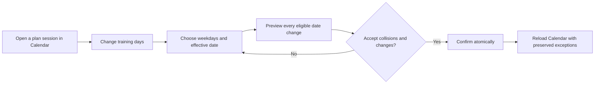

# TR-030 — Reschedule future workouts after changing training days

## Outcome

An active runner-owned training plan now exposes **Change training days** from its Calendar action sheet. The runner selects the same number of weekdays as the current plan, chooses when the new rhythm starts, and reviews every generated future workout date before confirming once.

The preview identifies any dates that will contain two sessions. Confirmation never overwrites another occurrence and is guarded by the runner identity, plan-run version, deterministic preview revision, and operation ID. Repeating the same confirmed operation returns its original result; reusing its operation ID for a different request is rejected.

## Preserved intent

The bulk change moves only future, incomplete, automatically generated plan positions. These stay fixed:

- completed sessions;
- skipped positions;
- repeat attempts;
- sessions moved individually;
- generated sessions before the selected effective date.

The plan order and progression identity do not change. Changing the weekly rhythm never prepares a workout, activates treadmill controls, or starts the treadmill.

## Interaction

## Validation

Store tests cover completed, skipped, repeated, explicitly moved, collision, invalid-day-count, past-date, stale-preview, and operation behavior. Gateway integration covers profile isolation, a non-mutating preview, apply, exact replay, conflicting reuse, and resulting Calendar dates. Phone and desktop browser tests verify the responsive chooser, collision preview, no early mutation, explicit confirmation, and generated showcase screenshots. The feature is installed in locally signed release 1.5.19.
