# Using Workflows

Workflows are for work that should be planned, paused, resumed, validated, and finished with evidence. Use this page for human prompts. Agents should start with [Workflow Quickstart](workflow-quickstart.md).

## What People Need To Do

1. Describe the work in plain language.
2. For a new or changed workflow, agents run `python -B .agents/manage.py workflow propose --from-request "<request>" --summary --compact --format json` before writing files.
3. If the proposal says an existing workflow owns the intent, adjust that workflow instead of creating another one.
4. If the proposal says `create-new`, agents can run `workflow create --from-request "<request>" --name <workflow-name> --write`.
5. For normal work inside an accepted workflow, agents can run `python -B .agents/manage.py workflow start --from-request "<request>" --summary --compact --format json` to route high-confidence user-story or bug work and start the run in one step.
6. Review the generated plan before implementation.
7. Approve, revise, or stop.
8. Resume in a new chat if interrupted.
9. Finish only after validation evidence is recorded.

[](diagrams/using-workflows-what-people-need-to-do.svg)

Source: [Mermaid](diagrams/using-workflows-what-people-need-to-do.mmd)

## Copyable Prompts

Create or adjust a workflow:

```text
Use the workflow builder. Propose from this request first, do not write files yet: <describe the workflow we need>. Tell me whether to adjust an existing workflow or create a new one, what files would change, and what validation would prove it.
```

Write a proposed workflow after review:

```text
Use the workflow builder proposal we approved. Create the workflow with --write, then run focused validation, eval, and scorecard checks. Do not edit generated routing by hand.
```

Adjust an existing workflow:

```text
Use workflow adjust for <workflow-name> from this change request: <describe the change>. Show the patch plan, files, validation commands, and any skipped or blocked checks before editing.
```

Start a user story:

```text
Use the user-story workflow. Start a new run, generate or refresh project context if it is missing or stale, inspect project context, generate the implementation plan with Mermaid diagrams, impacted files, validation steps, and risks, then stop before implementation for my approval.
```

Start a bug investigation:

```text
Use the bug-ticket workflow. Start a new run, capture the bug evidence, generate or refresh project context if it is missing or stale, inspect project context, produce a regression-focused plan with diagnostics, validation, and risks, then stop before implementation for my approval.
```

Resume in a new chat:

```text
Resume the latest user-story workflow run. Run workflow resume, load the returned required next context and any context handoff path, summarize checkpoint status, current phase, blockers, last evidence, and next action before changing files.
```

Recover after interruption:

```text
Recover workflow run <run-id> for user-story-workflow. If run.json is missing or invalid, run workflow recover with --write, then resume from the recovered context and report what was reconstructed.
```

Review a plan:

```text
Review the workflow plan before implementation. Check scope, impacted files, diagrams, database/entity impact, validation commands, rollback or stop conditions, and unresolved questions.
```

Finish a run:

```text
Finish workflow run <run-id>. Run the declared validation, refresh finish evidence, record skipped or blocked checks, and only mark the run complete if finish criteria pass.
```

Check worker choices:

```text
Show the worker/model plan for this workflow, including the current phase execution profile, reasoning effort, context budget, validation gate, and any fallback if the current host cannot spawn workers.
```

Check token policy:

```text
Run cost-policy in check mode. Confirm local AI is preferred for evidence shaping, paid small models are only fallbacks, and this workflow phase stays inside its context budget before loading large files.
```

## First Story Walkthrough

1. Ask the agent to start the user story workflow with the prompt above.
2. The agent runs `workflow start`, refreshes project context when required, reads project context, and creates plan/evidence files.
3. Review `plan.md`, diagrams, impacted files, validation commands, risks, and unresolved questions.
4. Ask for revisions until the plan is concrete.
5. Approve implementation in the same run, or stop and keep the run as a planning artifact.
6. If the chat stops, start a new chat with the resume prompt above.
7. Finish with `workflow finish` only after validation evidence is recorded.

## Choosing A Workflow

If you are not sure which workflow fits, ask normally or run:

```shell
python -B .agents/manage.py workflow propose --from-request "create a workflow for release evidence review" --summary --compact --format json
python -B .agents/manage.py workflow recipes --summary --compact --format json
python -B .agents/manage.py workflow start --from-request "implement Azure DevOps user story 123" --summary --compact --format json
python -B .agents/manage.py which-workflow "implement Azure DevOps user story 123" --summary --compact --format json
python -B .agents/manage.py which-workflow "fix a bug ticket with reproduction" --summary --compact --format json
```

`workflow start --from-request` starts a run only when routing confidence is high. Ambiguous requests return ranked candidates, reasons, and the safest next command without creating a run.

For read-only lifecycle dogfood or fresh-agent explanation tasks, prefer `which-workflow` followed by `workflow smoke --name <workflow-name> --dry-run --summary --compact --format json`. Do not use `workflow start` unless the task actually needs a retained run packet.

Before resuming or handing off a run, agents can run:

```shell
python -B .agents/manage.py workflow context-audit --name <workflow-name> --run-id <run-id> --summary --compact --format json
```

The audit reports the context packet path, required next-context files, handoff evidence, stale packet status, missing evidence paths, and the next command to recover.

| Need | Workflow |
|---|---|
| New feature or user story | `user-story-workflow` |
| Bug investigation and fix planning | `bug-ticket-workflow` |
| .NET Framework 4.5+ migration to modern .NET | `dotnet-framework-migration` |
| Modern .NET version upgrade | `dotnet-upgrade` |
| Larger repo change with explicit discipline | `disciplined-change-workflow` |
| Local AI benchmark or model comparison | `local-ai-benchmark-workflow` |
| External reference refresh | `reference-refresh` |

If none fit, route through `automations/routing.md` and choose the smallest matching owner. Do not create a workflow for one command or a one-off static document.

## What Good Output Includes

- A concrete plan with target files, validation commands, risks, and stop conditions.
- Mermaid process and connection diagrams; add an ERD when persistence changes.
- Evidence paths for checks that passed, failed, were skipped, or were blocked.
- A resumable next action in `run.json` and a human summary in `REPORT.md`.
- Explicit fallback notes when local AI, external systems, or subagents are unavailable.

For command variants and file contracts, use [Workflows](workflows.md) and [Repository Commands](../reference/commands.md).
