# Workflow Quickstart

This is the agent-facing workflow gateway. For implementation work, read `docs/project/project-context.md` and `automations/navigation/artifacts/maps/HANDOFF.md` when present before planning; run `python -B .agents/manage.py setup` first if they are missing. Then read `automations/routing.md`, the selected workflow's `module.json`, and `WORKFLOW.md`.

Use [Using Workflows](using-workflows.md) only when you need human copy-paste prompts or a plain-language walkthrough.

## System Map

[](diagrams/workflow-quickstart-map.svg)

Source: [Mermaid](diagrams/workflow-quickstart-map.mmd)

## Create Or Adapt

Use the intent-first builder when a fresh agent needs to create a workflow or adapt an existing one. Start read-only:

```shell
python -B .agents/manage.py workflow propose --from-request "<plain language request>" --summary --compact --format json
python -B .agents/manage.py workflow recipes --summary --compact --format json
python -B .agents/manage.py workflow adjust --name <workflow-name> --from-request "<change request>" --plan
```

Only write after the proposal picks `create-new` and names the expected files:

```shell
python -B .agents/manage.py workflow create --from-request "<plain language request>" --name <workflow-name> --write
```

The builder asks for only the human facts: when the workflow runs, required input, expected output, proof of done, and risk or approval needs. It derives `module.json`, prompts, phase instructions, diagrams, templates, eval expectations, worker guidance, and focused validation commands.

Use this lower-level path when manually reviewing or repairing the generated workflow.

1. Route through `automations/routing.md`; extend an existing workflow when it already owns the behavior.
2. For a new workflow, scaffold with `python -B .agents/manage.py new --kind workflow --name <workflow-name> --summary "<summary>"`.
3. Keep the workflow folder scorecard-ready: `WORKFLOW.md`, `module.json`, `instructions.md`, `diagrams/`, and `suites/workflow-evals.json`.
4. `WORKFLOW.md` must include linked process and connection diagrams plus copyable Start, Resume, Handoff, and Finish prompts.
5. `instructions.md` phase steps must use `Read:`, `Do:`, `Write:`, `Done when:`, and `If blocked:` so resume packets stay useful.
6. If `module.json.outputs` declares `artifacts/context/context-packet.json`, `module.json.commands` must include `workflow context --name <workflow-name> --run-id <run-id> --write`.
7. Run focused checks before repo-wide checks:

```shell
python -B .agents/manage.py validate-automations --name <workflow-name> --strict-phase-quality
python -B .agents/manage.py eval-workflow --name <workflow-name> --suite automations/<workflow-name>/suites/workflow-evals.json
python -B .agents/manage.py workflow scorecard --name <workflow-name> --format json
```

For standalone Mermaid validation in PowerShell, pass explicit `.mmd` file paths. Do not rely on `*.mmd` glob expansion in command arguments.

8. Refresh generated workflow routing after focused checks:

```shell
python -B .agents/manage.py sync-automation-routing
```

`sync-automation-routing` is repo-wide. If it fails, read the first failing workflow path before editing; the blocker may be an unrelated incomplete workflow.

## Essential Run Commands

```shell
python -B .agents/manage.py workflow start --name <workflow-name> --run-id <run-id> --summary --compact --format json
python -B .agents/manage.py workflow resume --name <workflow-name> --summary --compact --format json
python -B .agents/manage.py workflow finish --name <workflow-name> --run-id <run-id>
```

Runs use `runs/<run-id>/run.json`, `REPORT.md`, optional `validation/` or `artifacts/`. Record decisions, commands, skipped/blocked/failed checks, evidence, unsupported claims, and next action. Completed runs must keep at least one evidence entry or evidence path and a finishable external validation status.

## References

- Full workflow reference: [Workflows](workflows.md)
- Human prompts: [Using Workflows](using-workflows.md)
- Command variants: [Repository Commands](../reference/commands.md)

Final confidence pass: `python -B .agents/manage.py workflow smoke --all --summary --compact --format json`, then `sync`, then `check`.
