# Workflows

Workflows own phases, decisions, evidence, hooks, and finish criteria. Use [Workflow Quickstart](workflow-quickstart.md) as the agent gateway; use this page only when you need reference detail.

Story, bug, and disciplined-change plans use [Spec Driven Workflow Gates](spec-driven-gates.md) for clarification, requirements quality, cross-artifact coverage, complexity, template layering, and stage-boundary evidence before implementation approval.

## Read Order

1. `docs/project/project-context.md` and `automations/navigation/artifacts/maps/HANDOFF.md` when present; run `python -B .agents/manage.py setup` first if missing.
2. `automations/routing.md`
3. `automations/<workflow-name>/module.json`
4. `automations/<workflow-name>/WORKFLOW.md`
5. `automations/<workflow-name>/instructions.md` only for the current phase or when a context packet requires it
6. `runs/<run-id>/artifacts/context/context-packet.json` when resuming

Do not load all workflow folders. Do not hand-edit generated `automations/routing.md` or `automations/registry.json`.

## Core Commands

```shell
python -B .agents/manage.py workflow start --name <workflow-name> --summary --compact --format json
python -B .agents/manage.py workflow resume --name <workflow-name> --summary --compact --format json
python -B .agents/manage.py workflow finish --name <workflow-name> --run-id <run-id>
python -B .agents/manage.py workflow scorecard --name <workflow-name> --format json
python -B .agents/manage.py workflow smoke --name <workflow-name> --format json
python -B .agents/manage.py workflow template resolve --name <workflow-name> --template plan.md
python -B .agents/manage.py workflow template resolve --name <workflow-name> --template plan.md --profile lean
python -B .agents/manage.py workflow template lint --name <workflow-name>
python -B .agents/manage.py workflow metadata inspect --name <workflow-name> --format json
python -B .agents/manage.py workflow integration-check --format json
python -B .agents/manage.py workflow branch-policy --branch feature/example --format json
```

Use [Repository Commands](../reference/commands.md) for context, hook, worker, analytics, run-index, and all-workflow variants. Prefer targeted smoke during iteration and `workflow smoke --all --summary --compact --format json` before finalizing broad workflow changes.

Natural-language routing is start-ready only when the route packet reports high confidence or `start_ready: true`. Medium-confidence `which-workflow` results require a more specific request or explicit confirmation before using `start_command_if_confirmed`.

Strict no-write/no-temp lifecycle dogfood is planning smoke only. Route it with `which-workflow`, then use `workflow smoke --name <workflow-name> --dry-run --summary --compact --format json`; do not run normal smoke when temp files or writes are forbidden. Cleanup-backed smoke is only for runs where temp files and run-folder writes are allowed, and the agent must confirm cleanup.

Record reusable optimization findings in the owning workflow or skill documentation instead of keeping temporary run folders.

## Creation And Adaptation Gates

Fresh-agent dogfood showed that valid shape is not enough. A workflow is reusable only when these gates pass:

Use the intent-first builder before manual scaffold work:

```shell
python -B .agents/manage.py workflow propose --from-request "<plain language request>" --summary --compact --format json
python -B .agents/manage.py workflow recipes --summary --compact --format json
python -B .agents/manage.py workflow adjust --name <workflow-name> --from-request "<change request>" --plan
```

The proposal must decide one of three outcomes before writes: adjust an existing workflow, create a new workflow, or keep the request as a skill, command, or normal documentation change. Users supply only the trigger, inputs, outputs, proof of done, and risk or approval facts. The builder derives the contract files, diagrams, templates, worker profile guidance, eval expectations, and focused validation commands.

1. `WORKFLOW.md` has Start, Resume, Handoff, and Finish prompts.
2. `WORKFLOW.md` links adjacent `.mmd` and `.svg` process and connection diagrams.
3. `instructions.md` phase steps use `Read:`, `Do:`, `Write:`, `Done when:`, and `If blocked:`.
4. `module.json` declares phases, outputs, commands, deterministic context evidence, worker profiles, validation, local-AI use cases, and optional `metadata_path` for typed inputs, gates, template layers, integrations, and branch policy.
5. `suites/workflow-evals.json` proves validation, contract declarations, and lifecycle smoke.
6. Focused `validate-automations`, `eval-workflow`, and `workflow scorecard --name` pass before repo-wide sync/check.

`workflow scorecard` checks module validation, prompts, linked diagrams, Mermaid syntax, evals, lifecycle smoke, plan gates, and context declarations. If it fails, fix the first failing fact and rerun before broad checks.

`workflow smoke --summary --compact --format json` keeps lifecycle check names in `summary.check_names` so a fresh agent can see what passed without expanding the full run packet.

`workflow eval --all` groups suites by workflow and uses at most four workers when the selected hooks and command assertions are known to be parallel-safe. Suites within one workflow remain serial, output stays in deterministic discovery order, and unsafe or malformed inputs force serial execution or a failed result. Accepted workflows must have a non-empty eval suite, every case must contain an assertion, and repository-command assertions must match an exact read-only allowlist and execute fresh.

Lifecycle cleanup restores exact prior run-index bytes only when retained non-smoke runs remain unchanged. A concurrent retained-run change triggers a rebuild from current state, while unsafe index symlinks and paths outside the workflow boundary fail closed.

Use `new --kind workflow` for new modules. It scaffolds diagrams and an eval suite; customize them instead of deleting them. For existing workflows, run `review <workflow-name> --plan` first so likely files, checks, generated artifacts, and evidence paths are visible.

`sync-automation-routing` validates every accepted workflow before regenerating routing. If it fails while you are changing one workflow, inspect the reported path first; an unrelated incomplete workflow can block repo-wide sync.

## Templates And Integrations

Workflow template resolution is deterministic:

1. Project override: `docs/project/workflow-overrides/<workflow>/<template>`.
2. Workflow preset: `automations/<workflow>/presets/<preset>/templates/<template>`, ordered by `preset.json` priority.
3. Lean workflow template: `automations/<workflow>/templates/lean-<template>`, only when `--profile lean` is requested.
4. Workflow default: `automations/<workflow>/templates/<template>`.

Run `workflow start --profile lean` when a smaller planning surface is enough. Run `workflow template lint` whenever a workflow adds presets or override support. It checks required plan-template providers, preset manifests, provider priorities, and template file type. Run `workflow metadata inspect --name <workflow>` after changing `module.json` or `metadata_path` so the merged validation contract is visible.

Integration descriptors are optional and live under `integrations/<id>/integration.json` or `.agents/integrations/<id>/integration.json`. Run `workflow integration-check` after adding or changing them. Workflows that declare `integrations` must have matching descriptors. Descriptors declare available commands, managed files, and tools; they do not grant install, network, or write permission.

Use `workflow managed-section-diff` for generated or managed doc sections. It is read-only and gives a diff that should be applied through the owning generator or sync path.

## Evidence Flow

Users do not need local-AI commands for normal workflow work. The agent chooses a workflow from routing, then lifecycle commands write state, checkpoints, deterministic context evidence, hook evidence, context packets, documentation deltas, and finish proof.

[](diagrams/workflows-automatic-evidence-flow.svg)

Source: [Mermaid](diagrams/workflows-automatic-evidence-flow.mmd)

Run state lives under `automations/<workflow>/runs/<run-id>/`:

| File | Purpose |
|---|---|
| `run.json` | Machine state: phase, status, blockers, checks, commands, evidence, next action. |
| `REPORT.md` | Human status and summary. |
| `plan.md` or `execution-log.md` | Declared planning or progress file when the workflow owns one. |
| `validation/` | Context evidence, hook evidence, command evidence, and skipped/blocked/failed checks. |
| `artifacts/context/` | Compact resume context when declared in `module.json.outputs`. |

Completed runs must include at least one evidence entry or evidence path plus a finishable external validation status. Dogfood and temporary runs are not committed by default; durable lessons become docs, suites, scripts, templates, fixtures, or compact reports.

## Visuals

Every workflow needs:

1. A process diagram for phases and decisions.
2. A connection diagram for skills, workflows, systems, and services.
3. A lower-level diagram when multiple modules, generated artifacts, APIs, jobs, queues, or services interact.
4. An `erDiagram` when persistence, database schema, migrations, mappings, or data relationships change, unless the run records an explicit skipped reason.

Use adjacent `.mmd` plus materialized `.svg` links. Avoid HTML-like labels such as `<run-id>` in Mermaid; write `run-id` or `run evidence` instead.

## Worker And Local-AI Boundaries

`module.json.worker_profiles` is portable execution guidance. Each phase selects a stable semantic profile for purpose, consequence, tools, expected output, and validation. Trusted provider/model identity selects only a small prompt overlay, while independently attested host capabilities select a surface adapter. Context packets and handoff prompts keep all three axes separate. Hosts that cannot attest an axis preserve the semantic profile, use the generic overlay or direct-tool adapter, and record the fallback. Keep worker counts small and never require spawning for correctness. See [Model Compatibility And Routing](../reference/model-compatibility-and-routing.md).

Execution remains serial until the selected phase has a valid `parallel_safety` policy and [Delegation and Parallel Safety](../reference/delegation-and-parallel-safety.md) reports a trusted current-host observation, an eligible task class, passing provider-backed economics, and explicit delegation authority. `workflow workers` reports host availability separately from effective orchestration and lists every serial blocker. A prompt overlay never authorizes delegation or weakens validation. Model mismatch, incomplete thread trees, undeclared runtime sharing, or unavailable worker controls force serial execution.

Local AI is advisory evidence shaping, not validation authority. Workflow contracts may declare compact use-case IDs such as `validation-triage`, `changed-files-summary`, and `handoff-draft`. Deterministic command output, test output, build output, lint/static-analysis output, and recorded workflow evidence remain authoritative.

Use `python -B .agents/manage.py cost-policy --check --summary --compact --format json` before large planning, review, validation, or handoff work. Use `local-ai status` for quick automatic-use proof; reserve readiness and model benchmarks for setup or benchmark work.

## Recovery

Use `workflow recover` when a run folder exists but `run.json` is missing, invalid, or mismatched. Without `--write`, it diagnoses; with `--write`, it writes a minimal v2 packet, backs up invalid content, and refreshes declared context evidence.

Workflow doctor reports `no-retained-runs` as normal. By default, lifecycle health checks every retained run, blocks active or partial runs with missing, stale, or invalid context, and reports the same failures on completed historical runs as advisory. Any blocking run makes doctor return nonzero; a completed-only stale history stays successful with advisory status. Add `--include-completed` to `workflow context --all --check` or `workflow doctor --all` when release evidence requires completed history to block too. That flag never hides a newer or older active run: the primary display remains active-first while aggregate counts and run-specific remediation cover every retained failure. Unknown, missing, and invalid run states remain blocking because they cannot be safely classified as completed.

## Context Guidance Measurement

`workflow context --write` includes compact `guidance_savings` in each context packet and adds `coordinate_closet` when exact coordinates are present. Guidance savings reuses the repo cost policy measurement for the default guidance packet versus the broad orientation baseline, then the context-packet quality gate fails when a measurable result falls below `cost_policy.guidance.minimum_saved_percent`. The coordinate closet preserves exact paths, work item IDs, hashes, ports, and environment names for low-context resume without expanding the full run history.

The context packet is the conventional resume boundary. Run state, reports, execution logs, plans, tickets, project context, and validation artifacts remain explicit handle-only sources: open them when the packet identifies a fact or coordinate that needs direct verification, rather than loading every file on every resume.

Model identity is evidence, not a routing guess. When a host or provider exposes exact runtime identity, save the strict, workflow/run/phase-bound `workflow-manager.runtime-observation` JSON packet under the selected run's `validation/` directory and pass it to `workflow context --runtime-observation-file <path> --write`. The lifecycle persists the observation into `run.json` and forwards it only while its scope matches the current phase; any lifecycle context or handoff write after a phase transition clears the stale active record, retains the evidence file as history, and returns to explicitly unattested generic-overlay behavior until new machine evidence is ingested. See [Model Compatibility and Routing](../reference/model-compatibility-and-routing.md#runtime-observation-v1) for the packet contract and portability boundary.

The workflow packet copy is intentionally compact. Use `startup-context` or `cost-policy` for the full measurement boundary and detailed missing-file report.
